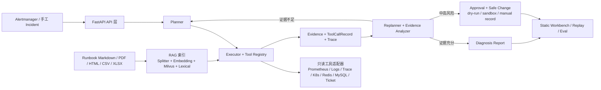

# AutoOnCall

AutoOnCall 是一个面向 OnCall 故障诊断场景的 Python 3.11 FastAPI 应用。它把告警接入、RAG Runbook、Plan-Execute-Replan 诊断、工具取证、风险审批、Trace、报告和安全变更记录串成一条可解释、可审计、可评测的 AIOps 闭环。

当前版本：`1.2.1`。

## 校招默认演示主线

默认 5 分钟面试只展示 Redis/MySQL 两条 live adapter golden chain：本地 Docker 只启动 MySQL、Redis、metrics-exporter、Prometheus、Loki 和 loki-log-emitter。Milvus/RAG 是 `make up && make upload` 的加分项，不抢主线；K8s CrashLoop/OOMKilled 只作为 offline golden regression case，不声称有 live container-backed K8s 证据。

固定演示顺序：

```powershell
make interview-up
make sandbox-verify
.venv\Scripts\python.exe scripts\eval\eval_cases.py --cases eval\cases.yaml --env-file deploy\sandbox.env --report-path logs\live_golden_eval_reports.db --summary-json logs\live_golden_eval_summary_current.json --summary-md logs\live_golden_eval_summary_current.md --skip-rag --live-golden
.venv\Scripts\python.exe scripts\eval\eval_rag_cases.py --cases eval\rag_cases.yaml --docs-dir docs/knowledge-base --summary-json logs\rag_eval_summary_current.json --summary-md logs\rag_eval_summary_current.md
.venv\Scripts\python.exe scripts\eval\eval_ragas_cases.py --cases eval\rag_cases.yaml --docs-dir docs/knowledge-base --summary-json logs\ragas_eval_summary.json --summary-md logs\ragas_eval_summary.md
.venv\Scripts\python.exe scripts\eval\verify_milvus_multisource_rag.py --summary-json logs\milvus_multisource_verification.json --summary-md logs\milvus_multisource_verification.md
.venv\Scripts\python.exe scripts\eval\build_interview_summary.py --ragas-summary logs\ragas_eval_summary.json --summary-json logs\interview_eval_summary.json --summary-md logs\interview_eval_summary.md
```

演示时优先打开 `logs/interview_eval_summary.md`，再展示一份 Redis 或 MySQL 报告。`logs/live_golden_eval_summary_current.md` 是 live AIOps 摘要，默认使用 `--skip-rag`；RAG 检索质量看 `logs/rag_eval_summary_current.md`，RAGAS 答案质量看 `logs/ragas_eval_summary.md`，Milvus 入库后多源召回证明看 `logs/milvus_multisource_verification.md`，避免把 live 摘要里的 RAG 0/0 误解成没有 RAG 评测。目标不是展示很多服务，而是展示一个 Agent 如何被工具契约、证据充分性门槛、证据链、审批边界和 eval 约束住。

RAGAS 是可选的回答质量回归层，和 `eval_rag_cases.py` 的检索召回评测分开：RAG eval 回答“是否召回可信来源”，RAGAS 回答“固定 RAG 答案是否满足 context id、citation、拒答边界和 OnCall actionability”。默认 `id-smoke` 不依赖 judge key；有评测账号时再用 `--metrics-profile full` 跑 faithfulness 和 response relevancy。

三条黄金故障链路已固化为面试资产：

- [Redis maxclients / 连接耗尽](docs/golden-chains/redis-maxclients.md)
- [MySQL 慢查询 / 连接池等待](docs/golden-chains/mysql-slow-query.md)
- [K8s Pod CrashLoop / OOMKilled](docs/golden-chains/k8s-crashloop-oom.md)

负例边界也单独整理为 [Negative Boundary Cases](docs/interview/negative-boundary-cases.md)：Runbook 缺失时进入 `needs_human`，K8s RBAC 拒绝时进入 `degraded`，用于说明系统不会在证据不足时强行输出 completed RCA。

## 项目叙事

线上故障排查通常不是“问模型一个问题，然后等答案”这么简单。OnCall 工程师需要同时查看告警、指标、日志、Trace、K8s 状态、Redis/MySQL 状态、发布记录、历史工单和 Runbook；如果排查过程只停留在聊天记录里，事后很难复盘模型为什么给出某个结论；如果让 Agent 直接执行重启、删 Pod、执行 SQL 或修改配置，又会把自动化工具变成新的生产风险。

AutoOnCall 的设计目标是把大模型放进一个受控的运维工程闭环里：

```text
Alert / Incident
  -> Planner 拆解排查计划
  -> Executor 通过 Tool Registry 调用指标、日志、Trace、Redis、MySQL、K8s、Runbook 等工具
  -> Evidence + ToolCallRecord 沉淀证据链
  -> Replanner 判断补查、审批、报告或升级人工
  -> Trace + Report + IncidentState 支撑复盘
  -> 高风险动作只进入审批、dry-run、sandbox 或人工执行记录
```

这个项目的重点不是包装“模型能回答”，而是证明大模型应用可以被放进清晰的后端边界里：RAG 只提供有引用的知识依据，工具只通过统一契约执行，证据和 Trace 可回放，风险动作不会自动改生产，测试和离线评测用于防止核心链路回归。

当前主线已经从“能跑通诊断闭环”推进到“诊断结论是否可信”。报告生成前会检查证据充分性：completed 报告至少需要主故障域工具证据、现象侧 metrics/logs 证据、Runbook 或历史工单处置参考；失败工具必须写入报告。如果证据不够，报告会降级为 `incomplete`、`degraded` 或 `needs_human`，并明确缺失证据、失败工具、置信度上限和人工补查项。

报告模板也按真实 OnCall 复盘收敛：前 9 段固定为故障摘要、影响范围、初步根因、关键证据、排查过程、风险动作判断、建议处置、回滚/观察指标和未确认事项；ToolCall、Evidence Matrix、Trace 和 Runbook 引用放入附录，便于面试时先讲业务结论，再按需展开审计细节。

Conclusion Alignment 的边界要按“关键结论级对齐”来讲：AutoOnCall 不做全句事实核查，而是要求 `root_cause`、`key_findings`、`remediation_suggestion` 能回链到 `evidence_id` 或 RAG citation。缺少回链时报告会降级为 `needs_human`，避免模型把没有证据支撑的判断包装成确定结论。

适合在简历中概括为：

> 面向 OnCall 场景的 RAG + AIOps Agent 故障诊断系统，基于 FastAPI、LangGraph、Milvus 和 Pydantic 实现告警接入、Runbook 检索、Plan-Execute-Replan 诊断、工具取证、证据链追踪、人工审批、诊断报告和安全变更 dry-run 闭环。

## 架构总览



代码阅读建议按业务闭环而不是目录顺序展开：

1. `app/main.py` 看路由装配、静态工作台和生产暴露提示。
2. `app/api/alerts.py` 与 `app/services/alert_ingestion_service.py` 看告警如何变成 Incident。
3. `app/api/aiops.py` 与 `app/services/aiops_service.py` 看 SSE 诊断入口和 Agent 编排。
4. `app/agent/aiops/planner.py`、`executor.py`、`replanner.py`、`evidence_analyzer.py` 看 Plan-Execute-Replan 主循环。
5. `app/services/rag_retrieval_service.py`、`rag_agent_service.py` 和 `vector_embedding_service.py` 看 RAG 检索、拒答和 Embedding 边界。
6. `static/` 与 `tests/` 看演示工作台和核心链路回归测试。

## 面试演示路径（5 分钟）

面试演示时不要平均展示所有页面或所有容器，建议只讲一条主线：

```text
Incident 诊断输入
  -> Plan-Execute-Replan
  -> 工具调用和 Evidence
  -> 风险审批或 forbidden
  -> Trace / Report / Eval
```

推荐节奏：

| 时间 | 展示内容 | 讲清楚什么 |
| --- | --- | --- |
| 时间 | 展示内容 | 讲清楚什么 |
| --- | --- | --- |
| 0:00-0:40 | 项目定位 | 不是聊天机器人，而是受约束的 OnCall 诊断闭环 |
| 0:40-1:40 | `make sandbox-verify` | Redis/MySQL/Prometheus/Loki 是 live adapter source，且没有 mock fallback |
| 1:40-3:10 | live golden eval | Redis/MySQL 是 live adapter golden chain；K8s 是 offline golden regression case |
| 3:10-4:20 | Redis/MySQL 报告 | Evidence timeline / evidence chain 中有 fact、inference、uncertainty |
| 4:20-5:00 | 风险与评测边界 | 诊断只读，变更需审批；eval 是回归保障，不是线上准确率声明 |

固定 5 分钟脚本见 [AutoOnCall 5-Minute Interview Demo](docs/interview/five-minute-demo.md)。RAG/Milvus 是加分项，可在主线之后补充展示 citation 与拒答。

## 面试前检查清单

- 基础门禁：优先运行 `make verify`；时间紧时至少运行 `make test-quick`、`make eval`、`make eval-rag`、`make eval-change`。
- 默认容器：只启动 MySQL、Redis、metrics-exporter、Prometheus、Loki、loki-log-emitter；Milvus/RAG 用 `make up && make upload` 单独作为加分项。
- AIOps 演示：Redis maxclients、MySQL slow query 是 live adapter golden chain；K8s CrashLoop/OOMKilled 是 offline golden regression case。
- 风险边界：准备一个审批或 forbidden case，明确说明高风险动作不会自动执行生产写操作。
- 环境边界：本地离线演示可显式开启 `AIOPS_MOCK_FALLBACK_ENABLED=true`；严格验收、沙箱或生产化说明应设置为 `false`。
- 前端稳定性：提前打开 `http://localhost:9900`、`/health/live`、`/health/ready` 和 OpenAPI，避免现场再排依赖问题。
- 契约稳定性：运行 `make api-contract-verify` 离线验证 `/api/chat`、AIOps SSE、ToolContract、报告、审批/变更恢复和 eval backlog 关键字段。
- 结果表述：离线 eval 只讲“回归保障”和“case 覆盖”，不要包装成线上真实准确率。

## 面试官高频追问边界

| 追问 | 推荐回答边界 |
| --- | --- |
| 这是 Agent 还是规则流程？ | LLM 负责计划生成和语言表达，工具调用、风险控制、状态流转和报告落库由后端契约约束。 |
| mock/fallback 算不算真实能力？ | mock/fallback 是本地演示和失败降级路径，数据源和 `source_quality` 会显式标记；严格环境关闭后未配置工具会返回结构化失败。 |
| 怎么防止 RAG 幻觉？ | 检索结果会经过 hybrid search、rerank、trust gate 和 citation guard；没有可信引用时拒答。 |
| 为什么不会误操作生产？ | Executor 先做风险评估；中高风险进入审批，危险动作 forbidden；审批后也只进入 dry-run、sandbox 或人工记录。 |
| eval 结果能代表线上准确率吗？ | 不能。eval 是固定 case 的回归门禁，用来验证工具选择、根因关键词、拒答和风险策略没有回退。 |
| 项目还差哪些生产化能力？ | 主要是 SSO/OIDC、后台任务队列、数据库 migration、多副本治理、审计防篡改和真实样本反馈闭环。 |

## 项目边界

当前阶段目标是围绕校招展示继续打磨稳定闭环：优先让 Redis / MySQL live 链路、K8s offline golden case、证据链、报告样例和评测指标更可信，而不是扩成大而全的企业平台。

持续保留的边界：

- 不把本地 demo、mock/fallback 或离线评测结果包装成真实生产能力。
- 不引入自动生产写操作；审批通过后仍只进入 dry-run、sandbox 或人工执行记录。
- 新增能力优先服务于端到端演示、证据驱动 RCA、评测指标、报告样例和安全边界。
- 不为了炫技重写成复杂多 Agent 群聊、复杂 React 前端或平台化系统。

两个月校招冲刺建议见 [校招项目总文档](docs/project/autooncall-campus-recruiting.md)。

## 核心能力

- RAG 知识库问答：支持 Markdown / PDF / HTML Wiki / CSV / XLSX 上传、结构化切分、DashScope Embedding、Milvus 向量检索、本地词法索引、hybrid search、rerank、引用补齐和无可信来源拒答。
- 告警自动接入：支持 Alertmanager webhook，按 fingerprint 去重，创建或更新 Incident，并保留 firing / resolved 状态。
- AIOps 诊断 Agent：基于 LangGraph 的 `planner -> executor -> replanner` 流程，结合指标、日志、Trace、K8s、Redis、MySQL、消息队列、CMDB、发布历史、工单和 Runbook 等工具取证。
- 风险控制与人工审批：只读诊断自动执行，中高风险动作进入审批，危险动作直接禁止。
- 安全变更闭环：审批后可进入 pre-check、dry-run、sandbox 或人工执行记录，系统不会自动执行生产写操作。
- 可观测和复盘：Trace、ToolCall、Evidence、Approval、DiagnosisReport、IncidentState、ChangeExecution、SessionSnapshot 和 AlertEvent 可写入 SQLite 或 MySQL。
- 最小人工反馈回流：Incident 报告支持提交 `root_cause_correct`、`accepted_suggestion` 和 `operator_note`，低评分反馈会归类为 eval case 草稿、RAG 文档缺口、工具缺口或报告模板问题。
- 前端工作台：FastAPI 直接挂载 `static/`，支持 RAG 问答、故障诊断、告警事件、Incident 详情、Trace、报告、审批、变更和评测面板。
- 离线评测：`eval/cases.yaml`、`eval/rag_cases.yaml`、`eval/change_cases.yaml`、`eval/replanner_cases.yaml` 覆盖 AIOps、RAG、安全变更和 Replanner LLM 决策核心行为。

## 核心链路

### RAG 问答

```text
文档入库
  -> POST /api/upload 或 make upload
  -> 文件名 / 扩展名 / 大小校验
  -> Markdown/PDF/HTML/CSV/XLSX 结构化切分
  -> DashScope Embedding
  -> Milvus 向量索引
  -> 本地 LexicalIndex 词法索引

用户提问
  -> POST /api/chat 或 /api/chat_stream
  -> retrieve_structured_knowledge
  -> 向量召回 + 词法召回
  -> 候选合并去重
  -> rerank: 向量距离 + 词法重合 + 原始排序
  -> trust gate: L2 距离阈值 / 词法可信阈值
  -> 有可信片段: grounded answer
  -> 无可信片段: refuse_without_trusted_source
  -> citation guard: 回答必须带 source_file + chunk_id
```

关键边界：

- 每个成功回答都必须带 citation；缺少 `source_file + chunk_id` 时会拒答。
- 无可信知识来源时稳定拒答，不让模型自由发挥。
- `top_k` 只代表候选召回，不等同于可信；回答前还要经过距离阈值、词法阈值和引用校验。
- 目录索引只允许 `INDEX_ALLOWED_ROOTS` 中的安全目录。
- RAG 结果用于知识依据，不等同于实时线上事实。

### 告警接入

```text
POST /api/alerts/alertmanager
  -> AlertIngestionService
  -> AlertEvent 标准化
  -> fingerprint 去重
  -> IncidentState 创建或更新
  -> GET /api/alerts 与 /api/incidents 可见
```

关键边界：

- 优先使用 Alertmanager 自带 fingerprint；缺失时根据 `alertname + service + environment + key labels` 生成稳定指纹。
- 重复 firing webhook 不会重复建 Incident。
- resolved webhook 会更新告警状态；如果 Incident 已进入审批、变更等更深生命周期，不会被恢复告警覆盖。
- 默认不保存完整外部原始 payload；确需排障时可显式开启 `AIOPS_STORE_RAW_EXTERNAL_PAYLOAD=true`。

### AIOps 诊断

```text
POST /api/aiops
  -> SSE 事件流
  -> AIOpsService
  -> LangGraph: planner -> executor -> replanner
  -> ToolRegistry / integrations / RAG runbook
  -> Evidence / ToolCallRecord / RiskAssessment
  -> Trace / Approval / Report / IncidentState
```

关键边界：

- Planner 生成结构化 `PlanStep`，LLM 失败时使用规则 fallback。
- Executor 只通过 Tool Registry 执行工具，并把结果归一成 Evidence。
- Replanner 根据证据充分性、工具失败、风险动作和最大步数决定补查、审批、报告或升级人工。
- mock/fallback 会在数据源字段中显式体现；严格环境应设置 `AIOPS_MOCK_FALLBACK_ENABLED=false`。

### 安全变更

```text
Approval approved
  -> POST /api/incidents/{incident_id}/changes/{change_plan_id}/resume
  -> pre-check
  -> dry-run
  -> dry_run_only / sandbox / manual_record
  -> ChangeExecution + Trace + Report snapshot
```

关键边界：

- `dry_run_only` 只校验计划、回滚方案和观察指标。
- `manual_record` 等待人工提交执行结果后生成观察和回滚建议。
- `sandbox` 只用于本地沙箱或明确开启的非生产执行路径。

## 快速开始

安装依赖：

```bash
python3.11 -m venv venv
. venv/bin/activate
pip install -U pip
pip install -e ".[dev]"
```

也可以使用：

```bash
make bootstrap
```

启动 FastAPI：

```bash
make dev
```

打开：

- 前端工作台：http://localhost:9900
- OpenAPI：http://localhost:9900/docs
- Liveness：http://localhost:9900/health/live
- Readiness：http://localhost:9900/health/ready

启动 Milvus 并上传 Runbook：

```bash
make up
make upload
```

启动校招核心 AIOps 栈：

```bash
make interview-up
make sandbox-verify
.venv\Scripts\python.exe scripts\eval\eval_cases.py --cases eval\cases.yaml --env-file deploy\sandbox.env --report-path logs\live_golden_eval_reports.db --summary-json logs\live_golden_eval_summary_current.json --summary-md logs\live_golden_eval_summary_current.md --skip-rag --live-golden
.venv\Scripts\python.exe scripts\eval\eval_rag_cases.py --cases eval\rag_cases.yaml --docs-dir docs/knowledge-base --summary-json logs\rag_eval_summary_current.json --summary-md logs\rag_eval_summary_current.md
.venv\Scripts\python.exe scripts\eval\verify_milvus_multisource_rag.py --summary-json logs\milvus_multisource_verification.json --summary-md logs\milvus_multisource_verification.md
.venv\Scripts\python.exe scripts\eval\build_interview_summary.py --summary-json logs\interview_eval_summary.json --summary-md logs\interview_eval_summary.md
```

Redis 与 MySQL 的黄金故障链路默认使用已启动的真实 Docker 容器证据，不再回退到 HTTP mock。可用以下命令验证 live golden 闭环：

```bash
.venv\Scripts\python.exe scripts\eval\eval_cases.py --cases eval\cases.yaml --env-file deploy\sandbox.env --report-path logs\live_golden_eval_reports.db --summary-json logs\live_golden_eval_summary_current.json --summary-md logs\live_golden_eval_summary_current.md --skip-rag --live-golden
.venv\Scripts\python.exe scripts\eval\eval_rag_cases.py --cases eval\rag_cases.yaml --docs-dir docs/knowledge-base --summary-json logs\rag_eval_summary_current.json --summary-md logs\rag_eval_summary_current.md
.venv\Scripts\python.exe scripts\eval\eval_ragas_cases.py --cases eval\rag_cases.yaml --docs-dir docs/knowledge-base --summary-json logs\ragas_eval_summary.json --summary-md logs\ragas_eval_summary.md
.venv\Scripts\python.exe scripts\eval\verify_milvus_multisource_rag.py --summary-json logs\milvus_multisource_verification.json --summary-md logs\milvus_multisource_verification.md
.venv\Scripts\python.exe scripts\eval\build_interview_summary.py --ragas-summary logs\ragas_eval_summary.json --summary-json logs\interview_eval_summary.json --summary-md logs\interview_eval_summary.md
.venv\Scripts\python.exe scripts\sandbox\verify_full_stack_adapters.py --env-file deploy\sandbox.env --output logs\full_stack_adapter_verification.json
```

验收重点是 `redis_maxclients_timeout` 与 `mysql_slow_query_latency` 两条 case 均包含标准 Alertmanager payload、Incident 字段、Planner 期望步骤、实际工具顺序、Evidence 的 `fact / inference / uncertainty`、root cause、处置建议、审批判断、报告证据和对应 eval 指标。Redis 必须命中 `redis_info / prometheus / loki`，MySQL 必须命中 `mysql / prometheus / loki / ticket_api`，并且 `required_live_sources_hit=true`、`evidence_sufficiency_hit=true`、`runtime_vs_incident_boundary_hit=true`、`approval_boundary_hit=true`、`mock_fallback_detected=false`。

证据不足的 case 不再伪装成 completed：例如 K8s API 权限失败会生成 `degraded` 报告，Runbook 无可信来源且无法归类的业务异常会生成 `needs_human` 报告。这一点是面试中的业务亮点：系统不会在证据不足时输出看似确定的 RCA。

面试演示栈默认只启动 MySQL、Redis、metrics-exporter、Prometheus、Loki 和 loki-log-emitter。服务目录、发布历史、历史工单和实时 Incident 证据会写入真实 MySQL / Redis 容器，不再依赖 HTTP mock 服务。Milvus/RAG 作为加分项保留，但不抢默认主线。详细说明见 [沙箱说明](deploy/sandbox.md)。

如果面试前只需要一组不依赖 Docker 沙箱的固定报告资产，可以运行：

```bash
make demo-reports
```

该命令会从离线评测集中生成 Redis maxclients、MySQL 慢查询、K8s CrashLoop 三份 Markdown 诊断报告和索引，默认输出到 `logs/demo_reports/`。其中 Redis/MySQL 可对应 live adapter 证明；K8s CrashLoop/OOMKilled 暂时只作为 offline golden regression case，不声称有 live container-backed K8s 证据。

Windows 下也可以使用：

```powershell
.\scripts\dev\start-windows.bat
.\scripts\dev\stop-windows.bat
```

可选容器镜像构建：

```bash
docker build -t autooncall:local .
docker run --rm -p 9900:9900 --env-file .env autooncall:local
```

容器入口只负责启动 FastAPI 和静态工作台；Milvus、MySQL、Redis、Prometheus、Loki、Kubernetes API 等依赖仍应通过 compose、托管服务或内网平台显式配置。默认面试栈不包含 K8s mock。`.dockerignore` 会排除 `.env`、虚拟环境、日志、上传文件、SQLite 数据库和覆盖率报告，避免把本地产物打进镜像。

面试演示脚本和讲解顺序见 [5 分钟面试演示脚本](docs/interview/five-minute-demo.md)。

## 常用接口

| 功能 | 方法 | 路径 |
| --- | --- | --- |
| RAG 对话 | POST | `/api/chat` |
| RAG 流式对话 | POST | `/api/chat_stream` |
| 文件上传并索引 | POST | `/api/upload` |
| 批量目录索引 | POST | `/api/index_directory` |
| Alertmanager 告警接入 | POST | `/api/alerts/alertmanager` |
| 告警列表 | GET | `/api/alerts` |
| 告警详情 | GET | `/api/alerts/{fingerprint}` |
| AIOps 诊断 | POST | `/api/aiops` |
| Demo Incident | GET | `/api/aiops/demo/incidents` |
| AIOps 运行历史 | GET | `/api/aiops/runs` |
| 工具契约 | GET | `/api/aiops/tools/contracts` |
| Incident 列表 | GET | `/api/incidents` |
| Incident 详情 | GET | `/api/incidents/{incident_id}` |
| Trace | GET | `/api/incidents/{incident_id}/trace` |
| 报告 | GET | `/api/incidents/{incident_id}/report` |
| 待审批列表 | GET | `/api/approvals/pending` |
| 提交审批 | POST | `/api/incidents/{incident_id}/approval` |
| 审批后恢复诊断闭环 | POST | `/api/incidents/{incident_id}/diagnosis/resume` |
| 启动安全变更 | POST | `/api/incidents/{incident_id}/changes/{change_plan_id}/resume` |
| 变更列表 | GET | `/api/incidents/{incident_id}/changes` |
| 变更详情 | GET | `/api/changes/{change_execution_id}` |
| 人工执行记录 | POST | `/api/changes/{change_execution_id}/manual-result` |
| 评测摘要 | GET | `/api/eval/summary` |
| 评测坏例草稿 | GET | `/api/eval/backlog` |
| 适配器验收摘要 | GET | `/api/eval/adapter-verification` |
| 进程探活 | GET | `/health/live` |
| 依赖就绪 | GET | `/health/ready` |

## 配置

配置默认值在 `app/config.py`，生产或本地覆盖可参考 `.env.example` 和 `deploy/sandbox.env`。

常用配置：

- DashScope：`DASHSCOPE_API_KEY`、`DASHSCOPE_API_BASE`、`DASHSCOPE_MODEL`、`DASHSCOPE_EMBEDDING_MODEL`、`DASHSCOPE_EMBEDDING_BATCH_SIZE`、`DASHSCOPE_EMBEDDING_MAX_RETRIES`、`RAG_MODEL`
- Milvus：`MILVUS_HOST`、`MILVUS_PORT`、`MILVUS_RECREATE_ON_DIMENSION_MISMATCH`
- RAG：`RAG_TOP_K`、`RAG_MAX_L2_DISTANCE`、`RAG_MIN_LEXICAL_TRUST_SCORE`、`RAG_HYBRID_SEARCH_ENABLED`、`RAG_RERANK_ENABLED`、`INDEX_ALLOWED_ROOTS`
- AIOps 状态：`AIOPS_STORAGE_BACKEND`、`AIOPS_SQLITE_PATH`、`MYSQL_DSN`、`AIOPS_REPLANNER_LLM_ENABLED`、`AIOPS_TOOL_OUTPUT_ARTIFACT_DIR`、`AIOPS_TOOL_OUTPUT_INLINE_BYTES`
- Eval 闭环：`EVAL_SUMMARY_PATH`、`EVAL_BACKLOG_PATH`；`make export-bad-cases` 默认只生成可复核 backlog 草稿，正式写入 `eval/*.yaml` 需要显式执行 `scripts/eval/export_bad_cases.py --promote-to-eval`。
- A2A 北向协作：`A2A_ENABLED`、`A2A_BASE_PATH`、`A2A_AGENT_NAME`
- Mock 边界：`AIOPS_MOCK_FALLBACK_ENABLED`
- 原始外部 payload：`AIOPS_STORE_RAW_EXTERNAL_PAYLOAD`；超出阈值的工具输出会脱敏后写入本地 artifact，Trace/Report 只保留摘要、hash、size 和引用。
- CORS：`CORS_ALLOWED_ORIGINS`
- API 鉴权：`API_AUTH_ENABLED`、`API_READ_TOKEN`、`API_OPERATOR_TOKEN`、`API_APPROVER_TOKEN`、`API_ADMIN_TOKEN`、`API_AUTH_TOKENS`
- 生产暴露保护：`PRODUCTION_EXPOSURE_STRICT`
- 外部适配器：`ALERTMANAGER_BASE_URL`、`PROMETHEUS_BASE_URL`、`LOG_GATEWAY_URL`、`LOKI_BASE_URL`、`JAEGER_BASE_URL`、`TEMPO_BASE_URL`、`KUBERNETES_API_SERVER`、`REDIS_URL`、`MYSQL_DSN`、`CMDB_API_URL`、`DEPLOY_HISTORY_API_URL`、`TICKET_API_URL`

默认 `API_AUTH_ENABLED=false`，适合本地 demo 和测试；默认 `AIOPS_MOCK_FALLBACK_ENABLED=false`，避免生产环境漏配外部系统时生成合成诊断证据；默认 `AIOPS_REPLANNER_LLM_ENABLED=false`，Replanner 先使用确定性证据分析，启用后才调用结构化 LLM 决策；默认 `A2A_ENABLED=false`，A2A 只作为受信任 Agent 运行时调用 AutoOnCall 诊断、状态、Replay 和 Runbook 问答的北向协作入口，不暴露底层工具、审批决策或生产变更执行。本地 demo 如需离线演示，可显式打开 mock fallback。内网或生产化环境应开启 token RBAC；更正式的生产环境应接入 SSO/OIDC，并在网关或应用层统一治理身份。

`PRODUCTION_EXPOSURE_STRICT=true` 时，如果服务绑定到 `0.0.0.0` / `::` 且仍使用关闭鉴权、通配 CORS 或 mock fallback 等演示默认值，应用会在启动期 fail closed。Docker 镜像默认开启该保护；本地可信 demo 可显式关闭。

## 质量验证

交付前本地门禁：

```bash
make verify
```

`make verify` 是只验证入口，不会格式化或修改源码；历史兼容入口 `make check-all` 等同于 `make verify`。需要自动修复格式或导入顺序时，再单独运行：

```bash
make fix
```

门禁拆开执行：

```bash
make format-check
make lint
make type-check
make security
make test-quick
make eval
make eval-rag
make eval-change
make eval-replanner
make hygiene-check
```

演示前可以额外运行轻量契约验证，它不启动 uvicorn，也不依赖 DashScope、Milvus、MCP、Prometheus、Redis 或 MySQL，只用进程内 ASGI 和 fake service 固化 API/SSE/ToolContract 字段：

```bash
make api-contract-verify
```

默认输出：

- `logs/api_contract_verification.json`
- `logs/api_contract_verification.md`

`make security` 运行 Bandit 中高风险扫描。`make hygiene-check` 只报告不删除，默认关注可能误提交的未忽略生成物；需要审计本地缓存、虚拟环境、日志、数据库和上传产物时可直接运行：

```bash
python scripts/maintenance/hygiene_check.py --include-ignored
```

如果浏览器 smoke 测试在受限环境下因为无法绑定本地端口失败，可以先跑非浏览器测试，再在本机可开放端口的环境补测前端。

CI 入口位于 `.github/workflows/quality.yml`，同样执行 `make verify`，确保本地交付门禁和 CI 门禁一致。

## 目录结构

```text
app/
  api/              FastAPI 路由：chat、file、aiops、alerts、approvals、incidents、health、eval
  agent/aiops/      LangGraph AIOps Agent 节点、状态、证据分析和风险控制
  core/             鉴权、Milvus 等基础设施封装
  integrations/     Alertmanager、Prometheus、Loki/日志网关、K8s、Redis、MySQL、CMDB、Ticket 等适配器
  models/           Pydantic 请求、告警、事件、证据、审批、报告和变更模型
  services/         RAG、索引、AIOps 编排、存储、Trace、审批、报告、告警接入和读模型服务
  tools/            Agent 工具抽象、工具注册表和本地工具
docs/knowledge-base/         写入向量库的 Runbook、PDF 复盘、Wiki、历史工单表格
config/             服务拓扑等本地配置
deploy/             生产配置说明和本地 full-stack sandbox
eval/               AIOps、RAG、安全变更、Replanner 离线评测用例
mcp_servers/        可选本地 MCP mock 服务
scripts/            评测、迁移、清理、沙箱验证脚本
static/             前端工作台，static/js/ 存放拆分后的业务脚本
tests/              pytest 测试
docs/               项目文档、技术文章、提示词、架构图、黄金链路和 RAG 知识库资产
```

不应提交的本地产物包括：`venv/`、`.env`、`logs/`、`data/*.db*`、`data/aiops_tool_artifacts/`、`uploads/`、`htmlcov/`、`.coverage`、`__pycache__/`、`.pytest_cache/`、`.ruff_cache/`、`.idea/`、Milvus 或 Docker 数据卷。

## 安全边界

- 这是 AIOps Agent 原型和工程化验证项目，不应声称已经接入真实生产系统。
- 本地演示可能使用 mock/fallback；生产或严格验收应设置 `AIOPS_MOCK_FALLBACK_ENABLED=false`。
- 外部响应和告警 webhook 默认保持精简存储，生产建议保留 `AIOPS_STORE_RAW_EXTERNAL_PAYLOAD=false`；大工具输出只通过 artifact 引用进入 Trace/Report。
- API token RBAC 已能支撑内网演示和轻量准入，生产仍建议接入 SSO/OIDC。
- 服务绑定到 `0.0.0.0` 且鉴权关闭或 CORS 全开放时，启动日志会给出生产暴露配置提示。
- 安全变更链路只支持 dry-run、sandbox 或人工执行记录，不自动执行重启、删 Pod、执行 SQL 或修改生产配置。
- SQLite 适合单机本地或单副本演示，多副本部署应切 MySQL 并配合备份和迁移策略。
- 离线评测用于稳定回归，不代表线上真实准确率。

## 文档导航

- [校招项目总文档](docs/project/autooncall-campus-recruiting.md)：校招定位、P0/P1 已落地改进、RAGAS 质量门禁、两个月冲刺取舍和面试话术。
- [5 分钟面试演示脚本](docs/interview/five-minute-demo.md)：默认容器边界、固定命令顺序、live adapter 证明和负例说明。
- [负例边界](docs/interview/negative-boundary-cases.md)：Runbook 缺失降级为 `needs_human`，K8s RBAC 拒绝降级为 `degraded`。
- [技术长文索引](docs/project/technical-article-prompt-index.md)：十三篇技术长文的主题、边界和写作口径。
- [生产配置说明](deploy/production.md)：生产化边界、配置建议和部署注意事项。
- [本地沙箱说明](deploy/sandbox.md)：full-stack sandbox 组件、启动和验证流程。
