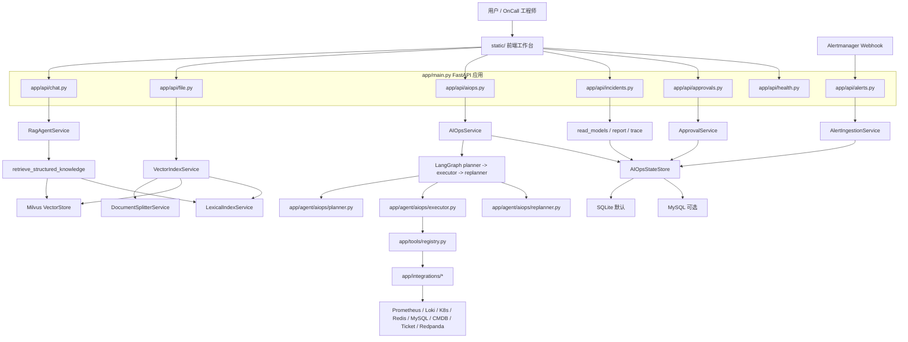
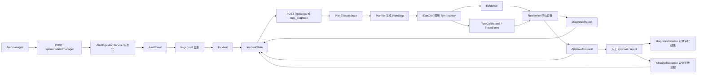
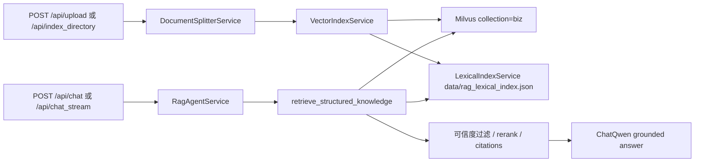
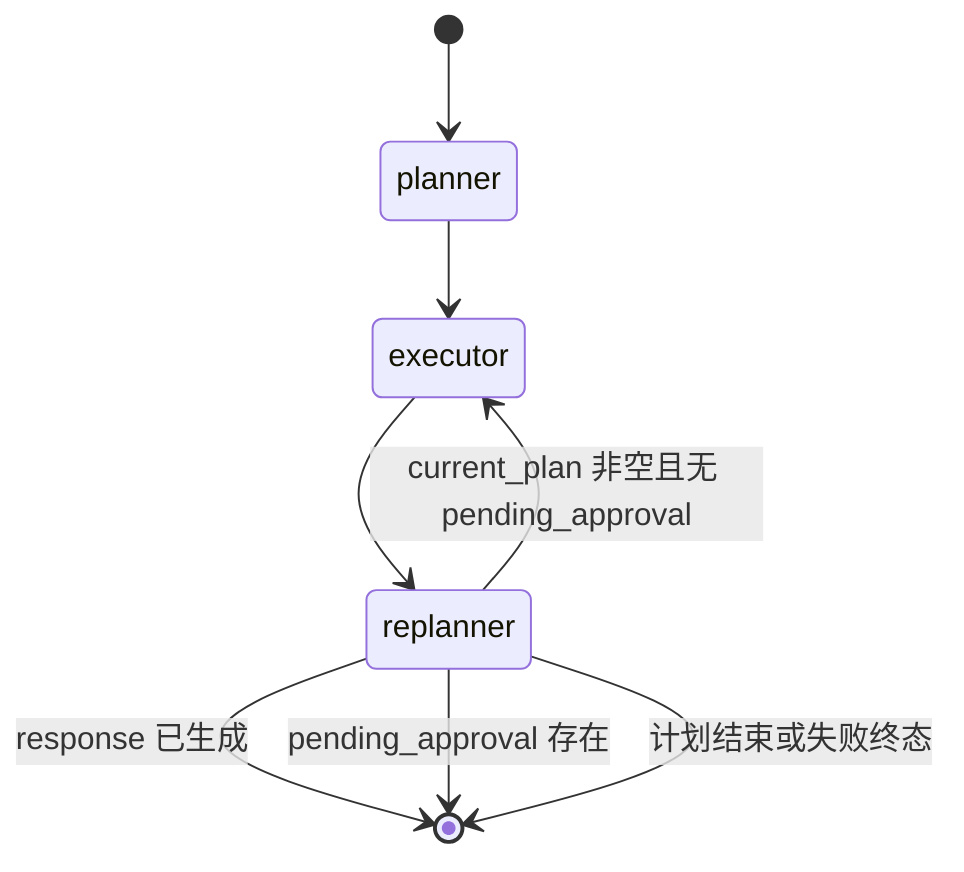

# AutoOnCall 项目总览：从 RAG 问答到 AIOps 智能诊断平台

AutoOnCall 是一个 Python 3.11 FastAPI 应用，项目定位是面向 OnCall 故障诊断场景的 RAG 问答与 AIOps Agent 原型。
它不是只调用大模型生成一段聊天回复，而是把知识库检索、告警接入、诊断计划、工具取证、风险控制、人工审批、报告沉淀和安全变更记录串成一条工程链路。
普通用户可以通过 `/api/chat` 和 `/api/chat_stream` 查询知识库；运维场景可以通过 Alertmanager webhook 或手动 Incident 触发 AIOps 诊断。
诊断过程由 LangGraph 编排的 `planner -> executor -> replanner` 工作流驱动，并通过 SSE 持续返回计划、步骤、报告和终态。
每次诊断都会沉淀 `Evidence`、`TraceEvent`、`DiagnosisReport`、`IncidentState` 和必要的审批/变更对象，方便复盘和审计。
当前项目强调“可解释、可回放、可控风险”的工程化闭环，不应被介绍成已经自动接管真实生产系统的闭环自愈平台。
读完本文，你应该能在一篇文章内建立项目全局地图，并能在面试中用 5 分钟讲清楚它的价值和边界。

## 一、项目解决什么问题

OnCall 故障诊断有三个典型痛点：

1. 信息分散：告警、指标、日志、Trace、K8s、Redis、MySQL、发布历史、工单和 Runbook 分散在不同系统里。
2. 诊断不可复盘：很多排查过程停留在聊天记录或人的脑子里，事后很难还原“看过什么证据、为什么这么判断”。
3. 自动化有风险：AIOps 如果直接执行重启、删 Pod、执行 SQL、改生产配置，很容易把诊断工具变成事故放大器。

AutoOnCall 的设计目标不是让大模型“拍脑袋给结论”，而是把大模型放在一个后端工程框架里：

- 用 RAG 检索内部 Runbook，约束问答和诊断计划。
- 用 Alertmanager webhook 把外部告警标准化成内部 `AlertEvent` 和 `IncidentState`。
- 用 AIOps Agent 生成结构化排查计划，按工具契约采集证据。
- 用 `Evidence`、`TraceEvent`、`DiagnosisReport` 沉淀过程和结果。
- 用风险控制与人工审批阻断生产写操作。
- 用安全变更流程记录 dry-run、sandbox 或人工执行结果，而不是让 Agent 直接修改生产环境。

所以，这个项目适合在校招面试中被定位为：“一个围绕 OnCall 场景构建的 FastAPI + RAG + AIOps Agent 工程化项目，核心亮点是复杂业务分层、状态建模、工具适配、风险控制和测试覆盖。”

## 二、总体架构图

下面是从前端、API、服务、Agent、工具、外部系统到存储的总览图。它故意不展开每个子链路的内部细节，后续文章会分别深入 RAG、告警、Agent、证据、审批和变更。



从图里可以看出，AutoOnCall 不是一个所有逻辑都塞在路由函数里的 Demo。`app/api/` 做请求入口，`app/models/` 做数据契约，`app/services/` 做业务编排与存储，`app/agent/aiops/` 做 Agent 工作流，`app/tools/` 和 `app/integrations/` 做工具契约与外部系统适配，`static/` 做本地工作台。

## 三、从代码入口看项目怎么启动

应用入口是 `app/main.py`。

这里做了几件关键事情：

- 创建 `FastAPI` 实例，标题和版本来自 `app/config.py` 中的 `config.app_name` 和 `config.app_version`。
- 注册 CORS 中间件，允许的来源来自 `config.cors_origins`。
- 挂载路由：`health`、`chat`、`file`、`aiops`、`alerts`、`approvals`、`incidents`、`evaluations`。
- 挂载 `static/` 目录，并在 `/` 返回 `static/index.html`。
- 在生命周期函数 `lifespan` 中打印启动信息，并说明 Milvus 会在 RAG 检索或文档索引首次使用时按需连接。
- 如果服务绑定到 `0.0.0.0`，并且鉴权关闭、CORS 全开或 mock fallback 开启，会通过 `production_exposure_warnings()` 记录生产暴露风险提示。

这个入口文件体现了一个重要取舍：应用本身是一个后端服务，但为了本地演示和校招展示，直接挂载了 `static/` 前端工作台，不需要额外启动前端构建工具。

关键路径：

| 层次 | 关键路径 | 作用 |
| --- | --- | --- |
| 应用入口 | `app/main.py` | 创建 FastAPI、注册路由、挂载静态页面、启动/关闭 Milvus 管理器 |
| 配置 | `app/config.py` | 统一管理 DashScope、Milvus、RAG、AIOps、外部适配器、鉴权和上传限制 |
| 鉴权 | `app/core/auth.py` | 可选 API token RBAC，按 read、diagnose、approve、change 等 scope 控制接口 |
| 健康检查 | `app/api/health.py` | 区分 liveness、readiness、RAG readiness 和 AIOps readiness |

## 四、模块分层：每层负责什么

### 1. API 层：把外部请求变成内部模型

`app/api/` 是所有 HTTP 入口：

- `app/api/chat.py`：RAG 快速问答 `/api/chat`、流式问答 `/api/chat_stream`、会话清理和会话历史。
- `app/api/file.py`：文件上传 `/api/upload` 和目录索引 `/api/index_directory`，上传后触发向量索引。
- `app/api/alerts.py`：Alertmanager webhook `/api/alerts/alertmanager`、告警列表 `/api/alerts`、告警详情 `/api/alerts/{fingerprint}`。
- `app/api/aiops.py`：AIOps 诊断 `/api/aiops`、Demo Incident、运行历史、工具契约、审批后恢复诊断、安全变更恢复和变更查询。
- `app/api/incidents.py`：Incident 列表、详情、Trace 和报告读取。
- `app/api/approvals.py`：待审批列表、Incident 审批列表、提交审批决策。
- `app/api/evaluations.py`：离线评测摘要和适配器验收摘要。
- `app/api/health.py`：健康检查与能力就绪检查。

API 层的设计重点是“薄”：它负责鉴权、参数接收、HTTP 状态码、SSE 包装和错误转换，不直接写复杂诊断逻辑。例如 `/api/aiops` 只生成或接收 `session_id`，然后调用 `aiops_service.diagnose()`，把事件通过 `EventSourceResponse` 逐条返回。

### 2. 模型层：用 Pydantic 固定业务语言

`app/models/` 是项目的业务词典。比较核心的模型包括：

- `app/models/request.py`、`app/models/response.py`：普通聊天请求/响应。
- `app/models/document.py`：文档相关模型。
- `app/models/alert.py`：`AlertEvent`、`AlertIngestionItem`、`AlertIngestionResult`。
- `app/models/incident.py`：结构化诊断输入 `Incident`。
- `app/models/incident_state.py`：面向持久化和前端读取的最新生命周期状态 `IncidentState`。
- `app/models/aiops.py`：`AIOpsRequest`、`AIOpsResumeRequest` 和旧兼容响应模型。
- `app/models/plan.py`：Agent 可执行的 `PlanStep`。
- `app/models/evidence.py`：工具取证结果 `Evidence`，包含来源、类型、立场、置信度、事实、推断和不确定性。
- `app/models/trace.py`：`ToolCallRecord` 和 `TraceEvent`。
- `app/models/report.py`：结构化诊断报告 `DiagnosisReport`。
- `app/models/approval.py`：`RiskAssessment`、`ApprovalRequest`、`ApprovalDecisionRequest`。
- `app/models/change_plan.py`、`app/models/change_execution.py`：变更计划和安全变更执行状态。

这里的关键取舍是：项目没有让字典在所有层里随意流动，而是把重要边界抽成 Pydantic 模型。这样做有三个收益：

1. API 文档能自动生成更稳定的 schema。
2. 测试可以围绕模型字段做明确断言。
3. Agent、报告和前端共享同一套业务语言，减少“同一件事有多个名字”的混乱。

### 3. 服务层：业务编排和状态沉淀

`app/services/` 是项目最重的后端业务层：

- RAG 相关：`rag_agent_service.py`、`rag_retrieval_service.py`、`vector_index_service.py`、`document_splitter_service.py`、`vector_store_manager.py`、`vector_embedding_service.py`、`lexical_index_service.py`。
- 告警和生命周期：`alert_ingestion_service.py`、`incident_lifecycle.py`、`incident_state_builder.py`。
- AIOps 编排：`aiops_service.py`。
- 审批和变更：`approval_service.py`、`approval_workflow.py`、`change_plan_builder.py`、`change_execution_service.py`。
- 沉淀和读模型：`trace_service.py`、`report_generator.py`、`read_models.py`、`rag_read_models.py`、`change_execution_read_models.py`。
- 存储：`aiops_store.py`、`sqlite_store.py`、`mysql_store.py`。
- 评测：`evaluation_read_models.py`。

服务层的核心设计是“把过程变成状态”。例如 `AIOpsService` 不只是跑完一个 Agent，它还会：

- 创建 workflow started Trace。
- 保存 `AIOpsSessionSnapshot`。
- 将每个 LangGraph 节点输出转换成 SSE 事件。
- 为每个节点记录 `TraceEvent`。
- 按事件状态更新 `IncidentState`。
- 如果最终没有结构化报告，调用 `ReportGenerator.generate_from_state()` 补齐报告。

这让系统从“调用一次大模型”变成“可查询、可恢复、可审计的一次诊断运行”。

### 4. Agent 层：Plan-Execute-Replan

`app/agent/aiops/` 是 AIOps 诊断的核心：

- `state.py` 定义 `PlanExecuteState`，包括 `input`、`incident`、`current_plan`、`past_steps`、`tool_call_records`、`gathered_evidence`、`risk_assessment`、`pending_approval`、`report`、`trace_id` 等。
- `planner.py` 负责生成结构化 `PlanStep`。它会检索 Runbook，读取工具契约，并在 LLM 失败时使用规则 fallback。
- `executor.py` 负责执行下一步。它优先通过 `ToolRegistry` 调用标准工具，把结果转成 `ToolExecutionResult`、`Evidence` 和 `ToolCallRecord`，并在执行前经过风险控制。
- `replanner.py` 负责根据证据分析决定继续、补查、重试、请求审批、生成报告或升级人工。
- `evidence_analyzer.py` 负责从证据和工具调用中判断证据是否充分、是否冲突、是否需要补证据。
- `risk_controller.py` 负责判断计划步骤是允许、需要审批还是禁止。
- `plan_fallback.py` 提供 LLM 不可用时的规则计划。

项目选择 Plan-Execute-Replan，而不是一次性问答，是因为 AIOps 场景天然需要多步取证：先看指标，再看日志，再看依赖和发布历史，过程中还要判断证据是否够、工具是否失败、是否触碰生产风险。一次性回答很难把这些中间状态沉淀下来。

### 5. 工具与外部适配器层：稳定契约隔离复杂系统

`app/tools/` 定义 Agent 能调用的工具，`app/integrations/` 定义外部系统适配器。

`app/tools/base.py` 中的核心抽象是：

- `ToolContract`：工具名称、输入输出 schema、风险等级、是否只读、超时、重试策略、数据源和降级策略。
- `ToolExecutionResult`：所有工具统一返回的结构化结果。
- `AIOpsTool`：工具基类，封装超时、异常捕获和失败结构化。

`app/tools/registry.py` 通过 `create_default_tool_registry()` 注册标准工具，包括：

- `query_alerts`
- `query_metrics`
- `query_logs`
- `query_traces`
- `query_service_context`
- `query_deploy_history`
- `query_message_queue_status`
- `query_redis_status`
- `query_k8s_status`
- `query_mysql_status`
- `search_runbook`
- `search_history_ticket`
- `suggest_remediation`

外部适配器包括：

- `app/integrations/alertmanager.py`
- `app/integrations/prometheus.py`
- `app/integrations/log_gateway.py`
- `app/integrations/loki.py`
- `app/integrations/tracing.py`
- `app/integrations/redpanda.py`
- `app/integrations/kubernetes.py`
- `app/integrations/redis_info.py`
- `app/integrations/mysql.py`
- `app/integrations/service_catalog.py`
- `app/integrations/ticketing.py`

这个分层的好处是：Planner 和 Executor 不需要知道 Prometheus HTTP API 怎么查，也不需要知道 Loki、Jaeger、Redis、MySQL 的响应格式。Agent 只面对“工具契约”，真实系统差异被适配器吸收。

### 6. 存储层：SQLite 默认，MySQL 可选

`app/services/aiops_store.py` 定义 `AIOpsStateStore` 协议，统一保存：

- `AlertEvent`
- `TraceEvent`
- `ApprovalRequest`
- `ChangeExecution`
- `AIOpsSessionSnapshot`
- `IncidentState`
- `DiagnosisReport`

`create_aiops_store()` 默认返回 `AIOpsSQLiteStore`，当 `AIOPS_STORAGE_BACKEND=mysql` 时返回 `AIOpsMySQLStore`。这体现了一个适合项目展示的取舍：

- 本地演示和测试优先 SQLite，启动简单。
- 更正式的部署可以切到 MySQL，便于多副本和备份。
- 上层服务依赖的是 store 协议，而不是直接依赖某个数据库实现。

### 7. 前端静态页面：本地可演示的工作台

`static/` 下只有三个文件：

- `static/index.html`
- `static/app.js`
- `static/styles.css`

前端不是复杂 SPA 工程，而是由 FastAPI 直接挂载的静态工作台。页面包含知识问答、故障诊断中心、处置中心、环境就绪中心等视图。`static/app.js` 会调用 `/api/chat`、`/api/chat_stream`、`/api/upload`、`/api/aiops`、`/api/incidents/*`、`/api/approvals/*`、`/api/eval/*` 等接口，并解析 SSE 事件展示计划、步骤、工具调用、证据、Trace、报告、审批和变更记录。

这对校招项目很实用：面试时可以直接打开 `http://localhost:9900` 演示，不需要解释前后端联调和构建链路。

## 五、主链路：从 Alertmanager 到诊断、审批和变更

下面是题目要求的主链路图。它展示的是告警进入系统后，如何逐步变成可诊断、可审计、可审批、可记录变更的 Incident。



按业务链路顺序拆开看：

### 1. 请求入口

告警入口是 `app/api/alerts.py` 的 `POST /api/alerts/alertmanager`。它接收 Alertmanager webhook payload，调用 `AlertIngestionService.ingest_alertmanager_webhook()`。

诊断入口是 `app/api/aiops.py` 的 `POST /api/aiops`。它接收 `AIOpsRequest`，其中可以带 `session_id` 和结构化 `Incident`，然后返回 SSE 流。

审批入口是 `app/api/approvals.py` 的 `POST /api/incidents/{incident_id}/approval`。

安全变更入口是 `app/api/aiops.py` 的 `POST /api/incidents/{incident_id}/changes/{change_plan_id}/resume`。

### 2. 数据模型

Alertmanager 进来后不会直接丢给 Agent，而是先标准化为 `AlertEvent`：

- `fingerprint`
- `incident_id`
- `status`
- `alertname`
- `service_name`
- `severity`
- `environment`
- `summary`
- `description`
- `labels`
- `annotations`
- `raw_payload`

随后通过 `_build_incident()` 转成 `Incident`，作为 AIOps 诊断输入。`IncidentState` 则是“当前 Incident 生命周期”的聚合视图，前端列表和详情页主要读它。

### 3. 服务层

告警服务是 `app/services/alert_ingestion_service.py`。它负责：

- 提取 webhook 中的 `alerts[]`。
- 合并 `commonLabels` 和单条 alert labels。
- 标准化 severity，例如 critical 映射为 `P1`。
- 优先使用 Alertmanager 自带 fingerprint；缺失或过长时生成稳定 hash。
- 保存 `AlertEvent`。
- 创建或更新 `IncidentState`。

AIOps 编排服务是 `app/services/aiops_service.py`。它负责：

- 构建 LangGraph 工作流。
- 初始化 `PlanExecuteState`。
- 记录 workflow started Trace。
- 逐节点输出 SSE 事件。
- 保存 session snapshot 和 incident lifecycle。
- 生成或补齐结构化报告。
- 支持审批后 resume。

审批和变更服务分别是 `app/services/approval_service.py`、`app/services/approval_workflow.py` 和 `app/services/change_execution_service.py`。

### 4. 状态变化

`app/services/incident_lifecycle.py` 定义了一组生命周期状态，例如：

- `alert_firing`
- `alert_resolved`
- `diagnosing`
- `running`
- `completed`
- `waiting_approval`
- `approval_approved`
- `approval_rejected`
- `approval_resumed`
- `blocked`
- `failed`
- `escalated`
- `change_prechecking`
- `change_dry_run`
- `change_validated`
- `waiting_manual_execution`
- `resolved`
- `rollback_recommended`

`app/services/incident_state_builder.py` 提供多个 builder，把不同来源转换为 `IncidentState`：

- `build_incident_state_from_alert()`
- `build_incident_state_from_state()`
- `build_incident_state_from_report()`
- `build_incident_state_from_approval()`
- `build_incident_state_from_change_execution()`

这个设计让“告警状态、诊断状态、审批状态、变更状态”都能投影到同一个 Incident 视图上。

### 5. 外部依赖

外部依赖分两类：

- RAG 依赖：DashScope Embedding/ChatQwen、Milvus、本地词法索引。
- AIOps 依赖：Alertmanager、Prometheus、Loki/日志网关、Jaeger/Tempo、Kubernetes、Redis、MySQL、Redpanda、CMDB、发布历史、工单系统、MCP mock 服务等。

代码当前实现强调“显式降级”：

- 如果外部适配器未配置且 `AIOPS_MOCK_FALLBACK_ENABLED=false`，工具应返回结构化不可用或失败结果。
- 如果本地 demo 开启 mock fallback，工具可以返回 mock 或混合来源，但 `data_source`、`source`、`source_detail` 会体现来源。
- 报告生成会根据 mock、unknown、failed 等证据来源限制置信度，避免把演示数据包装成真实生产结论。

### 6. 返回和沉淀结果

`/api/aiops` 返回的是 SSE 事件流，典型事件包括：

- `plan`：计划生成。
- `step_complete`：某一步完成，带证据和工具调用记录。
- `approval_required`：需要人工审批。
- `report`：最终报告。
- `complete`：终态事件。
- `error`：异常。

沉淀结果包括：

- `AIOpsSessionSnapshot`：诊断运行快照。
- `TraceEvent`：节点、工具、审批、报告、变更事件。
- `ToolCallRecord`：工具调用输入、输出、耗时、状态和风险信息。
- `Evidence`：证据事实、推断、不确定性、下一步。
- `DiagnosisReport`：结构化报告和 Markdown 报告。
- `ApprovalRequest`：风险动作审批单。
- `ChangeExecution`：安全变更执行记录。
- `IncidentState`：前端和读接口看到的最新生命周期。

### 7. 测试覆盖

这条主链路不是只靠人工演示验证。当前仓库已经有多类测试：

- `tests/test_alert_ingestion_service.py` 覆盖告警创建、去重、恢复、reopen、敏感字段脱敏、raw payload 压缩、长 fingerprint hash、空 fingerprint fallback。
- `tests/test_alerts_api.py` 覆盖 Alertmanager API、无 alerts 的 400、auto diagnose 只对新建或 reopen 告警触发、失败状态写入 IncidentState。
- `tests/test_aiops_mainline_api.py` 覆盖真实 graph 节点在 fallback 场景下跑通，并验证 SSE、Trace、Report、Incident Overview。
- `tests/test_aiops_service_events.py` 覆盖 planner/executor/replanner 事件结构、终态状态、结构化报告补齐和 snapshot merge。
- `tests/test_risk_controller.py` 覆盖只读查询允许、生产重启需要审批、删 Pod、危险 shell、未审核写 SQL 禁止。
- `tests/test_approval_service.py` 覆盖审批创建、幂等、决策状态、重复决策阻断和报告同步。
- `tests/test_change_execution_service.py` 覆盖 dry-run、manual record、sandbox、过期计划、回滚建议、幂等恢复等安全变更边界。
- `tests/test_report_generator.py`、`tests/test_trace_service.py` 覆盖报告和 Trace 的持久化、脱敏、置信度、冲突和引用。
- `tests/test_tool_registry.py`、`tests/test_external_adapters.py` 覆盖工具契约、适配器行为、真实适配器优先、未配置时结构化失败。
- `tests/test_frontend_playwright_smoke.py` 覆盖静态工作台基本渲染。

常用验证命令来自 `Makefile` 和 `pyproject.toml`：

```bash
make test-quick
make test
make eval
make eval-rag
make eval-change
make verify-local
```

本文是文档生成，没有修改应用代码；如果只是验证本文写入，可以检查 Markdown 文件是否存在。如果要验证项目行为，应运行上述测试和评测命令。

## 六、RAG 问答链路在整体架构中的位置

RAG 不是本文重点，但它是 AutoOnCall 的底座能力之一。它主要支撑两类场景：

- 用户直接问知识库问题。
- Planner 生成诊断计划时检索内部 Runbook，把经验步骤转成诊断计划候选。

RAG 链路如下：



关键代码路径：

- `app/api/chat.py`
- `app/api/file.py`
- `app/services/rag_agent_service.py`
- `app/services/rag_retrieval_service.py`
- `app/services/vector_index_service.py`
- `app/services/document_splitter_service.py`
- `app/services/vector_store_manager.py`
- `app/services/lexical_index_service.py`

关键设计取舍：

- 上传只允许配置中的文本/Markdown 扩展名，默认是 `txt,md,markdown`。
- `DocumentSplitterService` 对 Markdown 使用标题切分，再用递归字符切分，并合并过小 chunk。
- Milvus 用于向量检索，本地 `LexicalIndexService` 提供词法召回，检索时可以 hybrid search 和 rerank。
- `retrieve_structured_knowledge()` 对候选结果做可信度判断。没有可信来源时返回 `no_answer`，并要求回答拒答。
- citation 会补齐 `source_file + chunk_id`，让答案能回到来源文档。

边界情况：

- Milvus 不可用时，RAG readiness 会失败。
- 检索结果距离超过阈值或词法分不足时，不应强答。
- 元数据过滤 key 有安全校验，避免构造危险 Milvus 表达式。
- 索引失败时本地词法索引会标记 stale source，避免信任旧 chunk。

## 七、AIOps 诊断链路在整体架构中的位置

AIOps 是本文的主角，但内部 Planner/Executor/Replanner 的细节留给后续专文。总览层面只需要理解它的输入、输出和边界。

`app/services/aiops_service.py` 构建的 LangGraph 是：



核心状态在 `app/agent/aiops/state.py` 的 `PlanExecuteState` 中。它不是只保存一段文本，而是保存计划、当前队列、已执行步骤、证据、工具记录、风险评估、审批、报告、错误、告警和 trace_id。

设计取舍：

- `planner.py` 使用结构化 `PlanStep`，而不是普通自然语言步骤，方便 Executor 稳定消费。
- `executor.py` 优先走 `ToolRegistry`，只有工具未注册或 manual analysis 时才走 fallback，并把 fallback 写入 warning。
- `risk_controller.py` 在工具执行前拦截风险动作，避免“先执行再补审批”。
- `replanner.py` 依赖 `evidence_analyzer.py` 判断证据充分性、失败工具、缺失证据、冲突和升级人工。
- `report_generator.py` 把状态转为 `DiagnosisReport`，而不是只返回一段 LLM 文本。

边界情况：

- LLM 不可用时，Planner 可以使用 `build_fallback_plan()`。
- MCP 工具不可用时，Executor 继续使用本地工具和标准注册工具。
- 未注册工具的 LLM ToolNode 兜底结果不会被当成标准成功证据。
- 达到最大步骤数时，Replanner 会强制生成报告或升级人工，避免无限循环。
- 存在 `pending_approval` 时，LangGraph 停止自动执行。

## 八、人工审批与安全变更的架构边界

AutoOnCall 的一个核心亮点是：它把“诊断建议”和“生产动作”分开。

`app/agent/aiops/risk_controller.py` 里有三类策略：

- `allow`：低风险或只读动作可以自动执行。
- `approval_required`：例如生产环境重启、扩缩容、回滚、限流、修改配置等，需要人工审批。
- `forbidden`：例如 `delete_pod`、`execute_sql`、`run_shell`、`rm -rf`、`drop table`、未审核写 SQL 等，禁止自动执行。

`suggest_remediation` 是一个很好的边界例子：即使它的风险等级是 medium 或 high，只要它只是生成建议、保持只读，就不会创建审批单；真正的生产动作仍然需要进入审批和变更流程。

审批通过后，有两条后续路径：

- `/api/incidents/{incident_id}/diagnosis/resume`：记录审批决策，更新诊断报告和 Trace，但明确不执行生产变更。
- `/api/incidents/{incident_id}/changes/{change_plan_id}/resume`：进入安全变更流程，支持 `dry_run_only`、`manual_record`、`sandbox`。

当前代码实现的安全边界是：

- `dry_run_only` 只做 pre-check 和 dry-run。
- `manual_record` 等待人工提交执行结果。
- `sandbox` 只适合本地沙箱或明确开启的非生产路径。
- Agent 不会自动执行生产写操作。

这点在面试中很重要。不要把项目吹成“自动修复生产事故”。更准确的说法是：项目已经把风险动作识别、审批、变更计划、dry-run、人工记录和报告闭环做成了工程框架。

## 九、设计取舍：为什么这样组织

### 1. API -> Service -> Store/Integration/Agent -> Model

项目整体调用方向基本是：

```text
API 层
  -> Service 层
  -> Agent / Tool / Integration / Store
  -> Pydantic Model
```

这么做的原因是保持路由简单，让核心逻辑可测试。比如 `AlertIngestionService` 可以在测试里直接用临时 SQLite store 验证，不必每次都启动 FastAPI。

### 2. AlertEvent 和 IncidentState 分开

`AlertEvent` 是外部告警事件的标准化记录，重点是 fingerprint、labels、annotations、status 和 raw payload。

`IncidentState` 是内部生命周期视图，重点是当前状态、报告、审批、trace、session、manual action 等。

如果不分开，一个 resolved webhook 可能会错误覆盖已经进入审批或变更的 Incident。当前 `build_incident_state_from_alert()` 会检查已有状态，避免 resolved 告警覆盖 `waiting_approval` 等更深生命周期。

### 3. Evidence、Trace、Report 分开

`Evidence` 关注“证据内容和可信度”，`TraceEvent` 关注“什么时候哪个节点或工具做了什么”，`DiagnosisReport` 关注“面向人阅读的结论和建议”。

如果只保存最终报告，面试官追问“你怎么证明这个结论不是大模型编的”时会很被动。现在可以回答：每个工具调用有 `ToolCallRecord`，每个节点有 `TraceEvent`，报告中有 evidence profile、confidence reason、uncertainties 和 tool calls。

### 4. ToolRegistry 而不是让 LLM 随便调函数

工具契约包含 schema、risk、read_only、timeout、data_sources 和 degradation_strategy。Planner 可以参考工具契约制定计划，Executor 可以稳定调用，Risk Controller 可以用工具元信息判断是否允许自动执行。

这比“把一堆函数直接暴露给大模型”更适合后端工程项目展示。

### 5. SSE 优先而不是长时间阻塞响应

AIOps 诊断可能要经过多个步骤，直接同步返回会让用户不知道系统是否卡住。`/api/aiops` 用 SSE 返回 `plan`、`step_complete`、`report`、`complete` 等事件，前端可以实时展示。

测试也围绕 SSE contract 做了验证，例如 `tests/test_aiops_mainline_api.py` 和 `tests/test_aiops_service_events.py`。

### 6. Mock fallback 必须显式体现

项目支持本地 demo 和离线演示，但不会把 mock 伪装成真实生产数据。配置项 `AIOPS_MOCK_FALLBACK_ENABLED` 默认是 false；开启后工具输出中会保留 `source=mock` 或 `source_detail`。

这是一种面试中很容易讲清楚的工程边界：为了可演示，可以 fallback；为了可信，必须标注来源并限制报告置信度。

## 十、边界情况清单

这里把总览层面的边界统一列出来，后续文章会逐个深入。

| 边界情况 | 当前实现 |
| --- | --- |
| Alertmanager payload 没有有效 alerts | `app/api/alerts.py` 返回 400 |
| fingerprint 缺失 | `alert_ingestion_service.py` 基于 alertname、service、environment 和关键 labels 生成稳定 hash |
| fingerprint 过长 | 通过 sha256 压缩到可存储长度 |
| 重复 firing 告警 | 保存同一 fingerprint，标记 deduplicated，不重复创建 Incident |
| resolved 告警 | 更新 alert 状态；如果 Incident 已进入审批/变更等更深状态，不覆盖 |
| 敏感 label/annotation | `alert_ingestion_service.py` 对 password、token、secret、authorization、dsn 等脱敏 |
| raw payload 过大或含敏感字段 | 默认只保存精简 payload；完整 raw 需要显式开启配置，并仍会脱敏 |
| RAG 无可信来源 | `retrieve_structured_knowledge()` 返回 `no_answer`，问答层拒答 |
| Milvus 未就绪 | `/health/ready/rag` 返回不可用 |
| 外部系统未配置 | mock fallback 关闭时返回结构化失败；开启时可用 mock/offline 路径 |
| 工具输入过大 | 工具层对时间窗口、limit 等做 clamp |
| 未注册工具 | Executor 走 fallback，并记录 warning，不能当标准成功证据 |
| 危险动作 | Risk Controller 返回 forbidden，不执行 |
| 中高风险生产动作 | 创建 `ApprovalRequest`，自动诊断暂停 |
| 跨 Incident 审批 ID | API 校验并拒绝，不修改状态 |
| 审批通过后 | resume 只记录决策，不执行生产动作 |
| 安全变更重复触发 | `ChangeExecutionService` 使用稳定 ID 和 store 幂等创建 |
| SQLite 多副本 | README 明确 SQLite 适合单机演示，多副本应切 MySQL |

## 十一、代码当前实现与可改进方向

| 主题 | 代码当前实现 | 可改进方向 |
| --- | --- | --- |
| 鉴权 | `app/core/auth.py` 支持可选 API token RBAC，默认本地 demo 关闭 | 生产建议接入 SSO/OIDC，并在网关侧统一身份、审计和限流 |
| 存储 | `AIOPS_STORAGE_BACKEND` 支持 SQLite/MySQL，默认 SQLite | 生产需要完善迁移、备份、连接池、数据保留策略和多副本一致性验证 |
| 前端 | `static/` 原生 HTML/CSS/JS，便于本地演示 | 产品化可拆成独立前端工程，增强状态管理、权限感知和可观测性 |
| AIOps 自动化 | 只读诊断自动执行，风险动作审批，生产写操作不自动执行 | 可对接企业变更平台、工单系统和发布平台，把审批流做成真实组织流程 |
| 外部系统 | 已有 Prometheus、Loki、K8s、Redis、MySQL、CMDB、Ticket 等适配器 | 生产接入需要补齐认证、网络、限流、租户隔离、错误预算和更细粒度权限 |
| 评测 | `eval/` 和 `tests/` 已覆盖 AIOps、RAG、安全变更核心行为 | 可加入更多真实事故样本、黄金证据集和端到端回放数据 |
| Agent 控制 | 有 fallback、max steps、risk gate 和 evidence analyzer | 可进一步加入更强的策略引擎、工具白名单动态配置和人工反馈学习 |

## 十二、为什么适合作为校招项目亮点

### 1. 工程分层清晰

从 `app/main.py` 到 `app/api/`、`app/models/`、`app/services/`、`app/agent/aiops/`、`app/tools/`、`app/integrations/`，每层职责比较清楚。面试官问“你们项目怎么组织复杂业务”时，可以直接拿目录结构解释。

### 2. 状态建模完整

项目不是只做 CRUD，而是有 `IncidentState`、`AIOpsSessionSnapshot`、`Evidence`、`TraceEvent`、`DiagnosisReport`、`ApprovalRequest`、`ChangeExecution` 这些状态对象。状态建模是后端项目里很有含金量的部分。

### 3. Agent 不是黑盒

Plan-Execute-Replan 工作流把“计划、执行、再评估”拆开，每一步都有状态、证据和 Trace。这比“调用一次大模型”更能体现工程能力。

### 4. 外部系统适配真实

项目里有 Prometheus、日志网关、Loki、Jaeger/Tempo、K8s、Redis、MySQL、Redpanda、CMDB、Ticket 等适配器。即使本地演示可能用 mock，也保留了真实系统接入边界。

### 5. 风险控制意识强

很多 AI 项目容易忽视“模型会不会乱执行”。AutoOnCall 把 read-only、approval_required、forbidden 分开，并有人工审批和安全变更链路，是很适合面试展开的工程亮点。

### 6. 测试覆盖面广

仓库的 `tests/` 不只测简单函数，还覆盖 API、Agent 事件、告警、审批、变更、报告、Trace、适配器、RAG、前端冒烟和离线评测。这能体现你对质量保障的理解。

## 十三、本文不展开的内容

为了避免一篇总览文章写散，下面这些主题只在本文中说明位置，不展开内部细节：

- RAG 文档切分、hybrid search、rerank、可信来源拒答，会在 RAG 专文中展开。
- Alertmanager webhook 的状态机、fingerprint、resolved/reopened 细节，会在告警接入专文中展开。
- `/api/aiops` 的 SSE 事件、session snapshot、resume 细节，会在 AIOps 主链路专文中展开。
- Planner、Executor、Replanner 的提示词、fallback、工具策略，会在 Agent 机制专文中展开。
- Evidence、Trace、Report 的字段和报告生成策略，会在沉淀机制专文中展开。
- 人工审批和安全变更的状态流转，会在审批变更专文中展开。
- 部署、健康检查、评测体系和前端工作台，会在对应专题中展开。

## 十四、5 分钟项目介绍话术

可以按下面这个节奏讲：

第一分钟，讲项目定位：

> AutoOnCall 是我做的一个面向 OnCall 故障诊断场景的 Python 3.11 FastAPI 项目。它不是单纯聊天机器人，而是把 RAG 知识库问答、Alertmanager 告警接入、AIOps Agent 诊断、工具取证、人工审批、诊断报告和安全变更记录串成一条可解释闭环。普通用户可以问 Runbook，告警也可以自动进入 Incident 生命周期。

第二分钟，讲整体架构：

> 项目入口在 `app/main.py`，API 层在 `app/api/`，模型层在 `app/models/`，业务服务在 `app/services/`，Agent 在 `app/agent/aiops/`，外部适配器在 `app/integrations/`，工具契约在 `app/tools/`，前端工作台在 `static/`。调用方向基本是 API 到 Service，再到 Agent、Tool、Integration 或 Store，最后沉淀到 SQLite 或 MySQL。

第三分钟，讲核心链路：

> 告警从 `/api/alerts/alertmanager` 进入后，会被 `AlertIngestionService` 标准化成 `AlertEvent`，按 fingerprint 去重，再创建或更新 `IncidentState`。诊断从 `/api/aiops` 进入，`AIOpsService` 用 LangGraph 编排 `planner -> executor -> replanner`。Planner 生成 `PlanStep`，Executor 通过 `ToolRegistry` 调用指标、日志、Trace、Redis、MySQL、K8s、Runbook 等只读工具，Replanner 根据 `Evidence` 判断是否继续、补查、生成报告或请求审批。

第四分钟，讲工程亮点：

> 我比较重视可解释和风险控制。每次工具调用都会转成 `ToolCallRecord` 和 `Evidence`，每个节点会记录 `TraceEvent`，最终生成结构化 `DiagnosisReport`。对于风险动作，`risk_controller.py` 会在执行前判断是 allow、approval_required 还是 forbidden。审批通过后，系统也不会直接执行生产写操作，而是进入 dry-run、sandbox 或人工执行记录这样的安全变更流程。

第五分钟，讲验证和边界：

> 项目有比较完整的测试，包括 RAG 检索、告警接入、AIOps SSE 主链路、审批、变更、Trace、报告、适配器和前端冒烟。边界上，RAG 没有可信来源会拒答；resolved 告警不会覆盖已经进入审批的 Incident；mock fallback 默认关闭，开启时也会标记数据来源；SQLite 适合本地演示，生产多副本建议切 MySQL。所以我不会把它描述成已经自动接管生产的系统，而是一个有清晰工程边界的 AIOps Agent 平台原型。

## 十五、面试官可能追问与推荐回答

### 追问 1：这个项目和普通 RAG 聊天项目有什么区别？

推荐回答：

> 普通 RAG 项目一般是“上传文档、检索、回答”。AutoOnCall 有 RAG，但它只是底座之一。项目还接入了 Alertmanager，把告警标准化成 `AlertEvent` 和 `IncidentState`；诊断用 Plan-Execute-Replan 工作流，工具调用会沉淀 `Evidence` 和 `TraceEvent`；最终有 `DiagnosisReport`、人工审批和安全变更记录。所以它更像一个围绕 OnCall 场景的诊断平台，而不是单纯问答。

### 追问 2：为什么要把 AlertEvent 和 IncidentState 分开？

推荐回答：

> `AlertEvent` 代表外部告警事件本身，关注 fingerprint、labels、annotations、status 和原始 payload。`IncidentState` 代表内部生命周期视图，关注诊断、审批、报告、变更和当前状态。如果不分开，一个 Alertmanager resolved webhook 可能会覆盖已经进入审批或变更的 Incident。当前代码在 `build_incident_state_from_alert()` 中会保留更深生命周期状态，这就是两者分开的价值。

### 追问 3：AIOps Agent 为什么不用一次性 LLM 回答？

推荐回答：

> 故障诊断不是单轮问答，它需要分步骤取证。比如先看指标，再看日志，再看依赖、发布历史、Redis/MySQL 状态，过程中还要判断证据是否充分、工具是否失败、是否有风险动作。Plan-Execute-Replan 把计划、执行和再评估拆开，可以把每一步变成可审计状态，也方便加入工具契约、风险控制和 fallback。

### 追问 4：你怎么避免 Agent 乱执行危险操作？

推荐回答：

> 项目有两层控制。第一层是工具契约，`ToolContract` 会声明 read_only 和 risk_level。第二层是 `risk_controller.py`，在 Executor 调用工具前判断计划步骤是 allow、approval_required 还是 forbidden。像生产重启、回滚、扩缩容会进入审批；删 Pod、危险 shell、未审核写 SQL 会被禁止。审批通过后，`diagnosis/resume` 也只是记录审批结果，不执行生产写操作；真正后续动作进入安全变更流程。

### 追问 5：如果外部系统没配置，诊断会不会编造数据？

推荐回答：

> 不应该编造。当前配置里 `AIOPS_MOCK_FALLBACK_ENABLED` 默认是 false，外部系统没配置时工具会返回结构化的 not_configured 或 failed 结果。为了本地 demo 可以显式开启 mock fallback，但输出里会标记 `source=mock` 或 source_detail，报告生成也会根据证据来源限制置信度。这样能兼顾演示可用和结论可信。

### 追问 6：RAG 如何保证不是瞎答？

推荐回答：

> RAG 检索集中在 `retrieve_structured_knowledge()`。它会同时考虑向量检索和本地词法索引，可以做 hybrid search 和 rerank，并用 L2 distance 和 lexical trust score 判断可信来源。没有可信 chunk 时返回 `no_answer`，问答层会拒答并提示补充可信文档。回答中还会补 citation，包含 `source_file + chunk_id`。

### 追问 7：诊断结果怎么复盘？

推荐回答：

> 每次诊断不只返回 Markdown。Executor 会把工具结果转成 `Evidence` 和 `ToolCallRecord`；`AIOpsService` 会记录节点级 `TraceEvent`；`ReportGenerator` 会生成结构化 `DiagnosisReport`；`AIOpsSessionSnapshot` 保存运行快照；`IncidentState` 保存当前生命周期。前端和 API 可以按 Incident 查询 Trace、报告、审批和变更记录，所以可以复盘“看了什么证据、哪个工具失败、为什么需要审批”。

### 追问 8：为什么默认用 SQLite，还支持 MySQL？

推荐回答：

> SQLite 适合本地演示、单机开发和测试，启动成本低。项目通过 `AIOpsStateStore` 协议隔离存储，上层服务不直接依赖 SQLite。生产或多副本部署时可以通过 `AIOPS_STORAGE_BACKEND=mysql` 切到 MySQL。这个设计兼顾了校招项目的可运行性和后续生产化扩展。

### 追问 9：这个项目最有含金量的部分是什么？

推荐回答：

> 我会选三个点。第一是状态建模，把 Alert、Incident、Evidence、Trace、Report、Approval、ChangeExecution 都建成明确模型。第二是 Agent 工程化，Plan-Execute-Replan、工具契约、证据分析和 fallback 让大模型不再是黑盒。第三是风险控制，项目明确区分只读诊断、需要审批的风险动作和禁止动作，并且审批后也不自动执行生产写操作。

### 追问 10：如果让你继续改进，你会优先做什么？

推荐回答：

> 我会优先做三件事。第一，把生产鉴权从轻量 API token 升级为 SSO/OIDC 和更完整审计。第二，扩充真实事故样本和回放评测，让报告质量有更可信的指标。第三，把安全变更和企业工单/发布系统打通，让审批、dry-run、人工执行记录和观察结果形成更贴近真实组织流程的闭环。

## 十六、总结

AutoOnCall 的全局架构可以概括为一句话：用 FastAPI 承接 RAG 问答和 AIOps 诊断入口，用 Pydantic 固定业务模型，用 LangGraph 组织 Plan-Execute-Replan，用 ToolRegistry 和 integrations 连接外部系统，用 Evidence/Trace/Report/IncidentState 沉淀过程，用审批和安全变更控制风险。

它的价值不在于“让大模型自动修好一切”，而在于把大模型放进一个可解释、可审计、可测试、可控风险的后端工程框架里。对于校招项目来说，这比单纯展示一个聊天界面更能体现后端工程能力、架构意识和对真实运维场景边界的理解。
