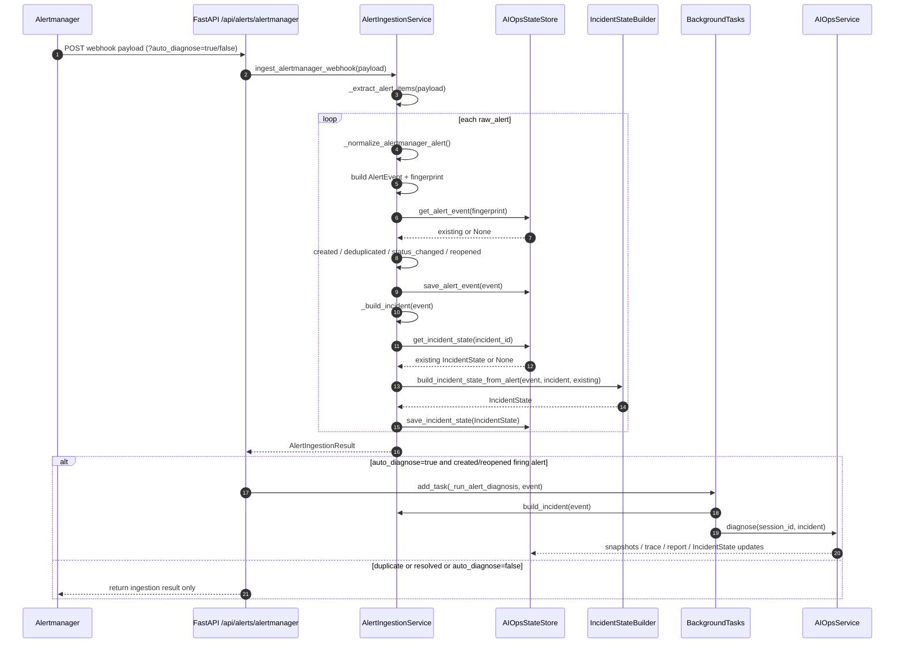

# AutoOnCall 的 Alertmanager 告警接入与 Incident 生命周期设计

AutoOnCall 是一个 Python 3.11 FastAPI 应用，用于 RAG 问答和 AIOps 智能诊断。
它既有面向知识库的对话能力，也有面向运维事件的告警接入、诊断、审批和安全变更能力。
本文只聚焦 Alertmanager webhook 进入系统后的链路，不展开 RAG 检索、Planner/Executor/Replanner 的内部推理细节。
在这条链路里，外部告警会先被标准化为 `AlertEvent`，再通过 `fingerprint` 找到稳定的 `incident_id`。
系统随后创建或更新 `IncidentState`，让前端、历史列表和后续诊断流程都能看到统一的事件生命周期。
如果调用方显式开启自动诊断，新的 firing 告警或 reopened 告警会被投递到现有 AIOps 工作流。

## 本文阅读地图

建议先看这些文件：

- `app/main.py`：注册 `alerts.router`，实际路径前缀是 `/api`。
- `app/api/alerts.py`：告警接入 API、列表 API、自动诊断后台任务。
- `app/models/alert.py`：`AlertEvent`、`AlertIngestionItem`、`AlertIngestionResult`。
- `app/models/incident.py`：AIOps 诊断使用的结构化 `Incident`。
- `app/models/incident_state.py`：持久化生命周期视图 `IncidentState`。
- `app/services/alert_ingestion_service.py`：Alertmanager payload 解析、标准化、去重、脱敏、截断。
- `app/services/incident_state_builder.py`：从告警构造 IncidentState，并保护深层生命周期不被告警覆盖。
- `app/services/incident_lifecycle.py`：状态归一化、状态映射、合并规则。
- `tests/test_alert_ingestion_service.py`、`tests/test_alerts_api.py`：这条链路的关键保护用例。

一句话概括主链路：

```text
POST /api/alerts/alertmanager
-> AlertIngestionService.ingest_alertmanager_webhook
-> AlertEvent
-> fingerprint / incident_id
-> Incident
-> IncidentState
-> 可选 BackgroundTasks 自动诊断
```

## 1. 请求入口：POST /api/alerts/alertmanager

告警 webhook 入口定义在 `app/api/alerts.py`：

```python
@router.post(
    "/alerts/alertmanager",
    response_model=AlertIngestionResult,
    dependencies=[Depends(require_scope(DIAGNOSE_SCOPE))],
)
async def ingest_alertmanager_webhook(
    payload: dict[str, Any],
    background_tasks: BackgroundTasks,
    auto_diagnose: bool = Query(default=False),
) -> AlertIngestionResult:
```

因为 `app/main.py` 使用 `app.include_router(alerts.router, prefix="/api", tags=["AIOps告警接入"])`，所以完整路径是：

```text
POST /api/alerts/alertmanager
```

这个入口做三件事：

1. 调用 `AlertIngestionService.ingest_alertmanager_webhook(payload)` 完成同步入库和生命周期更新。
2. 如果没有解析出任何有效告警，返回 `400`，错误信息是 `Alertmanager payload does not contain any valid alerts`。
3. 如果 `auto_diagnose=true`，只对新告警或重开告警投递后台诊断任务。

这里有一个很重要的代码当前实现：自动诊断默认不开启。也就是说，普通 webhook 请求只会完成告警标准化、去重、IncidentState 更新和结果返回；只有请求中带上 `?auto_diagnose=true` 时，才会进入自动 AIOps 诊断。

这个设计适合本项目当前阶段：告警接入是低风险同步链路，自动诊断是可选异步链路。接入方可以先把 webhook 可靠打进来，再决定是否让每条新告警自动消耗诊断资源。

## 2. Payload 解析：兼容 Alertmanager 标准批量格式

解析入口在 `app/services/alert_ingestion_service.py` 的 `_extract_alert_items`：

```python
def _extract_alert_items(payload: dict[str, Any]) -> list[dict[str, Any]]:
    alerts = payload.get("alerts")
    if isinstance(alerts, list):
        return [item for item in alerts if isinstance(item, dict)]
    if isinstance(payload.get("labels"), dict):
        return [payload]
    return []
```

它支持两种输入：

- 标准 Alertmanager webhook：顶层有 `alerts: [...]`。
- 单条告警兼容格式：顶层本身有 `labels`。

如果 `alerts` 存在但里面混入非 dict 项，代码会过滤掉这些无效项。这样做的好处是：一个批量 webhook 中的坏数据不会拖垮整批请求；但如果最终一条有效告警都没有，API 层会返回 `400`。

可改进方向：当前代码没有对 Alertmanager payload 做更严格的 schema 校验，而是采用宽松解析。生产环境如果希望更早暴露上游格式错误，可以引入专门的 Pydantic webhook 输入模型，并保留现在这种兼容模式作为降级路径。

## 3. AlertEvent 标准化：把外部告警变成内部事件

`AlertEvent` 定义在 `app/models/alert.py`，它是系统对外部告警的标准化快照，核心字段包括：

- `source`：默认是 `alertmanager`。
- `fingerprint`：告警去重键。
- `incident_id`：由 fingerprint 派生出的内部事件 ID。
- `status`：标准化后的告警状态，目前主要是 `firing` 或 `resolved`。
- `alertname`、`service_name`、`severity`、`environment`：面向诊断和列表展示的核心维度。
- `summary`、`description`：从 annotations 提取的文本信息。
- `labels`、`annotations`：脱敏后的标签和注解。
- `starts_at`、`ends_at`、`generator_url`：时间和 Prometheus 跳转信息。
- `raw_payload`：压缩、脱敏后的原始上下文。

标准化逻辑在 `_normalize_alertmanager_alert` 中完成：

```text
commonLabels/commonAnnotations
+ raw_alert.labels/raw_alert.annotations
-> labels / annotations
-> status / alertname / service_name / environment / severity
-> summary / description
-> fingerprint
-> AlertEvent
```

这里有几个工程取舍。

第一，labels 合并时，单条 alert 的 labels 会覆盖 commonLabels。Alertmanager 的 commonLabels 是这一组告警的公共部分，单条 alert 的 labels 更具体，所以后者优先。

第二，`service_name` 不是只认一个字段。代码依次尝试 `service`、`service_name`、`app`、`app_kubernetes_io_name`、`app.kubernetes.io/name`、`job`。这让同一个接入口可以兼容 Kubernetes、Prometheus job、业务自定义标签等不同命名习惯。

第三，`severity` 会映射成项目内部等级：`critical/page/fatal/p0/p1` 映射为 `P1`，`warning/warn/major/p2` 映射为 `P2`，`info/notice/minor/p3` 映射为 `P3`，`debug/p4` 映射为 `P4`，未知值默认 `P2`。这比直接保存外部 severity 更适合后续统一排序、展示和风险判断。

第四，所有长文本和 URL 都会被限制长度。模型层给 `summary`、`description` 等设置了最大长度，服务层也会调用 `_truncate_text`。例如 `generator_url` 和 `externalURL` 最多保留 `MAX_ALERT_URL_LENGTH`，也就是 2048 字符。

## 4. raw_payload 为什么要压缩、脱敏、截断

`raw_payload` 的处理在 `_raw_payload_for_storage`：

```python
if config.aiops_store_raw_external_payload:
    return {"webhook": _redact_mapping(webhook_payload), "alert": _redact_mapping(raw_alert)}
return {
    "raw_truncated": True,
    "webhook": {
        "receiver": ...,
        "status": ...,
        "groupLabels": ...,
        "commonLabels": ...,
        "commonAnnotations": ...,
        "externalURL": ...,
    },
    "alert": {
        "status": ...,
        "fingerprint": ...,
        "labels": ...,
        "annotations": ...,
        "startsAt": ...,
        "endsAt": ...,
        "generatorURL": ...,
    },
}
```

默认配置 `AIOPS_STORE_RAW_EXTERNAL_PAYLOAD=false`，所以系统不会把完整外部 webhook 原样落库，而是只保留排查需要的精简字段。

原因有三点：

- 控制存储体积：Alertmanager webhook 可能带很长的 annotations、URL、分组信息，完整保存会放大数据库压力。
- 降低敏感信息风险：labels 和 annotations 里可能出现 token、password、dsn、authorization、cookie 等字段。
- 保留必要可审计上下文：即使不保存完整 payload，也要保留 fingerprint、labels、annotations、时间、generatorURL 等排查关键字段。

脱敏逻辑覆盖两类情况：

- key 敏感：字段名包含 `password`、`token`、`secret`、`authorization`、`cookie`、`dsn` 等关键词时，值替换为 `[REDACTED]`。
- value 敏感：普通文本里出现 `Bearer xxx`、`token=xxx`、`Authorization: Bearer xxx`、`dsn=xxx` 等模式时，也会替换敏感部分。

测试 `test_alert_ingestion_redacts_sensitive_labels_and_annotations` 和 `test_alert_ingestion_redacts_full_raw_payload_when_enabled` 专门保护这部分行为。

## 5. fingerprint：告警去重和 Incident ID 的根

`fingerprint` 是这条链路的核心稳定键。它决定：

- 同一条告警是否应该被认为是重复上报。
- alert_events 表中哪一行会被更新。
- `incident_id` 如何生成。
- 自动诊断是否应该再次触发。

代码逻辑在 `_alert_fingerprint`：

```python
if raw_fingerprint:
    normalized = _normalize_fingerprint(raw_fingerprint)
    if normalized:
        return normalized

key_labels = {
    "alertname": alertname,
    "service": service_name,
    "environment": environment,
}
for key in ["namespace", "pod", "instance", "job", "severity", "cluster"]:
    if labels.get(key):
        key_labels[key] = str(labels[key])

source_text = "|".join(f"{key}={key_labels[key]}" for key in sorted(key_labels))
return sha256(f"{source}|{source_text}".encode()).hexdigest()
```

优先使用 Alertmanager 自带的 `fingerprint`。如果外部 fingerprint 为空字符串或全是空格，就用一组稳定标签重新计算 SHA-256。

这解决了两个问题：

- 上游正常提供 fingerprint 时，系统尊重上游的告警身份。
- 上游没有 fingerprint 时，系统仍然能基于 `alertname + service + environment + namespace/pod/instance/job/severity/cluster` 得到稳定去重键。

如果上游传入的 fingerprint 太长，`_normalize_fingerprint` 会把它 hash 成 64 位十六进制字符串。这是为了满足模型和数据库字段长度约束。测试 `test_long_alertmanager_fingerprint_is_hashed_for_storage` 覆盖了这个边界。

`incident_id` 由 fingerprint 派生：

```python
digest = sha256(fingerprint.encode()).hexdigest()[:12]
return f"inc-alert-{digest}"
```

这样，同一 fingerprint 永远落到同一个 `incident_id`。它不是随机 ID，而是一个稳定、可重复计算的事件 ID。

## 6. Incident：把 AlertEvent 转成诊断输入

`Incident` 定义在 `app/models/incident.py`，是 AIOps 工作流真正消费的结构化故障事件：

- `incident_id`
- `title`
- `service_name`
- `severity`
- `symptom`
- `start_time`
- `environment`
- `raw_alert`
- `status`

`AlertIngestionService.build_incident(event)` 调用 `_build_incident` 完成转换：

```text
AlertEvent.summary + AlertEvent.description
-> symptom

event.starts_at or event.created_at
-> start_time

event.status != resolved
-> Incident.status = investigating

event.status == resolved
-> Incident.status = resolved
```

`raw_alert` 中保存的是已经脱敏后的 source、fingerprint、status、alertname、labels、annotations、starts_at、ends_at、generator_url。这个字段后面会被 `AIOpsService._build_incident_diagnosis_input` 渲染进 Planner-facing 的诊断请求里，但本文不展开 Planner 的内部执行。

## 7. 为什么要区分 AlertEvent 和 IncidentState

这是这条链路里最值得面试展开的设计点。

`AlertEvent` 是“外部告警事件的最新标准化快照”。它回答的是：

- 这条 Alertmanager 告警现在是什么状态？
- 它的 labels、annotations、fingerprint 是什么？
- 它来自哪个 source？
- 它最近一次 webhook 更新是什么时候？

`IncidentState` 是“内部故障事件的持久生命周期视图”。它回答的是：

- 这个 incident 现在处在什么阶段？
- 只是告警触发，还是已经进入诊断、审批、变更、恢复？
- 当前是否需要人工动作？
- 最新 trace、session、report、approval 是什么？
- 前端和 incident 列表应该展示什么状态？

二者不能混成一个模型，原因是生命周期来源不同。

Alertmanager 只能告诉系统“告警 firing/resolved”。但 AutoOnCall 内部还有更深的状态，比如 `waiting_approval`、`approval_approved`、`change_dry_run`、`observing`、`completed`、`failed`。如果每次 webhook resolved 都直接把内部状态改成 resolved，就可能把“正在等人工审批”的真实状态覆盖掉。

所以本项目采用双模型：

- `AlertEvent` 保留告警事实。
- `IncidentState` 表达内部处理进度。
- 两者通过 `fingerprint -> incident_id` 关联。

## 8. IncidentState：从告警状态映射到内部生命周期

`build_incident_state_from_alert` 在 `app/services/incident_state_builder.py` 中实现。核心流程是：

```text
event.status
-> incident_status_from_alert_status
-> desired_status
-> 判断 existing.status 是否允许被 alert 覆盖
-> 生成新的 IncidentState
```

状态映射在 `app/services/incident_lifecycle.py`：

```python
def normalize_alert_status(value: Any) -> str:
    status = str(value or "firing").strip().lower()
    if status in ALERT_RESOLVED_STATUSES:
        return "resolved"
    if status in ALERT_FIRING_STATUSES:
        return "firing"
    return "firing"

def incident_status_from_alert_status(status: str) -> str:
    return "resolved" if normalize_alert_status(status) == "resolved" else "alert_firing"
```

也就是说：

- Alertmanager 的 `firing`、`active`、`triggered` 都归一成告警层面的 `firing`，IncidentState 变成 `alert_firing`。
- Alertmanager 的 `resolved`、`inactive`、`ok`、`closed` 都归一成告警层面的 `resolved`，IncidentState 变成 `resolved`。
- 未识别状态默认按 `firing` 处理，避免漏掉潜在故障。

但状态不是无条件覆盖。`is_alert_mutable_incident_status` 只允许 alert webhook 覆盖这些状态：

```text
created
investigating
alert_firing
alert_resolved
resolved
```

如果已有 IncidentState 是 `waiting_approval` 这类更深层状态，新的 resolved webhook 不会把它覆盖为 resolved。代码会保留原来的 `status` 和 `status_reason`，同时在 metadata 里写入：

```text
alert_status=resolved
preserved_incident_status=waiting_approval
```

这就是“告警事实可以更新，但内部处置状态不能被随意回退”的关键保护。

有一个例外：如果已有状态是 `failed`，并且 metadata 标记 `alert_auto_diagnosis_status=failed`，说明失败只是后台自动诊断失败，不一定代表 incident 生命周期不可再被告警更新。此时新的 resolved 可以把状态恢复为 `resolved`。测试 `test_resolved_alert_can_recover_auto_diagnosis_failed_lifecycle` 覆盖了这个规则。

## 9. 入库存储：AlertEvent upsert，IncidentState 合并

本项目通过 `AIOpsStateStore` 协议统一 SQLite 和 MySQL 存储接口。当前本地和测试主要走 `AIOpsSQLiteStore`。

`save_alert_event` 以 `fingerprint` 为主键写入 `alert_events`：

```sql
INSERT INTO alert_events (...)
VALUES (...)
ON CONFLICT(fingerprint) DO UPDATE SET ...
```

因此重复 webhook 不会产生多条 AlertEvent，而是更新同一个 fingerprint 对应的最新状态。

`save_incident_state` 以 `incident_id` 为主键写入 `incident_states`。如果已有状态，会先调用 `merge_incident_state(existing, update)`：

```python
existing = self.get_incident_state(state.incident_id)
if existing is not None:
    state = merge_incident_state(existing, state)
```

`merge_incident_state` 的职责不是简单覆盖，而是保护更深的生命周期。例如变更流程已经进入 `change_dry_run`，旧报告或较浅更新不应该把它拉回 `completed`。虽然本文主题是告警接入，但理解这个合并点很重要：Alertmanager webhook 写入 IncidentState 时，也会经过这套统一合并规则。

## 10. created、deduplicated、status_changed、reopened、resolved 的含义

每条告警处理后会返回一个 `AlertIngestionItem`：

```python
class AlertIngestionItem(BaseModel):
    event: AlertEvent
    created: bool = False
    deduplicated: bool = False
    previous_status: str | None = None
    status_changed: bool = False
    reopened: bool = False
    incident_id: str
    incident_status: str
    status_reason: str = ""
```

这些字段适合在面试里解释链路语义：

| 字段 | 当前代码含义 | 工程价值 |
| --- | --- | --- |
| `created` | `store.get_alert_event(fingerprint)` 不存在 | 区分首次接入和重复上报 |
| `deduplicated` | 同 fingerprint 已存在 | 表示本次是更新同一告警，而不是新 incident |
| `previous_status` | 已存在 AlertEvent 的旧状态 | 支持判断 firing/resolved 变化 |
| `status_changed` | 旧状态和新状态不同 | 前端或调用方可感知状态跳变 |
| `reopened` | 旧状态是 resolved，新状态是 firing | 表示恢复后的再次触发，应允许重新诊断 |
| `incident_status` | 写入后的 IncidentState.status | 告诉调用方内部生命周期状态 |
| `status_reason` | IncidentState.status_reason | 方便审计这次状态由哪个 webhook 产生 |

批量返回的 `AlertIngestionResult` 还会统计 `received`、`created`、`deduplicated`、`resolved`。

## 11. 自动诊断触发：只对新告警和重开告警

自动诊断逻辑在 `app/api/alerts.py`：

```python
if auto_diagnose:
    for item in result.items:
        if item.event.status == "resolved" or not (item.created or item.reopened):
            continue
        background_tasks.add_task(_run_alert_diagnosis, item.event)
```

触发条件非常克制：

- `auto_diagnose=true`
- `event.status != "resolved"`
- `item.created is True` 或 `item.reopened is True`

重复 firing 告警不会重复触发诊断。这避免 Alertmanager 持续重发同一告警时不断启动 AIOps 工作流。

resolved 告警不会触发诊断。因为 resolved 的语义是告警已恢复，当前实现只更新生命周期，不主动分析。

reopened 会触发诊断。因为旧状态 resolved、新状态 firing 表示问题再次出现，应当重新进入排查。

后台任务 `_run_alert_diagnosis` 做的事情很少：

```text
AlertEvent
-> service.build_incident(event)
-> session_id = alert-<incident_id>-<uuid>
-> aiops_service.diagnose(session_id=session_id, incident=incident)
```

注意 session_id 带随机 uuid。即使同一个 incident 多次重开，也会生成不同诊断会话，避免覆盖同一会话的 LangGraph checkpoint 或诊断历史。测试 `test_alert_auto_diagnosis_uses_unique_session_ids` 专门验证这一点。

如果自动诊断异常，`_record_alert_diagnosis_failure` 会：

- 记录一条 `workflow_error` TraceEvent。
- 把 IncidentState 更新为 `failed`。
- 在 metadata 中写入 `alert_auto_diagnosis_status=failed`、错误信息、session_id、trace_event_id。

这使后台任务失败也能被前端和 incident 列表看到，而不是静默丢失。

## 12. Mermaid 时序图



## 13. 边界情况与当前处理

| 边界情况 | 当前实现 | 为什么这样设计 |
| --- | --- | --- |
| payload 没有有效 alerts | API 返回 400 | 避免把空请求误认为成功接入 |
| `alerts` 中混入非 dict | 过滤无效项 | 批量 webhook 中单个坏项不影响其他告警 |
| fingerprint 为空或全空格 | 用 source、alertname、service、environment、namespace/pod/instance/job/severity/cluster 计算 SHA-256 | 保证没有上游 fingerprint 时仍能稳定去重 |
| fingerprint 超过 128 字符 | hash 成 64 位字符串 | 满足模型和数据库长度约束 |
| 长 URL 或长文本 | 截断到配置常量限制 | 控制存储体积，避免异常 payload 撑爆字段 |
| labels/annotations 有敏感字段 | key 命中敏感词则替换为 `[REDACTED]` | 防止 token、password、dsn 等落库 |
| 普通文本里包含 token 或 Bearer | 用正则脱敏文本片段 | 防止敏感值藏在 description 中 |
| 重复 firing webhook | AlertEvent upsert，`deduplicated=true`，不重复自动诊断 | Alertmanager 会重复发送，系统要幂等 |
| resolved webhook | AlertEvent 更新为 `resolved`，可把浅层 IncidentState 改成 `resolved` | 表达告警事实已经恢复 |
| resolved 遇到 `waiting_approval` | 保留 `waiting_approval`，metadata 记录 `alert_status=resolved` | 防止告警恢复覆盖人工审批等深层流程 |
| resolved 遇到自动诊断失败 | 如果 metadata 标记自动诊断失败，允许恢复为 `resolved` | 后台诊断失败不应永久阻止告警生命周期恢复 |
| resolved 后再次 firing | `reopened=true`，如果开启自动诊断会再次触发 | 重开代表故障再次出现 |
| 自动诊断异常 | Trace 记录 workflow_error，IncidentState 写为 failed | 后台错误必须可见、可审计 |

## 14. 返回与沉淀结果

同步返回是 `AlertIngestionResult`，结构来自 `app/models/alert.py`：

```text
source
received
created
deduplicated
resolved
items[]
```

其中每个 item 包含标准化后的 `AlertEvent` 和对应的 `incident_id`、`incident_status`。

沉淀结果分两层：

- `alert_events`：以 fingerprint 为键保存最新 AlertEvent。
- `incident_states`：以 incident_id 为键保存最新 IncidentState。

如果开启自动诊断，还会继续沉淀：

- AIOps session snapshot。
- TraceEvent。
- DiagnosisReport。
- 后续可能出现的 ApprovalRequest 或 ChangeExecution。

这些后续内容属于其他文章的主题。本文只需要知道：Alertmanager 接入链路把 `Incident` 交给 `aiops_service.diagnose`，后面复用现有 AIOps 主链路。

## 15. 测试说明：这条链路如何被保护

`tests/test_alert_ingestion_service.py` 覆盖服务层核心规则：

- `test_alertmanager_webhook_creates_and_deduplicates_incident`：首次告警创建 AlertEvent 和 IncidentState，重复告警走 deduplicated，同一个 incident_id 不变。
- `test_alertmanager_resolved_updates_alert_only_lifecycle`：firing 后 resolved 会更新 AlertEvent，并把浅层 IncidentState 变成 resolved。
- `test_alertmanager_reopened_firing_alert_is_marked_for_diagnosis`：resolved 后再次 firing 会标记 `reopened=true`。
- `test_resolved_alert_does_not_override_deeper_incident_lifecycle`：resolved 不覆盖 `waiting_approval`，只在 metadata 记录告警状态。
- `test_resolved_alert_can_recover_auto_diagnosis_failed_lifecycle`：自动诊断失败导致的 failed 可以被 resolved 恢复。
- `test_alert_ingestion_compacts_raw_payload_by_default`：默认不保存完整 webhook，URL 被截断。
- `test_alert_ingestion_redacts_sensitive_labels_and_annotations`：labels、annotations、嵌套 dict、普通文本中的敏感信息都会被脱敏。
- `test_long_alertmanager_fingerprint_is_hashed_for_storage`：超长 fingerprint 被 hash。
- `test_blank_alertmanager_fingerprint_falls_back_to_stable_hash`：空 fingerprint 会基于关键标签生成稳定 hash，不同 instance 得到不同 fingerprint。

`tests/test_alerts_api.py` 覆盖 API 层和自动诊断触发：

- `test_alertmanager_webhook_creates_incident_visible_in_list`：POST webhook 后，告警可从 `/api/alerts` 查到，事件可从 `/api/incidents` 看到。
- `test_alertmanager_webhook_rejects_payload_without_alerts`：没有有效告警时返回 400。
- `test_alertmanager_auto_diagnose_only_runs_for_new_alert`：开启 auto_diagnose 时，新告警触发一次，重复告警不再触发。
- `test_alertmanager_auto_diagnose_runs_for_reopened_alert`：resolved 后 reopened 会再次触发诊断。
- `test_alert_auto_diagnosis_uses_unique_session_ids`：同一事件多次诊断也生成不同 session_id。
- `test_alert_auto_diagnosis_failure_updates_incident_state`：自动诊断失败会写入 failed 状态和错误 metadata。
- `test_get_alert_returns_404_for_unknown_fingerprint`：未知 fingerprint 返回 404。
- `test_alert_list_rejects_unknown_status_filter`：非法 status 查询参数会被 FastAPI 校验为 422。

这些测试让链路的几个关键承诺被保护住：幂等、状态不回退、敏感信息不落库、自动诊断不重复触发、后台失败可见。

## 16. 代码当前实现与可改进方向

代码当前实现：

- API 已通过 `require_scope(DIAGNOSE_SCOPE)` 做权限约束。
- 自动诊断默认关闭，需要 `auto_diagnose=true`。
- AlertEvent 以 fingerprint upsert，IncidentState 以 incident_id 合并。
- raw payload 默认精简存储，完整存储也会先脱敏。
- resolved 不会覆盖 `waiting_approval` 等深层人工处理状态。

可改进方向：

- 为 Alertmanager webhook 增加更明确的输入 schema 或签名校验，降低误接入风险。
- 对批量 webhook 的部分失败做更细粒度返回，例如记录被过滤的无效 alert 数量。
- 自动诊断可以增加限流、队列和重试策略，避免告警风暴时 BackgroundTasks 压力过大。
- fingerprint fallback 可以把参与 hash 的 label 集合做成配置，适配更多公司的标签规范。
- IncidentState 可以记录更细的 alert lifecycle 历史，而不仅是最新状态和 metadata。

## 面试官可能追问

### 追问 1：为什么不直接把 Alertmanager payload 存起来，让后面诊断时再解析？

推荐回答：

直接存原始 payload 会把外部格式耦合到内部业务里，也会带来敏感信息和存储体积问题。本项目先把 webhook 标准化为 `AlertEvent`，只保留诊断需要的字段，并统一做脱敏、截断和 severity/status 映射。后续服务只依赖内部模型，不依赖 Alertmanager 的原始结构。

### 追问 2：fingerprint 为空怎么办？

推荐回答：

代码优先使用 Alertmanager 自带 fingerprint。如果为空，会用 source、alertname、service、environment 以及 namespace、pod、instance、job、severity、cluster 等关键标签拼成稳定文本，再计算 SHA-256。这样即使上游没给 fingerprint，也能实现稳定去重。测试里还验证了不同 instance 会得到不同 fallback fingerprint。

### 追问 3：为什么 resolved 不一定把 IncidentState 改成 resolved？

推荐回答：

因为 Alertmanager 只知道告警是否恢复，但 AutoOnCall 内部还有诊断、审批、变更等更深层生命周期。如果 incident 已经处在 `waiting_approval`，resolved webhook 只能说明监控告警恢复了，不能说明人工审批或变更流程已经结束。所以代码会保留原状态，只在 metadata 记录 `alert_status=resolved` 和 `preserved_incident_status`。

### 追问 4：重复告警如何避免重复触发自动诊断？

推荐回答：

入库前会用 fingerprint 查已有 AlertEvent。已有记录时，本次返回 `deduplicated=true`。API 层即使开启 `auto_diagnose=true`，也只对 `created` 或 `reopened` 的 firing 告警投递后台任务，所以重复 firing webhook 不会重复启动 AIOps 诊断。

### 追问 5：reopened 的语义是什么？

推荐回答：

`reopened` 表示同一个 fingerprint 的上一状态是 `resolved`，这次又变成 `firing`。它不是新 incident，但代表同一事件再次触发。当前实现会在 auto_diagnose 开启时对 reopened 告警重新触发诊断，并生成新的 session_id，保留新的诊断会话历史。

### 追问 6：AlertEvent 和 IncidentState 的边界怎么讲？

推荐回答：

AlertEvent 是外部告警事实，关注 fingerprint、status、labels、annotations、starts_at、ends_at。IncidentState 是内部处置生命周期，关注 incident_id、status、trace_id、session_id、report_id、approval_status、manual_action_required。两者用 fingerprint 派生的 incident_id 关联，但不能混用，否则外部 resolved 可能覆盖内部审批或变更状态。

### 追问 7：后台自动诊断失败会不会静默丢失？

推荐回答：

不会。`_run_alert_diagnosis` 捕获异常后会调用 `_record_alert_diagnosis_failure`，记录 workflow_error TraceEvent，并把 IncidentState 更新为 `failed`，metadata 里保存错误、session_id、trace_event_id。测试也验证了失败后 incident state 可见。

### 追问 8：这条链路的幂等性体现在哪里？

推荐回答：

第一层是 AlertEvent 用 fingerprint upsert，同一告警更新同一行。第二层是 incident_id 由 fingerprint 稳定派生，同一告警对应同一个 IncidentState。第三层是自动诊断只对 created 或 reopened 触发，重复 firing 不触发。这样 Alertmanager 重复发送 webhook 时，系统会更新最新状态，但不会制造重复 incident 或重复诊断。
