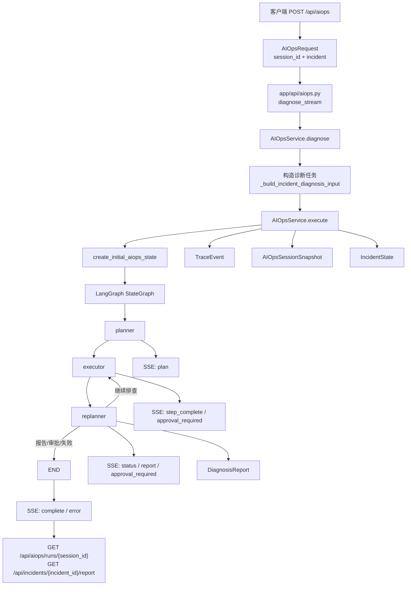

# AutoOnCall 的 AIOps 诊断主链路：从 Incident 到流式诊断报告

AutoOnCall 是一个 Python 3.11 FastAPI 应用，用于 RAG 问答和 AIOps 智能诊断。
项目一边支持基于知识库的运维问答，一边把告警、指标、日志、依赖状态、审批和报告串成一条诊断链路。
本文只讲 AIOps 诊断主链路，也就是一个结构化 Incident 如何进入 `/api/aiops`，如何被 AIOpsService 转换成 Plan-Execute-Replan 工作流，以及如何通过 SSE 持续返回诊断过程。
Planner、Executor、Replanner 内部提示词、工具策略和风险规则会在相邻文章展开，这里只说明它们在主链路中的位置。
读完本文后，你应该能在面试中讲清楚：请求怎么进来、状态怎么流转、为什么要有 `session_id`、Trace/Report/IncidentState 如何沉淀，以及终态如何判断。

## 1. 先看主链路的整体位置

这条链路的核心代码集中在下面几个文件：

- `app/api/aiops.py`：AIOps API 入口，包括 `/api/aiops`、demo incident、run history、resume diagnosis。
- `app/models/aiops.py`：`AIOpsRequest` 和 `AIOpsResumeRequest`。
- `app/models/incident.py`：结构化故障输入 `Incident`。
- `app/agent/aiops/state.py`：LangGraph 状态 `PlanExecuteState` 和初始状态构造。
- `app/services/aiops_service.py`：诊断主服务，负责构建图、执行图、发 SSE 事件、保存快照和处理恢复。
- `app/models/aiops_session.py`：持久化运行快照 `AIOpsSessionSnapshot`。
- `app/models/incident_state.py`、`app/services/incident_state_builder.py`：事件维度生命周期状态。
- `app/services/trace_service.py`、`app/services/report_generator.py`：Trace 和 Report 沉淀。

主链路可以概括为一句话：API 接收 `AIOpsRequest`，确定 `session_id` 和 `Incident` 后，通过 `AIOpsService.diagnose()` 启动 LangGraph 工作流；工作流每个节点产出事件、Trace 和快照，API 把这些事件包装成 SSE 返回给前端；最后生成结构化 Report，并更新 `AIOpsSessionSnapshot` 与 `IncidentState`。



## 2. 请求入口：`POST /api/aiops`

主入口在 `app/api/aiops.py`：

```python
@router.post("/aiops", dependencies=[Depends(require_scope(DIAGNOSE_SCOPE))])
async def diagnose_stream(request: AIOpsRequest):
    session_id = request.session_id or f"session-{uuid4().hex}"
    ...
    async for event in aiops_service.diagnose(
        session_id=session_id,
        incident=request.incident,
    ):
        yield sse_message(event)
```

这里有三个重点。

第一，接口是 SSE-first 的。返回值不是普通 JSON，而是 `EventSourceResponse(event_generator())`。每个后端事件会经过 `app/api/sse.py` 的 `sse_message()` 包装成：

```json
{
  "event": "message",
  "data": "{\"type\":\"plan\", ...}"
}
```

第二，`session_id` 由 API 层兜底生成。调用方可以传入自己的 `session_id`，不传则生成 `session-{uuid}`。这个设计解决了一个很实际的问题：诊断是长流程，不能像一次普通 HTTP 请求那样只靠 request id，后续查询运行状态、恢复审批、前端刷新都需要稳定的运行标识。

第三，API 层不直接执行业务诊断。它只负责权限、请求模型、SSE 包装和异常兜底，真正的诊断逻辑交给 `AIOpsService.diagnose()`。这符合项目的分层方向：API -> Service -> Agent/Store/Integration。

代码当前实现里，`AIOpsRequest.incident` 的描述写着“不传时后端会根据当前任务自动构造默认 Incident”。实际构造发生在服务层的 `create_initial_aiops_state()`，不是在 `app/api/aiops.py`。这不是功能问题，但面试时要说清楚：入口只传递 `incident=None`，默认 Incident 是 Service/State 层创建的。

## 3. demo incident 和 resume diagnosis 的差异

`app/api/aiops.py` 里除了主入口，还有两个很容易被问到的入口族。

### 3.1 demo incident

demo 相关接口包括：

- `GET /api/aiops/demo/incidents`
- `GET /api/aiops/demo/incidents/{case_id}`
- `POST /api/aiops/demo/incidents/{case_id}/run`

demo 数据在 `app/services/demo_incidents.py`。当前内置了 Redis maxclients、MySQL slow query、Pod CrashLoop、Redpanda lag、Forbidden SQL 等案例。`GET /api/aiops/demo/incidents/{case_id}` 会返回一个可直接运行的 payload：

```json
{
  "session_id": "demo-redis_maxclients",
  "incident": {
    "incident_id": "INC-REDIS-001",
    "title": "order-service Redis maxclients exhausted",
    "service_name": "order-service",
    "severity": "P1",
    "environment": "prod"
  }
}
```

`POST /api/aiops/demo/incidents/{case_id}/run` 最终仍然调用 `diagnose_stream()`，也就是走同一条主链路。差异只在输入来源：普通 `/api/aiops` 使用调用方传来的 incident，demo run 使用仓库内置的固定 incident，默认 `session_id` 是 `demo-{case_id}`。

这种设计的价值是：演示和测试不会复制另一套诊断逻辑，demo 只是“预置输入”，不是“特供流程”。

### 3.2 resume diagnosis

恢复入口是：

```text
POST /api/incidents/{incident_id}/diagnosis/resume
```

请求模型是 `AIOpsResumeRequest`，包含可选的 `session_id` 和 `approval_id`。入口会先通过 `_resolve_resume_approval()` 找到已通过的审批：如果传了 `approval_id`，必须属于当前 `incident_id`；如果没传，则要求没有 pending 审批，并选择该 incident 最新的 approved 审批。

随后 API 调用：

```python
aiops_service.resume_after_approval(
    session_id=session_id,
    incident_id=incident_id,
    approval=approval,
)
```

注意这里的边界非常重要：resume diagnosis 不会执行生产变更。代码在 `resume_after_approval()` 的注释和事件 payload 中都明确写了 `agent_does_not_execute_production_change`。它做的是记录审批结果、补齐 Trace、生成审批恢复后的报告，并把状态推进到 `approval_resumed`。真正的安全变更流程属于相邻的审批与变更文章，这里不展开。

## 4. 数据模型：`AIOpsRequest`、`Incident` 和 `session_id`

### 4.1 `AIOpsRequest`

`app/models/aiops.py` 中的请求模型很小：

```python
class AIOpsRequest(BaseModel):
    session_id: str | None = Field(default=None, min_length=1, max_length=128)
    incident: Incident | None = None
```

它有意保持简单，因为诊断主链路真正需要的只有两类信息：

- 用什么 `session_id` 追踪这次运行。
- 诊断哪个结构化故障事件。

测试 `tests/test_aiops_models.py` 覆盖了几个边界：允许只传 legacy `session_id`，允许完全不传以生成唯一会话，拒绝空字符串和超过 128 字符的 session id，允许传结构化 incident。

### 4.2 `Incident`

`app/models/incident.py` 定义了诊断输入：

```python
class Incident(BaseModel):
    incident_id: str = Field(default_factory=lambda: new_model_id("inc"))
    title: str = "AIOps diagnosis request"
    service_name: str = "unknown-service"
    severity: str = "P2"
    symptom: str = ""
    start_time: datetime = Field(default_factory=utc_now)
    environment: str = "unknown"
    raw_alert: dict[str, Any] = Field(default_factory=dict)
    status: str = "investigating"
```

为什么不是只传一段自然语言？因为 AIOps 诊断需要稳定的业务上下文。`service_name` 决定指标和日志查询范围，`severity` 影响风险判断，`environment` 会参与生产环境风险控制，`raw_alert` 能保存 Alertmanager 或前端表单带来的原始上下文。

`AIOpsService.diagnose()` 会调用 `_build_incident_diagnosis_input()`，把 `Incident` 渲染进给 Planner 的任务文本：

- `incident_id`
- `title`
- `service_name`
- `severity`
- `environment`
- `status`
- `start_time`
- `symptom`
- `raw_alert`

其中 `raw_alert` 会通过 `_format_raw_alert_for_prompt()` 序列化为 JSON，并限制最大 4000 字符，避免提示词被过长原始告警撑爆。

### 4.3 `session_id`

`session_id` 在这条链路里不是装饰字段，而是运行时主键。

它至少承担五个职责：

- API 层用它标识这次 SSE 诊断运行。
- LangGraph 用它作为 `configurable.thread_id`，绑定 `MemorySaver` checkpoint。
- `AIOpsSessionSnapshot` 用它作为 `aiops_sessions` 表的主键，支持 `/api/aiops/runs/{session_id}` 查询。
- resume diagnosis 用它优先寻找原始 checkpoint 或持久化 snapshot。
- 前端可以用它把流式事件、历史记录、Incident 面板关联起来。

它和 `incident_id` 的区别是：`incident_id` 表示“同一个故障事件”，`session_id` 表示“某一次诊断运行”。同一个 incident 可以有多次诊断运行，因此这两个 ID 不能混用。

## 5. 服务层：`AIOpsService` 如何连接 LangGraph

`app/services/aiops_service.py` 是主链路的中心。初始化时做三件事：

```python
self.checkpointer = MemorySaver()
self.state_store = create_aiops_store()
self.graph = self._build_graph()
```

`_build_graph()` 构建了一个 LangGraph `StateGraph(PlanExecuteState)`：

- 节点 `planner`：制定排查计划。
- 节点 `executor`：执行下一步，收集工具结果、Evidence 和 ToolCallRecord。
- 节点 `replanner`：评估证据，决定继续、补查、生成报告、等待审批或升级人工。

图结构是：

```text
planner -> executor -> replanner -> executor ... -> END
```

`should_continue()` 是图的退出条件：

- 如果 state 中已有 `response`，结束。
- 如果 state 中有 `pending_approval`，结束自动执行。
- 如果还有计划步骤，回到 executor。
- 否则结束。

这里的工程取舍是：图里只保留一个循环，复杂决策都放在 Replanner 的状态输出里。这样主流程简单，调试时也容易定位是哪个节点把状态推到了终态。

## 6. `execute()`：一次诊断运行的完整生命周期

`AIOpsService.execute()` 是更底层的执行方法，`diagnose()` 最终也是调用它。

### 6.1 创建初始状态

第一步是调用 `create_initial_aiops_state()`：

```python
initial_state = create_initial_aiops_state(
    user_input=user_input,
    session_id=session_id,
    incident=incident,
)
```

`app/agent/aiops/state.py` 的 `PlanExecuteState` 既保留旧字段，也新增了工业化诊断字段：

- 旧字段：`input`、`plan`、`past_steps`、`response`。
- 结构化事件：`incident`。
- 计划队列：`current_plan` 和 legacy `plan`。
- 执行沉淀：`executed_steps`、`tool_call_records`、`gathered_evidence`。
- 推理结果：`hypotheses`、`evidence_analysis`、`final_diagnosis`。
- 风险与审批：`risk_assessment`、`pending_approval`、`change_plan`。
- 报告与异常：`report`、`errors`、`warnings`。
- 链路追踪：`trace_id`。

其中 `past_steps`、`tool_call_records`、`gathered_evidence` 等字段使用 `operator.add`，表示图节点返回的是增量，LangGraph 会追加。服务层在保存快照时又用 `_merge_checkpoint_with_node_output()` 做了一次合并，避免 checkpoint 滞后时丢掉增量，也避免重复追加已有尾部数据。

### 6.2 记录 workflow_started 并保存 running 快照

初始状态创建后，服务会创建一个 TraceEvent：

```python
trace_service.create_event(
    node_name="workflow",
    event_type="workflow_started",
    status="success",
    metadata={"session_id": session_id},
)
```

随后调用 `_save_session_snapshot()`，把当前状态保存为 `running`。这意味着即使诊断刚开始，系统也已经有了可查询的运行记录。

### 6.3 流式执行图节点

服务通过：

```python
self.graph.astream(input=initial_state, config=config_dict, stream_mode="updates")
```

逐个拿到节点输出。每个节点输出都会经历同样的处理：

1. 转成 SSE payload。
2. 记录 node TraceEvent。
3. 从 checkpoint 读取当前完整状态。
4. 合并本次节点输出。
5. 保存 `AIOpsSessionSnapshot` 和 `IncidentState`。
6. 把 `trace_id`、`trace_event_id`、`trace_event` 附加到 SSE 事件。
7. yield 给 API 层。

这就是为什么前端能实时看到计划、步骤结果、报告，同时后端还能在数据库里恢复运行状态。

## 7. SSE event 的作用

SSE 事件不是随便打印日志，而是前后端约定的诊断过程协议。当前实现里的主要事件有：

| 事件类型 | 产生位置 | 作用 |
| --- | --- | --- |
| `plan` | `_format_planner_event()` | 告诉前端计划已生成，包含 legacy `plan` 和结构化 `current_plan`。 |
| `step_complete` | `_format_executor_event()` | 告诉前端一个执行步骤完成，包含结果预览、Evidence、ToolCallRecord、errors、warnings。 |
| `approval_required` | executor 或 replanner | 表示后续动作需要人工审批，自动执行暂停。 |
| `status` | replanner 或 resume | 表示节点状态、恢复状态等中间信息。 |
| `report` | `_format_replanner_event()` 或 resume | 返回 Markdown 报告和 `structured_report`。 |
| `complete` | `execute()` 或 `resume_after_approval()` | 当前 SSE 流结束，携带终态、诊断结果、trace 和结构化报告。 |
| `error` | service 或 API 异常处理 | 当前 SSE 流失败，携带失败阶段和错误信息。 |

`app/api/sse.py` 里的 `TERMINAL_EVENT_TYPES = {"complete", "error"}`。API 层在看到终止事件后会 break，关闭本次流。

这里有一个容易混淆的点：`waiting_approval` 在生命周期元数据里不是最终关闭状态，但当前 SSE 流会以 `complete` 事件结束。也就是说，流结束代表“本轮自动诊断暂停或结束”，不代表 incident 已经业务恢复。后续审批和恢复会产生新的状态推进。

可改进方向：可以在 read model 或 SSE complete payload 中显式增加 `paused: true` 或 `requires_resume: true`，让前端和面试讲解更容易区分“诊断完成”和“等待审批暂停”。

## 8. Report、Trace、Snapshot、IncidentState 如何沉淀

AIOps 主链路的一个亮点是：它不是只把最终 Markdown 返回给用户，而是沉淀四类结果。

### 8.1 TraceEvent：记录过程

`app/services/trace_service.py` 负责 Trace。主链路中至少会记录：

- `workflow_started`
- 每个节点的 `node`
- executor 中的 `tool_call`
- risk controller 的 `risk_decision`
- approval request 相关事件
- `workflow_completed` 或 `workflow_error`
- resume 中的 `diagnosis_resumed`、`report_resumed`、`resume_completed`

TraceService 会对输入输出做脱敏和截断，这说明项目把“可审计”和“避免敏感信息扩散”都考虑进去了。

### 8.2 DiagnosisReport：记录结论

`app/services/report_generator.py` 会从 state 生成 `DiagnosisReport`，字段包括：

- `summary`
- `root_cause`
- `hypotheses`
- `evidence`
- `tool_calls`
- `timeline`
- `risk_summary`
- `approval_status`
- `change_plan`
- `remediation_suggestion`
- `confidence`
- `markdown`

Replanner 正常生成报告时会调用 ReportGenerator。若图结束后没有 `structured_report`，`AIOpsService.execute()` 也会补一次 `report_generator.generate_from_state()`，保证 complete 事件里尽量有结构化报告。

### 8.3 AIOpsSessionSnapshot：记录一次运行

`app/models/aiops_session.py` 的 `AIOpsSessionSnapshot` 是按 `session_id` 保存的运行快照。它包含运行中的计划、已执行步骤、证据、风险、审批、报告和错误警告。SQLite 和 MySQL store 都实现了：

- `save_aiops_session_snapshot()`
- `get_aiops_session_snapshot(session_id)`
- `get_latest_aiops_session_snapshot(incident_id)`
- `list_aiops_session_snapshots()`

保存策略是 upsert：同一个 `session_id` 多次更新，保留 `created_at`，刷新 `updated_at` 和 payload。

这个模型解决的是“诊断运行可恢复、可查询”的问题。比如前端刷新后可以调用：

```text
GET /api/aiops/runs/{session_id}
```

拿回当前节点、计划、证据、审批摘要、报告链接和 Trace 摘要。

### 8.4 IncidentState：记录事件最新生命周期

`IncidentState` 是按 `incident_id` 保存的最新生命周期状态。它不等同于一次运行，而是用于事件列表和概览页展示：

- 当前 status 是 `diagnosing`、`completed`、`waiting_approval` 还是 `failed`。
- 最近的 `session_id` 和 `trace_id` 是什么。
- 是否需要人工动作。
- 最新审批 ID 和报告 ID 是什么。
- 事件标题、服务名、严重级别、环境和摘要是什么。

`AIOpsService._save_session_snapshot()` 会在保存 run snapshot 后，调用 `build_incident_state_from_state()` 构造 IncidentState 并保存。`save_incident_state()` 内部会通过 `merge_incident_state()` 合并已有状态，避免旧报告把正在进行的安全变更状态覆盖回去。

这就是“运行状态”和“事件状态”分开的原因：一次诊断运行会不断变化，但用户在事件列表里更关心某个 incident 的最新状态。

## 9. 终态如何判断

终态判断主要在 `app/services/incident_lifecycle.py` 和 `app/services/aiops_service.py`。

`snapshot_status_from_event()` 用于中间快照：

- `approval_required` -> `waiting_approval`
- `report` -> 优先使用 `structured_report.status`，否则 `completed`
- `error` -> `failed`
- 其他 -> `running`

`terminal_event_status()` 用于 complete 事件：

- 如果 `structured_report.status` 存在，优先使用它。
- 如果存在 `pending_approval`，返回 `waiting_approval`。
- 如果 `risk_assessment.policy == "forbidden"`，返回 `blocked`。
- 如果有 errors，返回 `escalated`。
- 如果事件类型是 `error`，返回 `failed`。
- 默认返回 `completed`。

几个重要终态可以这样理解：

| 状态 | 含义 | 典型来源 |
| --- | --- | --- |
| `completed` | 诊断完成并生成报告，没有待审批动作。 | Replanner 认为证据足够，ReportGenerator 生成报告。 |
| `waiting_approval` | 诊断暂停，后续动作需要人工审批。 | Executor 或 Replanner 发现高风险动作，创建 `ApprovalRequest`。 |
| `blocked` | 动作被风险策略禁止自动执行。 | `risk_assessment.policy == "forbidden"`。 |
| `escalated` | 证据不足、工具失败或流程无法安全继续，需要人工介入。 | Replanner escalation 或生成报告时发现 errors。 |
| `failed` | 服务异常或 API 流异常。 | `execute()` 捕获异常并 yield `error`。 |
| `approval_resumed` | 审批通过后，诊断闭环已补齐，Agent 仍未执行生产变更。 | `resume_after_approval()` 生成恢复报告。 |

面试中要强调：`waiting_approval` 是自动诊断流的暂停态，不是业务恢复态；`approval_resumed` 也不是“变更已完成”，它只是审批结果已写入诊断闭环。生产动作要进入安全变更流程。

## 10. 异常处理和持久化恢复

主链路有两层异常处理。

第一层在 `AIOpsService.execute()`。如果图执行过程中抛异常，服务会：

1. 保存 `failed` 快照。
2. 创建 `workflow_error` TraceEvent。
3. yield `type=error` 的 SSE payload。

第二层在 `app/api/aiops.py` 的 `event_generator()`。如果 service 外层还有异常，API 会记录日志并 yield：

```json
{
  "type": "error",
  "stage": "exception",
  "message": "诊断异常: ..."
}
```

持久化恢复主要体现在 `resume_after_approval()`。当审批通过后，服务按顺序寻找恢复来源：

1. 先查 LangGraph 内存 checkpoint。
2. 如果没有 checkpoint，查 `AIOpsSessionSnapshot`。
3. 如果没有 snapshot，查持久化 `DiagnosisReport`。
4. 如果三者都没有，抛 `LookupError`，API 转为 `resume_not_found` 错误事件。

这覆盖了服务重启后的场景：内存 checkpoint 丢了，但数据库里的 session snapshot 或 report 还在，仍然能补齐审批恢复记录。

代码当前实现里，`_save_session_snapshot()` 是 best effort，保存失败只记录 warning，不中断 SSE。这对用户体验友好，但可观测性上可以继续增强，例如暴露持久化失败指标，或在 complete 事件里附带 `persistence_warning`。

## 11. 外部依赖在主链路中的位置

本文不展开工具策略，但需要知道外部依赖位于哪里。

Planner 会检索知识库和 MCP 工具列表，用于制定计划。Executor 会通过 Tool Registry 调用标准工具，可能查询指标、日志、Redis、MySQL、Kubernetes、消息队列等。Replanner 会根据 Evidence Analyzer 的结果决定是否补查、生成报告或进入审批。

当前项目还支持 mock fallback。`tests/test_aiops_mainline_api.py` 会把大模型置为失败，同时打开 `config.aiops_mock_fallback_enabled = True`，确认真实 graph 节点仍能通过 fallback 走完整链路。这说明主链路不是“必须依赖在线 LLM 才能跑通”的脆弱实现。

## 12. 返回后的查询接口

SSE 是实时返回，持久化读接口负责“事后查看”和“刷新恢复”。

主链路相关读接口包括：

- `GET /api/aiops/runs`：列出最近诊断运行，可按 incident、status、service 过滤。
- `GET /api/aiops/runs/{session_id}`：查看某次运行的完整 durable state。
- `GET /api/incidents/{incident_id}`：查看 incident 概览。
- `GET /api/incidents/{incident_id}/trace`：查看 TraceEvent。
- `GET /api/incidents/{incident_id}/report`：查看结构化报告和 Markdown。
- `GET /api/incidents/{incident_id}/approval`：查看审批请求。

`app/services/read_models.py` 会把 snapshot、trace、approval、report 组装成前端友好的 read model。比如 `effective_run_status()` 会优先考虑 pending approval；如果审批已通过，但报告还没进入后续状态，会展示 `approval_approved`；如果报告已是 `approval_resumed` 或安全变更相关状态，则使用报告状态。

这个 read model 层的意义是：写入模型可以保持服务内部语义，读取模型可以面向用户体验做状态归并。

## 13. 测试说明：主链路如何被保护

当前仓库已经有多组测试覆盖这条链路。

`tests/test_aiops_models.py` 保护模型边界：

- `AIOpsRequest` 支持只传 `session_id` 的 legacy payload。
- 不传 `session_id` 时不会复用共享默认值，而是服务生成唯一 session。
- 空 session 和超长 session 会被 Pydantic 拒绝。
- 结构化 `Incident` 能被请求模型接受。
- `_build_incident_diagnosis_input()` 会把 incident 和 raw alert 写入诊断输入。
- `create_initial_aiops_state()` 保持旧字段兼容，同时包含 incident、trace、evidence、risk 等新字段。

`tests/test_aiops_service_events.py` 保护 SSE 合同：

- planner event 同时包含 legacy `plan` 和结构化 `current_plan`。
- executor event 暴露 evidence、tool_call_records 和 result_preview。
- replanner 在 pending approval 时返回 `approval_required`。
- report event 同时保留 Markdown 和 `structured_report`。
- 图没有 response 时会生成非空 fallback response。
- 快照合并不会重复追加 additive 字段。
- terminal status 优先使用 `structured_report.status`。
- 图没有报告时，complete 会补生成结构化报告。

`tests/test_aiops_mainline_api.py` 保护 API 主链路：

- 使用 FastAPI 测试应用，保留真实 graph 节点，只禁用 LLM 并开启 fallback。
- `POST /api/aiops` 返回 `plan`、`step_complete`、`report`、`complete`。
- complete 中的 `status`、`diagnosis.status`、`structured_report.status` 保持一致。
- 诊断后能查到 trace、report、incident overview 和 approval。
- 跨 incident 的审批 ID 会被拒绝，避免误改其他事件状态。

`tests/test_aiops_session_snapshot_store.py` 保护持久化：

- SQLite store 可以 upsert `AIOpsSessionSnapshot`。
- 可以按 `session_id` 查询、按 `incident_id` 查询最新 snapshot、列出最近 runs。
- 缺失 session 返回 `None`。
- 字符串 hypotheses 能正常保存和恢复。
- `IncidentState` upsert 不丢 title、service、severity、trace、session 等身份字段。

`tests/test_aiops_trace_events.py` 保护 Trace 和恢复：

- Executor 会记录 tool_call trace。
- 风险和审批会记录 trace。
- SSE payload 可以附加 trace metadata。
- checkpoint 缺失时，resume 可以使用持久化 report 恢复。
- checkpoint 缺失时，resume 也可以使用持久化 session snapshot 恢复。

`tests/test_aiops_run_status_api.py` 保护读接口：

- `/api/aiops/runs/{session_id}` 能组装 snapshot、trace、approval、report。
- run list 能返回紧凑历史。
- status 和 service 过滤有效。
- 未知 session 返回 404。

这些测试覆盖的不是某个函数的小正确性，而是“输入、流式事件、状态沉淀、恢复、读取”整条链路。

## 14. 面试中可以怎么讲

可以用下面这段 2 分钟版本：

AutoOnCall 的 AIOps 主链路是一个 SSE-first 的 FastAPI 诊断接口。用户调用 `POST /api/aiops`，请求体是 `AIOpsRequest`，里面可以带 `session_id` 和结构化 `Incident`。`session_id` 用来绑定 LangGraph checkpoint 和数据库运行快照，`Incident` 用来明确故障事件的服务、级别、环境、症状和原始告警。

API 层不直接诊断，只把请求交给 `AIOpsService.diagnose()`。服务层会把 Incident 渲染成 Planner 可理解的诊断任务，然后通过 `execute()` 创建初始 `PlanExecuteState`，启动 LangGraph 的 Planner、Executor、Replanner。每个节点执行完都会格式化成 SSE 事件，比如 `plan`、`step_complete`、`report`、`approval_required`，并附带 trace 信息。

同时，服务会把过程沉淀为三类状态：TraceEvent 记录每个节点和工具调用，AIOpsSessionSnapshot 按 session 记录一次运行的可恢复快照，IncidentState 按 incident 记录最新生命周期。最终 Replanner 或服务兜底生成 DiagnosisReport，complete 事件返回 status、incident_id、trace_id、pending_approval、risk_assessment 和 structured_report。

如果遇到高风险动作，链路会进入 `waiting_approval`，当前 SSE 流结束但 incident 没有关闭。审批通过后调用 resume diagnosis，系统会从 checkpoint、session snapshot 或持久化 report 恢复上下文，写入 `approval_resumed` 报告。这个 resume 只补齐诊断闭环，不执行生产变更，生产动作需要进入安全变更流程。

## 15. 面试官可能追问

### 追问 1：为什么要同时有 `session_id` 和 `incident_id`？

推荐回答：

`incident_id` 表示业务上的一次故障事件，`session_id` 表示某一次诊断运行。一个 incident 可能被诊断多次，比如第一次等待审批，第二次审批后恢复，第三次复盘重跑。如果只用 incident_id，会把多次运行的 checkpoint 和快照混在一起。当前代码用 `session_id` 作为 LangGraph `thread_id` 和 `AIOpsSessionSnapshot` 主键，用 `incident_id` 聚合 Report、Trace、Approval 和 IncidentState。

### 追问 2：SSE complete 事件里的 `waiting_approval` 算不算完成？

推荐回答：

不算业务完成。它只表示本轮自动诊断流结束，因为系统遇到了需要人工审批的动作。`app/api/sse.py` 以 `complete` 或 `error` 关闭 SSE 流，但 `incident_lifecycle.py` 里 `waiting_approval` 的 lifecycle terminal 是 false。后续还要通过审批接口和 resume diagnosis 把状态推进到 `approval_resumed`，生产变更还要走安全变更流程。

### 追问 3：如果服务重启，审批恢复还能继续吗？

推荐回答：

当前实现考虑了这个场景。`resume_after_approval()` 会先查内存 checkpoint，如果没有，再查 `AIOpsSessionSnapshot`，最后查持久化 `DiagnosisReport`。测试里覆盖了 session snapshot 恢复和 report fallback 恢复。所以即使内存 checkpoint 丢失，只要持久化状态还在，仍能补齐审批恢复报告和 Trace。

### 追问 4：为什么要把 SSE event 和 TraceEvent 都记录？

推荐回答：

SSE event 面向实时用户体验，告诉前端现在计划到哪一步、哪个步骤完成、是否需要审批。TraceEvent 面向审计和复盘，会持久化节点、工具调用、风险决策、耗时和错误。两者内容有交集，但生命周期不同：SSE 是流式传输，Trace 是后续可查询的证据链。

### 追问 5：如果 Replanner 没生成报告怎么办？

推荐回答：

`AIOpsService.execute()` 在图结束后会检查 final state。如果没有 `response`，会调用 `_build_fallback_final_response()` 生成非空 Markdown；如果没有 `structured_report`，会调用 `report_generator.generate_from_state()` 生成确定性的结构化报告。`tests/test_aiops_service_events.py` 专门覆盖了这个兜底。

### 追问 6：如何避免 Agent 自动执行危险操作？

推荐回答：

主链路里 Executor 和 Replanner 都会处理风险状态。风险动作会被转换成 `risk_assessment`，需要审批时创建 `pending_approval` 和 `ApprovalRequest`，SSE 返回 `approval_required`，图退出自动执行。禁止动作会进入 `blocked` 或错误升级。resume diagnosis 也明确只记录审批结果，不执行生产变更。真正执行变更属于安全变更流程，不在诊断 Agent 中直接做。

### 追问 7：状态沉淀为什么要分 Snapshot、Report、IncidentState？

推荐回答：

三者解决的问题不同。Snapshot 按 `session_id` 记录一次运行的可恢复状态，包括计划、步骤、证据和当前节点。Report 是面向复盘和展示的诊断结论，包含根因、证据、建议和 Markdown。IncidentState 是按 `incident_id` 保存的最新生命周期，用于事件列表和概览页。分开后，运行恢复、报告展示、事件状态就不会互相污染。

### 追问 8：这条链路的测试重点是什么？

推荐回答：

重点不是只测某个函数返回值，而是保护合同。模型测试保护 `AIOpsRequest` 和 `Incident` 的边界；服务事件测试保护 SSE 事件形状和终态判断；主链路 API 测试保留真实 graph 节点，确认能从 `/api/aiops` 跑到 report 和 complete；snapshot store 测试保护持久化恢复；trace/resume 测试保护审批恢复场景。这些测试组合起来覆盖了请求入口、状态变化、持久化和读取接口。

## 16. 小结

AutoOnCall 的 AIOps 诊断主链路不是一个“调用大模型然后返回文本”的接口，而是一条有状态、有审计、有恢复能力的后端工作流。

`/api/aiops` 负责把结构化 Incident 送入诊断，`AIOpsService` 负责连接 LangGraph 的 Plan-Execute-Replan，SSE 负责实时返回过程，Trace/Report/Snapshot/IncidentState 负责把结果沉淀下来。`completed`、`waiting_approval`、`failed`、`blocked`、`approval_resumed` 等状态让系统能表达不同的结束方式，而不是把所有结果都塞进一个“成功/失败”布尔值里。

这也是这个项目作为校招项目的亮点：它不仅有 Agent，还有工程上必须回答的问题，例如请求模型怎么设计、状态怎么恢复、风险怎么暂停、报告怎么审计、接口合同怎么用测试保护。
