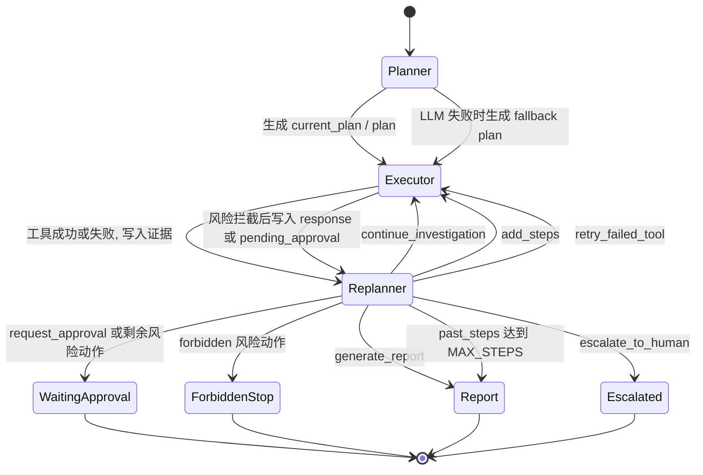

# AutoOnCall 的 Plan-Execute-Replan 机制：AIOps Agent 如何制定计划、取证和决策

AutoOnCall 是一个 Python 3.11 FastAPI 应用，核心能力包括 RAG 问答和 AIOps 智能诊断。
在普通问答场景里，系统可以直接检索知识库并生成回答；在故障诊断场景里，系统必须面对实时指标、日志、依赖状态、历史工单和人工审批等更多约束。
因此，AIOps 诊断不是“让大模型一次性猜根因”，而是把诊断拆成 Planner、Executor、Replanner 三段。
Planner 负责把 Incident 和用户输入拆成可执行计划，Executor 负责按计划调用工具收集证据，Replanner 负责根据证据决定继续补查、重试、生成报告、请求审批或升级人工。
本文只聚焦 Agent 内部机制，API 接入、SSE 流式返回和最终报告展示只作为链路位置出现，不展开细节。
对应核心代码位于 `app/services/aiops_service.py`、`app/agent/aiops/`、`app/models/plan.py`、`app/models/evidence.py` 和相关测试文件。

## 一、为什么 AIOps 适合 Plan-Execute-Replan

AIOps 诊断和普通聊天最大的不一样，是“答案必须有现场证据”。一次性大模型回答有三个明显风险：

1. 它容易把 Runbook、历史经验和实时现场混在一起，无法说明某个结论到底来自知识库、监控、日志还是猜测。
2. 它无法天然区分只读诊断动作和生产变更动作，容易把“建议重启”误写成“已经重启”。
3. 它缺少中途纠偏能力：如果 Redis 工具失败、日志证据反驳了指标、或者剩余计划里出现危险动作，一次性回答很难安全停下来。

AutoOnCall 当前实现把这个问题拆开：

- Planner 在 `app/agent/aiops/planner.py` 里只制定计划，不执行工具。
- Executor 在 `app/agent/aiops/executor.py` 里只执行当前步骤，并把结果标准化为 Evidence 和 ToolCallRecord。
- Replanner 在 `app/agent/aiops/replanner.py` 里读取 EvidenceAnalysis、risk_assessment、pending_approval 等状态，决定下一步。
- `app/services/aiops_service.py` 用 LangGraph 的 `StateGraph` 串起 `planner -> executor -> replanner`，并根据状态判断是否回到 Executor 或结束。

这种设计的工程价值是：每一步都能被记录、被测试、被回放，也能在高风险动作前停住。

## 二、内部链路：从服务入口到状态机

本文不展开 REST 路由，内部入口可以看 `AIOpsService.execute()` 和兼容方法 `AIOpsService.diagnose()`。它们会先调用 `create_initial_aiops_state()` 构造 LangGraph 初始状态，再把状态交给 `self.graph.astream(..., stream_mode="updates")`。

`AIOpsService._build_graph()` 定义了三类节点：

- `planner`：制定结构化排查计划。
- `executor`：执行当前计划步骤。
- `replanner`：分析证据并决定是否继续。

图上的条件边只从 Replanner 发出：

- 如果状态里已有 `response`，结束。
- 如果状态里已有 `pending_approval`，结束，表示自动流程暂停。
- 如果 `current_plan` 或 legacy `plan` 仍有剩余步骤，回到 Executor。
- 如果没有剩余计划，结束。

状态机可以概括为：

这里有一个需要特别注意的“代码当前实现”：提示词要求讲 `current_step_index`，但当前仓库没有这个字段。实际推进方式是 `current_plan` 队列加 legacy `plan` 队列同步消费：Executor 每次取 `current_plan[0]`，执行后通过 `remaining_plan_state_update()` 去掉已执行步骤。可改进方向是未来如果 UI 需要更明确的进度游标，可以新增 `current_step_index`，但要继续保持 `current_plan` 作为可恢复的真实队列。

## 三、状态结构：Agent 的共享记忆

状态定义在 `app/agent/aiops/state.py` 的 `PlanExecuteState`。它是一个 `TypedDict`，其中部分列表字段用 `Annotated[..., operator.add]` 做增量合并，适合 LangGraph 节点持续追加历史。

关键字段可以按职责理解：

| 字段 | 作用 |
| --- | --- |
| `input`、`session_id` | 原始诊断输入和会话标识 |
| `incident` | 结构化故障事件，存成 dict 以便 checkpointer 序列化 |
| `current_plan` | 当前真实计划队列，元素是 `PlanStep.model_dump()` 后的 dict |
| `plan` | legacy 文本计划，主要用于兼容 SSE 和旧展示 |
| `past_steps` | Executor 的文本执行历史，保存“步骤描述 + 结果文本” |
| `executed_steps` | 已执行 PlanStep 快照，记录 success、failed、skipped |
| `tool_call_records` | 工具调用审计记录，用于 Trace 查询和故障回放 |
| `gathered_evidence` | 工具结果标准化后的 Evidence，是 Replanner 的主要输入 |
| `hypotheses`、`evidence_analysis` | Evidence Analyzer 形成的根因假设、缺失证据、冲突、置信度 |
| `risk_assessment`、`pending_approval`、`change_plan` | 风险评估、待审批单和变更建议 |
| `response`、`report` | 终态响应和结构化诊断报告 |
| `errors`、`warnings`、`trace_id` | 错误、降级告警和全链路追踪 ID |

`normalize_plan_state_update()` 会把 `list[PlanStep]` 同步写成 `current_plan` 和 `plan`。`remaining_plan_state_update()` 则消费已经执行的步骤，并尽量用结构化 `current_plan` 重新渲染 legacy `plan`。这就是当前“没有 current_step_index 也能推进”的原因。

## 四、Planner：把 Incident 变成可执行计划

Planner 的核心输入来自 `PlanExecuteState`：

- `state["input"]`：用户或系统生成的诊断任务文本。
- `state["incident"]`：结构化故障事件，包括服务名、严重级别、症状、环境和 raw_alert。
- Tool Registry 暴露的工具契约：Planner 不直接调用工具，只用契约决定可规划哪些工具。
- RAG/Runbook 检索结果：用于约束排查路径。

Planner 先用 `_build_planner_retrieval_query()` 构造 Runbook 查询。这个查询不是直接把报告模板丢进知识库，而是围绕 Incident 的 `title`、`service_name`、`severity`、`symptom`、`environment` 和部分 `raw_alert` 字段组织。代码还特意跳过 `sql` 这类原始字段，避免把高风险或敏感内容随意塞进检索查询。

如果 `retrieve_structured_knowledge()` 命中知识库，Planner 会做两件事：

1. 把检索结果作为 `runbook` 类型 Evidence 写入 `gathered_evidence`，来源是 `rag`，置信度固定为 0.65，并明确说明“Runbook 不能替代实时指标、日志和依赖状态”。
2. 用 `_extract_runbook_sop_steps()` 尝试解析 Runbook 中的 YAML 元数据。如果存在 `diagnosis_steps`，最多取前三条转成低风险只读排查步骤；如果文档里有 `risk_actions`，提示词要求只能作为建议或审批候选，不能自动执行。

之后，Planner 通过 `ChatQwen(...).with_structured_output(Plan)` 让模型输出 `Plan`，其中 `Plan.steps` 是 `list[PlanStep]`。`PlanStep` 定义在 `app/models/plan.py`，字段包括：

- `step_id`：稳定步骤编号，如 `s1`、`s2`。
- `tool_name`：Executor 可消费的标准工具名。
- `purpose`：该步骤要做什么。
- `input_args`：工具输入参数。
- `expected_evidence`：预期拿到什么证据。
- `risk_level`：`low`、`medium` 或 `high`。
- `status`：`pending`、`running`、`success`、`failed`、`skipped`。
- `retry_count`：重试次数。

模型输出不会被直接信任。`normalize_plan_steps()` 会把 dict、字符串甚至异常格式都规整成合法 `PlanStep`，缺参数时用 `default_input_args()` 填充，状态统一改回 `pending`。如果模型没有产出有效计划，就调用 `build_fallback_plan()`。

### Planner 的 fallback 计划

`app/agent/aiops/plan_fallback.py` 是一个规则化规划器。它会根据输入文本、Incident 和服务拓扑决定优先排查方向：

- Redis timeout 会生成告警、服务上下文、Redis、指标、日志、调用链、消息队列、发布历史、Runbook、历史工单和修复建议步骤。
- MySQL 慢查询会优先加入 `query_mysql_status`、`query_traces`、`query_message_queue_status` 等步骤。
- 慢响应、服务不可用、CrashLoopBackOff、CPU、内存、磁盘等场景也各有规则化计划。
- 没有明确场景时，也会给出服务上下文、指标、日志、调用链、消息队列、发布历史、Runbook 和建议步骤。

还有一个很重要的安全设计：`append_incident_requested_action_step()` 会把 `incident.raw_alert.requested_action` 追加成一个计划步骤。例如 raw_alert 要求执行未审核 SQL，就会变成 `execute_sql` 高风险步骤。这样风险控制器一定能看到这个动作，而不是让它藏在原始告警里绕过审批。

## 五、Executor：按计划取证，而不是自由发挥

Executor 在 `app/agent/aiops/executor.py` 中实现。它首先读取 `current_plan`，优先解析第一个结构化 `PlanStep`；如果解析失败或只有旧格式，则回退到 legacy `plan[0]`。

它每次只做一个步骤，这是 Plan-Execute-Replan 的关键：执行一步，沉淀证据，再让 Replanner 判断是否继续，而不是一次性把整套排查跑到底。

Executor 的执行流程大致是：

1. 获取本地工具 `get_current_time`、`retrieve_knowledge`，并尝试获取 MCP 工具。
2. 用 `create_default_tool_registry()` 构建稳定的 AIOps Tool Registry。
3. 在任何工具调用前，先执行 `_risk_gate_state_update()`。
4. 如果工具已注册，则通过 `_try_execute_registered_step()` 走确定性工具调用。
5. 如果是 `manual_analysis` 或未注册工具，则走 `_execute_fallback_step()`。
6. 将结果转换成 Evidence、ToolCallRecord、past_steps、executed_steps、errors、warnings。
7. 用 `remaining_plan_state_update()` 消费当前步骤。

Tool Registry 在 `app/tools/registry.py` 中注册标准工具，包括 `query_alerts`、`query_metrics`、`query_logs`、`query_traces`、`query_service_context`、`query_deploy_history`、`query_message_queue_status`、`query_redis_status`、`query_k8s_status`、`query_mysql_status`、`search_runbook`、`search_history_ticket` 和 `suggest_remediation`。这些工具都实现统一的 `AIOpsTool` 接口，返回 `ToolExecutionResult`。

`ToolExecutionResult` 的字段包括 `tool_name`、`status`、`input_args`、`output`、`latency_ms`、`risk_level`、`read_only`、`error_message` 和 `metadata`。这让工具成功、失败、未配置、mock 回退都能用同一种结构进入后续流程。

### 工具结果如何变成证据

Executor 用 `_tool_result_to_evidence()` 把工具结果转换成 `app/models/evidence.py` 中的 `Evidence`。这个模型很适合面试讲，因为它把“观察事实”和“诊断推理”拆开：

- `source_tool`：哪个工具产生证据。
- `evidence_type`：metric、log、redis、mysql、k8s、trace、message_queue、risk 等。
- `data_source`：prometheus、loki、redis_info、mock、not_configured、failed、rule_based 等。
- `stance`：supporting、refuting、neutral、unknown。
- `fact`：直接观察到的事实。
- `inference`：它对当前假设意味着什么。
- `uncertainty`：证据边界，比如 Mock 回退、工具失败、未配置。
- `next_step`：建议后续怎么验证。
- `confidence`：证据置信度。

真实外部数据源通常会给较高置信度，例如 Prometheus、Loki、Redis、Kubernetes、MySQL 等是 0.82；Mock 证据是 0.5；工具失败通常是 0.1；未配置是 0.05。`manual_analysis` 会被压到不超过 0.35，`llm_toolnode_fallback` 失败时只有 0.1。

此外，`_result_for_persistence()` 会在持久化前做两件事：

- 递归脱敏 token、password、secret、authorization、cookie、dsn 等字段。
- 在 `config.aiops_store_raw_external_payload` 关闭时压缩外部系统 raw payload，避免把过大的生产返回直接塞进 Trace 和 Report。

这说明 Executor 不是只关心“跑工具”，还关心审计、隐私和报告可信度。

## 六、风险边界：只读诊断和生产变更必须分开

风险控制核心在 `app/agent/aiops/risk_controller.py`。Executor 在真正执行工具前会调用 `assess_plan_step()`。

当前规则把工具分成几类：

- 只读前缀：`query_`、`search_`、`get_`、`retrieve_`。
- 只读工具名：`manual_analysis`、`suggest_remediation`。
- 强禁止工具：`delete_pod`、`execute_sql`、`run_shell`、`kill_process`、`shutdown_host` 等。
- 需要审批的动作工具：`restart_service`、`scale_service`、`rollback_deployment`、`apply_config_change`、`clear_cache` 等。
- 危险模式：`rm -rf`、`kill -9`、`kubectl delete`、`drop table`、`delete from`、`update ...` 等。

风险策略有三种：

| policy | 含义 | 系统行为 |
| --- | --- | --- |
| `allow` | 低风险或只读动作 | Executor 自动执行 |
| `approval_required` | 可能影响线上系统 | 创建 `pending_approval`，流程暂停 |
| `forbidden` | 禁止 Agent 自动执行 | 生成拦截响应，记录错误和风险证据 |

生产环境还会提高风险等级：如果 Incident 的 `environment` 被识别为生产，非只读动作或审批动作会被提升到 high。

这里有两个容易被误解的点：

1. `suggest_remediation` 虽然可能是 medium 或 high，但它在当前实现里是只读建议工具，不会创建审批单。真正的重启、扩容、SQL、删 Pod 等动作才需要审批或禁止。
2. 如果一个审批动作前面还有低风险只读诊断步骤，`_postpone_risky_step_until_read_only_evidence_complete()` 会把风险动作挪到后面，先补齐剩余只读证据。这样可以减少“证据不足就让人审批”的情况。

当风险控制触发时，Executor 会把风险决策也写成 Evidence，来源是 `risk_controller`、类型是 `risk`、数据源是 `rule_based`。这让风险边界本身也成为可审计证据。

## 七、Fallback：失败可以降级，但不能伪装成功

AutoOnCall 的 fallback 设计不是“失败了就假装正常”，而是把失败和降级显式写进状态。

### 1. Planner fallback

如果 Runbook 检索失败，Planner 仍可继续，只是没有 `experience_context`。如果 LLM 规划失败，Planner 会调用 `build_fallback_plan()` 生成规则计划。规则计划会根据症状和服务拓扑选择指标、日志、Redis、MySQL、K8s、消息队列、发布历史、Runbook、历史工单等步骤。

### 2. MCP fallback

Executor 获取 MCP 工具失败时，不会让整个诊断崩掉，而是继续使用本地工具和 Tool Registry。未注册工具不会被当成标准成功证据，而是进入 LLM ToolNode 兜底路径，并明确标记为 failed。

### 3. LLM ToolNode fallback

`_safe_fallback_tools()` 限制 LLM 兜底只能绑定 `get_current_time` 和 `retrieve_knowledge` 两个明确安全的本地只读工具。即使 MCP 里存在 `delete_pod` 这类工具，也不会进入 LLM fallback 的可用工具列表。

如果某个结构化工具未注册，`_fallback_text_to_tool_result()` 会把结果标记为：

- `status="failed"`
- `execution_path="llm_toolnode_fallback"`
- `fallback_reason="structured_tool_not_registered"`
- `structured_tool_registered=False`

也就是说，系统允许兜底观察，但不允许把未注册工具包装成标准成功证据。

### 4. 外部适配器 fallback

配置项 `config.aiops_mock_fallback_enabled` 默认是 `False`。当外部系统没有配置且 mock fallback 关闭时，工具会返回 `not_configured` 的结构化失败结果；当 mock fallback 开启时，部分工具会返回演示用 mock 数据，但 Evidence 会标记 `data_source="mock"` 并降低置信度。

Evidence Analyzer 还会做二次质量门控：

- 如果关键诊断证据全是 Mock、未配置、失败、人工或未知来源，`source_quality` 是 `fallback_only`，诊断置信度封顶 0.50，且 `evidence_sufficient=False`。
- 如果真实证据和 fallback 证据混杂，`source_quality` 是 `mixed_with_fallback`，置信度封顶 0.72。

这就是“可以本地演示，但不能把演示结论伪装成生产确定结论”。

### 5. 最终响应 fallback

Replanner 生成最终响应时会尝试让 LLM 生成叙述，但 `_generate_response_with_analysis()` 如果捕获异常，会改用 `report_generator.generate_from_state()` 生成确定性报告。`AIOpsService.execute()` 最后还会在图结束却没有 `response` 时调用 `_build_fallback_final_response()`。这保证流程终态可解释，不会空白结束。

## 八、Replanner：根据证据决定下一步

Replanner 的代码在 `app/agent/aiops/replanner.py`，但真正的证据决策主要由 `app/agent/aiops/evidence_analyzer.py` 的 `analyze_evidence()` 完成。它读取：

- `gathered_evidence`
- `tool_call_records`
- `current_plan` 和 legacy `plan`
- `incident`
- `input`

然后输出 `EvidenceAnalysis`，字段包括 `decision`、`reason`、`hypotheses`、`hypothesis_ranking`、`conflicts`、`evidence_sufficient`、`missing_evidence`、`recommended_steps`、`retry_steps`、`evidence_profile`、`confidence_reasons` 和 `confidence`。

Replanner 支持的决策有六类：

| decision | 触发条件 | 动作 |
| --- | --- | --- |
| `continue_investigation` | 证据不足，但还有剩余计划 | 不改计划，继续回 Executor |
| `add_steps` | 证据不足且没有剩余计划，但还能安全补查 | 追加低风险只读步骤 |
| `retry_failed_tool` | 发现失败工具且尚未重试 | 追加一个 `-retry` 步骤 |
| `request_approval` | 后续动作需要人工审批 | 写入 `risk_assessment` 和 `pending_approval` |
| `generate_report` | 证据足够或只能降级收口 | 生成终态报告 |
| `escalate_to_human` | 证据不足且没有安全自动步骤 | 生成升级人工响应 |

Evidence Analyzer 的关键规则包括：

- Redis 根因需要 `query_redis_status`，再加指标或日志旁证。
- 消息队列积压需要 `query_message_queue_status`，再加指标或日志旁证。
- 如果至少三类工具成功，并形成根因假设，可以生成报告。
- 如果有证据冲突，例如“指标异常但日志没有 ERROR/timeout”或“日志指向 Redis timeout 但 Redis 状态正常”，生成待确认报告，不继续盲目补查。
- 失败工具只重试一次：`_build_retry_steps()` 会生成 `step_id` 以 `-retry` 结尾的步骤，之后同工具失败会被视为 exhausted。
- 如果 `past_steps` 达到 `MAX_STEPS = 8`，Replanner 强制生成响应，避免 Agent 无限循环。

Replanner 还有两道风险收口：

1. 如果状态里已经有 `pending_approval`，它直接保持暂停，并生成等待审批响应。
2. 如果 Evidence 已经足够准备报告，但 `current_plan` 里还剩风险动作，`_approval_state_update(force=False)` 会先检查剩余步骤，必要时进入审批或 forbidden 终态，而不是把风险动作默默留在计划里。

这也是为什么 Replanner 不只是“报告生成器”，它是整个 Agent 的安全刹车和循环控制器。

## 九、结果沉淀：状态、Trace、Evidence 和 Report 的关系

虽然本文不展开报告渲染，但需要知道三段式工作流会沉淀哪些结果：

- Planner 产生 `current_plan`、`plan`，并可能产生 Runbook Evidence。
- Executor 产生 `past_steps`、`executed_steps`、`gathered_evidence`、`tool_call_records`、`errors`、`warnings`。
- Risk Controller 产生 `risk_assessment`、`pending_approval`、风险 Evidence 和 Trace 风险事件。
- Replanner 产生 `evidence_analysis`、`hypotheses`、`final_diagnosis`、`response`、`report`。
- `AIOpsService.execute()` 会通过 `trace_service.record_node_event()` 记录节点事件，并通过 session snapshot 保存运行状态。

这种沉淀方式的好处是：用户最后看到的不只是一个结论，系统内部也知道这个结论由哪些工具、哪些证据、哪些风险判断推出来。如果结论是低置信度，原因也会落在 `confidence_reasons`、`uncertainty` 和 `warnings` 里。

## 十、测试说明：每个节点都有保护

当前仓库已经有比较完整的测试覆盖，重点可以这样读：

- `tests/test_aiops_plan_fallback.py`：验证 Redis timeout、MySQL 慢查询、慢响应等场景的规则计划；验证 raw_alert 请求未审核 SQL 会追加高风险步骤并被风险控制识别；验证模型输出会被规范化回 `pending` 状态。
- `tests/test_aiops_models.py`：验证 `normalize_plan_state_update()` 和 `remaining_plan_state_update()` 能让 `current_plan` 与 legacy `plan` 同步。
- `tests/test_tool_registry.py`：验证标准工具注册、工具契约、输入范围裁剪、MCP 部分失败时的 mock fallback，以及 fallback 关闭时不生成合成字段。
- `tests/test_executor_evidence.py`：验证 Registry 工具会生成 Evidence 和 ToolCallRecord；失败工具不会打断流程，而是生成低置信度失败证据；`manual_analysis` 会被包装成结构化证据；未注册工具 fallback 被标记为失败；敏感输入输出会脱敏。
- `tests/test_risk_controller.py`：验证只读查询自动允许、`suggest_remediation` 是只读建议、生产重启需要审批、删 Pod、危险 shell、未审核写 SQL 都被禁止。
- `tests/test_replanner_decision.py`：验证 Replanner 能追加缺失证据、重试失败工具、证据充分时生成报告、报告前检查剩余风险动作、达到最大步骤数强制收口、审批动作写入结构化状态。
- `tests/test_evidence_analyzer.py`：验证 fallback-only 和 mixed-with-fallback 会降低证据质量和置信度；消息队列积压、Redis 等场景能形成对应假设；正常证据可以反驳错误假设。
- `tests/test_external_adapters.py`：验证 mock fallback 关闭且外部系统未配置时，工具返回 `not_configured` 结构化失败。

这些测试说明项目并不是只测“能不能跑通”，而是在保护 Agent 的关键边界：计划必须结构化、工具失败必须可解释、fallback 必须降置信度、危险动作必须暂停或禁止。

## 十一、代码当前实现与可改进方向

代码当前实现已经具备完整的 Plan-Execute-Replan 骨架，但仍有几个可以继续演进的点：

1. 当前没有显式 `current_step_index`，而是通过 `current_plan` 队列推进。这个实现更简单，也适合恢复；如果未来前端需要稳定进度条，可以增加 index，但不要让 index 成为唯一真实状态。
2. Planner 的 LLM 输出已经做结构化校验和规则 fallback，但模型仍可能产生未注册工具。当前 Executor 会降级为失败证据。可改进方向是在 Planner 后增加工具名白名单修复或提示更精确的工具选择。
3. Risk Controller 是规则驱动，适合安全兜底。未来可以把规则配置化，但禁止动作列表和审批动作列表不应该只交给大模型判断。
4. Replanner Prompt 存在，但当前核心决策依赖 Evidence Analyzer 的规则化结果。这个选择更可测、更稳定；未来可以让 LLM 参与解释决策，但最终状态转换仍应由结构化规则裁决。
5. Mock fallback 对本地演示很友好，但生产环境要依赖健康检查、适配器验证和配置默认值，确保 mock 证据不会被误当成真实生产证据。

## 十二、面试官可能追问与推荐回答

### 追问 1：为什么不用一次大模型调用直接生成诊断报告？

推荐回答：

因为故障诊断不是纯文本问答，它需要实时证据、可审计工具调用和风险控制。AutoOnCall 把流程拆成 Planner、Executor、Replanner：Planner 只制定计划，Executor 只读取证并沉淀 Evidence，Replanner 根据证据决定继续、补查、重试、报告、审批或升级人工。这样可以避免大模型凭空猜根因，也能在危险动作前暂停。

### 追问 2：Planner 输出的计划如何保证 Executor 能消费？

推荐回答：

计划步骤使用 `PlanStep` 模型，包含 `step_id`、`tool_name`、`purpose`、`input_args`、`expected_evidence`、`risk_level`、`status` 和 `retry_count`。Planner 会用结构化输出生成 `Plan`，再通过 `normalize_plan_steps()` 规整模型输出，并同步写入 `current_plan` 和 legacy `plan`。如果 LLM 失败，就用 `build_fallback_plan()` 按规则生成计划。

### 追问 3：如果工具失败，Agent 会不会直接失败？

推荐回答：

不会。工具统一返回 `ToolExecutionResult`，失败也会被转成 Evidence 和 ToolCallRecord。Executor 会把失败写入 `errors`，Evidence 置信度会降到很低，并说明这是证据缺口。Replanner 看到失败工具后会生成一次 `-retry` 步骤；如果重试后仍失败，会基于已有证据降级生成不完整报告或升级人工。

### 追问 4：如何避免 Agent 乱执行生产动作？

推荐回答：

核心是风险控制前置。Executor 在任何工具调用前都会调用 `assess_plan_step()`。只读查询可以自动执行，重启、扩容、回滚、改配置等动作需要审批，删 Pod、危险 shell、未审核写 SQL 等动作直接 forbidden。生产环境会提高风险等级。即使 Replanner 已经准备生成报告，也会先检查剩余计划里是否还有风险动作，必要时写入 `pending_approval` 并暂停。

### 追问 5：`suggest_remediation` 为什么不触发审批？

推荐回答：

因为当前实现把 `suggest_remediation` 定义为只读建议工具，它只根据已有证据生成修复建议，不实际执行变更。审批应该绑定真实动作，比如 `restart_service`、`execute_sql`、`rollback_deployment`。这样可以让 Agent 给出建议，同时确保生产变更仍走人工审批。

### 追问 6：Mock fallback 会不会污染诊断结论？

推荐回答：

系统会显式标注来源。Mock 数据会进入 Evidence 的 `data_source="mock"`，置信度只有 0.5，并在 `uncertainty` 中说明只适合本地演示。Evidence Analyzer 还会做 source quality gate：如果关键证据全是 fallback，置信度封顶 0.50；如果真实和 fallback 混杂，封顶 0.72。也就是说 fallback 可以帮助演示和降级，但不能伪装成真实生产证据。

### 追问 7：Replanner 到底什么时候停止？

推荐回答：

它会在几类情况下停止：证据足够生成报告；存在 `pending_approval` 等待人工；风险动作 forbidden；没有安全自动步骤需要升级人工；或者执行步骤数达到 `MAX_STEPS = 8` 强制收口。否则，如果还有计划就继续执行，如果没有计划但缺关键证据，就追加低风险只读步骤。

### 追问 8：这个设计最适合在简历里怎么讲？

推荐回答：

可以说我实现的是一个可审计、可降级、有风险边界的 AIOps Agent 工作流。它不是简单调用大模型，而是用 LangGraph 把规划、执行、重新规划拆开；用 Pydantic 模型固定 PlanStep、Evidence、ToolCallRecord 和风险状态；用 Tool Registry 统一外部系统调用；用 Evidence Analyzer 做可测试的决策；用 Risk Controller 防止生产变更自动执行。亮点是工程可靠性和安全边界，而不是单纯“接了一个大模型”。
