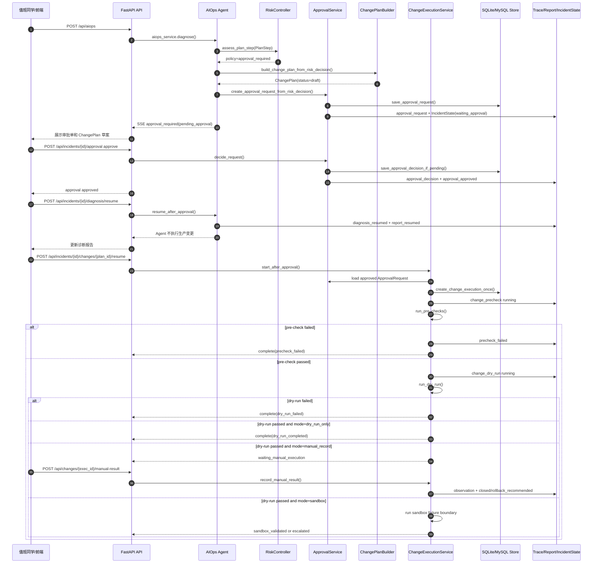

# AutoOnCall 的人工审批与安全变更链路：如何避免 Agent 直接执行生产风险操作

AutoOnCall 是一个 Python 3.11 FastAPI 应用，用于 RAG 问答和 AIOps 智能诊断。
它既能处理知识库问答，也能接入告警事件、启动诊断 Agent、沉淀证据和报告。
在 AIOps 场景里，系统不只是“回答故障原因”，还会遇到重启、扩容、回滚、改配置这类可能影响生产的动作。
本文只讲人工审批和安全变更链路，不展开告警接入、RAG 检索和 Planner 细节。
核心问题是：Agent 可以发现风险、生成建议和变更计划草案，但不能绕过人工直接执行生产写操作。
当前代码通过 RiskController、ApprovalRequest、ChangePlan、ChangeExecution、pre-check、dry-run、sandbox 和 manual_record，把“诊断建议”和“生产变更”隔离开。

## 一、为什么 AIOps 项目必须有审批边界

如果一个 AIOps Agent 只做只读诊断，例如查询指标、搜索日志、读取发布记录，风险相对可控。但当它看到“Redis 连接打满”“服务 5xx 升高”“数据库慢查询堆积”后，很容易生成看似合理的动作：

- 重启服务释放异常连接。
- 回滚最近发布。
- 扩容 Deployment。
- 调整 Redis 或服务配置。
- 执行 SQL 清理数据。

这些动作一旦直接落到生产，就可能扩大故障。AutoOnCall 的设计不是让 Agent 变成无人值守的生产操作员，而是让它做三件更安全的事：

1. 在执行工具前识别风险。
2. 对需要人工确认的动作创建审批请求和变更计划草案。
3. 审批通过后进入安全变更工作流，仍然先做 pre-check 和 dry-run，再选择 sandbox 或人工执行记录。

对应代码主要分布在：

| 层次 | 关键文件 | 职责 |
| --- | --- | --- |
| 风险识别 | `app/agent/aiops/risk_controller.py` | 判断计划步骤是 allow、approval_required 还是 forbidden |
| Agent 接入 | `app/agent/aiops/executor.py`、`app/agent/aiops/replanner.py` | 在执行前拦截风险动作，创建审批单 |
| 审批模型 | `app/models/approval.py` | 定义 `RiskAssessment`、`ApprovalRequest`、`ApprovalDecisionRequest` |
| 变更计划模型 | `app/models/change_plan.py` | 定义非执行型 `ChangePlan` 和 `ChangeStep` |
| 安全变更模型 | `app/models/change_execution.py` | 定义 `ChangeExecution`、pre-check、dry-run、observation 和人工记录请求 |
| 审批 API | `app/api/approvals.py` | pending/list/approve/reject |
| 恢复与变更 API | `app/api/aiops.py` | diagnosis resume、安全变更 resume、查询变更、记录人工结果 |
| 服务层 | `app/services/approval_service.py`、`app/services/approval_workflow.py`、`app/services/change_execution_service.py`、`app/services/change_plan_builder.py` | 持久化审批、构造变更计划、编排安全变更 |
| 持久化 | `app/services/sqlite_store.py`、`app/services/mysql_store.py` | 保存审批请求、变更执行、状态快照和幂等记录 |

## 二、请求入口：风险动作从哪里进入审批链路

审批链路不是从一个单独按钮开始的，它通常来自 AIOps 诊断过程。

入口是 `POST /api/aiops`，定义在 `app/api/aiops.py`。用户提交或系统构造一个 `AIOpsRequest`，后端用 `aiops_service.diagnose()` 流式返回诊断事件。诊断过程内部会经过 Planner、Executor、Replanner。本文只关注其中的安全关口：

- Executor 准备调用一个工具前，会用 `assess_plan_step()` 判断该步骤是否可自动执行。
- Replanner 在准备收口或发现剩余风险动作时，也会通过 `_approval_state_update()` 创建审批状态。
- 一旦 `pending_approval` 被写入运行状态，SSE 会返回 `approval_required` 事件，自动诊断暂停。

审批和变更相关的 HTTP API 分为两组。

第一组在 `app/api/approvals.py`：

| API | 权限 scope | 作用 |
| --- | --- | --- |
| `GET /api/approvals/pending` | `read` | 查询所有或某个 incident 的 pending 审批 |
| `GET /api/incidents/{incident_id}/approval` | `read` | 查询某个 incident 的审批列表，可按状态过滤 |
| `POST /api/incidents/{incident_id}/approval` | `approve` | 对最新 pending 审批或指定 `approval_id` 执行 approve/reject |

第二组在 `app/api/aiops.py`：

| API | 权限 scope | 作用 |
| --- | --- | --- |
| `POST /api/incidents/{incident_id}/diagnosis/resume` | `diagnose` | 审批通过后恢复诊断报告链路，但仍不执行生产变更 |
| `POST /api/incidents/{incident_id}/changes/{change_plan_id}/resume` | `change` | 启动安全变更工作流 |
| `GET /api/incidents/{incident_id}/changes` | `read` | 查询某个 incident 的安全变更执行记录 |
| `GET /api/changes/{change_execution_id}` | `read` | 查询单个变更执行详情 |
| `POST /api/changes/{change_execution_id}/manual-result` | `change` | 记录人工执行结果和观察指标 |

这里有一个很重要的边界：`diagnosis/resume` 只是记录“审批通过后诊断链路恢复”，它的事件文案和 Trace metadata 都强调 `agent_does_not_execute_production_change`。真正进入变更校验，需要再调用安全变更 resume API。

## 三、风险识别：RiskController 如何判断 approval_required

风险识别的核心函数是 `app/agent/aiops/risk_controller.py` 中的 `assess_plan_step()`。它接收 `PlanStep`、可选工具注册表和 incident 上下文，返回 `RiskControlDecision`。

`RiskControlDecision` 里最关键的字段是：

| 字段 | 含义 |
| --- | --- |
| `policy` | `allow`、`approval_required`、`forbidden` 三选一 |
| `risk_level` | `low`、`medium`、`high` |
| `read_only` | 该动作是否只读 |
| `need_approval` | 是否需要人工介入 |
| `allowed` | 是否允许自动执行 |
| `forbidden` | 是否被禁止自动执行 |
| `matched_rules` | 命中的规则，便于解释和测试 |

它的判断顺序很适合面试讲解。

第一步，判断只读属性。代码里把 `query_`、`search_`、`get_`、`retrieve_` 前缀视为只读工具，也把 `manual_analysis`、`suggest_remediation` 视为只读工具。也就是说，`suggest_remediation` 可以生成修复建议，即使建议里提到“重启服务”，当前实现也不会把它当作真实变更执行。

第二步，命中禁止规则直接 `forbidden`。例如 `delete_pod`、`execute_shell`、`run_sql`、`shutdown_host` 等工具在 `HARD_FORBIDDEN_TOOLS` 中。文本和参数里如果出现 `rm -rf`、`kubectl delete`、`drop table`、`delete from`、`未审核 SQL` 等模式，也会被禁止。

第三步，命中审批规则进入 `approval_required`。例如 `restart_service`、`scale_service`、`rollback_deployment`、`apply_config_change`、`drain_node`、`clear_cache` 属于需要审批的动作工具。文本中出现重启、扩缩容、回滚、限流、降级、修改配置等表达，也会命中审批规则。

第四步，生产环境会提升风险。`_risk_for_approval()` 会调用 `is_production_environment()` 判断 `prod`、`production`、`prd`、`线上`、`生产` 等环境名。生产环境里的非只读动作或审批动作会被提升为 high。

这套规则解决了两个常见问题。

一是避免“工具名看起来普通，但参数里藏危险命令”。例如工具是 `run_shell`，参数里有 `rm -rf /data/orders`，会被 shell 模式拦截。

二是避免“只是建议”和“真实执行”混在一起。`suggest_remediation` 是只读建议工具，允许自动执行；`restart_service` 才是真实动作，需要审批。

代码当前实现还有一个细节：`forbidden` 决策里 `need_approval=True`，表示需要人工介入，但 Executor 和 Replanner 不会为 forbidden 动作创建 `ApprovalRequest`，而是写入错误和拦截响应。也就是说，`need_approval` 不是“生成审批单”的唯一条件，真正决定行为的是 `policy`。

## 四、ApprovalRequest：审批单记录什么

审批模型在 `app/models/approval.py`。其中 `RiskAssessment` 是风险判断的公开模型，`ApprovalRequest` 是真正持久化的审批请求。

`ApprovalRequest` 的核心字段包括：

| 字段 | 说明 |
| --- | --- |
| `approval_id` | 审批 ID，默认用 `new_model_id("apr")` 生成 |
| `incident_id` | 审批属于哪个故障事件 |
| `action` | 待审批动作，例如“重启生产服务” |
| `risk_level` | 风险等级 |
| `reason` | 为什么需要审批 |
| `status` | `pending`、`approved`、`rejected`、`cancelled` |
| `step_id` | 对应的计划步骤 ID |
| `tool_name` | 原始工具名，例如 `restart_service` |
| `change_plan` | 关联的 `ChangePlan` 草案 |
| `requested_by` | 默认 `aiops-agent` |
| `decided_by` | 审批人 |
| `decision_reason` | 审批理由 |
| `metadata` | trace、session、matched_rules、idempotency_key 等扩展信息 |
| `created_at`、`decided_at` | 创建和决策时间 |

审批请求不是凭空生成的。`app/services/approval_workflow.py` 中的 `create_approval_request_from_risk_decision()` 会先从风险决策构造 `ChangePlan`，再创建 `ApprovalRequest`。

它还会生成一个审批幂等键：

```text
incident_id + step_id + tool_name + action + risk_level + policy
```

这些字段会排序后 JSON 序列化，再做 SHA-256，写入 `metadata["idempotency_key"]`。如果同一个 incident 下已经有 pending 审批命中了相同 idempotency key，服务会复用已有审批单，而不是重复创建一堆 pending 请求。

这个设计的边界是：只复用 pending 审批。测试里覆盖了一个场景，同一个风险动作先创建审批，再重复创建会拿到同一个 `approval_id`；如果这个审批被 reject，再次遇到同一风险动作时会创建新的审批单。这样既能防止重复弹窗，又允许被拒绝后重新补充证据和计划。

## 五、ChangePlan：审批单里的“非执行型变更计划”

`ChangePlan` 定义在 `app/models/change_plan.py`，构造逻辑在 `app/services/change_plan_builder.py`。

它不是执行命令，也不是变更平台工单的替代品，而是一个结构化草案，帮助审批人确认：

- 这次要改什么。
- 影响范围是什么。
- 变更前要检查什么。
- 如果失败怎么回滚。
- 变更后观察哪些指标。

`ChangePlan` 的核心字段包括：

| 字段 | 说明 |
| --- | --- |
| `change_plan_id` | 变更计划 ID |
| `incident_id` | 关联故障 |
| `action` | 计划动作 |
| `risk_level` | 风险等级 |
| `status` | `draft`、`approved`、`rejected`、`cancelled` |
| `pre_checklist` | 变更前检查项 |
| `execution_steps` | 人工执行步骤说明 |
| `rollback_steps` | 回滚步骤说明 |
| `verification_steps` | 变更后验证步骤 |
| `steps` | 结构化 `ChangeStep` 列表 |
| `rollback_plan` | 结构化回滚步骤 |
| `observe_metrics` | 观察指标 |
| `blast_radius` | 影响范围 |
| `expires_in_seconds` | 计划有效期，默认 3600 秒 |
| `manual_execution_required` | 默认 true |
| `notes` | 默认强调 Agent 只生成草案，不自动执行生产动作 |

`build_change_plan()` 会根据 action 和 tool_name 推断动作类型，例如 Redis 配置、数据库变更、服务重启、容量变更、发布回滚等。它生成的执行步骤默认使用 `manual_change_record` 作为工具名，并写明“由人工在正式运维平台执行变更，Agent 不自动调用生产写操作”。

审批服务在 `ApprovalService.decide_request()` 中处理 approve/reject 时，会同步更新 `change_plan.status`：审批通过变成 `approved`，拒绝变成 `rejected`，并把更新后的 plan 写回 `metadata["change_plan"]`。

这里的工程取舍是：审批通过只是让 `ChangePlan` 从 draft 变成 approved，不代表变更已经执行。真正执行前还要进入 `ChangeExecutionService`。

## 六、审批服务：pending/list/approve/reject 如何改变状态

`app/services/approval_service.py` 封装了审批请求的存储和状态转换。

### 创建审批

`ApprovalService.create_request()` 会做三件事：

1. 调用 store 保存 `ApprovalRequest`。
2. 通过 `build_incident_state_from_approval()` 写入 `IncidentState`，状态是 `waiting_approval`。
3. 通过 `trace_service.record_approval_event()` 写入 Trace，事件类型是 `approval_request`。

这意味着审批不是只存在内存里的一个 SSE 事件，而是会落到持久化状态、事件流和 incident 总览里。

### 查询审批

`list_pending()` 本质上调用 `list_requests(status="pending")`，可以按 `incident_id` 过滤。API 层对应 `GET /api/approvals/pending`。

`GET /api/incidents/{incident_id}/approval` 会列出某个 incident 的审批请求，并允许按 `pending`、`approved`、`rejected`、`cancelled` 过滤。

### 审批决策

`ApprovalService.decide_request()` 只允许 pending 状态被决策。如果审批已经 approved 或 rejected，再次决策会抛出 `ApprovalStateError`，API 返回 409。

决策成功后，它会：

- 把状态改为 `approved` 或 `rejected`。
- 记录 `decided_at`、`decided_by` 和 `decision_reason`。
- 同步更新 `change_plan.status`。
- 通过 store 的 `save_approval_decision_if_pending()` 做条件更新，防止并发二次决策。
- 写入 `IncidentState`，状态形如 `approval_approved` 或 `approval_rejected`。
- 写入审批 Trace。
- 尽力同步最新诊断报告里的审批决策。

API 层还有一个归属校验：如果用户显式传 `approval_id`，`submit_incident_approval()` 会先确认这个审批单的 `incident_id` 和路径中的 incident 一致，不一致直接返回 400。这可以防止把 A 事件的审批 ID 拿去操作 B 事件。

## 七、resume：审批通过后为什么还不直接执行

审批通过后有两个不同的 resume。

第一个是 `POST /api/incidents/{incident_id}/diagnosis/resume`。它在 `_resolve_resume_approval()` 中找到 approved 审批，然后调用 `aiops_service.resume_after_approval()`。

这个 resume 的职责是恢复诊断叙事：记录审批通过，更新报告状态，清掉 `pending_approval`，沉淀 `approval_resumed` 报告和 Trace。它不会调用生产写操作。代码里的事件 metadata 明确写了：

```text
boundary = agent_does_not_execute_production_change
```

第二个是 `POST /api/incidents/{incident_id}/changes/{change_plan_id}/resume`。这才会进入 `ChangeExecutionService.start_after_approval()`，启动安全变更工作流。

为什么要分成两段？

因为“审批通过”只说明人同意这个方向可以继续评估，不代表当前计划仍然新鲜、不代表回滚步骤齐全、不代表 dry-run 能过，也不代表生产环境允许沙箱执行。AutoOnCall 把审批通过后的动作继续关在安全变更流程里，避免把审批当成万能通行证。

`_resolve_resume_approval()` 还有一个状态保护：如果调用 diagnosis resume 时不传 `approval_id`，但该 incident 还有更新的 pending 审批，它会返回 409，提示 `approval is still pending`。这避免系统误用旧的 approved 审批绕过新的待审批动作。

## 八、ChangeExecution：安全变更工作流如何跑

`ChangeExecution` 定义在 `app/models/change_execution.py`，服务编排在 `app/services/change_execution_service.py`。

### 模式

当前支持三种模式：

| mode | 含义 |
| --- | --- |
| `dry_run_only` | 只做 pre-check 和 dry-run，不进入执行阶段 |
| `manual_record` | dry-run 通过后等待人工执行，并由 API 记录人工执行结果 |
| `sandbox` | dry-run 通过后进入本地或非生产沙箱验证 |

这三个模式都不是“Agent 直接生产执行”。即使是 sandbox，代码当前实现也只是本地 fixture adapter 或非生产边界；生产环境没有显式 `sandbox_enabled` 时会 escalated。

### 状态

`ChangeExecutionStatus` 覆盖了安全变更的关键节点：

```text
created
precheck_running / precheck_failed
dry_run_running / dry_run_failed / dry_run_completed
waiting_manual_execution / manual_execution_recorded
sandbox_executing / sandbox_validated
observing
rollback_recommended
closed
escalated
```

这些状态会通过 `build_incident_state_from_change_execution()` 映射到 IncidentState，例如：

| ChangeExecution status | Incident lifecycle status |
| --- | --- |
| `precheck_running` | `change_prechecking` |
| `dry_run_running` | `change_dry_run` |
| `dry_run_completed` | `change_validated` |
| `sandbox_validated` | `change_validated` |
| `waiting_manual_execution` | `waiting_manual_execution` |
| `closed` | `resolved` |
| `rollback_recommended` | `rollback_recommended` |
| `precheck_failed`、`dry_run_failed`、`escalated` | 原样保留 |

这样前端、报告和 incident 总览看到的是统一生命周期，而不是散落的服务内部状态。

## 九、pre-check：审批通过后仍要重新校验

`ChangeExecutionService.run_pre_checks()` 是安全变更的第一道门。

它检查：

- `approval.incident_id == plan.incident_id`，审批和计划必须绑定同一个 incident。
- 审批状态必须是 `approved`。
- `ChangePlan.status` 必须是 `approved`。
- 审批风险等级和计划风险等级必须一致。
- `ChangePlan` 不能超过 `expires_in_seconds`。
- high 风险变更必须有 rollback plan 或 rollback steps。

这些检查失败时，执行状态变为 `precheck_failed`，不会进入 dry-run。

这解决了几个真实风险：

- 审批通过很久后，故障现场已经变化，旧计划不该继续使用。
- 审批单和变更计划被错误拼接，必须阻断。
- 高风险变更没有回滚方案，不能只靠一句“先试试”推进。

pre-check 还会生成 `PreCheckResult`，包含 `checked_items`、`failed_items`、`evidence_snapshot` 和 `reason`。其中 `evidence_snapshot` 会记录审批 ID、审批状态、审批时间、变更计划 ID、风险等级、影响范围、观察指标和最新报告状态，方便审计。

## 十、dry-run：验证计划，不写生产

pre-check 通过后进入 `run_dry_run()`。

dry-run 的核心约束是：验证计划结构和步骤可行性，但不产生生产写操作。

当前实现会：

- 展开 `ChangePlan.steps`，如果没有结构化 steps，则从 `execution_steps` 构造可 dry-run 的人工步骤。
- 找出 `can_dry_run=False` 的步骤，作为阻断项。
- 支持通过 metadata 注入 `dry_run_should_fail` 或 `force_dry_run_failure`，用于测试失败路径。
- 生成 `diff_preview`，例如 Redis 场景会明确写出 `data_source=dry_run，不调用生产 Redis CONFIG SET`。

dry-run 成功后，不同 mode 的后续状态不同：

| mode | dry-run 通过后的状态 |
| --- | --- |
| `dry_run_only` | `dry_run_completed` |
| `manual_record` | `waiting_manual_execution` |
| `sandbox` | `sandbox_executing` 或 `escalated` |

如果 dry-run 失败，状态变为 `dry_run_failed`，不会进入人工执行等待态，也不会进入 sandbox。

## 十一、sandbox 和 manual_record：两种安全后续

### sandbox

`sandbox` 模式用于非生产或本地沙箱验证。`_status_after_dry_run()` 会检查环境：

- 如果是生产环境，并且 `plan.metadata["sandbox_enabled"]` 没有开启，状态直接变为 `escalated`。
- 如果不是生产环境，或显式启用了沙箱，进入 `sandbox_executing`。

`_run_sandbox_execution()` 当前会用本地 fixture adapter 生成观察结果，日志里明确写着 `sandbox adapter completed; no production mutation executed`。通过后状态为 `sandbox_validated`。

代码当前实现：sandbox 是安全边界和演示型验证，不是生产执行器。

可改进方向：后续可以接入真实预发环境、影子流量、Kubernetes dry-run 或专用变更平台，但仍应保留“生产写操作不由 Agent 直接发起”的边界。

### manual_record

`manual_record` 模式是当前最贴近生产安全流程的模式。

流程是：

1. pre-check 通过。
2. dry-run 通过。
3. `ChangeExecution` 进入 `waiting_manual_execution`。
4. 值班人员在正式运维平台或工单系统执行变更。
5. 调用 `POST /api/changes/{change_execution_id}/manual-result` 记录结果。

`ManualExecutionResultRequest` 包含：

| 字段 | 说明 |
| --- | --- |
| `status` | `succeeded` 或 `failed` |
| `operator` | 执行人 |
| `notes` | 执行说明 |
| `evidence` | 人工补充证据 |
| `observed_metrics` | 执行后观察指标 |
| `observe_window_seconds` | 观察窗口 |

`record_manual_result()` 只允许在 `waiting_manual_execution` 状态调用，否则抛出 `ChangeExecutionStateError`，API 返回 409。记录成功后，服务会生成 observation：

- 人工结果 succeeded，则 observation passed，最终状态 `closed`，IncidentState 映射为 `resolved`。
- 人工结果 failed，则 observation failed，最终状态 `rollback_recommended`，并写入 rollback 建议。

人工执行记录的意义是把“审批通过”“谁实际执行”“执行结果如何”“观察指标如何”拆开。这样事后复盘时不会出现“报告说已经修复，但没人知道是谁改的、改了什么、指标是否真的恢复”的问题。

## 十二、幂等：同一个 approval_id + change_plan_id 不能重复创建执行记录

安全变更的幂等在两层实现。

第一层是服务层查重。`start_after_approval()` 会先调用 `_find_existing_execution()`，按 `incident_id` 和 `change_plan_id` 列出执行记录，再匹配 `approval_id`。如果已有记录，大多数情况下直接返回现有状态和 complete 事件。

第二层是稳定 ID 加存储层 create-once。新建 `ChangeExecution` 时，服务用 `_stable_change_execution_id()` 对：

```text
approval_id:change_plan_id
```

做 SHA-256，取前 24 位生成：

```text
chgexec-<digest>
```

然后调用 store 的 `create_change_execution_once()`。

SQLite 实现在 `app/services/sqlite_store.py`，用 `change_execution_id` 主键和 `ON CONFLICT DO NOTHING` 保证只创建一次。MySQL 实现在 `app/services/mysql_store.py`，用 `change_execution_id` 唯一约束和 `INSERT IGNORE` 达到同样效果。

这解决的是重试问题。SSE 连接可能断开，前端可能重复点击，调用方可能超时重试。如果没有幂等，同一个审批和变更计划会产生多条执行记录，后续报告、Trace 和人工记录都会乱。

当前实现也允许一个已完成 dry-run 的记录继续转入 `manual_record` 或 `sandbox`，但它更新的是同一条 `ChangeExecution`，不会再创建第二条执行记录。进入这些后续模式前还会重新跑 pre-check，避免旧 dry-run 被长期复用。

## 十三、状态沉淀：Trace、Report、IncidentState 如何串起来

审批和安全变更不是只返回接口响应，它们会写入三类沉淀结果。

### Trace

`ApprovalService` 会调用 `trace_service.record_approval_event()`，记录 `approval_request` 和 `approval_decision`。

`ChangeExecutionService` 会调用 `trace_service.record_change_event()`，记录：

- `change_precheck`
- `change_dry_run`
- `change_execution`
- `change_observation`
- `change_rollback_recommended`
- `change_report`

这些事件都带有 `trace_id`、`incident_id`、`approval_id`、`change_plan_id`、`change_execution_id` 等字段，便于按故障回放全过程。

### Report

审批决策后，`ApprovalService._sync_latest_report_decision()` 会尽力同步最新报告。安全变更状态更新后，`ChangeExecutionService._sync_report()` 会调用 `mark_change_execution_updated()`，把 `build_change_execution_read_model()` 的结果写进报告。

read model 会生成四阶段展示：

```text
Pre-check -> Dry-run -> Execute -> Observe
```

这让报告既能展示 dry-run-only 的“执行阶段 skipped”，也能展示 manual_record 的“等待人工执行”，还能展示 sandbox 的“已验证但未证明生产恢复”。

### IncidentState

`build_incident_state_from_approval()` 会把 incident 标记为 `waiting_approval`、`approval_approved` 或 `approval_rejected`。

`build_incident_state_from_change_execution()` 会把 `ChangeExecution` 状态映射为统一生命周期，例如 `change_validated`、`waiting_manual_execution`、`resolved`。同时它会设置 `manual_action_required`，例如 dry-run-only 和 sandbox_validated 不再需要当前安全变更流程继续人工动作，但 manual_record 等待态需要。

这套沉淀的价值是：哪怕 SSE 中断、服务重启或前端刷新，审批和变更仍然可以从持久化状态恢复和查询。

## 十四、整体时序图



## 十五、外部依赖和安全边界

审批和安全变更链路依赖的外部系统很少，这也是当前实现的一个安全取舍。

当前真实依赖主要是：

- SQLite 或 MySQL 状态存储，由 `create_aiops_store()` 根据配置选择。
- Trace 和 Report 服务，它们也通过同一类 AIOps store 持久化。
- API token scope，由 `app/core/auth.py` 控制 `read`、`diagnose`、`approve`、`change` 等权限。

它没有直接依赖 Kubernetes 写接口、Redis CONFIG SET、生产 SQL 执行器或发布平台写接口。`ChangePlan` 中的执行步骤是人工步骤，`ChangeExecutionService` 的 dry-run 和 sandbox 都明确不调用生产写接口。

安全边界可以总结为四句话：

1. Agent 可以做只读诊断和生成建议。
2. 真实风险动作必须先进入 `ApprovalRequest`。
3. 审批通过后也只进入 `ChangeExecution` 校验流程。
4. 生产写操作由人工或专用变更平台执行，AutoOnCall 当前只记录结果和观察。

## 十六、测试覆盖：如何防止重复、越权和状态错乱

审批和安全变更的测试覆盖集中在四个文件。

### `tests/test_risk_controller.py`

这个文件保护风险识别规则：

- 低风险只读查询是 `allow`。
- `suggest_remediation` 即使是 high，也只是只读建议，不创建审批。
- 生产环境 `restart_service` 会变成 high 风险 `approval_required`。
- `delete_pod` 默认 forbidden。
- `run_shell` 携带 `rm -rf` 会 forbidden。
- 未审核写 SQL 会 forbidden。

这些测试保证 Agent 不会因为提示词变化就绕过基本安全策略。

### `tests/test_approval_service.py`

这个文件保护审批状态：

- 创建审批后能查询、持久化并重新加载。
- `decide_latest_pending()` 会审批最新 pending 请求，不会误改旧请求。
- 同一风险动作会复用 pending 审批的 idempotency key。
- 审批被 reject 后，再次遇到同一动作可以创建新的审批。
- 已决策审批不能二次 approve/reject。
- 审批决策会同步报告生命周期。
- resume 不传 `approval_id` 时，如果还有 pending 审批，会阻断旧审批恢复。

这些测试对应“重复”和“状态错乱”的核心风险。

### `tests/test_change_execution_service.py`

这个文件覆盖安全变更服务的主路径和边界：

- pending 审批不能启动安全变更，必须是 approved。
- dry-run-only 会产出 pre-check、dry-run、report、complete 事件，不会把 incident 直接标成 resolved。
- dry-run 完成后可以在同一条执行记录上转入 manual_record。
- dry-run 完成后可以在同一条执行记录上转入 sandbox。
- 旧计划从 dry-run 恢复到 manual_record 或 sandbox 前会重新 pre-check，过期则失败。
- 生产环境未启用 sandbox 时会 escalated，并明确未执行生产变更。
- high 风险计划没有 rollback plan 会停在 pre-check。
- dry-run 失败不会进入 manual execution。
- manual_record 等待人工结果，成功后关闭并映射为 resolved。
- 同一个 approval 和 change_plan 重复 resume，只会有一条执行记录。

这些测试是本文链路最关键的安全网。

### `tests/test_change_execution_api.py`

这个文件从 API 角度验证：

- 安全变更 resume API 会流式返回 pre-check、dry-run 和 complete。
- 查询 incident changes 能看到四阶段 read model。
- 查询单个 change execution 能看到 lifecycle status。
- manual-result API 能记录人工执行结果和 observation。

这保证服务层状态能通过真实 HTTP 路由暴露出来。

## 十七、代码当前实现与可改进方向

### 代码当前实现

当前 AutoOnCall 已经实现了完整的“风险识别 -> 审批 -> 安全变更校验 -> 人工记录/沙箱验证 -> 状态沉淀”链路。

它的强项是边界清楚：

- RiskController 是规则驱动，不依赖大模型自由判断危险动作。
- ApprovalRequest 绑定 ChangePlan 草案，而不是直接发执行命令。
- ApprovalService 只允许 pending 决策，避免二次审批覆盖。
- ChangeExecutionService 启动前校验 approved 状态、plan 归属、风险等级、有效期和回滚方案。
- dry-run 和 sandbox 的文案、状态、Trace 都强调不写生产。
- manual_record 让人工执行结果成为审计事实，而不是让报告假装已经自动修复。

### 可改进方向

第一，可以给 `change_executions` 增加数据库层面的组合唯一约束：

```text
incident_id + change_plan_id + approval_id
```

当前实现已经用稳定 `change_execution_id` 和查重逻辑保证幂等，SQLite/MySQL 也有 `change_execution_id` 唯一约束。组合唯一约束能进一步保护未来 ID 生成逻辑被改坏后的数据一致性。

第二，可以把 RiskController 的规则配置化，但不建议完全交给大模型。禁止规则、审批规则和生产环境提升策略应该保留确定性兜底。

第三，可以把 sandbox 从当前本地 fixture adapter 扩展为真实预发环境、影子流量或 Kubernetes server-side dry-run，但必须继续保持生产写操作边界。

第四，可以和工单系统打通，把 `ApprovalRequest`、`ChangePlan`、`ManualExecutionResultRequest` 映射到真实 ITSM 变更单，同时把外部工单 ID 写回 metadata。

## 十八、面试官可能追问与推荐回答

### 追问 1：你们怎么保证 Agent 不会直接执行生产变更？

推荐回答：

我们把风险控制放在工具调用前。Executor 在执行 `PlanStep` 前会调用 `assess_plan_step()`。只读查询可以自动执行；重启、扩容、回滚、改配置等动作会变成 `approval_required`；删 Pod、危险 shell、未审核写 SQL 会变成 `forbidden`。审批通过后也不会直接执行生产写操作，而是进入 `ChangeExecutionService`，先做 pre-check 和 dry-run，再选择 sandbox 或 manual_record。当前生产变更由人工或专用变更平台执行，系统只记录结果和观察。

### 追问 2：`approval_required` 和 `forbidden` 有什么区别？

推荐回答：

`approval_required` 表示这个动作理论上可以作为后续人工变更候选，但必须先审批，例如重启服务、扩容、回滚。系统会创建 `ApprovalRequest` 和 `ChangePlan` 草案，并暂停自动流程。`forbidden` 表示它不应该由 Agent 自动推进，例如删除 Pod、执行危险 shell、未审核写 SQL。代码会写风险 Evidence 和错误响应，但不会生成可 approve 的审批单。

### 追问 3：ApprovalRequest 里为什么要挂 ChangePlan？

推荐回答：

审批不能只审批一句“重启服务”，审批人需要知道影响范围、前置检查、执行步骤、回滚步骤和观察指标。`ChangePlan` 把这些内容结构化，但它是非执行型草案。审批通过只是把计划状态从 draft 改成 approved，后面仍要走安全变更的 pre-check 和 dry-run。

### 追问 4：为什么审批通过后还要 pre-check？

推荐回答：

审批通过只能说明人认可这个方向，不代表计划仍然新鲜。pre-check 会重新校验审批和计划是否属于同一个 incident、审批状态是否 approved、计划状态是否 approved、风险等级是否一致、计划是否过期、高风险计划是否有回滚方案。这样可以防止旧审批、错配计划或缺回滚方案的高风险变更继续推进。

### 追问 5：dry-run 在当前项目里具体做什么？

推荐回答：

dry-run 验证计划结构和步骤可行性，但不写生产。它会检查计划步骤是否 `can_dry_run`，生成 validated_steps、blocked_steps 和 diff_preview。Redis 场景的 diff_preview 会明确写“不调用生产 Redis CONFIG SET”。如果 dry-run 失败，流程停在 `dry_run_failed`，不会进入人工执行等待态或 sandbox。

### 追问 6：manual_record 有什么意义，为什么不直接让 Agent 执行？

推荐回答：

manual_record 是把生产执行权留给人和正式变更平台。系统在 dry-run 通过后进入 `waiting_manual_execution`，值班人员实际执行后再提交结果、说明、证据和观察指标。这样可以审计谁执行了什么、什么时候执行、指标是否恢复。Agent 负责诊断、建议、校验和记录，不直接拥有生产写权限。

### 追问 7：同一个审批重复点击 resume 会不会创建多条执行记录？

推荐回答：

不会。服务层会先按 incident、change_plan_id、approval_id 查已有执行记录。新建时还会用 `approval_id + change_plan_id` 生成稳定的 `change_execution_id`，存储层用主键或唯一约束 create-once。重复 resume 会返回已有记录。dry-run 完成后如果继续转 manual_record 或 sandbox，也是更新同一条执行记录，并且会重新 pre-check。

### 追问 8：这个链路如何防止越权？

推荐回答：

API 层有 scope 控制：读接口需要 `read`，审批需要 `approve`，诊断 resume 需要 `diagnose`，安全变更 resume 和 manual-result 需要 `change`。显式审批时还会校验 `approval_id` 是否属于路径里的 incident。服务层也会校验 approved 状态、change_plan_id 是否匹配审批里的计划、incident 是否一致。所以不是只靠前端按钮控制。

### 追问 9：sandbox 是否意味着已经在生产执行了？

推荐回答：

不是。当前实现的 sandbox 是安全验证边界，代码里使用本地 fixture adapter，并写明不产生生产 mutation。生产环境如果没有显式启用 sandbox，会直接 `escalated` 并转人工接管。sandbox_validated 只能说明沙箱验证通过，不能证明生产故障已经恢复，这一点在报告 uncertainty 里也会体现。

### 追问 10：如果让我一句话介绍这条链路，应该怎么说？

推荐回答：

AutoOnCall 把 AIOps Agent 的生产风险动作拆成可审计的安全链路：先用规则型 RiskController 在工具调用前拦截，再生成 ApprovalRequest 和非执行型 ChangePlan，审批通过后仍通过 ChangeExecution 做 pre-check、dry-run、sandbox 或人工执行记录，并用幂等、权限和状态沉淀保证不会重复、越权或误把建议当成已执行变更。
