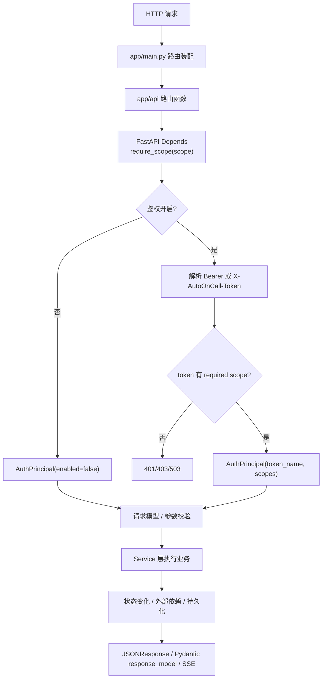
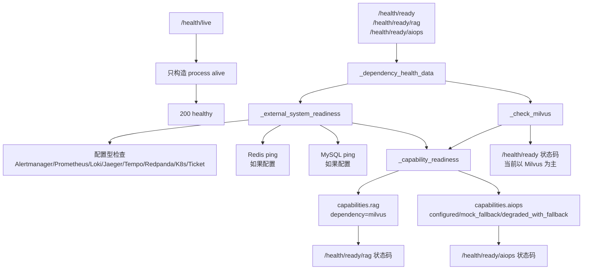

# AutoOnCall 的 API、RBAC 权限与健康检查设计

AutoOnCall 是一个 Python 3.11 FastAPI 应用，用于 RAG 问答和 AIOps 智能诊断。  
它既提供面向知识库的普通问答接口，也提供告警接入、故障诊断、人工审批、安全变更和离线评测等平台能力。  
这些能力最终都通过 HTTP API 暴露给前端工作台、运维脚本或外部系统。  
当接口数量变多后，项目必须回答三个工程问题：API 如何分组，谁可以调用哪些接口，探活和就绪检查到底代表什么。  
本文只讨论 API 组织、RBAC scope、审计 actor 和健康检查，不深入讲 RAG 检索算法或 AIOps Agent 的内部推理过程。  
读完本文，你应该能根据当前代码说清楚 `require_scope` 如何保护接口，`audit_actor` 为什么能防止审批人伪造，以及 `/health/live`、`/health/ready`、`/health/ready/rag`、`/health/ready/aiops` 的边界。

## 1. 从 `app/main.py` 看 API 边界

FastAPI 项目的 HTTP 边界首先体现在 `app/main.py`。这个文件创建 `FastAPI` 实例，注册 CORS 中间件、挂载静态页面，并把业务路由装配到主应用上。

当前代码中的路由注册是：

```python
app.include_router(health.router, tags=["健康检查"])
app.include_router(chat.router, prefix="/api", tags=["对话"])
app.include_router(file.router, prefix="/api", tags=["文件管理"])
app.include_router(aiops.router, prefix="/api", tags=["AIOps智能运维"])
app.include_router(alerts.router, prefix="/api", tags=["AIOps告警接入"])
app.include_router(approvals.router, prefix="/api", tags=["AIOps人工审批"])
app.include_router(incidents.router, prefix="/api", tags=["AIOps故障事件"])
app.include_router(evaluations.router, prefix="/api", tags=["离线评测"])
```

这段代码体现了两个重要设计：

- 健康检查路由不加 `/api` 前缀，直接暴露 `/health`、`/health/live`、`/health/ready` 等端点，方便容器编排、负载均衡和脚本探测。
- 业务接口统一挂在 `/api` 下，例如 `/api/chat`、`/api/aiops`、`/api/alerts/alertmanager`、`/api/incidents/{incident_id}/approval`。

`app/main.py` 还包含 `production_exposure_warnings()`。当服务绑定到 `0.0.0.0`、`::` 这类外部地址时，它会提示三类风险：API auth 关闭、CORS 允许所有来源、AIOps mock fallback 开启。这个函数不直接拒绝启动，但会在启动日志中提醒“当前配置适合本地演示，不适合直接暴露到生产公网”。

代码当前实现：API 鉴权默认是关闭的，适合本地 demo 和测试。生产环境如果对外绑定，应通过配置打开 `api_auth_enabled` 并设置 token。

可改进方向：如果未来要强约束生产安全，可以在检测到外部绑定且鉴权关闭时直接启动失败，或者提供 `ALLOW_INSECURE_DEMO=true` 这样的显式开关。

## 2. 主要路由组总览

AutoOnCall 的 API 层位于 `app/api/`，每个文件对应一类入口。API 层主要做四件事：接收请求、应用权限依赖、调用服务层、包装 HTTP 或 SSE 响应。

| 路由组 | 文件 | 主要端点 | 核心职责 |
| --- | --- | --- | --- |
| chat | `app/api/chat.py` | `/api/chat`、`/api/chat_stream`、`/api/chat/clear`、`/api/chat/session/{session_id}` | RAG 问答、流式问答、会话清理和会话历史查询 |
| file | `app/api/file.py` | `/api/upload`、`/api/index_directory` | 知识库文件上传和目录批量索引 |
| aiops | `app/api/aiops.py` | `/api/aiops`、`/api/aiops/runs`、`/api/incidents/{id}/diagnosis/resume`、`/api/changes/{id}/manual-result` | AIOps 诊断流、运行状态、demo incident、诊断恢复、安全变更 |
| alerts | `app/api/alerts.py` | `/api/alerts/alertmanager`、`/api/alerts`、`/api/alerts/{fingerprint}` | Alertmanager webhook 接入、告警列表和详情 |
| approvals | `app/api/approvals.py` | `/api/approvals/pending`、`/api/incidents/{incident_id}/approval` | 人工审批查询和审批决策 |
| incidents | `app/api/incidents.py` | `/api/incidents`、`/api/incidents/{id}`、`/api/incidents/{id}/trace`、`/api/incidents/{id}/report` | Incident 汇总、详情、Trace 和 Report 查询 |
| evaluations | `app/api/evaluations.py` | `/api/eval/summary`、`/api/eval/adapter-verification` | 离线评测结果和适配器验收结果读取 |
| health | `app/api/health.py` | `/health`、`/health/live`、`/health/ready`、`/health/ready/rag`、`/health/ready/aiops` | 进程探活、依赖就绪、能力级就绪 |

这些路由不是随机堆在一个文件里，而是按平台能力拆分。比如告警接入在 `alerts.py`，审批决策在 `approvals.py`，Incident 只读视图在 `incidents.py`。即使它们的 URL 都可能带有 `/incidents/{incident_id}`，代码职责仍然分开：审批模块负责“审批动作”，Incident 模块负责“查询视图”。

## 3. 请求链路：入口、模型、服务和结果

按提示词要求，我们用“请求入口 -> 数据模型 -> 服务层 -> 状态变化 -> 外部依赖 -> 返回/沉淀结果 -> 测试覆盖”的顺序看 API 设计。



几个典型入口可以帮助理解这条链路：

- `POST /api/chat` 使用 `ChatRequest`，调用 `rag_agent_service.query_with_retrieval()`，返回 answer、citations、retrieval 等字段。
- `POST /api/upload` 接收 `UploadFile`，先做文件名、扩展名、大小校验，再调用 `vector_index_service.index_single_file()`，返回上传和索引状态。
- `POST /api/alerts/alertmanager` 接收 Alertmanager 原始 payload，调用 `AlertIngestionService.ingest_alertmanager_webhook()`，生成或更新 `AlertEvent` 和 Incident 状态，必要时通过 `BackgroundTasks` 触发诊断。
- `POST /api/aiops` 接收 `AIOpsRequest`，调用 `aiops_service.diagnose()`，用 `EventSourceResponse` 流式返回诊断事件。
- `POST /api/incidents/{incident_id}/approval` 接收 `ApprovalDecisionRequest`，调用 `ApprovalService` 更新审批状态，并把认证主体写入 `decided_by`。
- `GET /health/ready/aiops` 不走业务模型，而是组合 Milvus、外部系统配置和 mock fallback 状态，返回 AIOps 能力是否可用。

这个设计的取舍是：API 层尽量保持薄，复杂逻辑下沉到 `app/services/`、`app/agent/aiops/`、`app/integrations/`。路由函数的职责是把 HTTP 世界和领域服务连接起来。

## 4. RBAC 的核心：用 scope 保护能力

RBAC 相关代码集中在 `app/core/auth.py`。当前项目没有把权限判断散落在每个路由函数里，而是用 FastAPI dependency 统一处理。

核心 scope 定义如下：

```python
READ_SCOPE = "read"
DIAGNOSE_SCOPE = "diagnose"
CHAT_WRITE_SCOPE = "chat_write"
KNOWLEDGE_WRITE_SCOPE = "knowledge_write"
APPROVE_SCOPE = "approve"
CHANGE_SCOPE = "change"
EVAL_SCOPE = "eval"
ADMIN_SCOPE = "admin"
```

这些 scope 对应的是“能力边界”，不是简单的页面菜单：

| Scope | 能力边界 | 典型操作 |
| --- | --- | --- |
| `read` | 读取平台状态，不触发新的诊断、审批或变更 | 查看工具契约、告警列表、Incident、Trace、Report、诊断运行状态 |
| `diagnose` | 触发诊断或告警接入，可能产生 Trace、Report、审批请求等状态 | 调用 `/api/aiops`、接收 Alertmanager webhook、resume 诊断 |
| `chat_write` | 修改 RAG 聊天会话状态 | 清空会话历史 |
| `knowledge_write` | 修改知识库和索引 | 上传文档、批量索引目录 |
| `approve` | 对风险动作做人工审批决策 | approve/reject 最新 pending approval |
| `change` | 启动或推进安全变更执行 | 变更 resume、提交人工执行结果 |
| `eval` | 查看离线评测和适配器验收结果 | 读取 eval summary、adapter verification |
| `admin` | 管理员通配能力 | `AuthPrincipal.has_scope()` 中 `admin` 可通过所有 scope 检查 |

项目还定义了角色到 scope 的映射：

| 角色 | Scope 集合 | 设计含义 |
| --- | --- | --- |
| `viewer` / `reader` | `read` | 只能看状态和报告 |
| `operator` | `read`、`diagnose`、`chat_write`、`knowledge_write`、`eval` | 运维操作者可以触发诊断、维护知识库、查看评测，但不能审批或执行变更 |
| `approver` | `read`、`approve`、`change` | 审批者可以查看上下文、做审批，并推进被授权的变更 |
| `admin` | `admin` + 全部业务 scope | 管理员通配 |

代码当前实现：`operator` 角色包含 `EVAL_SCOPE`，意味着离线评测结果不是普通 viewer 可读，而是给具备操作职责的人看。这个选择偏向“评测结果是内部工程质量信息”，而不是“所有只读用户都可见”。

可改进方向：如果以后 eval 页面要开放给只读观察者，可以把 `EVAL_SCOPE` 加入 viewer，或者拆成 `eval_read` 和 `eval_admin`。

## 5. `require_scope` 如何接入 FastAPI

`require_scope(scope)` 返回一个异步 dependency。它内部读取两种 token 来源：

- `Authorization: Bearer <token>`，由 `HTTPBearer(auto_error=False)` 解析。
- `X-AutoOnCall-Token: <token>`，通过 Header alias 解析。

然后调用 `authenticate_request(required_scope, credentials, x_autooncall_token)` 执行统一鉴权。

鉴权逻辑有几个关键分支：

1. 如果 `config.api_auth_enabled` 为 `False`，直接返回 `AuthPrincipal(enabled=False, token_name="auth-disabled")`，本地演示保持开放。
2. 如果启用了鉴权但没有配置任何 token，返回 `503`，错误信息是 `API auth is enabled but no API tokens are configured`。这是 fail closed，避免“以为开了鉴权但实际上无人校验”。
3. 如果请求没带 token，返回 `401`，并带 `WWW-Authenticate: Bearer`。
4. 如果 token 不匹配，返回 `401 invalid API token`。
5. 如果 token 有效但缺少目标 scope，返回 `403 token lacks required scope: ...`。
6. 如果 token 有效且拥有 scope，返回 `AuthPrincipal(enabled=True, token_name=..., scopes=...)`。

路由里有两种用法。

第一种是只需要保护接口，不关心调用者身份：

```python
@router.get("/aiops/tools/contracts", dependencies=[Depends(require_scope(READ_SCOPE))])
async def list_aiops_tool_contracts() -> dict:
    ...
```

这种写法常见于只读接口和诊断触发接口。dependency 执行完即可，路由函数不需要拿到 `principal`。

第二种是既要鉴权，也要把调用者写入审计字段：

```python
async def submit_incident_approval(
    incident_id: str,
    request: ApprovalDecisionRequest,
    principal: AuthPrincipal = Depends(require_scope(APPROVE_SCOPE)),
) -> dict:
    decided_by = audit_actor(principal, request.decided_by)
    ...
```

这种写法常见于审批和变更。路由函数需要知道“真实认证主体是谁”，不能只相信请求体里的 `operator` 或 `decided_by`。

## 6. Token 配置模型

`configured_token_scopes()` 会从两类配置构建 token registry。

第一类是角色快捷 token：

- `api_read_token` -> `viewer`
- `api_operator_token` -> `operator`
- `api_approver_token` -> `approver`
- `api_admin_token` -> `admin`

第二类是 JSON token registry：`api_auth_tokens`。它允许用 JSON 配置多个 token，并给每个 token 配 `scopes`、`roles` 或 `role`。如果配置了 `name`，这个 name 会成为 `AuthPrincipal.token_name`；否则会用 token 的 SHA-256 哈希前缀生成 `json_token_xxx`，避免把原始 token 暴露到审计字段。

代码当前实现：JSON 解析失败、格式不是 dict、scope 为空时会忽略对应配置，不会抛启动异常。

可改进方向：生产环境可以增加启动期配置校验，把 JSON token registry 的语法错误提前暴露出来，避免运行时排查困难。

## 7. 审计 actor：为什么不能只信请求体

审批和变更接口有一个容易忽视的安全点：请求体里的 `operator`、`decided_by` 是客户端传来的，不能直接当成审计主体。否则任何持有 token 的人都可以提交：

```json
{"decision": "approve", "decided_by": "someone-else"}
```

当前项目用 `audit_actor(principal, fallback)` 解决这个问题：

```python
def audit_actor(principal: AuthPrincipal, fallback: str = "operator") -> str:
    if principal.enabled and principal.token_name:
        return principal.token_name
    return fallback or principal.token_name
```

它的含义是：

- 当 API 鉴权开启时，审计 actor 使用认证主体的 `token_name`。
- 当 API 鉴权关闭时，保留请求体里的 fallback，方便本地 demo 和测试。

当前使用 `audit_actor` 的关键路径有三处：

| 文件 | 路由 | Scope | 审计字段 |
| --- | --- | --- | --- |
| `app/api/approvals.py` | `POST /api/incidents/{incident_id}/approval` | `approve` | `decided_by` |
| `app/api/aiops.py` | `POST /api/incidents/{incident_id}/changes/{change_plan_id}/resume` | `change` | `operator` |
| `app/api/aiops.py` | `POST /api/changes/{change_execution_id}/manual-result` | `change` | `operator` |

这背后的工程取舍是：审批和变更不是普通读写，它们会影响故障处置链路，也可能触发生产动作。因此审计字段必须绑定认证身份。请求体里的名字可以作为本地演示 fallback，但不能覆盖已认证 principal。

`tests/test_auth_rbac.py` 中的 `test_approver_token_is_used_as_approval_audit_actor` 就验证了这个边界：请求体故意传 `decided_by="spoofed-user"`，但响应里的审批记录最终是 `decided_by="approver_token"`。

## 8. API 权限矩阵

下面这张表按当前真实代码整理，重点看“接口会产生什么影响”和“需要哪个 scope”。

| 路由组 | 方法与路径 | Scope | 行为类型 | 说明 |
| --- | --- | --- | --- | --- |
| health | `GET /health` | 无 | 健康检查 | 兼容端点，当前等价于 readiness 语义 |
| health | `GET /health/live` | 无 | 健康检查 | 只检查 FastAPI 进程是否响应，不检查 Milvus 或外部系统 |
| health | `GET /health/ready` | 无 | 健康检查 | 检查依赖视图，当前以 Milvus 是否可用决定整体 readiness HTTP 状态 |
| health | `GET /health/ready/rag` | 无 | 健康检查 | 只判断 RAG 能力，核心依赖是 Milvus |
| health | `GET /health/ready/aiops` | 无 | 健康检查 | 判断 AIOps 能力，可由外部系统配置或 mock fallback 支撑 |
| chat | `POST /api/chat` | `read` | 读取/问答 | RAG 快速问答，读取知识库并返回答案 |
| chat | `POST /api/chat_stream` | `read` | 读取/问答 | RAG SSE 流式问答 |
| chat | `POST /api/chat/clear` | `chat_write` | 状态修改 | 清空会话历史 |
| chat | `GET /api/chat/session/{session_id}` | `read` | 查询 | 查看会话历史 |
| file | `POST /api/upload` | `knowledge_write` | 状态修改 | 上传知识文件并创建向量索引 |
| file | `POST /api/index_directory` | `knowledge_write` | 状态修改 | 批量索引目录，面向运维批处理 |
| aiops | `GET /api/aiops/tools/contracts` | `read` | 查询 | 返回工具契约，不调用外部系统 |
| aiops | `GET /api/aiops/demo/incidents` | `read` | 查询 | 返回 demo incident 列表 |
| aiops | `GET /api/aiops/status-catalog` | `read` | 查询 | 返回诊断生命周期状态字典 |
| aiops | `GET /api/aiops/runs` | `read` | 查询 | 查询诊断运行历史 |
| aiops | `GET /api/aiops/runs/{session_id}` | `read` | 查询 | 查询一次诊断运行详情 |
| aiops | `POST /api/aiops` | `diagnose` | 状态修改/SSE | 触发 AIOps 诊断，可能产生 Trace、Report、Approval |
| aiops | `GET /api/aiops/demo/incidents/{case_id}` | `read` | 查询 | 返回单个 demo incident payload |
| aiops | `POST /api/aiops/demo/incidents/{case_id}/run` | `diagnose` | 状态修改/SSE | 运行 demo incident 诊断 |
| aiops | `POST /api/incidents/{incident_id}/diagnosis/resume` | `diagnose` | 状态修改/SSE | 审批后恢复诊断流程 |
| aiops | `POST /api/incidents/{incident_id}/changes/{change_plan_id}/resume` | `change` | 状态修改/SSE | 审批后启动安全变更流程，operator 绑定 principal |
| aiops | `GET /api/incidents/{incident_id}/changes` | `read` | 查询 | 查询某个 incident 的变更执行记录 |
| aiops | `GET /api/changes/{change_execution_id}` | `read` | 查询 | 查询单个变更执行记录 |
| aiops | `POST /api/changes/{change_execution_id}/manual-result` | `change` | 状态修改 | 记录人工执行结果，operator 绑定 principal |
| alerts | `POST /api/alerts/alertmanager` | `diagnose` | 状态修改 | 接收告警、创建或更新 Incident，可触发后台诊断 |
| alerts | `GET /api/alerts` | `read` | 查询 | 查询标准化告警列表 |
| alerts | `GET /api/alerts/{fingerprint}` | `read` | 查询 | 查询单个告警详情 |
| approvals | `GET /api/approvals/pending` | `read` | 查询 | 查询待审批请求 |
| approvals | `GET /api/incidents/{incident_id}/approval` | `read` | 查询 | 查询某个 incident 的审批记录 |
| approvals | `POST /api/incidents/{incident_id}/approval` | `approve` | 状态修改 | 审批或拒绝最新 pending request，decided_by 绑定 principal |
| incidents | `GET /api/incidents` | `read` | 查询 | 汇总 Incident、Report、Trace、Approval、State |
| incidents | `GET /api/incidents/{incident_id}` | `read` | 查询 | 查询 Incident overview |
| incidents | `GET /api/incidents/{incident_id}/trace` | `read` | 查询 | 查询 Trace 事件 |
| incidents | `GET /api/incidents/{incident_id}/report` | `read` | 查询 | 查询诊断报告，可返回 Markdown |
| evaluations | `GET /api/eval/summary` | `eval` | 查询 | 读取离线评测摘要 |
| evaluations | `GET /api/eval/adapter-verification` | `eval` | 查询 | 读取适配器验收结果 |

这张矩阵里最重要的边界是：

- `read` 只能看，不应触发诊断、审批或变更。
- `diagnose` 可以触发诊断和告警接入，因为这些操作会产生新的诊断状态。
- `approve` 只覆盖审批决策，不覆盖变更执行。
- `change` 只覆盖安全变更推进和人工执行结果，不覆盖审批决策本身。
- `knowledge_write` 单独保护知识库写入，避免普通读者上传或覆盖索引内容。
- `eval` 单独保护工程评测结果，避免和普通读接口混在一起。

## 9. 为什么 read 接口里也会有 `POST`

`POST /api/chat` 和 `POST /api/chat_stream` 使用的是 `READ_SCOPE`，这可能让人疑惑：既然是 POST，为什么不是 write？

这里要区分 HTTP 方法和业务权限。RAG 问答虽然用 POST 承载请求体，但它的核心能力是“读取知识库并生成回答”。它可能会维护会话历史，但没有修改知识库、审批状态、Incident 生命周期或生产变更。因此当前代码把它归入 `read`。

真正修改聊天状态的接口是 `POST /api/chat/clear`，它会清空会话历史，所以使用 `CHAT_WRITE_SCOPE`。

同理，`POST /api/alerts/alertmanager` 虽然看起来是外部 webhook，但它会落 AlertEvent、更新 IncidentState，甚至通过 `auto_diagnose=true` 触发诊断，所以需要 `DIAGNOSE_SCOPE`。

这个设计提醒我们：权限应该按“业务影响面”划分，而不是机械按 HTTP verb 划分。

## 10. 健康检查的四层语义

健康检查代码在 `app/api/health.py`。当前实现提供五个端点，其中 `/health` 是兼容入口，真正需要重点理解的是四类语义。

### 10.1 `/health/live`：进程活着

`liveness_check()` 只构造基础健康数据，并返回：

```json
{
  "checks": {
    "process": {
      "status": "alive",
      "message": "FastAPI process is responsive"
    }
  }
}
```

它不会调用 `milvus_manager.health_check()`，也不会 ping Redis/MySQL。这一点非常重要：liveness 的作用是告诉编排系统“进程有没有卡死”。如果把外部依赖也放进 liveness，Milvus 短暂不可用就可能导致应用容器被反复重启，反而扩大故障。

`tests/test_health_api.py` 中的 `test_liveness_does_not_check_milvus` 专门把 Milvus health check monkeypatch 成抛异常，验证 `/health/live` 仍然返回 200。

### 10.2 `/health/ready`：整体依赖视图，当前以 RAG/Milvus 为主

`readiness_check()` 会调用 `_dependency_health_data()`，收集：

- process 状态。
- Milvus 状态。
- external systems 状态。
- capabilities，包括 `rag` 和 `aiops`。

当前代码中，`/health/ready` 的 HTTP 状态主要由 Milvus 决定：

```python
if health_data["checks"]["milvus"]["status"] != "connected":
    overall_status = "degraded"
    status_code = 503
    health_data["error"] = "RAG readiness dependency unavailable"
```

也就是说，Milvus 不可用时，整体 readiness 返回 503。这个选择偏向“生产流量就绪”和“RAG 能力就绪”：因为 AutoOnCall 的知识问答和上传索引都依赖 Milvus。

但它并不意味着所有外部系统都必须 connected。`_external_system_readiness()` 会检查 Alertmanager、Prometheus、Log Gateway、Jaeger、Tempo、Redpanda、Kubernetes、Redis、MySQL、Ticket 等系统。其中 Alertmanager/Prometheus 等多数系统是“是否配置”的检查；Redis/MySQL 如果配置了，会实际 ping。外部系统 failed 时，`external_systems.status` 可能是 `degraded`，但只要 Milvus connected，`/health/ready` 当前仍可返回 200，同时在 payload 中暴露 AIOps 能力的降级状态。

代码当前实现：`/health/ready` 不是“所有业务能力都满血”的意思，而是一个向后兼容的整体就绪入口，重点保护 RAG/Milvus 依赖。

可改进方向：如果部署平台需要严格区分能力，可以把 readiness probe 改成 `/health/ready/rag` 或 `/health/ready/aiops`，而不是只看 `/health/ready`。

### 10.3 `/health/ready/rag`：RAG 能力就绪

`rag_readiness_check()` 读取 `health_data["capabilities"]["rag"]["ready"]`：

```python
rag_ready = bool(health_data["capabilities"]["rag"]["ready"])
status_code = 200 if rag_ready else 503
```

RAG 的判断非常直接：`_capability_readiness()` 里只有当 Milvus status 为 `connected` 时，`rag.ready` 才是 `True`。

这是合理的，因为当前 RAG 搜索和上传索引都依赖 Milvus 向量库。Milvus 不可用时，RAG 问答可能无法检索知识库，上传后的向量索引也无法正常完成。

### 10.4 `/health/ready/aiops`：AIOps 能力就绪

`aiops_readiness_check()` 判断的是 `health_data["capabilities"]["aiops"]["ready"]`。它和 RAG 不同，不直接依赖 Milvus。

`_capability_readiness()` 中的 AIOps 判断逻辑是：

- 如果 external systems status 是 `configured`，AIOps ready。
- 如果 external systems status 是 `mock_fallback`，AIOps ready。
- 如果 external systems status 是 `degraded` 且 mock fallback 开启，AIOps ready，状态为 `degraded_with_fallback`。
- 否则 AIOps 不 ready。

这解释了为什么 `/health/ready` 不能等同于所有业务能力。比如：

- Milvus 断开，RAG 不可用。
- AIOps mock fallback 开启，外部系统没有配置或部分失败。
- 此时 `/health/ready` 可能返回 503，因为 RAG/Milvus 不 ready。
- 但 `/health/ready/aiops` 可以返回 200，因为 AIOps 仍能通过 mock/offline fallback 跑诊断演示或降级流程。

`tests/test_health_api.py` 中的 `test_capability_readiness_splits_aiops_from_rag` 就验证了这个场景：Milvus 断开、mock fallback 开启时，`/health/ready/aiops` 返回 200，同时 payload 明确显示 `rag.ready` 是 `False`，`aiops.ready` 是 `True`。

## 11. 健康检查数据流

健康检查的共享逻辑可以画成下面这张图：



这套实现解决的问题是：不同调用方关心的“健康”不是一回事。

- Kubernetes liveness probe 只需要知道进程是否活着。
- 负载均衡 readiness 可能需要知道服务是否适合承接生产 RAG 流量。
- RAG 页面需要知道 Milvus 是否可用。
- AIOps 演示或告警诊断页面需要知道外部系统或 fallback 能否支撑诊断。

把这些语义拆开，能避免“一个依赖失败导致所有能力都被误判不可用”。

## 12. `/health` 为什么保留兼容入口

`@router.get("/health")` 的实现非常简单：

```python
async def health_check():
    """Compatibility endpoint with readiness semantics."""
    return await readiness_check()
```

这说明 `/health` 是兼容旧脚本或旧部署的入口，语义上跟 readiness 一致。README 和操作脚本更推荐显式使用 `/health/live` 和 `/health/ready`。

代码当前实现：`/health` 会走 Milvus readiness 语义，不是纯 liveness。

面试时可以主动强调这一点：如果面试官问“你们的健康检查会不会因为外部依赖失败而重启服务”，不要只说“有 health 接口”，要说明 liveness 和 readiness 已拆分，真正不会检查外部依赖的是 `/health/live`。

## 13. 外部系统 readiness 的细节

`_external_system_readiness()` 会构造一个 `checks` 字典：

- `alertmanager`
- `prometheus`
- `log_gateway`
- `jaeger`
- `tempo`
- `redpanda`
- `kubernetes`
- `redis`
- `mysql`
- `ticket`

其中多数系统使用 `_configured_only_check(bool(config.xxx_url))`。也就是说，只要配置了 URL 或 API server，就认为它是 `configured`；没配置则是 `not_configured`。Redis 和 MySQL 特殊一些：如果配置存在，会通过 `RedisInfoAdapter.ping()` 或 `MySQLStatusAdapter.ping()` 做实际连通性检查。

整体外部系统状态由 `_external_overall_status(statuses, mock_fallback_enabled)` 决定：

```python
if any(status == "failed" for status in statuses.values()):
    return "degraded"
if any(status in {"connected", "configured"} for status in statuses.values()):
    return "configured"
return "mock_fallback" if mock_fallback_enabled else "not_configured"
```

这段逻辑的工程含义是：

- 任何已配置系统实际失败，外部依赖视图就是 `degraded`。
- 至少有一个外部系统 configured 或 connected，就说明 AIOps 有真实外部信号来源。
- 全部没配置时，如果 mock fallback 开启，AIOps 仍然可以跑演示或离线路径。
- 全部没配置且 fallback 关闭，AIOps 不 ready。

`_dependency_health_data()` 还有一个细节：如果 Milvus 不可用、外部系统 degraded、且 mock fallback 开启，会把 external systems status 调整为 `mock_fallback`。这是为了表达“虽然真实依赖不完整，但当前模式允许 mock fallback 支撑 AIOps”。

## 14. 为什么整体 readiness 不能等同于所有业务能力

很多项目会把 readiness 简化成“所有依赖都必须正常”。AutoOnCall 没有这样做，原因是它有两类差异很大的能力：

第一类是 RAG 能力。它对 Milvus 有强依赖。Milvus 不可用，知识检索和向量索引就不能正常工作。

第二类是 AIOps 能力。它可以使用真实外部系统，例如 Prometheus、日志、Redis、MySQL、Kubernetes、Redpanda，也可以在本地演示和测试时使用 mock fallback。AIOps 的可用性不应该被 Milvus 单点绑定。

所以当前代码把 readiness 拆成：

- `/health/ready`：兼容的整体入口，当前以 RAG/Milvus 为主。
- `/health/ready/rag`：明确判断 RAG。
- `/health/ready/aiops`：明确判断 AIOps。

这个设计解决的是“多能力平台的健康语义混乱”问题。面向校招项目讲解时，可以把它总结成一句话：同一个服务里有多个业务能力，健康检查不能只给一个模糊的 healthy，而要让调用方选择自己关心的能力探针。

## 15. 安全边界和生产暴露

API 权限设计还要结合部署默认值理解。

`app/config.py` 中：

- `api_auth_enabled` 默认 `False`。
- `api_auth_tokens`、`api_read_token`、`api_operator_token`、`api_approver_token`、`api_admin_token` 默认空。
- `host` 默认是本地 demo host。
- `cors_allowed_origins` 默认只包含本地地址。
- `aiops_mock_fallback_enabled` 默认 `False`。

这组默认值的目标是：本地开发容易启动，但生产要显式配置。

`app/main.py` 的 `production_exposure_warnings()` 会检查外部绑定场景：

- 外部绑定且 API auth 关闭，提示风险。
- 外部绑定且 CORS 允许 `*`，提示风险。
- 外部绑定且 mock fallback 开启，提示风险。

这不是 RBAC 的替代品，而是第二层安全提醒。RBAC 控制“谁可以调用接口”，生产暴露检查控制“服务是不是以危险 demo 配置暴露出去了”。

## 16. 边界情况：当前代码如何处理

### 16.1 鉴权开启但没配置 token

返回 503，而不是默认放行。这是一个很重要的 fail closed 设计。否则生产环境可能以为打开了鉴权，实际上所有请求仍然可以访问。

### 16.2 token 缺失、无效、权限不足

当前代码区分三类错误：

- 缺失 token：401。
- token 无效：401。
- token 有效但缺少 scope：403。

这对排查很有帮助。401 是“你没有证明你是谁”，403 是“你已证明身份，但权限不够”。

### 16.3 admin 为什么能通过所有接口

`AuthPrincipal.has_scope()` 中只要 `ADMIN_SCOPE in self.scopes`，就返回 True。这样 admin 不需要列举每个 scope。角色映射里 admin 同时包含 `ADMIN_SCOPE` 和 `ALL_SCOPES`，属于双保险。

### 16.4 健康检查为什么没有鉴权

当前 health 路由没有 `require_scope`。这是常见平台设计：liveness/readiness 通常给容器编排、负载均衡、监控系统直接访问。如果生产环境担心信息暴露，可以在反向代理或内网层限制 health 访问，而不是让 Kubernetes probe 也去处理业务 token。

### 16.5 response model 为什么重要

`alerts.py`、`approvals.py`、`incidents.py` 的部分接口声明了 `response_model`，例如 `AlertIngestionResult`、`ApprovalDecisionResponse`、`IncidentOverviewResponse`。这让 OpenAPI schema 能稳定暴露给前端和测试，也能防止响应结构随手漂移。

`tests/test_api_contracts.py` 专门检查这些关键路径的 OpenAPI `$ref` 是否指向预期 response model。

## 17. 测试说明：RBAC 如何被验证

RBAC 的测试主要在 `tests/test_auth_rbac.py`。

这个文件用一个最小 FastAPI app 注册 `aiops.router`、`approvals.router`、`evaluations.router`，然后通过 `httpx.ASGITransport` 直接调用路由，不需要真的启动服务。

关键测试包括：

- `test_auth_disabled_keeps_local_demo_routes_open`：鉴权关闭时，本地 demo 路由可以访问。
- `test_auth_enabled_without_tokens_fails_closed`：鉴权开启但没有 token 配置时，接口返回 503。
- `test_read_token_can_read_but_cannot_approve_or_diagnose`：read token 可以访问只读工具契约，但不能调用诊断、审批或 eval；缺失 token 是 401，权限不足是 403。
- 同一个测试还验证 approver token 调审批接口时能通过鉴权，之后因为没有对应审批记录返回 404。这说明请求已经越过权限层，进入业务层。
- `test_approver_token_is_used_as_approval_audit_actor`：认证主体会覆盖请求体中的伪造 `decided_by`。
- `test_json_token_registry_expands_roles`：JSON token registry 能把 `operator` role 展开成 scope，从而访问 read 接口。

这些测试覆盖了 RBAC 最关键的四个边界：默认开放、开启后 fail closed、scope 不足拒绝、审计 actor 绑定认证主体。

## 18. 测试说明：健康检查如何被验证

健康检查测试主要在 `tests/test_health_api.py`。

关键测试包括：

- `test_liveness_does_not_check_milvus`：liveness 不访问 Milvus，即使 Milvus health check 会抛异常，仍返回 200。
- `test_readiness_reports_milvus_dependency_failure`：Milvus 不可用时，`/health/ready` 返回 503，payload 中 `status=degraded`，`capabilities.rag.ready=false`。
- `test_capability_readiness_splits_aiops_from_rag`：Milvus 不可用但 mock fallback 开启时，AIOps readiness 可以返回 200，同时 RAG 明确不可用。
- `test_rag_readiness_uses_rag_dependency_status`：RAG readiness 直接跟 Milvus 绑定，Milvus 断开时返回 503。
- `test_health_keeps_readiness_compatible`：`/health` 仍保持 readiness 兼容语义，Milvus connected 时返回 200。
- `test_readiness_reports_external_connected_and_failed`：Redis connected、MySQL failed、mock fallback 开启时，external systems 是 `degraded`，AIOps capability 状态是 `degraded_with_fallback`，但 Milvus connected 时整体 readiness 仍返回 200。
- `test_external_overall_status_respects_mock_fallback_flag`：全部未配置时，fallback 开启返回 `mock_fallback`，关闭返回 `not_configured`。

这些测试说明健康检查不是简单测一个 `/health` 200，而是明确保护了 liveness、readiness、RAG readiness、AIOps readiness 的语义差异。

## 19. 测试说明：API 契约如何被验证

`tests/test_api_contracts.py` 关注的是 OpenAPI response model。

它构造一个最小 app，注册 `alerts`、`approvals`、`incidents` 三组路由，然后读取 `app.openapi()`。测试断言这些路径的 200 响应 schema 指向预期 Pydantic 模型：

- `/api/alerts/alertmanager` -> `AlertIngestionResult`
- `/api/alerts` -> `AlertListResponse`
- `/api/alerts/{fingerprint}` -> `AlertDetailResponse`
- `/api/approvals/pending` -> `ApprovalListResponse`
- `/api/incidents/{incident_id}/approval` -> `IncidentApprovalListResponse` 或 `ApprovalDecisionResponse`
- `/api/incidents` -> `IncidentListResponse`
- `/api/incidents/{incident_id}` -> `IncidentOverviewResponse`
- `/api/incidents/{incident_id}/trace` -> `IncidentTraceResponse`
- `/api/incidents/{incident_id}/report` -> `IncidentReportResponse`

这类测试的价值是防止 API 文档和前端契约被无意破坏。对校招项目来说，这是一个很好的工程亮点：不仅测试业务返回，还测试 OpenAPI 契约稳定性。

## 20. 面试中怎么讲这套设计

可以按三层回答。

第一层，讲 API 组织。AutoOnCall 把健康检查、RAG 问答、文件上传、AIOps 诊断、告警接入、审批、Incident 查询、评测读取拆成不同 router，在 `app/main.py` 里统一装配。健康检查直接挂根路径，其余业务接口挂 `/api`。

第二层，讲权限边界。项目没有按“页面”或“HTTP 方法”粗暴授权，而是按能力定义 scope：`read` 看状态，`diagnose` 触发诊断，`knowledge_write` 写知识库，`chat_write` 改会话，`approve` 做审批，`change` 推进变更，`eval` 看评测。路由通过 `Depends(require_scope(...))` 统一接入。

第三层，讲健康检查。liveness 不检查外部依赖，readiness 提供共享依赖视图，RAG readiness 绑定 Milvus，AIOps readiness 可以由真实外部系统或 mock fallback 支撑。这样同一个 FastAPI 服务里的多种能力不会被一个模糊的 `/health` 混在一起。

如果要再拔高一点，可以补一句：审批和变更接口会用 `audit_actor` 把认证主体写入审计字段，避免客户端伪造 operator 或 decided_by。这说明项目不仅有“能调用”，还考虑了“谁调用、谁负责、如何追责”。

## 21. 面试官可能追问与推荐回答

### 追问 1：你们的 RBAC 是怎么实现的？

推荐回答：

RBAC 代码集中在 `app/core/auth.py`。项目先定义 `READ_SCOPE`、`DIAGNOSE_SCOPE`、`APPROVE_SCOPE`、`CHANGE_SCOPE` 等能力级 scope，再把 viewer、operator、approver、admin 这些角色映射成 scope 集合。路由通过 `Depends(require_scope(scope))` 接入鉴权。`require_scope` 会解析 Bearer token 或 `X-AutoOnCall-Token`，构造 `AuthPrincipal`，并检查 token 是否具备目标 scope。

### 追问 2：鉴权关闭时是不是不安全？

推荐回答：

鉴权默认关闭是为了本地 demo 和自动化测试易用。生产暴露时需要显式开启 `api_auth_enabled` 并配置 token。代码里还有 `production_exposure_warnings()`，当服务绑定到 `0.0.0.0` 且鉴权关闭、CORS 放开或 mock fallback 开启时会打安全提示。也就是说，本地默认值偏易用，生产要靠配置切换到受保护模式。

### 追问 3：为什么启用鉴权但没配 token 返回 503？

推荐回答：

这是 fail closed。启用鉴权说明管理员希望接口受保护，如果没有任何 token 配置，系统不能默认放行，否则会造成“以为有权限控制，实际没有”的风险。返回 503 能明确告诉部署方配置不完整。

### 追问 4：read token 为什么不能调用 `/api/eval/summary`？

推荐回答：

当前代码把 eval 单独定义成 `EVAL_SCOPE`，没有放进 viewer/reader。这样做是因为评测摘要和适配器验收结果属于内部工程质量信息，不一定要对所有只读用户开放。operator 角色包含 eval，所以运维操作者可以查看。未来如果产品定位变化，可以把 eval 拆成更细的读权限。

### 追问 5：为什么 `POST /api/chat` 用的是 `READ_SCOPE`？

推荐回答：

权限不是按 HTTP 方法机械划分，而是按业务影响划分。`POST /api/chat` 虽然是 POST，但它本质是读取知识库、生成回答，不修改知识库、不审批、不触发生产变更。真正改变聊天状态的 `/api/chat/clear` 使用的是 `CHAT_WRITE_SCOPE`。

### 追问 6：审批接口怎么防止用户伪造审批人？

推荐回答：

审批接口不是直接相信请求体里的 `decided_by`。`POST /api/incidents/{incident_id}/approval` 会用 `principal: AuthPrincipal = Depends(require_scope(APPROVE_SCOPE))` 拿到认证主体，然后调用 `audit_actor(principal, request.decided_by)`。鉴权开启时，`audit_actor` 返回 token 对应的 `token_name`，覆盖请求体里的值。测试里专门传了 `spoofed-user`，最终记录仍然是 `approver_token`。

### 追问 7：变更接口为什么要用 `CHANGE_SCOPE`，审批通过不就够了吗？

推荐回答：

审批和执行是两个职责。审批表示“允许这个变更计划继续”，执行或记录人工结果表示“真正推进变更状态”。所以审批接口使用 `APPROVE_SCOPE`，变更 resume 和 manual-result 使用 `CHANGE_SCOPE`。这样可以让组织里审批人和执行人分离，也能在审计上区分谁批准、谁执行。

### 追问 8：`/health/live` 和 `/health/ready` 有什么区别？

推荐回答：

`/health/live` 只判断 FastAPI 进程是否响应，不检查 Milvus、Redis、MySQL 或其他外部系统。它适合 liveness probe，避免外部依赖短暂故障导致容器被重启。`/health/ready` 会构造依赖视图，当前以 Milvus 是否 connected 决定整体 readiness 状态，更适合判断服务是否适合承接依赖 RAG 的生产流量。

### 追问 9：为什么还要有 `/health/ready/rag` 和 `/health/ready/aiops`？

推荐回答：

因为 AutoOnCall 是多能力平台。RAG 强依赖 Milvus；AIOps 可以使用 Prometheus、日志、Redis、MySQL、Kubernetes 等外部系统，也可以在本地或降级场景使用 mock fallback。Milvus 挂了不代表 AIOps 演示或降级诊断完全不可用，所以需要能力级 readiness。测试里也验证了 Milvus 断开时，RAG readiness 返回 503，但 AIOps readiness 在 mock fallback 开启时可以返回 200。

### 追问 10：外部系统没有配置时，AIOps readiness 怎么判断？

推荐回答：

`_external_overall_status` 会先看是否有 failed，再看是否有 connected 或 configured。如果全部没有配置，就看 `aiops_mock_fallback_enabled`。fallback 开启时返回 `mock_fallback`，AIOps ready；fallback 关闭时返回 `not_configured`，AIOps not ready。这样本地 demo 和生产真实依赖是可区分的。

### 追问 11：健康检查接口要不要鉴权？

推荐回答：

当前代码没有给 health 路由加鉴权，这是为了兼容容器编排、负载均衡和监控探针。生产上如果担心暴露依赖信息，可以在网关或内网层限制访问，而不是让 liveness/readiness 也依赖业务 token。关键是不要把 health 当成业务数据接口。

### 追问 12：这套 API 设计还能怎么改进？

推荐回答：

可以从三方面改进。第一，生产模式下把危险默认值变成硬失败，比如外部绑定但 auth 关闭时拒绝启动。第二，JSON token registry 可以做启动期强校验，避免配置错误被静默忽略。第三，权限可以继续细分，比如把 eval 拆成 eval_read/eval_admin，把 change 拆成 change_resume/change_manual_result，以适配更复杂的组织分工。
