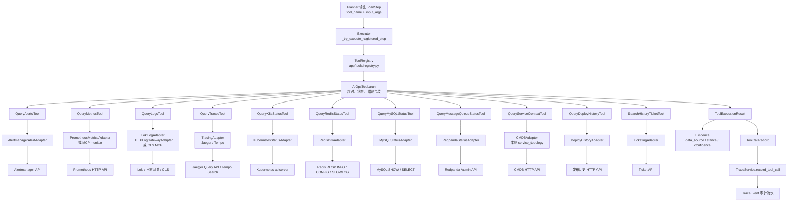

# AutoOnCall 的外部系统适配器设计：Prometheus、日志、Trace、K8s、Redis、MySQL 如何统一接入

AutoOnCall 是一个 Python 3.11 FastAPI 应用，用于 RAG 问答和 AIOps 智能诊断。
RAG 负责把知识库、Runbook 和历史经验带入上下文，AIOps Agent 负责围绕告警或诊断请求执行排障计划。
在一次诊断里，Agent 不能只靠自然语言猜测根因，而要访问监控、日志、调用链、Kubernetes、缓存、数据库、消息队列、CMDB 和工单等外部系统。
这些系统的协议、认证、返回格式、失败模式都不同，所以项目在 `app/integrations/` 和 `app/tools/` 之间设计了一层清晰边界。
`integrations` 负责把外部系统协议封装成 adapter，`tools` 负责把 adapter 包装成 Executor 可以稳定调用的工具。
本文只展开外部系统适配器和工具层，不深入 Planner/Replanner 的策略细节。
可以把本文理解为：AutoOnCall 如何把“杂乱的生产系统接口”变成“Agent 可审计、可降级、可测试的只读诊断工具”。

## 1. 这层解决什么问题

如果让 Agent 直接访问生产系统，最容易出三个问题。

第一，协议不统一。Prometheus 是 PromQL HTTP API，Loki 是 LogQL，Jaeger/Tempo 是 Trace 查询接口，Kubernetes 是 apiserver，Redis 走 RESP 协议，MySQL 走 SQL，工单和 CMDB 通常是内部 HTTP API。Planner 不应该关心这些差异。

第二，输入不安全。生产系统不能让 Agent 随意拼任意 PromQL、LogQL、SQL 或 Kubernetes selector。项目要把可变输入限制在服务名、时间窗口、limit、实例名等受控字段里。

第三，失败不可解释。真实环境里经常出现未配置、超时、权限不足、HTTP 5xx、字段缺失等情况。如果只抛异常，报告就很难区分“根因证据为空”和“证据系统不可用”。

AutoOnCall 的解决方式是：

- `app/integrations/`：每个外部系统一个 adapter，负责认证、协议、查询、原始结果规整。
- `app/tools/`：每个诊断能力一个 tool，负责输入裁剪、超时、mock fallback、结构化失败、工具契约。
- `app/tools/registry.py`：把标准工具注册为稳定名称，供 Executor 按 `PlanStep.tool_name` 调用。
- `app/models/evidence.py` 和 `app/agent/aiops/executor.py`：把工具结果沉淀为 Evidence、ToolCallRecord 和 TraceEvent。

这层的核心设计目标不是“查到数据就行”，而是让每次查询都有明确来源、状态、边界和审计记录。

## 2. 请求入口：Executor 不是直接调外部系统

一次 AIOps 诊断会进入 `app/agent/aiops/executor.py`。Executor 拿到 Planner 生成的 `PlanStep` 后，会优先走 `_try_execute_registered_step`：

1. 检查 `plan_step.tool_name` 是否存在于 `ToolRegistry`。
2. 通过 `registry.arun(plan_step.tool_name, plan_step.input_args)` 调用标准工具。
3. 得到 `ToolExecutionResult`。
4. 转成 `Evidence`，追加到诊断状态。
5. 转成 `ToolCallRecord`，交给 `trace_service.record_tool_call` 做审计沉淀。

工具注册表在 `app/tools/registry.py`：

- `query_alerts`：Alertmanager 告警上下文。
- `query_metrics`：Prometheus 或 MCP monitor 指标。
- `query_logs`：Loki、HTTP 日志网关或 CLS MCP 日志。
- `query_traces`：Jaeger/Tempo 调用链。
- `query_service_context`：CMDB 或本地拓扑。
- `query_deploy_history`：发布历史。
- `query_message_queue_status`：Redpanda/Kafka-compatible 队列状态。
- `query_redis_status`：Redis INFO。
- `query_k8s_status`：Kubernetes Pod/Event 状态。
- `query_mysql_status`：MySQL 状态 SQL。
- `search_history_ticket`：历史工单。
- `suggest_remediation`：基于规则的修复建议，不执行变更。

这个入口设计的好处是：Planner 只需要输出稳定工具名和参数，Executor 不需要知道 Prometheus URL、Redis 密码或 MySQL 驱动细节。外部系统接入复杂度被隔离在 adapter 和 tool 内部。

## 3. 数据模型：两层结构化返回

工具调用结果有两层结构。

第一层是 tool 执行结果，定义在 `app/tools/base.py`：

- `ToolContract`：描述工具名称、输入输出 schema、风险等级、是否只读、超时、重试策略、数据源和降级策略。
- `ToolExecutionResult`：记录 `tool_name`、`status`、`input_args`、`output`、`latency_ms`、`risk_level`、`read_only`、`error_message` 和 `metadata`。
- `AIOpsTool.arun`：统一执行 `_call`，包裹超时和异常；如果 output 是结构化失败，tool 状态也会变成 `failed`。

第二层是 adapter 或 tool output 的 envelope。公共 helper 在 `app/integrations/base.py`：

- `adapter_success(...)` 返回成功 envelope。
- `adapter_failure(...)` 返回失败 envelope。
- `adapter_not_configured(...)` 在 mock fallback 关闭时返回稳定的未配置失败。

统一 envelope 的关键字段是：

| 字段 | 含义 |
| --- | --- |
| `status` | `success` 或 `failed`，让 `AIOpsTool.arun` 能判断工具成功与否。 |
| `source` | 数据来源，例如 `prometheus`、`loki`、`redis_info`、`mysql`、`mock`。 |
| `signals` | 面向诊断规则的结构化信号，例如错误率、Pod 重启数、Redis 连接数。 |
| `raw` | 外部系统原始或压缩后的返回，便于排查但要控制敏感信息和体积。 |
| `summary` | 面向人阅读的短摘要，会进入 Evidence 和报告。 |
| `error_type` | 失败分类，例如 `timeout`、`permission_denied`、`not_configured`。 |
| `retryable` | 是否适合重试，超时、连接错误、5xx、未配置会标为可重试或可修复配置。 |

代码当前实现里，大多数真实 adapter 都通过 `adapter_success` 返回这个 envelope；失败则由 tool 捕获异常后调用 `adapter_failure`。Mock 输出也基本提供 `source`、`summary` 和业务字段，但部分 mock 没有完整 `raw` 字段，这是可以继续统一的方向。

## 4. Adapter 与 Tool 的区别

可以用一句话区分：

Adapter 负责“怎么和外部系统说话”，Tool 负责“怎么让 Agent 安全调用”。

在代码里，adapter 通常做这些事：

- 从 `app/config.py` 读取 URL、token、timeout、namespace、实例映射等配置。
- 调用 HTTP API、Redis TCP、MySQL driver 等真实外部协议。
- 对外部返回做字段规整、摘要提取和 signals 计算。
- 通过 `require_config` 在未配置时明确失败。

Tool 通常做这些事：

- 暴露稳定名称，例如 `query_metrics`、`query_logs`。
- 定义 `input_schema`、`risk_level`、`read_only`、`data_sources`。
- 对 `time_range`、`limit` 等输入做边界裁剪。
- 判断 adapter 是否配置，决定真实查询、mock fallback 或 `not_configured`。
- 捕获 adapter 异常，包装为结构化失败。

例如 `app/integrations/prometheus.py` 的 `PrometheusMetricsAdapter` 只关心 PromQL 和 Prometheus HTTP API；`app/tools/metrics_tool.py` 的 `QueryMetricsTool` 则负责在 MCP monitor、Prometheus 和 mock 之间选择路径，并把结果变成 Executor 能消费的工具输出。

## 5. Adapter/Tool 关系图



这张图的重点是：外部系统不直接暴露给 Planner；所有生产数据都经过 adapter/tool 的协议层和安全层，再进入 Evidence 和 Trace。

## 6. Prometheus：受控模板，不让 Agent 拼任意 PromQL

`app/integrations/prometheus.py` 的 `PrometheusMetricsAdapter` 查询五类指标：

- `qps`
- `error_rate`
- `p95_latency_ms`
- `cpu_usage_percent`
- `memory_working_set_bytes`

PromQL 模板来自 `app/config.py` 的 `prometheus_qps_query`、`prometheus_error_rate_query`、`prometheus_p95_query`、`prometheus_cpu_query` 和 `prometheus_memory_query`。adapter 只把 `{service_name}` 替换进去，然后请求 `/api/v1/query`。

这里最关键的安全点是 `escape_prometheus_label_value`。它会转义反斜杠、换行、回车和双引号，避免服务名破坏 label matcher。例如测试里会把 `order"service\prod\nblue` 转成适合放进 quoted label 的形式。

返回时，adapter 会把空查询记录到 `empty_queries`，但整体仍然是 `status=success`，并将指标值置为 0。这是一个工程取舍：Prometheus 返回成功但某些序列为空，不等于 adapter 失败；报告应该能说明“没有查到对应时间序列”。

Tool 层在 `app/tools/metrics_tool.py`。`QueryMetricsTool` 的优先级是：

1. 如果存在 MCP monitor 工具，先尝试 `query_cpu_metrics` 和 `query_memory_metrics`。
2. 如果 MCP 部分可用，并且 mock fallback 开启，可以用 mock 补齐缺失指标，同时记录 `partial_errors` 和 `source_detail`。
3. 如果 Prometheus 配置存在，调用 `PrometheusMetricsAdapter`。
4. 如果都不可用，按 `AIOPS_MOCK_FALLBACK_ENABLED` 决定返回 mock 还是 `not_configured`。

代码当前实现：真实 Prometheus adapter 的输出已经包含 `status`、`source`、`signals`、`raw`、`summary`。MCP/mock 路径为了兼容演示数据，输出字段更偏业务结构，统一 envelope 还可以继续收敛。

## 7. 日志：Loki、HTTP 网关和 CLS MCP 的多路径降级

日志相关代码主要有三个入口：

- `app/integrations/loki.py`：`LokiLogAdapter`
- `app/integrations/log_gateway.py`：`HTTPLogGatewayAdapter`
- `app/tools/logs_tool.py`：`QueryLogsTool`

`QueryLogsTool` 的优先级是 Loki、HTTP 日志网关、CLS MCP，最后才是 mock 或 `not_configured`。这样设计是为了兼容两类环境：本地沙箱或生产可观测性栈可以直接接 Loki；企业内部也可以只提供一个统一日志网关。

Loki adapter 使用 `/loki/api/v1/query_range`，会构造类似：

```text
{service="order-service"} |~ "ERROR" |~ "timeout"
```

它会做几件输入规整：

- `limit` 被限制到 1 到 1000。
- `time_range` 通过 `parse_duration_seconds` 转成 start/end 纳秒时间。
- service label 用 `_escape_logql_string` 转义反斜杠和双引号。
- query 按 `OR`、`or`、`|`、`,` 拆成关键字，再用 `re.escape` 处理正则特殊字符。

HTTP 日志网关 adapter 则把 `service_name`、`query`、`time_range`、`start_time`、`end_time`、`keyword_filters`、`limit` 作为 JSON POST 出去。它用 `_extract_keyword_filters` 从查询字符串里提取关键字，避免把整段自然语言直接交给后端网关做不受控查询。

生产系统不能让 Agent 任意拼日志查询，原因很现实：日志系统通常数据量巨大，任意正则和超大时间窗口可能拖垮后端；同时日志中可能包含隐私或密钥片段。AutoOnCall 当前的做法是把工具输入限制为服务名、时间窗口、关键字和 limit，再由 adapter 生成受控查询。

代码当前实现：Loki 的 service label 和关键字正则都做了基本转义；HTTP 网关保留了原始 query，同时补充 `keyword_filters`，真正的二次限制需要网关侧继续执行。可改进方向是为日志 query 加更明确的关键词白名单或最大长度限制。

## 8. Trace：Jaeger/Tempo 调用链证据与诊断审计 Trace

本文里的 Trace 有两层含义。

第一层是外部调用链系统，代码在 `app/integrations/tracing.py` 和 `app/tools/tracing_tool.py`。`TracingAdapter` 支持 Jaeger 和 Tempo：

- 如果配置了 `JAEGER_BASE_URL`，优先请求 Jaeger `/api/traces`。
- 如果 Jaeger 未配置但配置了 `TEMPO_BASE_URL`，请求 Tempo `/api/search`。
- Jaeger 返回的 trace 会被整理成 `trace_id`、`span_count`、`duration_us`、`start_time_us`、`error_span_count`、`services`。
- Tempo 返回的 trace 兼容 `spanSets` / `spanSet`，并从 attributes 中识别 `resource.service.name`、`status.code`、`error`。

`QueryTracesTool` 会限制 `lookback` 最大 1 天，`limit` 最大 50。后端未配置且 mock fallback 开启时，它返回空调用链 mock；关闭 mock 时返回 `not_configured`。

第二层是诊断审计 Trace。Executor 会把每个 `ToolExecutionResult` 转成 `ToolCallRecord`，再通过 `TraceService.record_tool_call` 写成 TraceEvent。这个 Trace 不是外部 Jaeger/Tempo，而是 AutoOnCall 自己的诊断流水，用于说明“Agent 调用了什么工具、参数是什么、来源是什么、耗时多少、是否失败”。

代码当前实现：Jaeger 查询参数是受控的 service/lookback/limit；Tempo 当前用 `f'{{ resource.service.name = "{service_name}" }}'` 拼 TraceQL，尚未像 PromQL 和 LogQL 一样对 service_name 做专门转义。可改进方向是增加 TraceQL 字符串转义，并补充对应测试。

## 9. Kubernetes：先校验 label，再查 Pod 和 Event

`app/integrations/kubernetes.py` 的 `KubernetesStatusAdapter` 通过 Kubernetes HTTP API 读取 Pod 和 Event。

查询逻辑是：

1. 用 `require_config` 确认 `KUBERNETES_API_SERVER` 已配置。
2. 用 `require_kubernetes_label_value(service_name, field_name="service_name")` 校验服务名。
3. 构造 `labelSelector=app=<service_name>` 查询 Pod。
4. 查询 namespace 下 Pod 相关 Event。
5. 只保留命中 Pod 名称的 Event。
6. 汇总 `pod_count`、`not_ready_count`、`restart_count`、`warning_event_count`。

这里的边界设计很重要：`require_kubernetes_label_value` 限制 label 值不能为空、长度不能超过 63，并且必须符合 Kubernetes label value 规则。这样可以防止 Agent 传入 `order/service` 或更危险的 selector 片段，避免查到过宽范围的资源。

Event 查询失败不会导致整个 adapter 失败，而是记录到 `partial_errors`。这符合诊断习惯：Pod 状态是主证据，Event 是增强证据；Event 权限不足时仍然可以保留 Pod 结果。

Tool 层是 `app/tools/mock_ops_tool.py` 的 `QueryK8sStatusTool`。它只读、低风险。真实 adapter 不可用时，如果 mock fallback 开启，会返回演示 Pod 状态；关闭时返回 `not_configured`，并补空 `pods` 和 `events` 字段。

## 10. Redis：直接使用 RESP，保持只读和低负载

`app/integrations/redis_info.py` 的 `RedisInfoAdapter` 没有依赖第三方 Redis 客户端，而是用 `asyncio.open_connection` 和 RESP 编码直接发送命令。

它支持两类配置：

- `REDIS_URL` 或 `REDIS_HOST` / `REDIS_PORT` / `REDIS_PASSWORD`
- `REDIS_INSTANCES`，用 JSON map 配置多个实例，例如把 `redis-cluster-prod` 映射到一个 Redis URL

查询时会执行：

- `AUTH`：如果 URL 中有密码。
- `INFO`：核心状态。
- `CONFIG GET maxclients`：在 `REDIS_ALLOW_ADMIN_COMMANDS=true` 时执行。
- `SLOWLOG LEN`：同样受 `REDIS_ALLOW_ADMIN_COMMANDS` 控制。

如果关闭 admin 命令，adapter 不会强查 `CONFIG` 和 `SLOWLOG`，而是在 `partial_errors` 里说明被配置禁用。它会从 INFO 中尝试读取 `maxclients`，避免为了诊断给 Redis 增加额外风险。

Redis signals 包括：

- `connected_clients`
- `maxclients`
- `client_usage_ratio`
- `blocked_clients`
- `slowlog_len`
- `memory_usage_ratio`

还有一个很值得面试讲的点：`_big_key_analysis` 当前不会真的执行 `SCAN`，而是返回 `status=not_scanned`，理由是只读 adapter 不运行 SCAN，避免给生产 Redis 增加额外负载。它只根据 INFO 中的内存和 keyspace 做风险估计。

Tool 层是 `app/tools/redis_tool.py` 的 `QueryRedisStatusTool`。它会从 `app/services/service_topology.py` 推断服务的主 Redis 依赖；如果没传实例，默认用 `redis-cluster-prod`。真实 adapter 失败时，只有在默认 adapter 且 mock fallback 开启的情况下才回退 mock；测试注入的 adapter 失败则会暴露为结构化失败。

## 11. MySQL：只允许 SHOW/SELECT，并脱敏 processlist

`app/integrations/mysql.py` 的 `MySQLStatusAdapter` 通过可选的 PyMySQL 访问 MySQL。它支持：

- `MYSQL_DSN`
- `MYSQL_URL`
- `MYSQL_HOST` / `MYSQL_PORT` / `MYSQL_USER` / `MYSQL_PASSWORD` / `MYSQL_DATABASE`
- `MYSQL_INSTANCES` 多实例映射

查询执行在同步线程里，避免阻塞事件循环。核心 SQL 是：

- `SHOW GLOBAL STATUS WHERE Variable_name IN (...)`
- `SHOW FULL PROCESSLIST`

安全边界在 `_assert_read_only_sql`：

- SQL 必须以 `show` 或 `select` 开头。
- 如果出现 `insert`、`update`、`delete`、`drop`、`alter`、`truncate`、`create`、`replace`、`grant`、`revoke`、`load` 等关键词，直接抛 `ExternalAdapterError`。

这说明当前 MySQL adapter 的定位是状态采集，不是 SQL 执行器。Agent 不能通过它改数据。

processlist 也会脱敏。`_redact_sql` 会把字符串字面量和数字替换成 `?`，例如用户手机号、订单 ID 一类信息不会原样进入报告。配置字段 `aiops_store_raw_external_payload` 默认关闭；关闭时 raw 里只保存压缩后的状态和 processlist 样本。

Tool 层是 `QueryMySQLStatusTool`。它会从服务拓扑推断 `mysql_instance`，adapter 不可用时按 mock 开关决定降级。失败 payload 会补 `slow_queries=[]`、`connections={}`、`lock_waits=0`，便于报告层稳定读取。

## 12. Alertmanager：诊断中的告警上下文

告警接入主链路属于另一篇文章，这里只看工具层的 Alertmanager 查询。

`app/integrations/alertmanager.py` 的 `AlertmanagerAlertAdapter` 调用 `/api/v2/alerts`，参数包含：

- `active`：根据 `state != "resolved"` 生成。
- `silenced=false`：默认不取静默告警。

adapter 会把 Alertmanager 原始 alert 规整成：

- `alertname`
- `service_name`
- `severity`
- `state`
- `starts_at`
- `ends_at`
- `summary`
- `description`
- `labels`

然后用 `_matches_service` 按服务名过滤。如果服务名是 `unknown-service`，会允许全部告警，便于在缺少服务名时保留上下文。

Tool 层是 `app/tools/alert_tool.py` 的 `QueryAlertsTool`。它有明确的 `input_schema`，并把 `limit` 限制在 1 到 100。未配置时如果 mock fallback 关闭，会通过 `adapter_not_configured` 返回 `error_type=not_configured`。

## 13. Redpanda：Kafka-compatible 队列的只读观测

`app/integrations/redpanda.py` 的 `RedpandaStatusAdapter` 通过 Redpanda Admin API 查询：

- `/v1/status/ready`
- `/v1/partitions`

它会汇总：

- `ready`
- `topic_count`
- `partition_count`
- `matched_partition_count`
- `topics`
- `partitions`
- `bootstrap_servers`

一个细节是：`configured` 只看 `REDPANDA_ADMIN_URL`，不把 `KAFKA_BOOTSTRAP_SERVERS` 当成可用条件。测试 `test_redpanda_adapter_requires_admin_url_not_only_kafka_bootstrap` 明确验证了这一点。原因是当前 adapter 使用的是 Admin API，而不是 Kafka 协议客户端；只有 bootstrap servers 无法完成现有查询。

Tool 层是 `app/tools/message_queue_tool.py` 的 `QueryMessageQueueStatusTool`。mock 里会模拟 `checkout-service` 或相关 topic 的 consumer lag，用于本地演示消息积压诊断。真实环境里要以 Redpanda Admin API 返回为准。

## 14. CMDB、发布历史和工单：上下文不是根因，但能解释根因

`app/integrations/service_catalog.py` 包含两个 adapter：

- `CMDBAdapter`：读取 `/services/{service_name}.json`，返回 owner、namespace、dependencies。
- `DeployHistoryAdapter`：读取 `/deployments/{service_name}.json`，兼容 `deployments`、`recent_deployments`、`items` 三种字段。

对应工具在 `app/tools/context_tool.py`：

- `QueryServiceContextTool`
- `QueryDeployHistoryTool`

CMDB 未配置时，`QueryServiceContextTool` 还有一个中间降级路径：先读本地 `service_topology`。如果本地拓扑也没有，才根据 mock 开关返回 mock 或 `not_configured`。这比直接 mock 更可信，因为本地拓扑虽然不是外部系统，但仍是项目维护的结构化配置。

发布历史用于判断“近期变更是否可能影响故障”。它不是直接证明根因的核心证据，但能帮助报告解释“故障是否和发布有关”。

`app/integrations/ticketing.py` 的 `TicketingAdapter` 支持两个操作：

- `search_history`：查相似历史故障。
- `create_ticket`：创建工单，遇到 HTTP 409 时识别重复工单并返回 `duplicate=True`。

本文关注工具层的 `SearchHistoryTicketTool`，它只读、低风险，用来给诊断补历史案例。`create_ticket` 更接近事件流转和审批变更场景，本文不展开。

## 15. require_config、adapter_failure 和 mock fallback

项目把“未配置”“真实失败”“演示降级”分成三类，不混在一起。

`require_config(value, name)` 在 adapter 层使用。如果关键配置为空，就抛出 `ExternalAdapterError(f"{name} is not configured")`。这样不会出现空 URL 请求、误打本地地址或静默返回假数据。

`adapter_failure(source, exc, ...)` 负责把异常分类成稳定错误：

- `timeout`
- `connection_error`
- `permission_denied`
- `not_found`
- `server_error`
- `http_error`
- `not_configured`
- `adapter_error`

它还会设置 `retryable`。例如超时、连接错误、5xx、未配置通常是可重试或可修复配置的；权限不足通常不可自动重试。

`adapter_not_configured(source, required_config, ...)` 用于 mock fallback 关闭时。它本质上是一个标准失败 envelope，`error_type=not_configured`，`signals={}`，`raw={}`。

mock fallback 的总开关是 `AIOPS_MOCK_FALLBACK_ENABLED`，配置字段在 `app/config.py` 中是 `aiops_mock_fallback_enabled`，默认 `False`。这点很重要：默认生产姿态是没有真实配置就失败，而不是悄悄 mock。

还有一个细节：很多 tool 在构造时会记录 `_allow_adapter_failure_fallback`。如果测试或调用方显式注入了 adapter，失败通常不会回退 mock，而是暴露为失败。这让测试可以验证 adapter_failure 行为，也避免“我以为测的是真 adapter，结果失败后偷偷变成 mock”。

## 16. 输入安全：生产系统不能给 Agent 自由查询权

这个项目对输入安全的原则是：Agent 只能填少数受控参数，真正的查询模板由后端掌握。

Prometheus 的例子是 `PrometheusMetricsAdapter`。Agent 只能传 `service_name`、`time_range`、`interval`，真实 PromQL 来自配置模板；service label 通过 `escape_prometheus_label_value` 转义。

Kubernetes 的例子是 `KubernetesStatusAdapter`。Agent 不能传任意 `labelSelector`，只能传 `service_name`；代码先用 `require_kubernetes_label_value` 校验，再生成 `app=<service_name>`。

日志的例子是 `LokiLogAdapter` 和 `HTTPLogGatewayAdapter`。Agent 传的是查询关键词和 limit，adapter 会拆关键词、限制 limit、计算时间窗口，然后构造 LogQL 或 JSON 请求。

MySQL 的例子更直接：当前 adapter 内部只有固定 SQL，并用 `_assert_read_only_sql` 阻止非只读 SQL。即使未来扩展自定义 SQL，也必须继续保留只读校验、语句白名单和参数化。

为什么生产系统不能让 Agent 直接拼任意查询？

- 查询代价不可控：超大 PromQL、LogQL 正则、宽 Kubernetes selector 都可能压垮后端。
- 安全边界不可控：SQL、日志、工单和 CMDB 都可能包含敏感信息。
- 结果不可审计：自由查询很难知道 Agent 到底查了什么、为什么这么查。
- 误操作风险：如果工具边界不清，诊断 Agent 很容易滑向变更执行 Agent。

AutoOnCall 当前的实现把所有标准诊断工具标为 `read_only=True`，风险等级大多为 `low`；`suggest_remediation` 虽然是 `medium`，但也只是生成建议，不执行动作。

## 17. 状态变化：从工具结果到 Evidence、Trace 和报告

外部 adapter 查询成功或失败后，不是只把结果文本返回给模型，而是进入状态沉淀。

`ToolExecutionResult` 会被 `_tool_result_to_evidence` 转成 `Evidence`：

- `source_tool` 来自工具名。
- `evidence_type` 由工具名推断，例如 metric、log、redis、mysql、trace、message_queue。
- `data_source` 由 output 的 `source` 和 `status` 归一化，例如 `prometheus`、`loki`、`failed`、`not_configured`。
- `confidence` 根据真实来源、mock、失败、未配置等情况打分。
- `uncertainty` 会显式说明 mock、失败或未配置的局限。

同一个结果还会被 `_tool_result_to_call_record` 转成 `ToolCallRecord`，其中包含输入摘要、输出摘要、数据源、耗时、状态、风险等级、只读标记和错误信息。TraceService 再把它写入诊断事件流。

这意味着统一 envelope 不只是方便返回 API，它会影响证据来源、置信度、报告措辞和前端展示。如果 adapter 错把 mock 标成真实来源，后面的置信度和报告都会被污染。

## 18. 测试说明：这层如何被保护

`tests/test_external_adapters.py` 是本文最重要的测试文件，覆盖了 adapter 和 tool 的核心边界。

它验证了公共失败 envelope：

- timeout 会被分类为 `timeout`，且 `retryable=True`。
- HTTP 403 会被分类为 `permission_denied`，且 `retryable=False`。
- 失败 payload 保持 `signals={}`、`raw={}`。

它验证了输入安全：

- Prometheus label 值会转义双引号、反斜杠和换行。
- Kubernetes 非法 label 值会在请求前被拒绝。
- Loki LogQL 不会把中文关键字 URL 编码进查询字符串，同时会转义正则特殊字符。
- MySQL 会阻止非只读 SQL，并脱敏 processlist 里的数字和字符串。

它验证了各 adapter 的真实协议形状：

- Alertmanager 访问 `/api/v2/alerts` 并过滤服务告警。
- Prometheus 访问 `/api/v1/query`，空结果进入 `empty_queries`。
- HTTP 日志网关发送时间窗口、关键词和有界 limit。
- Loki 访问 `/loki/api/v1/query_range` 并规整 stream values。
- Jaeger 和 Tempo 都能生成 trace summary。
- Redpanda 读取 readiness 和 partitions。
- Kubernetes 返回 Pods、Events、restart 和 warning signals。
- Redis 能解析 INFO、maxclients，并对 raw INFO 做压缩。
- MySQL 能解析 status rows、实例 DSN 和精简 payload。
- Ticketing 创建工单遇到 409 时能识别重复工单。

它还验证了 tool 层降级：

- 配置真实 adapter 时，工具输出真实 `source`，例如 `prometheus`、`loki`、`redis_info`、`mysql`、`cmdb`、`ticket_api`。
- adapter 抛异常时，工具结果会变成 `status=failed`，并保留 `error_type`、`retryable`、空 `signals` 和空 `raw`。
- mock fallback 关闭且所有外部配置为空时，标准工具都会返回 `not_configured`。
- `suggest_remediation` 是 `rule_based`，只生成建议，不声明可直接变更。

`tests/test_tool_registry.py` 则验证默认 registry 注册了标准工具，并检查工具契约。例如 `query_redis_status` 是只读低风险，声明数据源包含 `Redis INFO`；`query_message_queue_status` 声明的是 `Redpanda Admin API`，不是泛泛的 Kafka metadata。

`tests/test_aiops_tool_contract_api.py` 覆盖了 `/api/aiops/tools/contracts`，确保 API 能返回所有工具契约、只读标记、超时和降级策略。

`tests/test_full_stack_adapter_verification.py` 和 `scripts/verify_full_stack_adapters.py` 提供了更接近集成验收的思路：逐个调用工具，要求观测到的 `source` 等于真实来源；如果检测到 `mock` 或 `not_configured`，在默认模式下判失败。这对上线前检查“是不是还在用演示数据”很有价值。

本次写作没有运行测试；以上说明来自当前仓库测试代码和实现代码。

## 19. 代码当前实现与可改进方向

当前实现已经有几个比较成熟的点：

- adapter/tool 分层清晰，Planner 和 Executor 面向稳定工具名，而不是外部协议。
- 成功和失败 envelope 基本统一，失败可以分类和判断是否可重试。
- mock fallback 有全局开关，默认关闭，避免生产环境静默使用演示数据。
- Prometheus、Kubernetes、日志、MySQL 有明确输入安全边界。
- Redis 和 MySQL 对生产负载比较克制，不做高风险扫描和写操作。
- Evidence 和 Trace 会记录来源、状态、置信度和不确定性。

也有可以继续加强的地方：

- 部分 mock 输出还没有完整遵循 `status/source/signals/raw/summary` envelope，可以继续收敛。
- Tempo TraceQL 中的 `service_name` 当前没有专门转义，可以补齐类似 PromQL/LogQL 的 helper。
- HTTP 日志网关虽然提取了 `keyword_filters`，但 query 本体仍会传给网关；生产环境应在网关侧或 adapter 侧增加最大长度、关键字白名单或查询 DSL 限制。
- `require_config` 是运行时检查，未来可以在 readiness 或启动自检中更早暴露关键 adapter 配置缺口。
- Redpanda 当前依赖 Admin API；如果要支持纯 Kafka bootstrap，需要新增 Kafka 客户端 adapter，而不是复用现有 `configured` 判断。

这些改进方向不影响当前项目作为校招项目讲解，反而能体现你理解“演示可用”和“生产可用”之间的差距。

## 20. 面试讲法

如果面试官问“你们怎么接入 Prometheus、日志、K8s、Redis、MySQL 这些系统”，可以这样回答：

> 我们没有让 Agent 直接拼外部系统查询，而是做了 adapter 和 tool 两层。adapter 在 `app/integrations/`，负责具体协议，比如 Prometheus HTTP API、Loki query_range、Kubernetes apiserver、Redis RESP、MySQL 只读 SQL、Redpanda Admin API、CMDB 和工单 HTTP API。tool 在 `app/tools/`，负责给 Executor 暴露稳定工具名、输入 schema、只读风险等级、超时和降级策略。所有结果都会进入统一 envelope，包括 status、source、signals、raw、summary、error_type 和 retryable，再由 Executor 转成 Evidence 和 ToolCallRecord。这样 Agent 看到的是结构化、可审计、可降级的工具结果，而不是直接操作生产系统。

如果只讲 30 秒，可以压缩成：

> 外部系统接入我做了协议层和 Agent 工具层隔离。Prometheus、Loki、Jaeger/Tempo、K8s、Redis、MySQL、Redpanda、CMDB、Ticketing 都先封装成 adapter，再通过只读 tool 暴露给 Executor。tool 统一处理输入裁剪、mock fallback、结构化失败和审计结果。失败不会直接吞掉，而是带 error_type、retryable 和 summary 进入 Evidence/Trace，最终影响报告置信度。

## 21. 面试官可能追问与推荐回答

### 追问 1：为什么要区分 adapter 和 tool？

推荐回答：

adapter 是协议边界，解决“怎么访问外部系统”；tool 是 Agent 边界，解决“Agent 可以用什么能力、传什么参数、失败怎么表达”。这样外部系统替换时只改 adapter，Planner/Executor 仍然调用同一个 `query_metrics` 或 `query_logs`。同时 tool 可以声明只读、风险等级、超时、数据源和降级策略，便于审计和安全控制。

### 追问 2：统一 envelope 的价值是什么？

推荐回答：

统一 envelope 让成功和失败都能被后续链路稳定消费。`status` 决定工具是否成功，`source` 决定证据来源，`signals` 给规则判断使用，`raw` 供排查，`summary` 供报告展示，`error_type` 和 `retryable` 让 Replanner 或人工知道是超时、权限、未配置还是普通 adapter 错误。没有 envelope 的话，报告层就只能解析各种系统的私有返回格式，很难判断置信度。

### 追问 3：mock fallback 会不会污染生产诊断？

推荐回答：

项目用 `AIOPS_MOCK_FALLBACK_ENABLED` 控制 mock fallback，默认是关闭的。关闭时，未配置外部系统会返回 `not_configured` 的结构化失败，而不是偷偷生成 mock 数据。即使开启 mock，Evidence 的 `data_source` 也会标成 `mock`，置信度低于真实来源，报告里会写出不确定性。上线前还可以用 `scripts/verify_full_stack_adapters.py` 检查每个工具是否返回真实 source，发现 mock 会失败。

### 追问 4：怎么防止 Agent 拼危险查询？

推荐回答：

核心是不给 Agent 任意查询能力。Prometheus 使用后端配置的 PromQL 模板，只替换经过转义的 service label；Kubernetes 只允许传服务名，先校验为合法 label value，再生成 `app=<service>` selector；日志工具会裁剪时间窗口和 limit，把 query 拆成关键字；MySQL 当前只执行内部固定 SQL，并用只读校验阻止非 SHOW/SELECT。Agent 传的是受控参数，真正查询由 adapter 生成。

### 追问 5：Redis 为什么不扫描 big key？

推荐回答：

因为诊断工具默认应该低风险、低负载。Redis adapter 当前只执行 INFO，以及可配置的 CONFIG/SLOWLOG 只读命令；big key 分析只根据 INFO 的内存和 keyspace 做风险估计，并明确返回 `status=not_scanned`。生产中直接 SCAN 大库可能带来额外负载，所以这一步更适合单独做受控任务或人工审批后的专项巡检。

### 追问 6：MySQL 怎么保证不会误执行写操作？

推荐回答：

当前 MySQL adapter 不是通用 SQL 执行器，它内部只执行固定的 `SHOW GLOBAL STATUS` 和 `SHOW FULL PROCESSLIST`。同时 `_assert_read_only_sql` 要求语句以 SHOW 或 SELECT 开头，并禁止 insert、update、delete、drop、alter、truncate、grant 等关键字。processlist 会脱敏数字和字符串，raw payload 默认也会压缩，避免把敏感 SQL 原样写进报告。

### 追问 7：如果外部系统超时或权限不足，Agent 怎么处理？

推荐回答：

tool 会捕获异常并通过 `adapter_failure` 转成结构化失败。比如超时是 `error_type=timeout` 且可重试，403 是 `permission_denied` 且通常不可重试。Executor 会把失败工具也沉淀为 Evidence 和 ToolCallRecord，但证据来源会归一化为 `failed` 或 `not_configured`，置信度很低，报告会把它当成证据缺口，而不是当成根因证据。

### 追问 8：Trace 在这里指 Jaeger/Tempo 还是诊断链路 Trace？

推荐回答：

两者都有。Jaeger/Tempo 是外部调用链证据，由 `TracingAdapter` 和 `QueryTracesTool` 查询，返回慢 span、错误 span 和服务传播路径。诊断链路 Trace 是 AutoOnCall 自己的审计流水，Executor 会把每个 `ToolExecutionResult` 记录成 `ToolCallRecord` 和 TraceEvent。前者是被诊断系统的调用链，后者是 Agent 自己做了什么。

### 追问 9：Redpanda 为什么不直接用 Kafka bootstrap servers？

推荐回答：

当前 `RedpandaStatusAdapter` 使用的是 Redpanda Admin API，查询 readiness 和 partitions，所以它的 `configured` 只看 `REDPANDA_ADMIN_URL`。`KAFKA_BOOTSTRAP_SERVERS` 只是作为返回上下文保留，并不能驱动现有 adapter 查询。如果要支持纯 Kafka 协议，需要新增 Kafka client adapter，而不是把 bootstrap servers 误判为当前 adapter 可用。

### 追问 10：这层测试怎么设计？

推荐回答：

测试分三类。第一类测公共 helper，比如错误分类、Prometheus label 转义、K8s label 校验。第二类用 `httpx.MockTransport` 或 fake adapter 验证每个外部系统的请求路径、参数和返回规整。第三类测 tool 层策略，比如真实 adapter 优先、mock fallback 开关、未配置时返回 `not_configured`、失败时 `ToolExecutionResult.status=failed`。此外还有 registry 和 contracts API 测试，确保工具对 Planner、UI 和安全审计暴露稳定契约。
