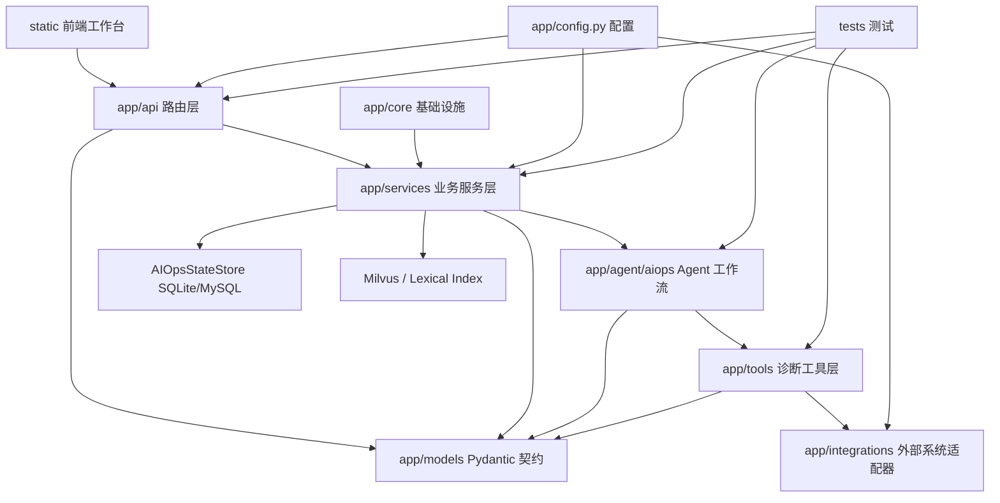
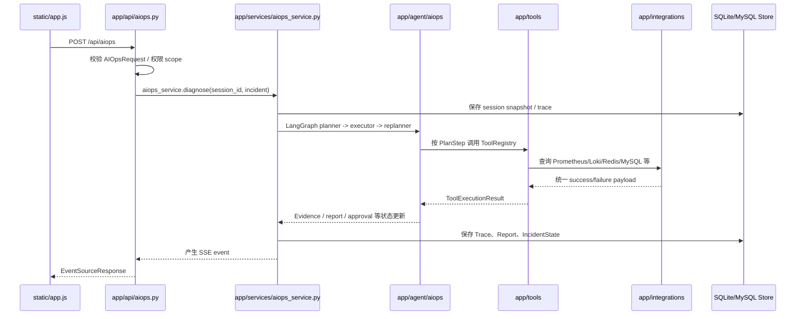

# AutoOnCall 的代码结构与工程分层：FastAPI 项目如何组织复杂业务

AutoOnCall 是一个 Python 3.11 FastAPI 应用，项目定位是把 RAG 问答和 AIOps 智能诊断放在同一个工程里。  
它既支持普通知识库问答，也支持告警接入、故障事件管理、诊断过程追踪、人工审批和安全变更记录。  
从代码结构看，它不是一个只有几个接口的演示项目，而是一个包含 API、模型、服务、Agent、工具、外部适配器、持久化和前端工作台的后端应用。  
本文只讨论代码结构和工程分层，不深入展开 RAG 检索算法、Plan-Execute-Replan 推理细节或具体 AIOps 诊断策略。  
读完本文，你应该能回答三个问题：这个仓库每个目录负责什么，调用方向应该怎么走，新人应该按什么顺序读代码。  
后续如果要深入告警生命周期、AIOps 主链路、审批和变更等主题，可以在本文建立的工程地图上继续往下钻。

## 1. 先从入口看项目骨架

理解 FastAPI 项目，最好的起点是 `app/main.py`。这个文件没有堆业务逻辑，而是承担应用装配职责：

- 创建 `FastAPI` 实例，并把标题、版本和描述绑定到 `app.config.config`。
- 通过 `lifespan` 管理应用启动和关闭阶段。
- 注册跨域中间件 `CORSMiddleware`。
- 挂载各业务路由。
- 挂载 `static/` 静态文件目录。
- 为 `/` 返回前端首页 `static/index.html`，否则返回基础 API 欢迎信息。

`app/main.py` 中最重要的两个函数是：

- `production_exposure_warnings()`：检查服务绑定到 `0.0.0.0`、`::` 等外部地址时，是否仍然开启了不适合生产暴露的演示默认值，例如关闭鉴权、CORS 允许所有来源、AIOps mock fallback 开启。
- `lifespan(app)`：启动时打印应用信息和安全提示，说明 Milvus 会在 RAG 检索或文档索引首次使用时按需连接；关闭时调用 `milvus_manager.close()` 释放 Milvus 连接。

这体现了一个比较健康的入口设计：入口层只做“装配”和“生命周期”，不直接写告警解析、RAG 检索、诊断执行等业务逻辑。

当前项目注册的路由包括：

```python
app.include_router(health.router, tags=["健康检查"])
app.include_router(chat.router, prefix="/api", tags=["对话"])
app.include_router(file.router, prefix="/api", tags=["文件管理"])
app.include_router(aiops.router, prefix="/api", tags=["AIOps智能运维"])
app.include_router(alerts.router, prefix="/api", tags=["AIOps告警接入"])
app.include_router(approvals.router, prefix="/api", tags=["AIOps人工审批"])
app.include_router(incidents.router, prefix="/api", tags=["AIOps故障事件"])
app.include_router(evaluations.router, prefix="/api", tags=["离线评测"])
```

所以，新人看到一个接口时，可以先定位到 `app/api/`，再沿着路由里的服务调用往下追，而不是从入口文件里找业务实现。

## 2. 总体分层图

AutoOnCall 的典型调用方向可以概括为：

```text
API -> Service -> Store / Integration / Agent / Tool -> Model
```

这里的 `Model` 不是最底层数据库模型，而是 Pydantic 契约模型。更准确地说，数据模型被各层共同引用，用来约束输入输出。



这个图里最关键的是依赖方向：

- `app/api/` 可以依赖 `app/models/` 和 `app/services/`。
- `app/services/` 可以依赖 `app/models/`、`app/core/`、`app/integrations/`，也可以编排 `app/agent/aiops/`。
- `app/agent/aiops/` 可以依赖模型、工具注册表、Trace/Approval/Report 等服务，但不应该反过来让 API 层参与内部决策。
- `app/tools/` 通过统一工具接口调用 `app/integrations/` 或本地 mock/fallback。
- `app/integrations/` 面向外部系统，负责 HTTP、Redis、MySQL、Kubernetes 等边界，不应该写业务编排。
- `app/models/` 是稳定数据契约，被多个层引用。

## 3. `app/api/`：请求入口层

API 层应该放什么？答案是：路由、参数校验、权限依赖、响应模型和异常状态码。它不应该承担复杂业务编排。

当前项目中 `app/api/` 实际包含这些路由模块：

- `health.py`：健康检查，提供 `/health`、`/health/live`、`/health/ready`、`/health/ready/rag`、`/health/ready/aiops`。
- `chat.py`：RAG 问答入口，包括 `/api/chat`、`/api/chat_stream`、会话清理和会话历史查询。
- `file.py`：知识文件上传和目录索引入口，包括 `/api/upload`、`/api/index_directory`。
- `aiops.py`：AIOps 诊断、demo incident、诊断运行状态、resume、安全变更相关接口。
- `alerts.py`：Alertmanager webhook 接入、告警列表和告警详情。
- `approvals.py`：人工审批列表和审批决策。
- `incidents.py`：Incident 汇总、详情、Trace、Report 查询。
- `evaluations.py`：离线评测摘要和适配器验收结果读取。
- `sse.py`：SSE 消息包装和终态事件判断的小工具。

以 `app/api/chat.py` 为例，路由函数 `chat()` 接收 `ChatRequest`，调用 `rag_agent_service.query_with_retrieval()`，再包装成前端使用的统一响应。流式接口 `chat_stream()` 则把服务层产生的 chunk 转换成 SSE message。

以 `app/api/aiops.py` 为例，`diagnose_stream()` 接收 `AIOpsRequest`，确定 `session_id`，然后调用 `aiops_service.diagnose()`，把每个诊断事件通过 `EventSourceResponse` 返回。它不会直接调用 Planner、Executor、Replanner，这些是 Agent 和 Service 层的职责。

以 `app/api/alerts.py` 为例，`ingest_alertmanager_webhook()` 只负责接收 payload、调用 `AlertIngestionService.ingest_alertmanager_webhook()`，并在 `auto_diagnose=true` 时把自动诊断任务加入 `BackgroundTasks`。

这说明 API 层的边界比较清楚：接住请求，把请求转给服务，把结果按 HTTP/SSE 协议返回。

## 4. `app/models/`：跨层数据契约

模型层应该放什么？答案是：请求、响应、领域状态、结构化中间结果。它的价值不是“少写 dict”，而是让每层之间有明确契约。

当前项目的 `app/models/` 包含多类 Pydantic 模型：

- 请求与响应：`request.py`、`response.py`、`api_contracts.py`、`aiops.py`。
- 告警与事件：`alert.py`、`incident.py`、`incident_state.py`。
- 诊断过程：`plan.py`、`evidence.py`、`hypothesis.py`、`trace.py`、`report.py`、`aiops_session.py`。
- 审批与变更：`approval.py`、`change_plan.py`、`change_execution.py`。
- 文档与知识库：`document.py`。

几个核心模型很能说明项目的分层方式。

`app/models/incident.py` 中的 `Incident` 是 AIOps 诊断的结构化输入，包含 `incident_id`、`title`、`service_name`、`severity`、`symptom`、`environment`、`raw_alert`、`status` 等字段。API 可以直接接收它，Alertmanager 接入服务也可以从告警构造它。

`app/models/incident_state.py` 中的 `IncidentState` 是持久化的事件生命周期视图，包含最新状态、原因、服务名、Trace ID、Session ID、Report ID、审批状态和 metadata。它不是一次请求的 DTO，而是用于列表页、详情页和恢复流程的“当前状态”。

`app/models/plan.py` 中的 `PlanStep` 是 Agent 计划步骤的机器可消费格式，包含 `tool_name`、`purpose`、`input_args`、`expected_evidence`、`risk_level`、`status` 和 `retry_count`。这让 Planner 生成的计划不只是自然语言，而能被 Executor 稳定执行。

`app/models/evidence.py` 中的 `Evidence` 用来沉淀工具调用产生的证据，字段包括 `source_tool`、`evidence_type`、`data_source`、`stance`、`fact`、`inference`、`uncertainty`、`confidence` 等。它把“工具返回值”提升为可报告、可追踪、可评估的证据对象。

工程上要注意一点：`app/agent/aiops/state.py` 的 `PlanExecuteState` 是 `TypedDict`，不是 Pydantic 模型。代码注释解释了原因：LangGraph checkpoint 和序列化对 Pydantic 对象可能有兼容问题，所以 Agent 状态里会把 `Incident`、`PlanStep` 等转成 JSON-safe dict。这是一个典型的“外部契约用 Pydantic，工作流状态用可序列化结构”的取舍。

## 5. `app/services/`：业务编排层

服务层应该放什么？答案是：业务流程、状态变更、持久化编排、读模型组装、跨模块协调。服务层通常是这个项目最值得读的部分。

当前 `app/services/` 可以分成几组。

第一组是 RAG 相关服务：

- `document_splitter_service.py`：把上传文档切分成可索引 chunk。
- `vector_embedding_service.py`：封装 DashScope embedding。
- `vector_store_manager.py`：管理 LangChain Milvus vector store。
- `vector_index_service.py`：负责文件索引流程，读取文件、切分、写入 Milvus，并同步 lexical index。
- `lexical_index_service.py`：维护词法索引，用于 hybrid search 和 rerank 的辅助信号。
- `rag_retrieval_service.py`：结构化知识检索，返回可信 chunk、拒答原因、引用信息。
- `rag_agent_service.py`：RAG 对话服务，负责 ChatQwen、LangGraph agent、MCP 工具、本地知识工具和流式输出。
- `rag_read_models.py`：把检索 payload 压缩成引用、摘要等前端友好的结构。

第二组是 AIOps 主流程服务：

- `aiops_service.py`：构建 LangGraph 工作流，把 Planner、Executor、Replanner 串起来，并负责 SSE 事件、Trace、Session Snapshot、Report 和 IncidentState 的沉淀。
- `aiops_store.py`：定义 `AIOpsStateStore` 协议和 `create_aiops_store()` 工厂。
- `sqlite_store.py`、`mysql_store.py`：分别实现 SQLite 和 MySQL 持久化。
- `trace_service.py`：记录和查询 TraceEvent。
- `report_generator.py`：从诊断状态生成结构化报告和 Markdown。
- `read_models.py`：组装运行状态、Incident overview、审批摘要、诊断链路等读模型。
- `incident_lifecycle.py`、`incident_state_builder.py`：维护 Incident 生命周期状态和状态合并规则。

第三组是告警、审批和变更：

- `alert_ingestion_service.py`：把 Alertmanager webhook 标准化为 `AlertEvent`，生成 fingerprint，创建或更新 IncidentState。
- `approval_service.py`、`approval_workflow.py`：管理风险动作审批请求、审批决策和审批幂等。
- `change_plan_builder.py`、`change_execution_service.py`、`change_execution_read_models.py`：把审批后的安全变更计划转成可展示、可记录、可恢复的执行状态。

第四组是评测、演示和迁移：

- `demo_incidents.py`：内置 demo incident，供前端和面试演示使用。
- `evaluation_read_models.py`：读取离线评测结果。
- `legacy_migration.py`：兼容旧存储迁移。
- `diagnostic_signal_rules.py`、`service_topology.py`：为证据解释和服务拓扑提供规则支持。

服务层的核心特点是“编排”，而不是直接处理 HTTP 协议。例如 `AIOpsService.execute()` 会创建初始状态，记录 workflow_started Trace，保存 session snapshot，驱动 LangGraph `astream()`，再把 Planner/Executor/Replanner 的输出转换成对外事件。API 层只消费这些事件。

## 6. `app/agent/aiops/`：Agent 工作流层

Agent 层应该放什么？答案是：诊断工作流节点、状态定义、证据分析、风险控制和 fallback 计划。它不应该关心 HTTP 路由细节，也不应该直接拼前端响应。

当前 `app/agent/aiops/` 包含：

- `state.py`：定义 `PlanExecuteState`，以及 `create_initial_aiops_state()`、`normalize_plan_state_update()` 等状态转换函数。
- `planner.py`：Planner 节点，负责根据输入、Incident、Runbook 检索结果和工具描述生成结构化计划。
- `executor.py`：Executor 节点，按 `PlanStep` 调用工具注册表或 fallback 工具，并把结果转成 `Evidence` 和 `ToolCallRecord`。
- `replanner.py`：Replanner 节点，根据证据决定继续补查、重试、请求审批、生成报告或升级人工。
- `evidence_analyzer.py`：分析证据充分性、冲突、假设排序和后续建议。
- `risk_controller.py`：判断工具步骤风险、只读属性、是否需要审批或禁止执行。
- `plan_fallback.py`：当 LLM 或知识库不可用时，根据输入构造可用的保底诊断计划。
- `utils.py`：格式化工具描述等辅助函数。

`app/services/aiops_service.py` 是 Agent 与应用服务层之间的连接点。它用 `StateGraph(PlanExecuteState)` 注册三个节点：

```text
planner -> executor -> replanner
```

`replanner` 后面有条件边：如果已有最终响应或待审批，就结束；如果还有计划，就回到 `executor`；否则结束。

这里要注意边界：本文不展开 Planner 如何设计提示词，也不展开 Executor 如何构造证据报告。对工程分层来说，重要的是 Agent 内部被拆成多个节点，外部只通过 `AIOpsService` 与它交互。

## 7. `app/tools/`：诊断工具层

工具层应该放什么？答案是：Agent 可调用的稳定工具接口、工具契约、工具注册表和具体工具实现。

`app/tools/base.py` 定义了几个关键抽象：

- `ToolContract`：工具的可审计契约，包括名称、描述、输入输出 schema、风险等级、是否只读、超时、重试策略、数据源和降级策略。
- `ToolExecutionResult`：工具统一输出，包括状态、输入参数、输出、延迟、风险等级、只读属性和错误信息。
- `AIOpsTool`：所有 AIOps 工具的基类，统一实现超时控制、结构化错误捕获和 contract 输出。

`app/tools/registry.py` 中的 `create_default_tool_registry()` 注册了默认诊断工具，包括：

- `query_alerts`
- `query_metrics`
- `query_logs`
- `query_traces`
- `query_service_context`
- `query_deploy_history`
- `query_message_queue_status`
- `query_redis_status`
- `query_k8s_status`
- `query_mysql_status`
- `search_runbook`
- `search_history_ticket`
- `suggest_remediation`

这层设计解决了一个很实际的问题：Agent 不能只靠 prompt 里写“可以查日志、查指标”，它需要稳定的工具名、输入参数、风险等级和降级行为。比如 `QueryMetricsTool` 会优先使用 MCP monitor 工具或 Prometheus；如果不可用，会根据 `config.aiops_mock_fallback_enabled` 决定返回 mock 证据还是结构化不可用结果。`QueryLogsTool` 则按 Loki、HTTP log gateway、CLS MCP、mock 的顺序降级。

因此，工具层既是 Agent 的能力边界，也是安全边界。只读工具可以自动执行，中高风险动作需要经过 `risk_controller.py` 和审批流程。

## 8. `app/integrations/`：外部系统适配层

集成层应该放什么？答案是：和外部系统通信的细节，比如 URL、鉴权 header、HTTP 请求、响应解析、错误分类。它不应该知道“诊断报告怎么写”，也不应该知道“前端卡片怎么展示”。

当前项目的 `app/integrations/` 覆盖了多类外部系统：

- `alertmanager.py`：Alertmanager API 适配。
- `prometheus.py`：Prometheus HTTP API 和 PromQL 查询。
- `log_gateway.py`、`loki.py`：日志网关和 Loki 查询。
- `tracing.py`：Jaeger、Tempo 等调用链查询。
- `kubernetes.py`：Kubernetes 状态查询。
- `redis_info.py`：Redis INFO 和 ping。
- `mysql.py`：MySQL 状态和 ping。
- `redpanda.py`：Redpanda / Kafka 状态。
- `service_catalog.py`：CMDB、发布历史等服务上下文。
- `ticketing.py`：工单系统。
- `base.py`：外部适配器公共错误和响应 envelope。

`app/integrations/base.py` 里有几个很有工程价值的函数：

- `require_config()`：外部系统未配置时抛出清晰错误。
- `bearer_headers()`：统一 bearer token header。
- `adapter_success()`：统一成功 payload。
- `adapter_failure()`：统一失败 payload，并通过 `classify_adapter_error()` 标记 timeout、connection_error、permission_denied、not_configured 等类型。
- `adapter_not_configured()`：mock fallback 关闭时，返回稳定的“未配置”失败结果。

这样做的好处是工具层不需要为每个外部系统单独发明错误结构，报告层也可以稳定解释“为什么这个证据缺失”。

## 9. `app/core/`、`app/config.py` 和 `app/utils/`

基础设施层应该放什么？答案是：跨业务模块复用的底层能力。

`app/config.py` 用 `pydantic-settings` 的 `BaseSettings` 定义配置，支持从 `.env` 注入。配置项覆盖：

- 应用基础信息：`app_name`、`app_version`、`host`、`port`。
- 文件上传限制：上传目录、扩展名、最大大小、读取 chunk。
- DashScope / LLM / Embedding。
- Milvus。
- RAG 检索、hybrid search、rerank。
- AIOps 存储、SQLite 路径、mock fallback、服务拓扑。
- CORS、日志保留。
- API token / RBAC。
- Alertmanager、Prometheus、日志、Tracing、Redpanda、CMDB、Kubernetes、Redis、MySQL、工单系统。
- MCP 服务地址。

`app/core/auth.py` 是轻量 RBAC。它定义了 scope，例如 `READ_SCOPE`、`DIAGNOSE_SCOPE`、`KNOWLEDGE_WRITE_SCOPE`、`APPROVE_SCOPE`、`CHANGE_SCOPE`、`EVAL_SCOPE`、`ADMIN_SCOPE`，并通过 `require_scope(scope)` 生成 FastAPI dependency。配置关闭鉴权时会返回 `AuthPrincipal(enabled=False)`；配置开启但 token 缺失时会失败关闭。

`app/core/milvus_client.py` 封装 Milvus 连接、collection 创建、向量维度检查和关闭逻辑。这里有一个重要的安全取舍：当已有 collection 向量维度不匹配时，默认不会自动删除重建，除非显式设置 `MILVUS_RECREATE_ON_DIMENSION_MISMATCH=true`。这避免开发配置误删知识库数据。

`app/utils/logger.py` 用 Loguru 设置日志，包含控制台输出和按天轮转的文件日志。它还处理 Windows 窄编码下中文日志输出可能崩溃的问题。

## 10. `static/`：前端工作台

`static/` 是一个不依赖前端构建工具的静态工作台：

- `static/index.html`：页面结构。
- `static/styles.css`：界面样式。
- `static/app.js`：前端交互、API 请求、SSE 解析和工作台状态。

从 `static/index.html` 可以看到，前端不是单纯聊天框，而是包含故障诊断中心、Incident 列表、Alert 列表、诊断表单、运行历史、计划、步骤、工具调用、依赖信号、证据、Trace、报告、审批、变更、健康检查、工具契约和评测摘要等面板。

`static/app.js` 会调用 `/api/chat`、`/api/chat_stream`、`/api/upload`、`/api/aiops`、`/api/incidents/{incident_id}/trace`、`/api/incidents/{incident_id}/report`、`/api/aiops/tools/contracts` 等接口。这说明前端是后端读模型的消费者，后端需要提供稳定、适合展示的数据结构。

工程上，`app/main.py` 直接挂载 `static/`，适合本地演示和校招项目展示。如果未来进入更严格的生产部署，可以把前端独立构建和部署，但当前实现的好处是启动 FastAPI 后即可打开完整工作台。

## 11. `tests/`：测试如何保护分层

测试层应该放什么？答案是：围绕 API 契约、服务行为、Agent 状态、工具注册、外部适配器边界和前端冒烟做保护。

当前仓库的 `tests/` 已经覆盖了很多核心链路：

- API 层：`test_chat_rag_api.py`、`test_file_api_boundaries.py`、`test_aiops_mainline_api.py`、`test_alerts_api.py`、`test_approval_service.py`、`test_incident_overview_api.py`、`test_health_api.py`。
- 模型与契约：`test_aiops_models.py`、`test_api_contracts.py`、`test_change_execution_models.py`。
- Agent 与证据：`test_aiops_plan_fallback.py`、`test_executor_evidence.py`、`test_evidence_analyzer.py`、`test_replanner_decision.py`、`test_risk_controller.py`。
- 工具与外部适配器：`test_tool_registry.py`、`test_external_adapters.py`、`test_full_stack_adapter_verification.py`。
- 存储与恢复：`test_aiops_session_snapshot_store.py`、`test_sqlite_aiops_recovery.py`、`test_sqlite_retention.py`、`test_legacy_migration.py`。
- RAG：`test_rag_retrieval_service.py`、`test_rag_boundaries.py`、`test_rag_agent_citations.py`、`test_rag_stream_boundaries.py`、`test_lexical_index_service.py`。
- 评测与脚本：`test_eval_cases.py`、`test_rag_eval_cases.py`、`test_operational_scripts.py`。
- 前端冒烟：`test_frontend_playwright_smoke.py`、`test_static_aiops_demo.py`。

`pyproject.toml` 里配置了 pytest 发现规则：测试目录是 `tests`，测试文件匹配 `test_*.py` 或 `*_test.py`，异步测试使用 `pytest-asyncio` 的 `auto` 模式。默认测试命令还开启了 `--cov=app`。

这套测试和分层的关系很直接：API 测试保护 HTTP 契约，服务测试保护业务状态，Agent 测试保护计划和证据行为，工具测试保护工具契约和 fallback，适配器测试保护外部边界。

## 12. `deploy/`、`eval/`、`scripts/`：运行、评测与运维辅助

`deploy/` 应该放部署和环境编排。当前项目里包括：

- `deploy/production.md`：生产部署说明。
- `deploy/sandbox.md`、`deploy/sandbox.env`、`deploy/sandbox-compose.yml`：沙箱环境。
- `deploy/full-stack-compose.yml`：完整 AIOps 证据沙箱。
- `deploy/full-stack/`：Alertmanager、Prometheus、Loki、Tempo、OTel Collector、demo seed SQL 等配置。
- `deploy/sandbox/metrics_exporter.py`、`deploy/sandbox/prometheus.yml`：沙箱指标相关配置。

`eval/` 应该放离线评测用例。当前包含：

- `eval/cases.yaml`：AIOps 诊断评测用例。
- `eval/rag_cases.yaml`：RAG 检索评测用例。
- `eval/change_cases.yaml`：安全变更评测用例。

`scripts/` 应该放运维、评测、迁移和本地演示脚本。当前包含：

- `eval_cases.py`、`eval_rag_cases.py`、`eval_change_cases.py`。
- `cleanup_aiops_store.py`。
- `migrate_aiops_sqlite_to_mysql.py`。
- `verify_full_stack_adapters.py`。
- `simulate_mysql_redis_aiops.py`。
- `hygiene_check.py`。
- `pycharm_one_click_start.py`、`pycharm_one_click_stop.py`。

这些目录不属于在线请求路径，但对项目可演示、可验证、可部署很重要。面试时讲工程化，不能只讲接口，还要讲评测、脚本、部署和健康检查。

## 13. 一条典型调用链怎么走

用 AIOps 诊断接口举例，调用方向大致是：



这条链路体现了分层职责：

- 前端只关心事件和读模型。
- API 只关心协议和权限。
- Service 负责编排状态和持久化。
- Agent 负责诊断工作流。
- Tool 负责稳定工具调用。
- Integration 负责外部系统边界。
- Store 负责运行态持久化。
- Model 在层与层之间定义结构。

## 14. 推荐阅读顺序

如果你是刚开始学习这个项目的新手，建议不要从 Agent prompt 或某个长服务文件直接冲进去。更稳的阅读顺序是：

1. 先读 `README.md` 和 `pyproject.toml`，了解项目定位、依赖和测试配置。
2. 读 `app/main.py`，掌握应用如何启动、注册路由、挂载静态文件和关闭 Milvus。
3. 读 `app/config.py`，知道所有外部依赖、存储、RAG、AIOps、鉴权、mock fallback 都通过配置控制。
4. 读 `app/api/health.py`，理解健康检查如何区分 liveness、readiness、RAG readiness 和 AIOps readiness。
5. 读 `app/api/chat.py`、`app/api/file.py`，建立 RAG 问答和知识上传的入口视角。
6. 读 `app/services/rag_retrieval_service.py`、`app/services/vector_index_service.py`，理解 RAG 服务层怎么组织，但先不要深入每个 rerank 细节。
7. 读 `app/api/aiops.py` 和 `app/models/aiops.py`、`app/models/incident.py`，理解 AIOps 请求入口和核心输入模型。
8. 读 `app/services/aiops_service.py`，掌握它如何连接 API、LangGraph、Trace、Snapshot 和 Report。
9. 读 `app/agent/aiops/state.py`、`planner.py`、`executor.py`、`replanner.py`，了解 Agent 内部节点分工。
10. 读 `app/tools/base.py`、`app/tools/registry.py`，理解工具契约和工具注册。
11. 读 `app/integrations/base.py` 和一两个代表性适配器，例如 `prometheus.py`、`log_gateway.py`、`redis_info.py`。
12. 最后读 `tests/` 中对应测试，用测试反向确认你对行为的理解是否正确。

这个顺序的核心思想是：先入口，后契约；先主链路，后细节；先分层边界，后算法策略。

## 15. 项目中的工程化规范

第一，Pydantic 模型作为接口契约。  
请求模型如 `ChatRequest`、`AIOpsRequest`，领域模型如 `Incident`、`IncidentState`、`PlanStep`、`Evidence`，读模型如 `api_contracts.py`，都让输入输出更明确。这样改接口时可以更容易定位影响面。

第二，类型注解和结构化状态并用。  
项目大量使用 Python 类型注解，例如 `AIOpsStateStore(Protocol)` 定义存储接口，`PlanExecuteState(TypedDict)` 定义 LangGraph 状态。Pydantic 模型负责边界契约，TypedDict 负责工作流内部可序列化状态。

第三，配置集中在 `app/config.py`。  
外部系统地址、token、超时、mock fallback、存储后端、上传限制、RAG 参数都从配置读取。新增环境变量时，应该在配置类中给安全默认值，并同步更新文档。

第四，Store 通过协议隔离后端。  
`AIOpsStateStore` 规定保存 Alert、Trace、Approval、ChangeExecution、SessionSnapshot、IncidentState、Report 等方法，`AIOpsSQLiteStore` 和 `AIOpsMySQLStore` 分别实现。业务服务通过工厂 `create_aiops_store()` 获取 store，而不是直接写死 SQLite。

第五，Mock fallback 是显式配置。  
AIOps 工具会根据 `config.aiops_mock_fallback_enabled` 决定外部系统不可用时是返回 mock 数据，还是返回结构化失败。`app/main.py` 还会在服务绑定外部地址时提醒 mock fallback 的生产风险。

第六，健康检查拆分能力。  
`/health/live` 只验证进程响应，不检查外部依赖；`/health/ready` 检查 Milvus 和外部系统；`/health/ready/rag` 单独判断 RAG 能力；`/health/ready/aiops` 允许在 mock fallback 下把 AIOps 标记为可用或降级可用。这比一个 `/health` 返回笼统 OK 更适合真实部署。

第七，工具契约可审计。  
`ToolContract` 把工具输入、输出、风险等级、只读属性、数据源和降级策略暴露出来，`/api/aiops/tools/contracts` 又能给前端和测试读取。这让 Agent 工具不是黑盒。

第八，测试覆盖跨层边界。  
测试不仅测 happy path，还测文件上传边界、RAG 拒答、工具 fallback、健康检查、审批状态、SQLite 恢复、外部适配器和前端冒烟。这是复杂业务项目能持续演进的重要基础。

## 16. 代码当前实现与可改进方向

代码当前实现：服务层已经承载了大量编排逻辑，尤其是 `aiops_service.py`、`report_generator.py`、`sqlite_store.py` 这类文件较长，但职责仍然围绕工作流编排、报告生成和持久化，没有散到 API 层。

可改进方向：如果后续继续变大，可以把 `app/services/` 进一步按领域拆包，例如 `services/rag/`、`services/aiops/`、`services/approval/`、`services/storage/`。这样能降低单目录文件数量，也更适合多人协作。

代码当前实现：`static/` 是原生 HTML/CSS/JS，和 FastAPI 同仓库同进程托管，适合演示和快速迭代。

可改进方向：如果前端复杂度继续上升，可以独立为前端项目，后端只保留 API 和静态资源发布配置。但在当前阶段，一体化静态工作台对校招项目展示更直接。

代码当前实现：`mcp_servers/` 提供本地 mock MCP 服务，但 `mcp_servers/README.md` 已说明当前主诊断链路以 `app/tools/registry.py` 的 Tool Registry 和真实适配器为准，MCP 服务不是生产主入口。

可改进方向：面试或文档中不要把 MCP mock 服务包装成生产接入能力。更准确的说法是：项目支持本地 MCP fallback，同时真实数据优先走 `app/integrations/` 中的适配器。

## 17. 面试官可能追问与推荐回答

### 追问 1：你们项目怎么分层？

推荐回答：

我们按 FastAPI 项目常见的工程分层来组织。最外层是 `app/api/`，只负责路由、权限、参数校验和响应包装；中间是 `app/services/`，负责编排业务流程、状态变更和持久化；`app/models/` 放 Pydantic 数据契约；AIOps Agent 单独放在 `app/agent/aiops/`，里面是 Planner、Executor、Replanner 和状态定义；`app/tools/` 是 Agent 可调用的工具契约和工具注册表；`app/integrations/` 专门处理 Prometheus、Loki、Redis、MySQL、Kubernetes、Alertmanager 等外部系统；`app/core/` 放鉴权、Milvus 这类基础设施；`static/` 是前端工作台；`tests/`、`deploy/`、`eval/`、`scripts/` 分别负责测试、部署、评测和运维脚本。

### 追问 2：为什么 API 层不直接写业务逻辑？

推荐回答：

因为这个项目的业务链路比较长，比如 AIOps 诊断会涉及 Incident、Session、Trace、Report、Approval、Tool、外部适配器。如果这些逻辑写在路由函数里，接口会很难测试，也很难复用。现在 API 层只接收请求并调用服务层，像 `diagnose_stream()` 只是把 `AIOpsRequest` 转交给 `aiops_service.diagnose()`，这样服务层可以被 API、后台任务和测试共同复用。

### 追问 3：模型层在项目里起什么作用？

推荐回答：

模型层是跨层契约。比如 `Incident` 是诊断输入，`IncidentState` 是故障生命周期当前状态，`PlanStep` 是 Agent 计划步骤，`Evidence` 是工具调用后沉淀的证据。API、Service、Agent、Tool 都可以围绕这些模型协作，避免不同层传不受约束的 dict。对于 LangGraph 内部状态，项目用 `TypedDict` 保证可序列化，再在边界处和 Pydantic 模型互转。

### 追问 4：外部系统接入为什么要单独放 `integrations`？

推荐回答：

因为外部系统是不稳定边界，涉及配置、鉴权、超时、HTTP 状态码、错误分类和响应结构。如果把这些细节散落在工具或服务里，会导致每个工具都自己处理异常。现在 `app/integrations/base.py` 提供统一的 `adapter_success()`、`adapter_failure()`、`adapter_not_configured()`，具体适配器只负责和系统通信，工具层再把适配器结果包装成诊断证据。

### 追问 5：项目怎么保证本地演示和生产行为不混淆？

推荐回答：

项目通过配置显式区分。`AIOPS_MOCK_FALLBACK_ENABLED` 控制外部系统不可用时能不能用 mock fallback；`app/main.py` 在服务绑定到外部地址时会检查鉴权、CORS 和 mock fallback 是否存在生产暴露风险；健康检查也会显示当前是 production 还是 mock-compatible 模式。也就是说 mock 是为了本地演示和降级解释，不会被默默当成真实生产数据。

### 追问 6：新人接手这个项目应该先读哪里？

推荐回答：

我会建议先读 `app/main.py` 看路由和生命周期，再读 `app/config.py` 看配置边界，然后读 `app/api/health.py`、`app/api/chat.py`、`app/api/aiops.py` 建立入口地图。接着读核心模型 `Incident`、`IncidentState`、`PlanStep`、`Evidence`，再看 `aiops_service.py` 如何编排 Agent、Trace、Snapshot 和 Report。最后再深入 `app/agent/aiops/`、`app/tools/registry.py` 和外部适配器。这样不会一开始就被长文件和 Agent 细节淹没。

### 追问 7：这个项目的工程亮点是什么？

推荐回答：

我会重点讲四点。第一，API、Service、Agent、Tool、Integration 分层比较清楚，复杂链路没有堆在路由里。第二，核心状态都建模了，比如 Incident、IncidentState、Evidence、Trace、Approval、Report，不只是文本输出。第三，工具层有可审计契约，能声明风险等级、只读属性和降级策略。第四，测试覆盖从 API 到工具、存储、评测和前端冒烟，能保护复杂业务持续迭代。

## 18. 小结

AutoOnCall 的代码结构可以用一句话概括：FastAPI 负责接入，Service 负责编排，Agent 负责诊断工作流，Tool 负责可审计能力，Integration 负责外部系统边界，Model 负责跨层契约，Store 负责状态沉淀。

对校招项目来说，这种结构比“一个接口里调用大模型直接回答”更有工程含量。它体现了复杂业务系统需要的几个能力：清晰分层、状态建模、外部依赖隔离、可降级、可追踪、可测试、可部署。

后续继续阅读具体链路时，只要记住这个依赖方向：请求先进 API，业务进 Service，诊断进 Agent，工具进 Tool，外部系统进 Integration，结果回到 Store 和读模型，最后再通过 API 或 SSE 返回给前端。
