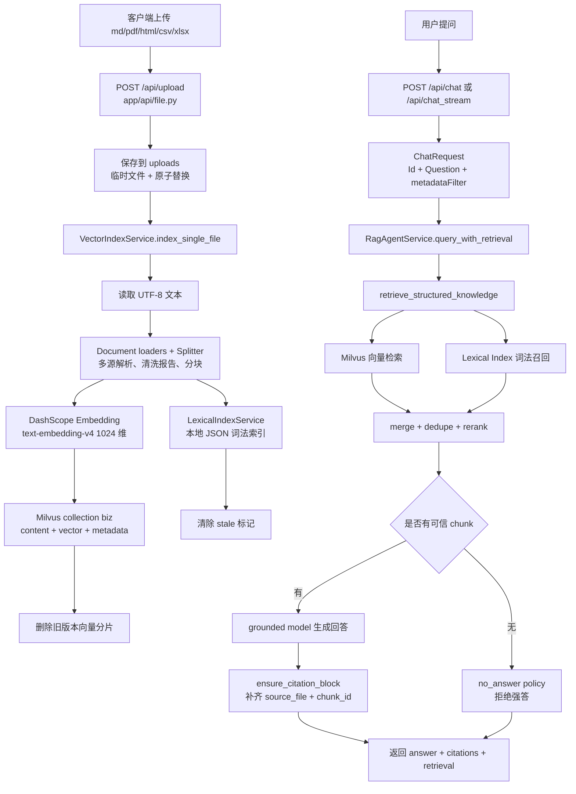

# AutoOnCall 的 RAG 知识库与问答链路：从文档上传到带引用回答

AutoOnCall 是一个 Python 3.11 FastAPI 应用，用于 RAG 问答和 AIOps 智能诊断。
项目不是把 RAG 做成一个孤立的聊天玩具，而是把运维知识库、Runbook、故障处理手册和诊断上下文统一放进一条可检索、可引用、可拒答的链路里。
在这个项目里，RAG 一方面服务 `/api/chat` 和 `/api/chat_stream` 的知识库问答，另一方面也给 AIOps Planner 和 Runbook 工具提供诊断经验。当前面试版已经把 PDF 复盘、HTML Wiki、CSV/XLSX 历史工单纳入 Redis/MySQL RCA 证据闭环：RAG 不再只是“支持很多格式”，而是为 `Evidence Matrix` 的 `knowledge` 和 `history` 层提供可引用依据。
本文只讲 RAG 知识库与聊天问答，不展开 Alertmanager、审批、安全变更和 Agent 内部执行策略。
读完本文后，你应该能讲清楚：文件如何上传，多源文档如何解析和分块，Embedding 如何写入 Milvus，本地 lexical index 如何补充召回，检索如何融合，回答如何带引用，以及没有可信来源时为什么必须拒答。

## 1. 先看 RAG 链路在项目里的位置

这条链路主要分布在下面这些文件：

- `app/api/file.py`：文件上传和批量索引入口，包括 `/api/upload`、`/api/index_directory`。
- `app/api/chat.py`：聊天问答入口，包括 `/api/chat`、`/api/chat_stream`、`/api/chat/session/{session_id}`、`/api/chat/clear`。
- `app/models/request.py`：`ChatRequest`、`ClearRequest`。
- `app/models/response.py`：`ApiResponse`、`SessionInfoResponse` 等 API 返回模型。
- `app/models/document.py`：历史分片模型 `DocumentChunk`，当前索引主链路实际使用 LangChain `Document`。
- `app/services/document_loaders/`：Markdown/文本、PDF、HTML、CSV/XLSX 的 loader，保留 page、heading、sheet、row、primary_key 等引用定位。
- `app/services/document_splitter_service.py`：文档分块和版本元数据生成。
- `app/services/vector_embedding_service.py`：DashScope Embedding 的 LangChain 适配。
- `app/core/milvus_client.py`：Milvus collection 创建、索引、连接和维度保护。
- `app/services/vector_store_manager.py`：LangChain Milvus VectorStore 封装。
- `app/services/lexical_index_service.py`：本地 BM25-like lexical index。
- `app/services/vector_index_service.py`：上传文件到向量库和 lexical index 的索引编排。
- `app/services/rag_retrieval_service.py`：结构化检索、hybrid search、rerank、可信阈值、no-answer policy。
- `app/services/rag_agent_service.py`：带检索上下文的回答生成、SSE 流式回答、引用兜底和会话历史。
- `app/services/rag_read_models.py`：面向前端/API 的 citation 和 retrieval 读模型。
- `app/tools/knowledge_tool.py`、`app/tools/runbook_tool.py`：把同一套 RAG 检索能力暴露给 Agent 和 AIOps Runbook 工具。

整体流程如下：



这张图背后的核心思想是：上传时把文档变成两套索引，问答时先做可信检索，再让模型只基于可信片段回答。模型不是第一步，检索可信性才是第一步。对 AIOps RCA 来说，PDF/HTML/table 的价值不是展示格式数量，而是让报告能引用“复盘文档第几页、Wiki 标题路径、工单表格第几行”作为知识或历史依据。

## 2. 请求入口：上传、聊天、会话管理

### 2.1 文件上传：`POST /api/upload`

文件上传入口在 `app/api/file.py`：

```python
@router.post("/upload", dependencies=[Depends(require_scope(KNOWLEDGE_WRITE_SCOPE))])
async def upload_file(file: UploadFile = File(...)):
    ...
```

`app/main.py` 把 file router 挂到 `/api`，因此完整路径是 `/api/upload`。这个接口做的事情不是简单保存文件，而是“保存文件 + 尝试立即索引”：

1. 校验文件名不能为空。
2. 通过 `_sanitize_filename()` 去掉路径分隔符和危险字符。
3. 校验扩展名，只允许配置中的 `txt,md,markdown,pdf,html,htm,csv,xlsx`。
4. 按 `UPLOAD_READ_CHUNK_SIZE` 分块读取，超过 `UPLOAD_MAX_FILE_SIZE_MB` 就拒绝。
5. 先写临时文件，再用 `temp_path.replace(file_path)` 原子替换目标文件。
6. 调用 `vector_index_service.index_single_file(str(file_path))` 创建向量索引和 lexical index。
7. 根据索引结果返回 200 或 207。

这里有一个很重要的工程取舍：上传成功不等于索引成功。当前代码里，如果文件保存成功但 Milvus 不可用、Embedding 失败或索引阶段异常，接口不会把整个上传回滚，而是返回 HTTP 207：

```json
{
  "code": 207,
  "message": "partial_success",
  "data": {
    "filename": "runbook.md",
    "indexing_ready": false,
    "indexing": {
      "status": "failed",
      "chunk_count": 0,
      "error_message": "milvus unavailable"
    }
  }
}
```

为什么这样设计？因为上传文件本身是一个持久化动作，索引是另一个外部依赖动作。把两者拆开后，前端和运维人员能清楚看到“文件已经落盘，但知识库暂时不可检索”。这比简单返回 500 更利于恢复。

边界情况也在代码里体现得比较清楚：

- 文件名 `.md` 这种没有有效 basename 的输入会被 `_validate_safe_filename()` 拒绝。
- 大文件会在写入过程中被发现，并且不会覆盖已有安全文件。
- 已存在同名文件时会设置 `overwritten=true`。
- 索引结果为 `empty` 时也返回 207，表示文件上传成功但没有可检索分片。

### 2.2 批量索引：`POST /api/index_directory`

`app/api/file.py` 还有一个运维入口：

```python
@router.post("/index_directory", dependencies=[Depends(require_scope(KNOWLEDGE_WRITE_SCOPE))])
async def index_directory(directory_path: str | None = None):
    result = vector_index_service.index_directory(directory_path)
```

它用于批量索引目录，比如 README 中提到的 `make upload` 场景。这个接口不是前端主上传入口，代码注释也写得很明确：它面向批处理和运维流程。

安全边界在 `VectorIndexService._ensure_path_allowed()`：目录和单文件索引都必须位于 `config.index_allowed_roots` 允许的根目录下。默认配置是：

```python
index_allowed_roots: str = "uploads,aiops-docs"
```

这能避免“传一个任意本机路径让服务读取”的问题。RAG 系统很容易因为索引入口过宽而变成文件读取漏洞，这个边界在面试里值得主动讲。

### 2.3 快速问答：`POST /api/chat`

聊天入口在 `app/api/chat.py`：

```python
@router.post("/chat", dependencies=[Depends(require_scope(READ_SCOPE))])
async def chat(request: ChatRequest):
    chat_payload = await rag_agent_service.query_with_retrieval(
        request.question,
        session_id=request.id,
        metadata_filter=request.metadata_filter,
    )
```

完整路径是 `/api/chat`。它的职责非常薄：

- 接收 `ChatRequest`。
- 把 `question`、`session_id`、`metadata_filter` 交给 `RagAgentService`。
- 把服务层返回的 answer、citations、retrieval、noAnswer、answerPolicy 包装成统一 JSON。

返回里最重要的不是只有 `answer`，还有这些字段：

- `citations`：可信来源列表，包含 `source_file`、`chunk_id`、score、preview 等。
- `retrieval`：检索过程摘要，包括候选数、检索模式、过滤条件、拒绝结果。
- `noAnswer`：是否触发拒答。
- `answerPolicy`：当前策略，比如 `answer_with_citations` 或 `refuse_without_trusted_source`。

也就是说，前端不只是拿到模型输出，还能展示“为什么回答、引用了谁、哪些候选被拒绝”。

### 2.4 流式问答：`POST /api/chat_stream`

流式入口同样在 `app/api/chat.py`：

```python
@router.post("/chat_stream", dependencies=[Depends(require_scope(READ_SCOPE))])
async def chat_stream(request: ChatRequest):
    async for chunk in rag_agent_service.query_stream_with_retrieval(...):
        ...
```

它返回 `EventSourceResponse`，事件类型由服务层 chunk 转成 SSE message：

- `search_results`：先把检索结果发给前端。
- `content`：模型生成的文本片段。
- `done`：最终完整 answer、citations、retrieval、no_answer、answer_policy。
- `error`：异常信息。

注意顺序：`query_stream_with_retrieval()` 会先 yield `search_results`，再生成内容。这个细节很实用，因为前端可以先显示“检索到了哪些来源/为什么拒答”，用户不用等模型输出完才知道依据。

### 2.5 会话查询和清空

会话相关接口也在 `app/api/chat.py`：

- `GET /api/chat/session/{session_id}`：调用 `rag_agent_service.get_session_history(session_id)`。
- `POST /api/chat/clear`：调用 `rag_agent_service.clear_session(request.session_id)`。

`RagAgentService` 内部有两种历史来源：

- 早期 Agent 工具链使用 LangGraph `MemorySaver` checkpoint。
- 当前 grounded RAG 主链路会把原始用户问题和最终回答写进 `_grounded_history`。

为什么要特别保存“原始问题”？因为 `query_with_retrieval()` 传给模型的其实是带检索上下文的 grounded prompt。如果把这个内部 prompt 直接暴露到会话历史，用户会看到一大段“请只基于下面的知识库检索结果回答……”。当前代码通过 `_append_grounded_history()` 和 `_replace_latest_human_message()` 保护会话展示，尽量让历史里保留用户真正问的问题。

## 3. 数据模型：`ChatRequest`、响应模型和文档分片

### 3.1 `ChatRequest`

`app/models/request.py` 定义了聊天请求：

```python
class ChatRequest(BaseModel):
    id: str = Field(..., min_length=1, max_length=SESSION_ID_MAX_LENGTH, alias="Id")
    question: str = Field(..., min_length=1, max_length=CHAT_QUESTION_MAX_LENGTH, alias="Question")
    metadata_filter: dict[str, Any] | None = Field(
        default=None,
        validation_alias=AliasChoices("metadataFilter", "MetadataFilter"),
    )
```

几个边界很值得注意：

- `session_id` 最大 128 字符，避免无界字符串进入日志、checkpoint 和路径相关逻辑。
- `question` 最大 8000 字符，避免用户一次塞入过大的 prompt。
- 对外兼容前端字段 `Id`、`Question`、`metadataFilter`，内部统一使用 `id`、`question`、`metadata_filter`。

`metadata_filter` 是 RAG 检索的精确过滤条件。比如只查某个 `_document_version`，或者只查 metadata 中 `service=billing` 的文档。它不是自由 SQL，也不是任意表达式，后面检索层会做 key 过滤和表达式转义。

### 3.2 响应模型

`app/models/response.py` 中定义了：

- `ChatResponse`：包含 `answer` 和 `session_id`，更像早期普通聊天响应模型。
- `SessionInfoResponse`：返回 session_id、message_count、history。
- `ApiResponse`：清空会话等通用接口使用。

代码当前实现里，`/api/chat` 直接返回 dict，没有把 `ChatResponse` 作为 `response_model` 使用，因为现在响应已经扩展出 `citations`、`retrieval`、`noAnswer`、`answerPolicy` 等字段。这里可以理解为：模型文件保留了早期普通聊天结构，而当前主链路已经升级成“带检索证据的读模型”。

可改进方向是新增一个显式的 `RagChatResponse` Pydantic 模型，把现在实际返回的结构固化下来，这样 OpenAPI 文档和测试都会更清晰。

### 3.3 文档分片模型

`app/models/document.py` 里有 `DocumentChunk`，但类注释写得很明确：

```python
class DocumentChunk(BaseModel):
    """Legacy 文档分片模型；当前索引链路使用 LangChain Document。"""
```

当前实际流转的是 `langchain_core.documents.Document`。每个分片的正文放在 `page_content`，元数据放在 `metadata`。核心 metadata 包括：

- `_source`：源文件完整路径。
- `_extension`：扩展名。
- `_file_name`：文件名。
- `_doc_id`：文档 ID，当前等于文件路径。
- `_chunk_id`：稳定可读的分片 ID，如 `redis.md#0001`。
- `_document_version`：源文档内容 hash 的短版本。
- `_document_hash`：源文档完整 SHA-256。
- `_chunk_hash`：分片内容 SHA-256。
- `_version_key`：文件名 + 文档版本。
- Markdown 标题 metadata，如 `h1`、`h2`。

这些字段后面会同时用于 Milvus metadata、lexical index、citation、旧版本删除和面向前端的来源展示。

## 4. 文档解析与分块：从文件内容到 LangChain Document

索引入口在 `app/services/vector_index_service.py` 的 `index_single_file()`：

```python
content = path.read_text(encoding="utf-8")
documents = document_splitter_service.split_document(content, normalized_path)
```

这说明当前实现的“文档解析”是轻量文本解析：只读取 UTF-8 文本内容，然后根据扩展名选择 Markdown 或普通文本分块。它不是 PDF、Word、HTML 或图片 OCR 解析器。

### 4.1 Markdown 分块

`app/services/document_splitter_service.py` 初始化了两个 LangChain splitter：

```python
self.markdown_splitter = MarkdownHeaderTextSplitter(
    headers_to_split_on=[
        ("#", "h1"),
        ("##", "h2"),
    ],
    strip_headers=False,
)
```

Markdown 会先按一级、二级标题拆开，同时保留标题文本。保留标题的价值是：即使某个 chunk 被单独召回，模型也能看到这一段属于哪个标题语义下。

接着会再走 `RecursiveCharacterTextSplitter`：

```python
self.text_splitter = RecursiveCharacterTextSplitter(
    chunk_size=self.chunk_size * 2,
    chunk_overlap=self.chunk_overlap,
    length_function=len,
)
```

配置里 `chunk_max_size=800`、`chunk_overlap=100`，所以实际二阶段文本切分的 chunk size 是 1600。代码注释写明这是为了减少过度碎片化。

最后 `_merge_small_chunks()` 会把小于 300 字符的小片段合并到前一个 chunk，避免知识库里充满只有一个标题或一两句话的低质量分片。

### 4.2 普通文本分块

对 `.txt` 文件，`split_text()` 直接使用 `RecursiveCharacterTextSplitter.create_documents()`。元数据先写 `_source`、`_extension`、`_file_name`、`_doc_id`，再逐个补 `_chunk_id` 和版本 hash。

### 4.3 版本元数据为什么重要

`build_version_metadata()` 会基于整个文档内容和每个 chunk 内容计算 hash：

```python
document_hash = hashlib.sha256(document_content.encode("utf-8")).hexdigest()
chunk_hash = hashlib.sha256(chunk_content.encode("utf-8")).hexdigest()
```

它解决了两个问题。

第一，覆盖同名文件后，可以区分新旧版本。`VectorIndexService.index_single_file()` 在成功写入新分片后会调用：

```python
vector_store_manager.delete_by_source_except_version(normalized_path, document_version)
```

也就是保留当前 `_document_version`，删除同一个 `_source` 下的旧版本。

第二，citation 和排障时更容易追溯。即使文件名一样，`_document_version` 也能告诉你引用来自哪一次内容版本。

### 4.4 代码当前实现与可改进方向

代码当前实现已经从早期 Markdown/纯文本扩展到 PDF、HTML、CSV 和 XLSX。对应 loader 位于 `app/services/document_loaders/`：

- PDF loader 保留 `page_number`，适合引用事故复盘或容量评审文档。
- HTML loader 会清理导航、脚本等噪声，并保留 `heading_path`，适合引用 Wiki 页面中的具体章节。
- CSV/XLSX table loader 会把行转成可引用 knowledge unit，并保留 `sheet_name`、`row_number`、`primary_key`，适合引用历史工单、服务目录或发布记录。
- plain text loader 继续服务 Markdown、Runbook 和普通文本。

面试时仍然不要说“项目支持所有文档格式”。准确说法是：当前实现覆盖了 OnCall 场景最常用的 Runbook、复盘 PDF、内部 Wiki 和表格历史记录，并通过 cleaning report 记录 raw/indexed/dropped/warning，让多源材料能以 citation 的形式进入 RCA。

后续真正值得补的是更稳定的企业数据源同步和质量治理，而不是继续横向堆格式：

- 大文档异步索引任务。
- 文档版本和来源权限审计。
- Word/Confluence/Jira 等真实企业源接入。
- 按表格、代码块、告警规则块做更细的结构化解析。

## 5. Embedding 与 Milvus：向量索引如何落地

### 5.1 DashScope Embedding 是懒加载的

`app/services/vector_embedding_service.py` 里有两个类：

- `DashScopeEmbeddings`：真正调用 OpenAI 兼容接口的 Embedding 实现。
- `LazyDashScopeEmbeddings`：首次 `embed_documents()` 或 `embed_query()` 时才创建真实客户端。

真实 Embedding 默认使用：

```python
dashscope_embedding_model: str = "text-embedding-v4"
dimensions: int = 1024
```

懒加载的价值是：导入模块、启动部分测试、构造 VectorStoreManager 时不需要立即拥有 DashScope API Key。只有真正索引或检索时，才会因为缺少 `DASHSCOPE_API_KEY` 报错。`tests/test_rag_boundaries.py` 专门验证了这一点。

### 5.2 Milvus collection 结构

Milvus 连接和 collection 创建在 `app/core/milvus_client.py`。当前 collection 名是 `biz`，字段包括：

- `id`：VARCHAR 主键，最大 100。
- `vector`：FLOAT_VECTOR，维度 1024。
- `content`：VARCHAR，最大 8000。
- `metadata`：JSON。

向量索引配置是：

```python
{
    "metric_type": "L2",
    "index_type": "IVF_FLAT",
    "params": {"nlist": 128},
}
```

这意味着检索层用的是 L2 距离，距离越小越相似。后面 `rag_max_l2_distance` 默认是 2.0，可信判断会用到这个阈值。

### 5.3 VectorStoreManager 封装了 LangChain Milvus

`app/services/vector_store_manager.py` 用 `langchain_milvus.Milvus` 封装向量库：

```python
self.vector_store = Milvus(
    embedding_function=vector_embedding_service,
    collection_name=self.collection_name,
    auto_id=False,
    drop_old=False,
    text_field="content",
    vector_field="vector",
    primary_field="id",
    metadata_field="metadata",
)
```

`add_documents()` 会给每个 LangChain `Document` 生成 UUID 作为 Milvus 主键，然后调用 `vector_store.add_documents(documents, ids=ids)`。Embedding 会在 LangChain VectorStore 写入过程中自动触发。

这里有两个安全取舍：

第一，`drop_old=False`，不会因为启动或初始化 VectorStore 就删除旧 collection。

第二，如果已有 collection 的 vector 维度和当前 1024 不一致，默认不会自动 drop collection。`MilvusClientManager._handle_vector_dimension_mismatch()` 会在 `milvus_recreate_on_dimension_mismatch=False` 时抛错，提示只有显式设置 `MILVUS_RECREATE_ON_DIMENSION_MISMATCH=true` 才允许重建。这避免了开发时不小心把知识库删掉。

### 5.4 为什么先写新版本，再删旧版本

`VectorIndexService.index_single_file()` 的顺序是：

1. 分块。
2. `vector_store_manager.add_documents(documents)` 写入新分片。
3. `delete_by_source_except_version(normalized_path, document_version)` 删除旧版本。
4. `lexical_index_service.upsert_source(normalized_path, documents)` 更新本地词法索引。

这个顺序的好处是：如果新版本写入失败，旧向量分片还在 Milvus 里，不会因为“先删后写失败”导致知识库直接空掉。但为了避免旧内容在新文件上传失败后继续被信任，异常分支会做 stale 标记，后面会单独讲。

边界情况是：如果新版本写入成功，但删除旧版本失败，代码会记录 warning，短时间内可能存在重复 chunk。检索层后续会 dedupe 和 rerank，但这仍是一个可改进点：生产环境可以增加异步清理任务或后台一致性检查。

## 6. Lexical Index：为什么有向量检索还要词法索引

本地 lexical index 在 `app/services/lexical_index_service.py`，默认文件是：

```python
rag_lexical_index_path: str = "data/rag_lexical_index.json"
```

它不是 Milvus 的替代品，而是一个小型、本地、可持久化的 BM25-like 关键词索引。每个 source 会被转换成 JSON 里的 chunk record：

- `source_path`
- `chunk_id`
- `content`
- `metadata`
- `terms`

`terms` 的提取逻辑很简单但实用：

- 英文、数字、下划线、路径、冒号等 token：适合 `maxclients`、`HighCPUUsage`、`order-service`、`5xx`。
- 中文连续字的 bi-gram 和 tri-gram：适合中文 Runbook 的短词召回。

搜索时用 `bm25_like_score()` 计算分数，按分数倒序返回。

### 6.1 lexical index 解决什么问题

向量检索擅长语义相似，但运维知识库里有很多“精确词”非常重要：

- 告警名：`HighCPUUsage`、`RedisMaxClientsExceeded`。
- 配置项：`maxclients`、`innodb_lock_wait_timeout`。
- 服务名：`order-service`、`payment-api`。
- 错误码和字段名：`OOMKilled`、`CrashLoopBackOff`、`5xx`。
- Markdown 文件名和标题。

这些词如果被 Embedding 模型弱化，向量检索可能把语义相近但关键实体不同的文档排到前面。lexical index 可以把“精确命中关键字”的文档拉回来。

### 6.2 lexical index 如何更新和删除

`upsert_source()` 会替换同一个 source 的所有旧 chunk，然后清除 stale 标记：

```python
payload["chunks"] = [
    chunk for chunk in payload["chunks"] if chunk.get("source_path") != source_path
]
payload["chunks"].extend(chunks)
payload["stale_sources"].pop(source_path, None)
```

`delete_source()` 会删除该 source 的 lexical chunk，并同时移除 stale 标记。

保存文件时使用临时文件 + `os.replace()`，所以 lexical JSON 的更新也是原子的。`tests/test_lexical_index_service.py` 验证了不会留下临时文件。

### 6.3 stale source 标记

lexical index 还承担一个很关键的状态职责：记录陈旧 source。

```python
payload["stale_sources"][source_path] = reason[:500]
```

这不是单纯给 lexical index 用的。`rag_retrieval_service.is_stale_retrieval_source()` 会用 lexical index 判断某个 vector result 的 `_source` 是否 stale。如果 stale，就把这个向量候选从 RAG 检索中排除。

换句话说，lexical index 同时是“词法召回索引”和“source freshness registry”。

## 7. stale index：覆盖上传失败时如何避免用旧知识胡答

stale index 是这条链路里很有面试价值的设计点。

场景是这样的：

1. 用户上传了一个同名 Runbook，比如 `redis.md`。
2. 文件已经成功覆盖到 `uploads/redis.md`。
3. 接下来索引失败，例如 Milvus 不可用或 Embedding 失败。
4. 如果系统继续使用旧的 Milvus 分片回答，就会出现“文件明明换了，回答还引用旧内容”的问题。

当前代码在 `VectorIndexService.index_single_file()` 的异常分支里处理这个问题：

```python
except Exception as e:
    try:
        lexical_index_service.mark_source_stale(normalized_path, str(e))
    ...
    raise RuntimeError(f"索引文件失败: {e}") from e
```

检索时，`retrieve_structured_knowledge()` 会把候选转成 retrieval chunk 后过滤：

```python
candidates = [chunk for chunk in candidates if not is_stale_retrieval_source(chunk)]
```

而 lexical index 的搜索本身也会排除 stale source：

```python
chunks = [
    chunk
    for chunk in payload["chunks"]
    if chunk.get("source_path") not in stale_sources
]
```

所以索引失败后的行为是：

- 上传接口返回 207 `partial_success`。
- 新文件已保存。
- 旧 Milvus 分片可能还物理存在。
- 但该 source 被标记 stale 后，RAG 检索不会信任它。
- 下一次成功 `upsert_source()` 会清除 stale 标记。

这比简单“失败就保留旧索引继续答”更保守，也更符合运维知识库的可信性要求。

空文件或无法分块是另一种情况。当前代码不是标记 stale，而是主动清理旧索引：

```python
vector_deleted = vector_store_manager.delete_by_source(normalized_path)
lexical_deleted = lexical_index_service.delete_source(normalized_path)
```

原因是：空内容不是“索引临时失败”，而是“这个 source 当前没有可检索知识”。继续保留旧知识会误导用户，所以要删除。

## 8. 检索融合：Milvus + lexical + rerank + trust gate

真正的检索入口是 `app/services/rag_retrieval_service.py`：

```python
def retrieve_structured_knowledge(
    query: str,
    *,
    top_k: int | None = None,
    max_distance: float | None = None,
    metadata_filter: dict[str, Any] | None = None,
    hybrid_search_enabled: bool | None = None,
    rerank_enabled: bool | None = None,
    vector_store: Any | None = None,
) -> dict[str, Any]:
```

它返回的是结构化 payload，而不是一串拼好的文本。这个 payload 会包含：

- `status`：`success`、`no_answer` 或 `failed`。
- `retrieval_results`：可信 chunk。
- `rejected_results`：被拒绝的候选 chunk。
- `answer_policy`：回答策略。
- `retrieval_mode`：如 `hybrid_vector_lexical_rerank`。
- `vector_candidate_count`、`lexical_candidate_count`。
- `metadata_filter` 和 `metadata_filter_expr`。
- `content`：给模型看的 grounded context。

### 8.1 metadata_filter 如何进入 Milvus

`ChatRequest.metadata_filter` 会一路传到 `retrieve_structured_knowledge()`。检索层先调用：

```python
expr = build_milvus_metadata_expr(metadata_filter)
```

这个函数只接受安全 key：

```python
METADATA_FILTER_KEY_PATTERN = re.compile(r"^[A-Za-z_][A-Za-z0-9_]*$")
```

非法 key 会被忽略。合法条件会转成 Milvus JSON metadata expression，例如：

```text
metadata["_document_version"] == "v2" and metadata["service"] == "billing"
```

如果 value 是 list，会生成 `in [...]`。字符串值会经过转义，避免把用户输入直接拼成危险表达式。

同一个 filter 还会用于 lexical index 和非 Milvus 测试 store 的二次过滤，保证不同检索后端语义一致。

### 8.2 candidate_k：为什么候选数会放大

配置里：

```python
rag_top_k: int = 3
rag_hybrid_candidate_multiplier: int = 4
```

如果开启 hybrid search 或 rerank，`candidate_k` 会变成 `top_k * multiplier`。默认 top_k=3 时，候选数至少是 12。

原因是 rerank 需要更多候选。如果一开始只取 3 条，后面再融合词法分数也没有空间把真正相关但初始排名靠后的文档提上来。

### 8.3 向量检索和词法检索如何合并

检索流程大致是：

1. 调 Milvus VectorStore 的 `similarity_search_with_score(query, k=candidate_k, expr=expr)`。
2. 如果开启 hybrid search，再调用 `lexical_index_service.search(query, top_k=candidate_k, metadata_filter=...)`。
3. `merge_raw_retrieval_results()` 用 `_doc_id/_source + _chunk_id` 做 identity 合并。
4. 同时保留 `_vector_score`、`_vector_rank`、`_lexical_score`、`_lexical_rank`。
5. `document_to_retrieval_chunk()` 转成统一 chunk payload。
6. 过滤 stale source。
7. 应用 metadata filter。
8. `rerank_retrieval_candidates()` 重新排序。
9. trust gate 决定哪些进入 `retrieval_results`，哪些进入 `rejected_results`。

合并后的 `_retrieval_source` 可能是：

- `vector`：只来自向量检索。
- `lexical`：只来自词法索引。
- `hybrid`：两边都命中。

### 8.4 rerank 如何计算

`rerank_retrieval_candidates()` 里混合了三个信号：

```python
rerank_score = (
    (0.55 * vector_score) + (0.35 * lexical_score) + (0.10 * base_rank_score)
)
```

其中：

- `vector_score` 由 L2 distance 归一化得到，距离越小分数越高。
- `lexical_score` 来自 lexical index 或 query/chunk term overlap。
- `base_rank_score` 保留原始排名的弱信号。

这不是复杂的学习排序模型，但对项目当前阶段很合适：可解释、可测试、无额外服务依赖。每个 chunk 还会带上 `retrieval_signals`，方便调试和前端展示。

### 8.5 trust gate：不是召回到就可信

RAG 最容易出错的地方是“召回到了东西就让模型回答”。AutoOnCall 当前实现多了一层可信判断：

```python
if has_vector_signal and is_trusted_l2_distance(chunk.get("score"), max_distance):
    return True
if retrieval_source in {"lexical", "hybrid"}:
    return _trusted_lexical_score(chunk, min_lexical_score)
```

默认阈值来自配置：

- `rag_max_l2_distance=2.0`
- `rag_min_lexical_trust_score=0.20`

也就是说，一个 chunk 要进入可信结果，必须满足至少一个条件：

- 向量距离存在且小于等于 L2 阈值。
- 词法召回分数大于等于 lexical 阈值。

如果 VectorStore 只返回 unscored docs，没有距离分数，默认不会被信任。`tests/test_rag_retrieval_service.py` 里专门覆盖了这个场景，避免“无分数也当可信”。

### 8.6 no_answer policy

如果 trust gate 后没有可信 chunk，检索服务返回：

```python
{
    "status": "no_answer",
    "no_answer_rejected": True,
    "answer_policy": "refuse_without_trusted_source",
    "retrieval_results": [],
    "rejected_results": rejected,
    "summary": "未找到可信知识来源。",
    "content": "未找到可信知识来源。"
}
```

这就是 no-answer policy 的核心：没有可信知识来源时，系统不让模型凭常识补答案。

`rejected_results` 不会丢掉。它们会带着 `retrieval_reason` 返回，例如：

```text
L2 distance 8.0000 大于 阈值 0.5000
```

这对用户和面试官都很重要：系统不是“没搜到”，而是“搜到了但不够可信，所以拒绝强答”。

## 9. 带引用回答：模型只负责基于可信片段组织语言

`app/services/rag_agent_service.py` 里有两套问答能力：

- `query()`、`query_stream()`：早期通用 Agent，会初始化 LangGraph Agent 和工具。
- `query_with_retrieval()`、`query_stream_with_retrieval()`：当前显式 RAG 主链路，先检索，再 grounded 生成。

聊天 API 走的是后者。

### 9.1 非流式 grounded RAG

`query_with_retrieval()` 的核心逻辑是：

```python
retrieval_payload = retrieve_structured_knowledge(question, metadata_filter=metadata_filter)
retrieval_context = compact_retrieval_payload(retrieval_payload)

if retrieval_payload.get("status") != "success":
    answer = build_no_answer_message(retrieval_payload)
    ...
    return {"no_answer": True, "answer_policy": ...}

grounded_question = build_grounded_question(question, retrieval_payload)
answer = await self.query_grounded(grounded_question, session_id, history_question=question)
citations = build_citations(retrieval_payload)
answer = ensure_citation_block(answer, citations)
```

这里有三个关键点。

第一，检索失败或无可信来源时不会调用大模型生成答案，直接走 `build_no_answer_message()`。这减少了幻觉风险。

第二，成功检索后会构造 grounded prompt：

```text
请只基于下面的知识库检索结果回答用户问题。
不要使用未出现在知识库中的事实；如果知识不足，请明确说明无法回答。
...
回答要求: ... 末尾必须列出引用来源，格式为 source_file + chunk_id。
```

第三，`query_grounded()` 使用的是基础模型调用，不暴露 Agent tools：

```python
messages = [
    SystemMessage(content=build_grounded_system_prompt()),
    HumanMessage(content=grounded_question),
]
result = await model.ainvoke(messages)
```

也就是说，在“已经完成检索”的阶段，模型不能再自由调用其他工具。它的职责只是把可信片段组织成可读答案。

### 9.2 引用兜底：`ensure_citation_block`

即使 prompt 要求模型列引用，也不能完全相信模型会按格式输出。所以代码增加了后处理：

```python
answer = ensure_citation_block(answer, citations)
```

这个函数会检查每个 citation 的 `source_file` 和 `chunk_id` 是否出现在答案中。如果缺失，就在答案末尾追加：

```text
引用来源：
- source_file: redis.md; chunk_id: redis.md#0001; score: 0.1235
```

这解决了一个很实际的问题：模型可能答得对，但漏掉引用。对于 RAG 系统来说，“答对但不可追溯”仍然是不合格的。

### 9.3 流式 grounded RAG

`query_stream_with_retrieval()` 与非流式逻辑一致，但事件顺序更适合前端：

1. 先 yield `search_results`，返回 compact retrieval payload。
2. 如果 no_answer，yield 拒答文本，然后 yield `complete`。
3. 如果 success，调用 `query_grounded_stream()` 流式输出模型内容。
4. 生成结束后用 `ensure_citation_block()` 补齐引用。
5. 如果补齐引用产生了新增文本，用 `citation_guard` 节点再 yield 一个 `content`。
6. 最后 yield `complete`，包含完整 answer、citations、retrieval。

所以流式接口不会为了追求“边生成边答”而牺牲引用完整性。引用兜底仍然发生在最终完成前。

## 10. 返回与沉淀：API 给前端什么，系统记住什么

### 10.1 API 返回的检索读模型

`app/services/rag_read_models.py` 的 `compact_retrieval_payload()` 会把完整 retrieval payload 转成前端安全结构。它保留：

- `status`
- `query`
- `top_k`
- `candidate_k`
- `vector_candidate_count`
- `lexical_candidate_count`
- `max_l2_distance`
- `retrieval_mode`
- `metadata_filter`
- `metadata_filter_expr`
- `summary`
- `answer_policy`
- `no_answer_rejected`
- `retrieval_results`
- `rejected_results`
- `error_message`

但它会通过 `public_source_path()` 隐藏服务器绝对路径，只给前端文件名：

```python
return Path(text).name
```

这很重要。RAG 引用应该告诉用户“引用了哪个知识文件和 chunk”，但不应该泄露 `/srv/autooncall/uploads/...` 这种服务器路径。

### 10.2 会话历史

grounded RAG 回答会调用：

```python
self._append_grounded_history(session_id, question, answer)
```

保存的是：

- 用户原始问题。
- 最终带引用答案。
- timestamp。

它不是长期数据库存储，而是 `RagAgentService` 实例内存里的 `_grounded_history`。重启后这部分会话历史不会保留。

代码当前实现适合 demo 和本地工作台。如果要做生产级聊天历史，需要把 session history 写入数据库，并设计 retention、脱敏和权限。

### 10.3 no_answer 时返回什么

无可信来源时，`build_no_answer_message()` 会返回稳定拒答文案：

- 检索失败：提示知识库检索暂不可用，请检查向量库或检索配置。
- 检索到了候选但不可信：提示补充相关知识库文档，并说明候选片段距离分数超过可信阈值，已拒绝强答。
- 完全没有可信来源：提示补充相关知识库文档后再提问。

API 层会设置：

```json
{
  "noAnswer": true,
  "answerPolicy": "refuse_without_trusted_source",
  "citations": []
}
```

这让前端可以明确区分“模型正常回答”和“系统主动拒答”。

## 11. RAG 与 AIOps Planner/Runbook 的关系

RAG 问答链路不只是给用户聊天用，也被 AIOps 诊断复用。

在 `app/agent/aiops/planner.py` 里，Planner 会先构造 Runbook 检索查询：

```python
retrieval_query = _build_planner_retrieval_query(input_text, incident)
retrieval_payload = retrieve_structured_knowledge(retrieval_query)
```

如果检索成功，Planner 会把检索结果写入 `experience_docs`，并沉淀一条 `Evidence`：

- `source_tool="retrieve_knowledge"`
- `evidence_type="runbook"`
- `data_source="rag"`
- `confidence=0.65`
- `uncertainty="知识库内容可能滞后，不能替代实时指标、日志和依赖状态。"`

这句话非常关键：RAG Runbook 用来约束诊断计划，不直接替代实时取证。

另外，`app/tools/runbook_tool.py` 定义了 AIOps 工具 `SearchRunbookTool`：

```python
name = "search_runbook"
data_sources = ["Milvus knowledge base", "lexical index"]
degradation_strategy = "知识库不可用或可信度不足时拒绝强答，并返回 no_answer/failed 检索结果"
```

它同样调用 `retrieve_structured_knowledge()`，只是面向 AIOps Tool Registry 输出结构化工具结果。

所以 RAG 与 AIOps 的关系可以概括为：

- 对普通用户：RAG 是知识库问答。
- 对 Planner：RAG 是 Runbook 经验上下文。
- 对 Executor/工具层：RAG 是低风险只读工具。
- 对报告：Runbook evidence 可以成为诊断依据之一。
- 对生产事实：RAG 不能替代指标、日志、Trace、K8s、Redis、MySQL 等实时证据。

本文只讲 RAG 链路本身。AIOps Planner 如何使用这些 Runbook 生成计划，会在 Plan-Execute-Replan 文章中展开。

## 12. 关键边界情况

### 12.1 上传失败

上传阶段如果文件名、扩展名、大小不合法，直接返回 400，不会进入索引。大文件写入失败时会清理临时文件，并且不会覆盖已有文件。

索引阶段失败时，上传返回 207，不是 500。文件已经保存，但 `indexing_ready=false`。同时 `VectorIndexService` 会尽量标记 stale source，避免旧索引继续被信任。

### 12.2 空内容

如果文件内容为空或分块结果为空，`index_single_file()` 会删除该 source 的旧向量索引和 lexical index，返回 `status="empty"`。

这是正确的保守行为：用户上传空文件，系统就不应该继续用旧文件内容回答。

### 12.3 metadata_filter

`metadata_filter` 是精确过滤，不是模糊查询。它会被规范化：

- 空 key、空值会被丢弃。
- key 必须匹配 `^[A-Za-z_][A-Za-z0-9_]*$`。
- list 会转成 `in [...]`。
- 字符串值会转义。

过滤会同时作用在 Milvus expr、lexical search 和本地候选二次过滤上。

### 12.4 stale index

stale source 会从 vector 候选和 lexical 候选中排除。它解决的是“新文件覆盖成功但新索引失败，旧知识不能继续被当作可信来源”的问题。

### 12.5 no_answer policy

没有可信 chunk 时，系统拒绝回答。即使有 rejected candidates，也不能让模型“参考一下然后发挥”。当前策略是 `refuse_without_trusted_source`，回答会提示补充可信知识库文档。

### 12.6 引用完整性

模型生成后还会经过 `ensure_citation_block()`。如果答案没有包含 `source_file` 或 `chunk_id`，系统自动追加引用来源。这是带引用回答的最后一道兜底。

## 13. 测试说明：这条链路如何被保护

当前仓库的 RAG 测试覆盖比较完整，可以按链路理解。

### 13.1 API 合同测试

`tests/test_chat_rag_api.py` 覆盖：

- `ChatRequest` 和 `ClearRequest` 会拒绝过长 session id、空问题等无界输入。
- `/api/chat` 返回 answer、citations、retrieval、noAnswer、answerPolicy。
- RAG 服务异常时，接口返回 500，并把 errorMessage 放入 data。
- `/api/chat_stream` 会先发 `search_results`，再发 `content` 和 `done`。
- `metadataFilter` 会传到流式检索服务。

这些测试保护的是“前端/API 合同”，确保 RAG 不会退化成只有纯文本 answer。

### 13.2 文件上传和索引边界

`tests/test_file_api_boundaries.py` 覆盖：

- 上传成功但索引失败时返回 207，并保留上传文件。
- 空索引结果返回 207，`indexing_ready=false`。
- `.markdown` 扩展名可被接受，同名文件覆盖会报告 `overwritten=true`。
- `.md` 这种无有效 basename 的文件名会被拒绝。
- 超大文件不会覆盖已有文件，也不会触发索引。
- 目录和单文件索引必须位于 allowed roots。
- `splitter` 会添加 `_document_version`、`_document_hash`、`_chunk_hash`、`_version_key`。
- Milvus 写入失败时会 mark source stale。
- 空内容会清理旧向量索引和 lexical index。

这些测试保护的是“上传不是任意文件读取，索引失败不会静默污染知识库”。

### 13.3 检索可信度和融合

`tests/test_rag_retrieval_service.py` 覆盖：

- 可信结果会返回 source、score、heading_path、chunk_id 和 retrieval_reason。
- 所有分数超过阈值时返回 `no_answer`。
- stale vector source 会被排除。
- `metadata_filter` 会生成 Milvus expr，并过滤结果。
- 非法 metadata filter key 会被忽略，避免表达式注入。
- hybrid rerank 可以把词法强相关候选提到前面。
- vector 为空时，lexical-only 候选也可以召回。
- lexical-only 候选必须通过 lexical trust threshold。
- 无 score 的向量结果默认不可信。
- `SearchRunbookTool` 会返回结构化检索 payload。

这些测试保护的是“召回、排序、阈值和拒答策略”。

### 13.4 引用与拒答

`tests/test_rag_agent_citations.py` 覆盖：

- `ensure_citation_block()` 会补齐缺失引用。
- no-answer payload 会保留 rejected candidates 给前端展示。
- compact retrieval payload 不泄露服务器绝对路径。
- `query_with_retrieval()` 使用 tool-free grounded model，不初始化 Agent 工具。
- 会话历史里保存原始问题和带引用回答。

这些测试保护的是“回答必须可审计，不可信时必须拒答”。

### 13.5 本地 lexical、Milvus 和懒加载边界

`tests/test_lexical_index_service.py` 覆盖 lexical index 的 upsert、search、metadata filter、delete、stale 排除和原子写。

`tests/test_vector_store_manager.py` 覆盖 Milvus metadata delete expression 的转义。

`tests/test_milvus_client_boundaries.py` 覆盖维度不匹配时默认不 drop collection，只有显式配置才允许重建。

`tests/test_rag_boundaries.py` 覆盖 DashScope Embedding、VectorStore、RAG Agent 的懒加载行为，避免构造对象时就要求外部服务可用。

## 14. 面试官可能追问与推荐回答

### 追问 1：为什么有了向量检索，还要做 lexical index？

推荐回答：

向量检索解决语义相似，lexical index 解决运维场景里的精确词召回。比如 `maxclients`、`CrashLoopBackOff`、`HighCPUUsage`、服务名、错误码，这些词如果只靠 Embedding，可能会被语义相近但实体不同的文档干扰。项目里用 Milvus 做向量召回，用本地 BM25-like lexical index 做关键词召回，再通过 rerank 融合两个信号。这样既能理解语义，也能尊重运维文档里的关键实体。

### 追问 2：如何避免 RAG 胡答？

推荐回答：

项目不是“检索到就回答”，而是先做 trust gate。向量结果必须有 L2 distance 且小于阈值，词法结果必须达到最小 lexical score。没有可信 chunk 时，`retrieve_structured_knowledge()` 返回 `status=no_answer` 和 `answer_policy=refuse_without_trusted_source`，`RagAgentService` 不会调用大模型生成答案，而是直接返回拒答文案。成功检索时，模型也只拿到 grounded context，系统 prompt 明确禁止使用知识库外事实，最后还会补齐引用。

### 追问 3：上传文件成功但索引失败怎么办？

推荐回答：

当前代码把“文件保存”和“知识库索引”拆成两个阶段。文件保存成功但索引失败时，`/api/upload` 返回 207 `partial_success`，响应里 `indexing_ready=false` 和具体错误。服务层会标记该 source 为 stale，后续检索会排除旧向量候选和旧 lexical 候选，避免用户覆盖了新文件但系统继续用旧知识回答。下一次成功索引会清除 stale 标记。

### 追问 4：为什么空文件要删除旧索引，而不是标记 stale？

推荐回答：

索引失败代表“新内容暂时没能写入索引”，所以用 stale 标记保护一致性；空文件代表“当前 source 没有可检索内容”，继续保留旧索引会明显误导用户。因此当前实现会删除该 source 的旧 Milvus 分片和 lexical chunk，并返回 `status=empty`。

### 追问 5：metadata_filter 怎么防止注入？

推荐回答：

`metadata_filter` 不允许用户传任意表达式。检索层会先规范化 key，只接受 `^[A-Za-z_][A-Za-z0-9_]*$`，非法 key 直接忽略。value 会通过 `_quote_expr_value()` 转义后拼成 Milvus JSON metadata expression。list 类型只生成 `in [...]`。同样的 filter 还会在 lexical index 和本地候选上做二次过滤，保证语义一致。

### 追问 6：为什么先写新向量，再删旧版本？

推荐回答：

这是为了避免“先删后写失败”导致知识库直接空掉。当前实现先把新 chunk 写入 Milvus，成功后再按 `_source` 和 `_document_version` 删除旧版本。如果写新版本失败，会标记 stale，检索层不再信任旧内容。如果删除旧版本失败，可能短期存在重复 chunk，但不会丢知识；后续可以用后台清理任务改进。

### 追问 7：引用是怎么保证的？

推荐回答：

分块阶段为每个 chunk 写入 `_file_name` 和 `_chunk_id`。检索阶段把可信 chunk 转成 citation，回答 prompt 要求末尾列出 `source_file + chunk_id`。生成后还有 `ensure_citation_block()` 兜底：如果答案没有包含某个 source_file 或 chunk_id，就自动追加“引用来源”块。API 还会单独返回 `citations` 和 `retrieval`，前端可以独立展示。

### 追问 8：RAG 和 AIOps Planner 是什么关系？

推荐回答：

RAG 是 AIOps 的知识上下文来源之一。Planner 会先调用 `retrieve_structured_knowledge()` 检索内部 Runbook，如果命中，就把结果作为 planning context，并沉淀一条 `evidence_type=runbook` 的证据。但 Runbook 不能替代实时证据，代码里也明确写了 uncertainty：知识库可能滞后，仍需指标、日志、Trace、K8s、Redis、MySQL 等只读工具验证现场状态。

### 追问 9：Milvus collection 维度不匹配会怎样？

推荐回答：

当前项目统一使用 1024 维 Embedding。启动连接 Milvus 时，如果发现已有 collection 的 vector 维度不匹配，默认不会自动 drop collection，而是抛 RuntimeError，提示设置 `MILVUS_RECREATE_ON_DIMENSION_MISMATCH=true` 才允许重建。这是为了防止误删已有知识库数据。测试里也覆盖了默认不删除和显式允许重建两个分支。

### 追问 10：这套 RAG 还有哪些可改进方向？

推荐回答：

当前实现已经有上传、分块、Embedding、Milvus、lexical index、hybrid rerank、引用兜底和拒答策略，但它仍是工程原型。可改进方向包括：支持 PDF/DOCX/HTML 等更多解析器，索引任务异步化，增加后台 stale/duplicate 修复任务，引入更强 reranker，持久化聊天历史，增加文档级权限过滤，以及为 citations 提供可点击的原文片段定位。
