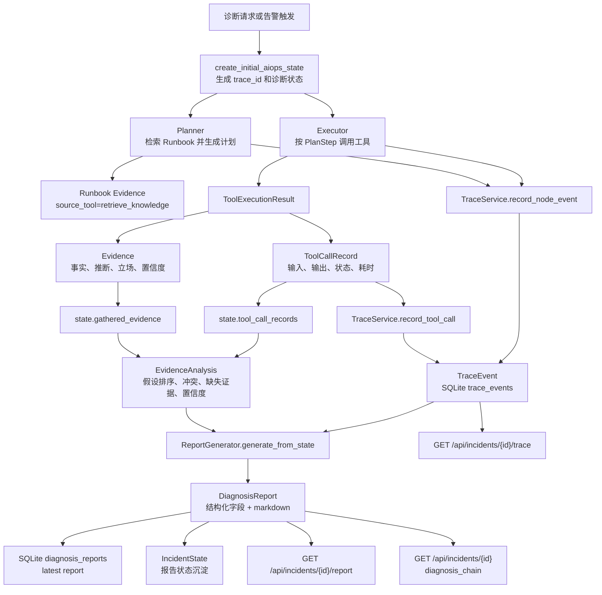

# AutoOnCall 的 Evidence、Trace 与 Report：诊断过程如何沉淀为可审计结果

AutoOnCall 是一个 Python 3.11 FastAPI 应用，用于 RAG 问答和 AIOps 智能诊断。
在这个项目里，RAG 负责把知识库经验引入诊断上下文，AIOps Agent 负责围绕一次故障执行排查计划。
一次诊断不是只返回一段自然语言答案，而是要留下证据、调用轨迹和最终报告。
这三类沉淀分别对应 `Evidence`、`TraceEvent`/`ToolCallRecord` 和 `DiagnosisReport`。
它们让诊断过程可以被前端展示、被接口查询、被测试验证，也能在面试里讲清楚“Agent 为什么得出这个结论”。
本文只展开 Evidence、Trace 和 Report，不深入告警接入、审批变更和 Planner/Executor/Replanner 的完整策略。
如果把 AIOps 诊断理解成一次排障工单，那么 Evidence 是证据材料，Trace 是操作流水，Report 是可交付的复盘结论。

## 1. 为什么不能只返回一个答案

传统聊天机器人常见输出是“一段回答”。这对知识问答还能接受，但对 AIOps 诊断不够。

故障诊断至少要回答四类问题：

1. 结论来自哪些数据源，比如 Prometheus、Loki、Redis、MySQL、Jaeger、Redpanda 或 RAG Runbook。
2. 哪些工具被调用过，输入是什么，输出是什么，耗时多少，是否失败。
3. 证据之间是否互相支持，有没有冲突或缺口。
4. 最终报告的置信度为什么是这个分数，哪些地方仍然需要人工复核。

AutoOnCall 的代码把这些问题拆成三层沉淀：

- `app/models/evidence.py` 的 `Evidence`：记录单条证据的来源、类型、立场、置信度和原始数据。
- `app/models/trace.py` 的 `ToolCallRecord` 和 `TraceEvent`：记录工具调用和工作流节点事件，形成可回放的诊断轨迹。
- `app/models/report.py` 的 `DiagnosisReport`：把证据、轨迹、根因假设、风险、后续建议渲染成结构化报告和 Markdown。

这套设计解决的是可解释性和可审计性问题。面试里不要只说“我们用了 Agent 自动诊断”，更应该说“我们把 Agent 的诊断过程结构化沉淀，所以能解释、能查询、能降级、能复盘”。

## 2. 总体数据流

这个图里最关键的关系是：工具执行结果会同时进入两条线。一条线转成 `Evidence`，用于判断根因；另一条线转成 `ToolCallRecord` 和 `TraceEvent`，用于审计执行过程。最终 `ReportGenerator` 再把状态里的证据、工具调用和 Trace 聚合成报告。

## 3. 请求入口：从诊断状态开始沉淀

Evidence、Trace 和 Report 不是单独的入口功能，而是贯穿 AIOps 诊断链路的横切能力。

状态初始化在 `app/agent/aiops/state.py` 的 `create_initial_aiops_state` 中完成。它会为一次诊断创建这些关键字段：

- `trace_id`：形如 `trace-{uuid}`，用于把同一次诊断里的事件串起来。
- `tool_call_records`：保存工具调用审计记录。
- `gathered_evidence`：保存结构化证据。
- `evidence_analysis`：保存 Replanner 对证据充分性、冲突和置信度的判断。
- `report`、`final_diagnosis`、`remediation_suggestion`：保存最终报告和诊断输出。
- `errors`、`warnings`：保存降级和异常信息。

这一步的设计取舍是：不让证据和报告散落在各个节点的局部变量里，而是放进同一个 LangGraph 状态对象。这样 Planner、Executor、Replanner 和 ReportGenerator 都能围绕同一份状态增量更新。

边界情况是持久化恢复。项目里还有 `AIOpsSessionSnapshot` 和 SQLite 存储，诊断中断后可以从 snapshot 或 report fallback 恢复。本文不展开恢复主链路，只需要知道 Evidence、Trace 和 Report 都是恢复和展示时的重要数据来源。

## 4. Evidence：把“工具返回”变成“诊断证据”

`app/models/evidence.py` 定义了 `Evidence`：

- `source_tool`：产生证据的工具名，如 `query_metrics`、`query_logs`、`query_redis_status`、`query_traces`。
- `step_id`：对应计划步骤，便于把证据和执行计划关联起来。
- `summary`：面向人阅读的证据摘要。
- `evidence_type`：证据类型，包括 `metric`、`log`、`runbook`、`k8s`、`redis`、`mysql`、`trace`、`message_queue`、`risk`、`unknown` 等。
- `data_source`：真实来源，包括 `prometheus`、`loki`、`redis_info`、`mysql`、`jaeger`、`tempo`、`redpanda`、`mock`、`not_configured`、`failed`、`rag`、`unknown` 等。
- `stance`：证据立场，取值为 `supporting`、`refuting`、`neutral`、`unknown`。
- `confidence` 和 `confidence_reason`：单条证据的置信度与原因。
- `fact`、`inference`、`uncertainty`、`next_step`：把事实、推断、不确定性和后续动作拆开。
- `raw_data`：保留工具结果的结构化原始数据。
- `related_hypothesis`：关联当前步骤期望验证的假设。

证据不是手工拼出来的。`app/agent/aiops/executor.py` 的 `_tool_result_to_evidence` 会把 `ToolExecutionResult` 转成 `Evidence`：

1. 先用 `infer_evidence_stance` 判断它支持、反驳还是中性。
2. 再用 `normalize_data_source` 归一化来源。
3. 然后用 `_evidence_confidence` 按来源和状态打分。
4. 最后补充 `fact`、`inference`、`uncertainty`、`next_step`。

这里有一个很好的工程取舍：置信度不是只看工具是否成功。`_evidence_confidence` 对真实生产数据源给较高分，例如 Prometheus、Loki、Redis、Kubernetes、MySQL、Jaeger、Tempo、Redpanda 返回成功时通常是 `0.82`；MCP 或 RAG 类证据会更保守；Mock 是 `0.5`；失败或未配置会降到 `0.1` 或 `0.05`。如果执行路径是 `manual_analysis` 或 `llm_toolnode_fallback`，还会进一步封顶到 `0.35` 或更低。

这避免了一个常见问题：Agent 只要拿到一段“看起来合理”的文本就自信地下结论。AutoOnCall 会把“真实观测数据”和“兜底生成内容”区分开。

## 5. Evidence 的立场和来源如何推断

证据分类规则集中在 `app/services/diagnostic_signal_rules.py`。

`infer_evidence_type` 根据工具名推断类型：

- 名字里有 `metric` 是指标证据。
- 名字里有 `log` 是日志证据。
- 名字里有 `redis` 是 Redis 证据。
- 名字里有 `mysql` 或 `sql` 是 MySQL 证据。
- 名字里有 `trace` 或 `span` 是调用链证据。
- 名字里有 `queue`、`kafka`、`redpanda` 是消息队列证据。

`infer_evidence_stance` 再根据类型和输出内容判断立场。例如：

- 指标超过阈值、P95 或 5xx 异常，通常是 `supporting`。
- 日志出现 `error`、`timeout`、`exception`，通常是 `supporting`；如果明确“未发现异常”，则可能是 `refuting`。
- Redis 的 `connected_clients / maxclients` 接近上限是 `supporting`；状态正常可能是 `refuting`。
- 消息队列 ready 且 lag 为 0 会反驳积压假设；consumer lag 或 under replicated partition 则支持积压假设。
- 工具失败或未知工具会被标为 `unknown`。

为什么要区分 `stance`？因为真实诊断不是所有证据都支持同一个结论。有些证据会推翻当前假设，例如日志指向 Redis timeout，但 Redis 状态正常。这种情况不能强行给出高置信根因，而应该进入“低置信、待确认、需要补证”的报告路径。

## 6. TraceEvent 和 ToolCallRecord：诊断过程的流水账

`app/models/trace.py` 里有两个模型。

`ToolCallRecord` 是一次工具调用的审计对象，字段包括：

- `call_id`、`trace_id`、`incident_id`、`step_id`
- `tool_name`
- `input_args` 和 `input_summary`
- `output` 和 `output_summary`
- `data_source`
- `latency_ms`
- `status`
- `risk_level`
- `read_only`
- `error_message`
- `created_at`

它关注的是“工具调用本身”。例如某一步调用了 `query_redis_status`，输入是 `service_name=order-service`，输出摘要是 `connected_clients=9940/10000`，耗时 18.5ms，状态成功，来源是 `redis_info`。

`TraceEvent` 是更通用的事件模型，字段包括：

- `event_id`、`trace_id`、`incident_id`
- `event_type`，例如 `node`、`tool_call`、`risk_decision`、`approval_request`、`report_generated`
- `node_name`，例如 `planner`、`executor`、`risk_controller`、`report_generator`
- `step_id`
- `input_summary`、`output_summary`
- `tool_name`、`tool_args`、`tool_result`
- `latency_ms`
- `status`
- `error_message`
- `metadata`
- `created_at`

二者的关系是：`ToolCallRecord` 更像工具调用原始审计单，`TraceEvent` 是统一事件流。`app/services/trace_service.py` 的 `record_tool_call` 会把 `ToolCallRecord` 转换成 `event_type="tool_call"` 的 `TraceEvent`，再写入 SQLite。

`TraceService` 还提供了几个专门入口：

- `record_node_event`：记录 Planner、Executor、Replanner 等节点更新。
- `record_tool_call`：记录工具调用。
- `record_risk_decision`：记录风险控制决策。
- `record_approval_event`：记录审批请求和审批结果。
- `record_change_event`：记录安全变更阶段。
- `list_events`：按 `incident_id`、`trace_id`、`event_type` 查询事件。

本文重点是 Trace 本身，所以审批和变更只作为事件类型背景出现，不展开业务细节。

## 7. Trace 的安全边界：脱敏、截断和持久化

Trace 的价值是可审计，但审计日志也可能泄露敏感信息。`TraceService.create_event` 在写入前会做几件事：

- 对 `input_summary`、`output_summary`、`error_message` 执行 `_redact_sensitive_text`。
- 对 `tool_args`、`tool_result`、`metadata` 执行递归脱敏。
- 识别 `password`、`passwd`、`pwd`、`token`、`secret`、`api_key`、`authorization`、`cookie`、`credential`、`bearer` 等敏感键。
- 识别 `Bearer xxx` 和 `password=xxx` 这类文本模式。
- 对摘要文本用 `_truncate` 限制到 1000 字符。
- 对列表类结果用 `_compact_value` 截断到最多 20 项。

测试 `tests/test_trace_service.py` 覆盖了这些边界：敏感输入参数会变成 `[REDACTED]`，敏感输出和摘要也会被脱敏，重新加载 SQLite 后仍然保持脱敏结果。

这体现了一个很重要的工程原则：可审计不等于把所有原始内容无脑落盘。审计数据要足够解释诊断过程，同时不能成为新的安全风险。

## 8. EvidenceAnalysis：置信度和冲突的中间层

`app/agent/aiops/evidence_analyzer.py` 定义 `EvidenceAnalysis`，它是 Replanner 生成报告前的结构化判断：

- `decision`：下一步决策，如 `continue_investigation`、`add_steps`、`retry_failed_tool`、`generate_report`、`escalate_to_human`。
- `reason`：决策原因。
- `hypotheses`：根因假设列表。
- `hypothesis_ranking`：带置信度的根因假设排序。
- `conflicts`：证据冲突。
- `evidence_sufficient`：证据是否充足。
- `missing_evidence`：缺失哪些关键证据。
- `recommended_steps`：需要追加的只读证据采集步骤。
- `retry_steps`：失败工具的重试步骤。
- `evidence_profile`：证据质量画像。
- `confidence_reasons`：置信度原因。
- `confidence`：综合置信度。

`analyze_evidence` 会读取 `state.gathered_evidence`、`state.tool_call_records`、`current_plan`、`plan` 和 incident 上下文。它不是让大模型自由判断，而是用规则把证据质量和场景信号整理成稳定结果。

几个关键逻辑很适合面试展开：

- Redis 场景：如果形成 “Redis maxclients” 根因，且有 Redis 证据，并且指标或日志至少有一类旁证，可以生成报告，基础置信度接近 `0.86`。
- 消息队列场景：Redpanda/Kafka 积压证据加指标或日志旁证，可以生成报告，基础置信度接近 `0.82`。
- 泛化场景：至少三类成功工具证据并形成假设，可以生成报告，基础置信度约 `0.72`。
- 只有初步假设但关键证据不足时，置信度约 `0.55`，可能追加步骤或生成低置信报告。
- 没有足够证据且没有安全可追加步骤时，会升级人工。

它还会根据来源质量做封顶：

- `fallback_only`：关键诊断证据都来自 Mock、未配置、失败、规则、人工或未知来源，置信度封顶 `0.50`，并且不把证据标为充足。
- `mixed_with_fallback`：真实来源和 fallback 混合，置信度封顶 `0.72`。

这就是 AutoOnCall 的“低置信也能报告，但必须明确低置信原因”的设计。

## 9. 证据冲突如何处理

`_detect_conflicts` 目前内置了几类常见冲突：

- 指标异常，但日志未发现对应 `ERROR` 或 `timeout`。
- 日志指向 Redis timeout，但 Redis `connected_clients/maxclients` 状态正常。
- K8s OOM 与 MySQL 慢查询同时出现，需要人工确认主次根因。

一旦发现冲突且已有根因假设，`analyze_evidence` 会返回 `decision="generate_report"`，但 `evidence_sufficient=False`，原因会写成“检测到证据冲突，生成待确认报告”。同时置信度会被扣减，`confidence_reasons` 会加入“证据冲突降低置信度”。

这样做的好处是：系统不会因为冲突就什么都不输出，也不会把冲突掩盖掉。它会生成一份可复核报告，把冲突列入 `uncertainties`，提醒人继续确认。

这也是 AIOps 项目和普通问答项目的区别。真实生产现场经常出现多源数据不一致，系统要能表达“我知道哪里不确定”。

## 10. DiagnosisReport：从诊断状态到结构化报告

`app/models/report.py` 的 `DiagnosisReport` 是最终沉淀对象。它不只是 Markdown，而是结构化字段加 Markdown 渲染。

核心字段包括：

- 基本信息：`report_id`、`incident_id`、`trace_id`、`title`、`service_name`、`severity`、`environment`、`status`。
- 结论信息：`summary`、`root_cause`、`hypotheses`、`hypothesis_ranking`、`selected_root_cause_id`。
- 证据信息：`evidence`、`key_findings`、`confirmed_facts`、`inferred_conclusions`、`dependency_signals`。
- 执行信息：`tool_calls`、`timeline`、`trace_summary`。
- 风险与后续：`risk_summary`、`manual_action_required`、`approval_status`、`approval_decision`、`change_plan`、`change_executions`。
- 质量信息：`errors`、`warnings`、`evidence_profile`、`confidence_reason`、`uncertainties`、`confidence`。
- 展示信息：`markdown`。

`app/services/report_generator.py` 的 `ReportGenerator.generate_from_state` 是报告生成主函数。它会从 state 中取出 incident、trace_id、evidence、tool_call_records、hypotheses、risk_assessment、pending_approval、evidence_analysis、errors 和 warnings，然后：

1. 加载 Trace 事件，除非调用方显式传入 `trace_events`。
2. 构建根因假设排序和选中的根因。
3. 生成 summary、root_cause、key_findings、confirmed_facts、inferred_conclusions、next_steps。
4. 从 Trace 事件构造 timeline 和 trace_summary。
5. 从 Evidence 和 ToolCallRecord 构造 dependency_signals，特别是 tracing 和消息队列证据。
6. 根据 `evidence_analysis`、错误、来源质量计算报告置信度。
7. 渲染 Markdown。
8. 保存报告，并同步保存由报告构建出的 IncidentState。
9. 在已有 Trace 流时追加 `report_generated` 事件。

这里的设计很稳：结构化字段服务 API 和前端，Markdown 服务人类阅读和复盘。两者来自同一个 `DiagnosisReport`，避免“页面展示”和“机器数据”不一致。

## 11. 报告置信度如何计算

报告置信度在 `report_generator.py` 的 `_calculate_confidence` 中计算。

大致规则是：

- 如果没有证据，基础分是 `0.25`。
- 如果有证据，会优先排除 `runbook` 和 `risk` 这类非实时诊断证据，用剩余证据的 `confidence` 求平均。
- 如果 `evidence_analysis.confidence` 或假设排序第一名的置信度更高，会取更高者。
- 如果有错误且没有 analysis 置信度，会扣分。
- 如果有失败证据，但成功诊断证据足够多，会保证基础置信度至少 `0.55`，避免一个失败工具把整份报告打到不可读。
- 如果来源质量是 `fallback_only`，最终封顶 `0.5`。
- 如果来源质量是 `mixed_with_fallback`，最终封顶 `0.72`。

`confidence_reason` 则由 `_build_confidence_reason` 生成：优先使用 `evidence_analysis.confidence_reasons`，否则退回单条 Evidence 的 `confidence_reason`，如果有 errors 再追加错误降级原因。

这套逻辑的边界很清晰：

- Runbook 命中能帮助制定计划，但不能单独证明生产现场状态。
- Mock 和 LLM 兜底能让本地演示跑通，但不能给出高置信生产结论。
- 工具失败本身也是审计事实，需要进入报告，而不是被吞掉。
- 冲突和缺失证据必须进入 `uncertainties`。

## 12. 报告如何面对证据不足、fallback 和 unknown source

代码里对低质量证据的处理比较克制：

- `not_configured`：说明真实适配器未配置且 Mock 回退关闭，不能生成真实系统证据。
- `mock`：说明该证据只适合本地演示，不代表真实生产状态。
- `manual_analysis`、`rule_based`、`llm_toolnode_fallback`：说明来自规则、人工或 LLM 兜底，需要真实工具复核。
- `unknown`：说明来源未知，需要可信生产数据源复核。
- `failed`：说明工具调用失败，记录错误原因和重试建议。

这些信息会进入 Evidence 的 `uncertainty`、`next_step`，也会进入 `EvidenceAnalysis.evidence_profile`、`confidence_reasons`，最终出现在 `DiagnosisReport.uncertainties` 和 Markdown 的“证据质量”“不确定性”“置信度原因”里。

所以 AutoOnCall 的报告不是“永远正确”，而是会说清楚“哪里可靠，哪里只是参考，哪里需要补查”。

## 13. 返回与查询：报告不只存在于一次 SSE 里

诊断结束后，Report 和 Trace 会通过 incident 维度查询。

`app/api/incidents.py` 提供了三个相关接口：

- `GET /api/incidents/{incident_id}/trace`：返回该 incident 的 Trace 事件，可用 `event_type` 过滤。
- `GET /api/incidents/{incident_id}/report`：返回最新结构化报告，`format=markdown` 时只返回 Markdown。
- `GET /api/incidents/{incident_id}`：通过 `build_incident_overview` 聚合 report、trace、approval 和 IncidentState，返回 incident 总览。

`app/services/read_models.py` 还会构造 `diagnosis_chain`：

- `plan`：从 planner trace 或 report timeline 提取计划步骤。
- `steps`：从 TraceEvent 提取执行时间线。
- `tool_calls`：来自 report 的工具调用摘要。
- `dependency_signals`：从 trace/message_queue 证据和工具调用中提取依赖信号卡片。
- `evidence`、`confirmed_facts`、`inferred_conclusions`、`hypothesis_ranking`、`uncertainties`、`next_steps`、`confidence`、`confidence_reason`。

这说明沉淀机制不是“为了写日志而写日志”，而是直接服务产品查询和 UI 展示。

## 14. 外部依赖与存储实现

外部依赖层面，Evidence 的来源覆盖多类系统：

- 指标：Prometheus。
- 日志：Loki 或日志网关。
- 服务状态：Kubernetes。
- 依赖状态：Redis、MySQL、Redpanda/Kafka。
- 调用链：Jaeger 或 Tempo。
- 知识库：RAG Runbook。
- 兜底路径：Mock、规则、人工分析、LLM ToolNode fallback。

存储层面，`TraceService` 和 `ReportGenerator` 都通过 `app/services/aiops_store.py` 的 store 接口创建底层存储，当前实现会落到 SQLite。`app/services/sqlite_store.py` 中有 `trace_events`、`diagnosis_reports` 等表，并为 `incident_id`、`trace_id`、`event_type` 建索引，支持按事件和诊断流查询。

代码当前实现：Evidence 本身没有独立的 evidence 表。它主要存在于运行 state、session snapshot 和 `DiagnosisReport.evidence` 中。对当前项目来说这样足够，因为 Evidence 是诊断状态和报告的一部分。

可改进方向：如果未来要做跨 incident 的证据检索、证据复用、证据级审计留存，可以把 Evidence 独立持久化，并建立 `incident_id + trace_id + step_id + source_tool` 索引。

## 15. 测试覆盖：哪些边界被保护了

这条链路的测试不是只测“能不能生成报告”，而是覆盖了很多可审计边界。

`tests/test_evidence_analyzer.py` 重点保护证据分析：

- Redis `maxclients` 证据加指标或日志旁证时，可以生成高置信报告。
- unknown source 成功证据会被封顶，`source_quality` 变成 `fallback_only`。
- Redpanda/Kafka lag 中混入 Mock 证据时，置信度封顶到 `0.72`。
- 消息队列正常状态会反驳 lag 假设。
- 证据不足且没有剩余计划时，会推荐补充 `query_metrics`、`query_redis_status` 等只读步骤。
- 工具失败会重试一次，重试也失败后降级生成不完整诊断。
- Redis 日志异常但 Redis 状态正常时，会检测冲突并降低置信度。
- 未归类和失败证据会使用 `unknown` 立场。

`tests/test_trace_service.py` 重点保护 Trace：

- Trace 事件能写入、按 incident 或 event_type 查询，并能重新加载。
- 工具输入里的 authorization、password 等敏感字段会被脱敏。
- 工具输出、摘要和错误信息中的 token、Bearer、cookie、api_key 也会被脱敏。
- incident trace API 能返回指定 incident 的事件列表。

`tests/test_report_generator.py` 重点保护报告：

- Report 能从 Redis Evidence 生成、持久化、重新加载。
- Markdown 包含关键证据、已确认事实、推断结论、根因假设矩阵、证据质量、运行告警、下一步建议。
- 生成报告后会追加 `report_generated` TraceEvent。
- Runbook 证据会渲染成引用信息。
- Jaeger/Tempo 和 Redpanda/Kafka 会进入 `dependency_signals` 和 Markdown。
- 等待审批时会标记 `manual_action_required`，并展示人工边界和变更计划草案。

`tests/test_aiops_trace_events.py` 则验证 Executor 会写工具调用 Trace、风险和审批 Trace，SSE payload 能挂上 trace event，审批恢复时也会沉淀恢复事件和报告状态。

这些测试说明项目对“可解释、可审计、可恢复”的关注不是文档口号，而是写进了行为断言。

## 16. 面试时怎么讲这个设计

可以这样组织回答：

第一，AutoOnCall 没有让 Agent 只输出一段结论，而是把诊断拆成 Evidence、Trace 和 Report 三类沉淀。Evidence 解释结论来自哪些证据，Trace 解释过程做过哪些动作，Report 把证据和过程整理成结构化复盘。

第二，Evidence 里不仅有 summary，还有来源、类型、立场、置信度、事实、推断、不确定性和 raw_data。这样报告可以区分真实生产数据、Mock 回退、工具失败和未知来源，不会把所有文本都当成同等可信。

第三，TraceEvent 和 ToolCallRecord 解决审计问题。每次工具调用都会记录输入摘要、输出摘要、状态、耗时、错误和数据源，写入 SQLite，并且写入前做脱敏和截断。

第四，EvidenceAnalysis 负责在报告前做质量判断。它会检测证据是否充分、是否冲突、是否缺失关键工具、是否需要重试或追加步骤，并把来源质量用于置信度封顶。

第五，DiagnosisReport 是最终产物，它同时提供结构化字段和 Markdown。结构化字段给 API 和前端用，Markdown 给人复盘和面试展示用。

这个回答的亮点是把 Agent 从“会调用工具”提升到“诊断过程可审计”。这比单纯说用了 LangGraph 或 RAG 更有工程含量。

## 17. 面试官可能追问与推荐回答

### 追问 1：Evidence 和 ToolCallRecord 有什么区别？

推荐回答：

`ToolCallRecord` 记录的是工具调用事实，比如调用了哪个工具、输入是什么、输出是什么、耗时多少、状态是否成功。`Evidence` 记录的是这次调用对诊断有没有价值，比如它属于指标、日志还是 Redis 证据，它支持还是反驳当前假设，置信度是多少，哪里不确定。简单说，ToolCallRecord 是操作审计，Evidence 是诊断语义。

### 追问 2：为什么还需要 TraceEvent，ToolCallRecord 不够吗？

推荐回答：

不够。ToolCallRecord 只能覆盖工具调用，但一次 Agent 工作流还有 Planner 节点、Executor 节点、风险决策、审批请求、报告生成等事件。TraceEvent 是统一事件流，能把节点事件、工具调用和后续生命周期事件放在同一个 trace_id 下，方便按 incident 回放完整过程。

### 追问 3：报告置信度是大模型给的吗？

推荐回答：

当前代码不是让大模型直接给最终置信度，而是基于结构化规则计算。单条 Evidence 会按工具状态和数据源打分，EvidenceAnalysis 会结合证据充分性、冲突、失败工具和来源质量给出综合置信度，ReportGenerator 再结合 evidence 平均分、analysis 置信度、假设排序和来源质量封顶得到报告置信度。这样比纯 LLM 自评分更稳定，也更容易测试。

### 追问 4：如果证据冲突，系统会怎么办？

推荐回答：

系统不会强行选择一个高置信结论。`evidence_analyzer.py` 会检测常见冲突，例如指标异常但日志没有异常、日志指向 Redis timeout 但 Redis 状态正常、K8s OOM 和 MySQL 慢查询同时出现。发现冲突后可以生成待确认报告，但 `evidence_sufficient` 会是 false，置信度会下降，冲突会进入 `uncertainties` 和 `confidence_reasons`，提醒人工复核或补充证据。

### 追问 5：Mock 或 fallback 证据为什么要降权？

推荐回答：

AIOps 面向生产诊断，Mock、规则兜底、人工分析或 LLM fallback 只能保证流程可用，不能证明生产现场真实状态。代码里会把 `fallback_only` 证据封顶到 0.50，把真实来源和 fallback 混合的场景封顶到 0.72，并在报告里说明原因。这样本地演示不会被误当成生产结论。

### 追问 6：Trace 里会不会泄露密钥？

推荐回答：

代码里专门做了脱敏。`TraceService.create_event` 会对输入摘要、输出摘要、错误信息、工具参数、工具结果和 metadata 做递归脱敏，识别 password、token、secret、api_key、authorization、cookie、Bearer 等敏感内容。测试也验证了写入和重新加载后敏感字段仍然是 `[REDACTED]`。

### 追问 7：为什么 DiagnosisReport 既有结构化字段又有 markdown？

推荐回答：

结构化字段方便 API、前端和后续自动化读取，例如 evidence、tool_calls、hypothesis_ranking、trace_summary、confidence。Markdown 方便人类阅读和复盘。两者由同一个 `DiagnosisReport` 生成，避免展示层和数据层不一致。

### 追问 8：这套设计还能怎么改进？

推荐回答：

当前 Evidence 主要随 state、snapshot 和 report 持久化，还没有独立 evidence 表。未来如果要做跨 incident 的证据检索、证据复用或证据级审计，可以把 Evidence 独立落表，并按 incident_id、trace_id、step_id、source_tool 建索引。另外，证据冲突检测目前是规则化的常见场景，可以继续扩展成更通用的证据矩阵和因果图。

