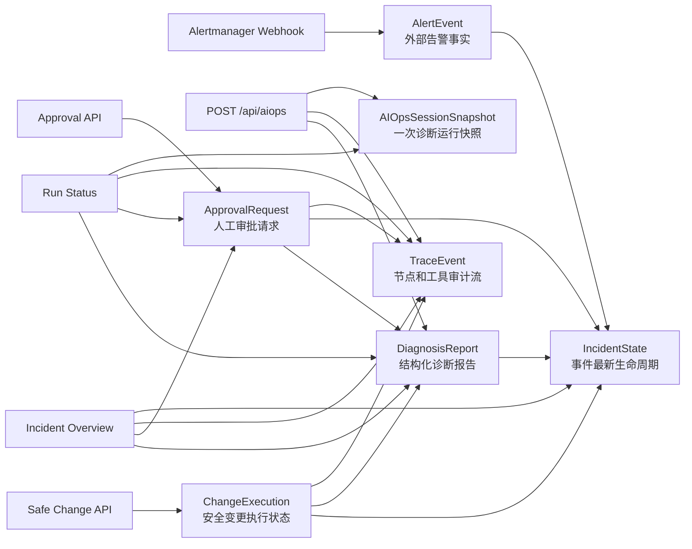
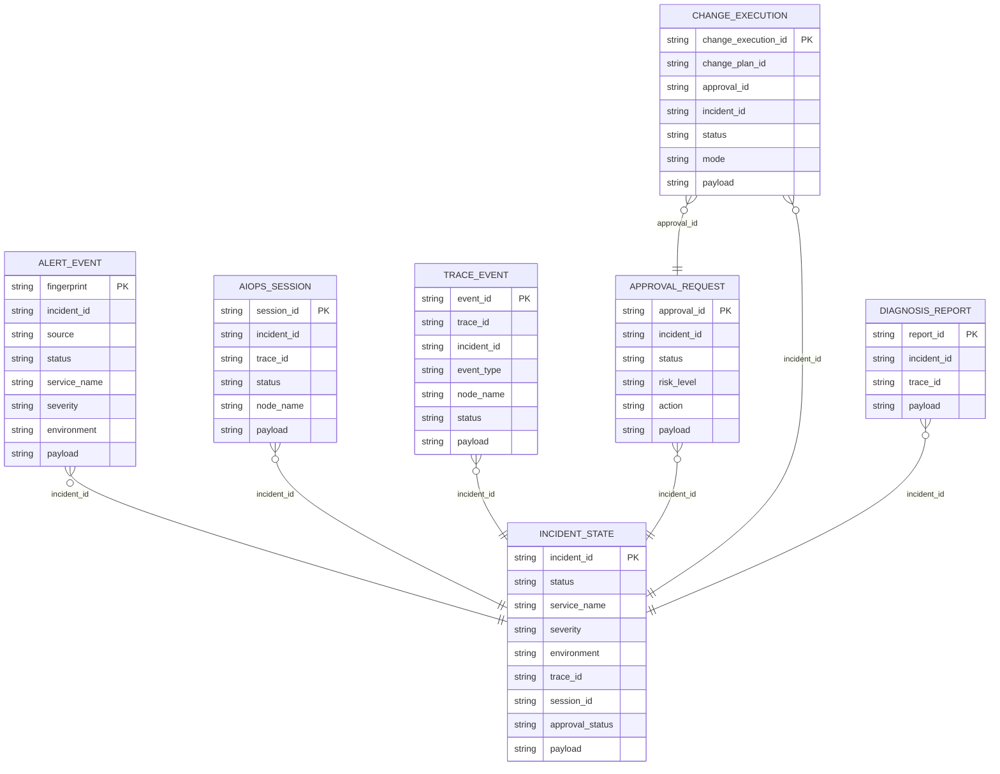

# AutoOnCall 的存储与状态模型设计：IncidentState、Approval、Trace、Report 如何持久化

AutoOnCall 是一个 Python 3.11 FastAPI 应用，既支持 RAG 问答，也支持 AIOps 智能诊断。
在 AIOps 场景里，系统不只是给出一段大模型回答，还要接入 Alertmanager 告警、执行 Plan-Execute-Replan 诊断、沉淀证据、等待人工审批，并在审批后进入安全变更流程。
这意味着“状态”本身就是核心业务资产：它决定列表页看到什么、详情页怎么复盘、服务重启后能不能恢复，以及审计时能不能解释每一步。
本篇只讲存储与状态模型，不展开外部 Prometheus、日志网关、Kubernetes、Redis、MySQL 适配器的内部实现。
读完本文后，你应该能讲清楚：为什么项目要把状态拆成 IncidentState、AlertEvent、ApprovalRequest、ChangeExecution、TraceEvent、DiagnosisReport、SessionSnapshot，SQLite/MySQL store 如何抽象，以及读模型如何把这些表重新组织成 API 返回。

## 1. 为什么不能只把状态放内存

如果 AutoOnCall 只是一个命令行 demo，把所有变量放在进程内存里也许够用。但当前项目有几个明显的工程约束：

1. AIOps 诊断是流式过程。`app/services/aiops_service.py` 中 `AIOpsService.execute()` 会经过 planner、executor、replanner 多个节点，每个节点都可能产生 SSE 事件、Trace、Snapshot 和 Report。
2. 审批会中断自动流程。风险动作会创建 `ApprovalRequest`，系统可能隔几分钟甚至几小时后才收到人工批准或拒绝。
3. 安全变更有多阶段状态。`ChangeExecution` 会经历 pre-check、dry-run、manual_record、sandbox、observation、rollback_recommended 等阶段。
4. 前端需要历史列表和详情页。`GET /api/aiops/runs`、`GET /api/aiops/runs/{session_id}`、`GET /api/incidents`、`GET /api/incidents/{incident_id}` 都依赖持久化状态。
5. 服务重启不能丢上下文。`tests/test_sqlite_aiops_recovery.py` 专门验证了 Trace、Approval、Report 在重新实例化服务后仍可读回。

所以本项目没有把诊断过程当成一次性请求处理，而是把运行态拆成多类可恢复、可查询、可审计的状态对象。

## 2. 请求入口到状态沉淀的主链路

围绕存储主题，可以把入口分成写入入口和读取入口。

写入入口主要有四类：

- `POST /api/alerts/alertmanager`：在 `app/api/alerts.py` 中接收 Alertmanager webhook，经 `app/services/alert_ingestion_service.py` 标准化为 `AlertEvent`，并创建或更新 `IncidentState`。
- `POST /api/aiops`：在 `app/api/aiops.py` 中启动 AIOps 诊断，`AIOpsService` 持续保存 `TraceEvent`、`AIOpsSessionSnapshot`、`DiagnosisReport` 和 `IncidentState`。
- 审批 API：`app/api/approvals.py` 调用 `app/services/approval_service.py` 保存 `ApprovalRequest`，并同步 Trace、Report 和 IncidentState。
- 安全变更 API：`/api/incidents/{incident_id}/changes/{change_plan_id}/resume` 和 `/api/changes/{change_execution_id}/manual-result` 调用 `app/services/change_execution_service.py` 保存 `ChangeExecution`，并同步 Trace、Report 和 IncidentState。

读取入口主要有两类：

- 运行视角：`GET /api/aiops/runs` 和 `GET /api/aiops/runs/{session_id}` 使用 `app/services/read_models.py` 中的 `build_aiops_run_summary()`、`build_aiops_run_status()`。
- 事件视角：`GET /api/incidents`、`GET /api/incidents/{incident_id}`、`GET /api/incidents/{incident_id}/trace`、`GET /api/incidents/{incident_id}/report` 使用 `build_incident_overview()` 聚合多类状态。

这条链路的关键不是“存一份 JSON”，而是把不同生命周期的事实分开保存，再在读模型里按用户需要重新组装。



## 3. 核心状态模型

### 3.1 IncidentState：一个 incident 的最新生命周期

`app/models/incident_state.py` 中的 `IncidentState` 是事件级 latest 状态。它的主键语义是 `incident_id`，不是 `session_id`。

核心字段包括：

- `incident_id`：事件身份。
- `status`、`status_reason`：当前生命周期和原因。
- `title`、`service_name`、`severity`、`environment`：列表和详情页需要的身份字段。
- `summary`、`root_cause`：从告警、报告或诊断状态中提炼出的说明。
- `trace_id`、`session_id`、`report_id`：把事件连接回 Trace、诊断运行和报告。
- `approval_status`、`latest_approval_id`、`manual_action_required`：表达是否还需要人工动作。
- `metadata`：保存来源、风险等级、变更执行 ID、告警 fingerprint 等扩展信息。

`IncidentState` 的职责是回答“这个故障现在处于什么阶段”。它不是完整历史，所以它会被反复 upsert；完整过程由 Trace、Report、Approval、ChangeExecution 保存。

### 3.2 AlertEvent：外部告警事实

`app/models/alert.py` 中的 `AlertEvent` 是 Alertmanager webhook 标准化后的持久对象。

它关注的是外部监控系统告诉我们的事实：

- `source`、`fingerprint`、`incident_id`。
- `status`，例如 firing 或 resolved。
- `alertname`、`service_name`、`severity`、`environment`。
- `labels`、`annotations`、`starts_at`、`ends_at`、`generator_url`。
- `raw_payload`。

它和 `IncidentState` 的边界很重要。`AlertEvent` 代表“外部告警现在是什么状态”，`IncidentState` 代表“内部处置生命周期现在到哪一步”。如果把两者混在一起，resolved webhook 可能会错误覆盖正在等待审批或正在 dry-run 的内部状态。

### 3.3 ApprovalRequest：风险动作的人工审批状态

`app/models/approval.py` 中的 `ApprovalRequest` 记录高风险动作是否已被人工批准。

核心字段包括：

- `approval_id`：审批主键。
- `incident_id`：关联事件。
- `action`、`risk_level`、`reason`：审批对象和风险解释。
- `status`：`pending`、`approved`、`rejected`、`cancelled`。
- `step_id`、`tool_name`：关联诊断计划中的风险步骤。
- `change_plan`：审批通过后可进入安全变更流程的计划。
- `requested_by`、`decided_by`、`decision_reason`、`created_at`、`decided_at`。

`ApprovalService.create_request()` 保存审批请求后，会调用 `build_incident_state_from_approval()` 把 IncidentState 更新为 `waiting_approval`；`decide_request()` 只允许 pending 状态被决定，并把 IncidentState 更新为 `approval_approved` 或 `approval_rejected`。

### 3.4 ChangeExecution：审批后的安全变更执行状态

`app/models/change_execution.py` 中的 `ChangeExecution` 表达审批通过后的安全变更流程，不是直接生产执行记录。

它的核心字段包括：

- `change_execution_id`：执行记录主键。
- `change_plan_id`、`approval_id`、`incident_id`。
- `trace_id`、`mode`、`status`。
- `pre_check`、`dry_run`、`execution_steps`、`observation`。
- `rollback_result`、`manual_result`。
- `created_by`、`created_at`、`updated_at`。

当前状态集合包括 `precheck_running`、`dry_run_completed`、`waiting_manual_execution`、`sandbox_validated`、`rollback_recommended`、`closed` 等。`app/services/incident_lifecycle.py` 中的 `status_from_change_execution()` 会把这些执行状态映射成 IncidentState 的生命周期，例如 `dry_run_completed -> change_validated`，`closed -> resolved`。

### 3.5 TraceEvent：过程审计流

`app/models/trace.py` 中的 `TraceEvent` 记录诊断节点、工具调用、风险决策、审批和变更事件。

核心字段包括：

- `event_id`：事件 ID。
- `trace_id`、`incident_id`。
- `event_type`：如 `node`、`tool_call`、`risk_decision`、`approval_request`、`change_dry_run`。
- `node_name`、`step_id`、`tool_name`。
- `input_summary`、`output_summary`、`tool_args`、`tool_result`。
- `latency_ms`、`status`、`error_message`、`metadata`、`created_at`。

`app/services/trace_service.py` 负责写 Trace。它会做敏感信息脱敏、摘要截断和工具结果压缩，然后调用 store 的 `save_trace_event()`。因为每个新事件默认生成新的 `event_id`，所以 Trace 在业务上是 append 流；如果重复写同一个 `event_id`，store 会做 upsert。

### 3.6 DiagnosisReport：结构化诊断报告

`app/models/report.py` 中的 `DiagnosisReport` 是面向复盘和展示的结构化报告。

它不仅有 `summary`、`root_cause`、`markdown`，还包含：

- `hypotheses`、`hypothesis_ranking`、`selected_root_cause_id`。
- `evidence`、`key_findings`、`confirmed_facts`、`inferred_conclusions`。
- `tool_calls`、`dependency_signals`、`timeline`。
- `risk_summary`、`approval_status`、`approval_decision`、`change_plan`、`change_executions`。
- `manual_action_required`、`errors`、`warnings`、`confidence`。

`app/services/report_generator.py` 中 `ReportGenerator.save_report()` 保存报告后，会同步保存由报告构建出的 IncidentState。这让报告和事件最新态保持一致。

### 3.7 AIOpsSessionSnapshot：一次诊断运行的可恢复快照

`app/models/aiops_session.py` 中的 `AIOpsSessionSnapshot` 是按 `session_id` 保存的一次诊断运行快照。

它保存的不是报告，而是 LangGraph 状态的可恢复形态：

- `session_id`、`incident_id`、`trace_id`、`status`、`node_name`。
- `input`、`incident`。
- `plan`、`current_plan`、`past_steps`。
- `tool_call_records`、`gathered_evidence`、`hypotheses`、`evidence_analysis`。
- `risk_assessment`、`pending_approval`、`change_plan`。
- `final_diagnosis`、`remediation_suggestion`、`report`、`final_report_id`。
- `errors`、`warnings`、`created_at`、`updated_at`。

`AIOpsSessionSnapshot.from_state()` 把运行时 state 转成 JSON-safe 的 Pydantic 模型；`to_state()` 再把它恢复成类似 LangGraph state 的 dict。代码当前实现没有单独的 `aiops_session_snapshot_store.py`，而是把 snapshot 的持久化方法放在 `AIOpsStateStore` 协议以及 SQLite/MySQL store 中。

## 4. AIOpsStateStore：统一 SQLite 和 MySQL 的 Repository 协议

`app/services/aiops_store.py` 定义了 `AIOpsStateStore(Protocol)`。它是一组存储能力约定，业务服务只依赖协议，不关心底层是 SQLite 还是 MySQL。

协议覆盖七类对象：

- Alert：`save_alert_event()`、`get_alert_event()`、`list_alert_events()`。
- Trace：`save_trace_event()`、`list_trace_events()`。
- Approval：`save_approval_request()`、`save_approval_decision_if_pending()`、`get_approval_request()`、`list_approval_requests()`。
- ChangeExecution：`save_change_execution()`、`create_change_execution_once()`、`get_change_execution()`、`list_change_executions()`。
- SessionSnapshot：`save_aiops_session_snapshot()`、`get_aiops_session_snapshot()`、`get_latest_aiops_session_snapshot()`、`list_aiops_session_snapshots()`。
- IncidentState：`save_incident_state()`、`get_incident_state()`、`list_incident_states()`。
- Report：`save_report()`、`get_latest_report()`、`list_latest_reports()`。

`create_aiops_store()` 是工厂函数。代码当前实现是：

- 显式传入 `storage_path` 时，总是创建 `AIOpsSQLiteStore`，这方便测试和本地工具使用临时数据库。
- 未传路径时，根据 `config.aiops_storage_backend` 选择 `sqlite` 或 `mysql`。
- SQLite 默认路径来自 `config.aiops_sqlite_path`，当前默认值是 `data/aiops_state.db`。
- MySQL 使用 `config.resolved_mysql_dsn`，可来自 `MYSQL_DSN`、`MYSQL_URL` 或拆分的 host/user/password/database 配置。

这种设计让服务层可以写：

```python
self.state_store = create_aiops_store()
```

而不是在业务代码里到处判断 SQLite/MySQL。

## 5. SQLite 和 MySQL 的表设计

`app/services/sqlite_store.py` 和 `app/services/mysql_store.py` 的表结构基本保持一致：每张表都有若干可查询列，以及一个完整的 `payload` JSON。

实体关系可以概括如下：



SQLite 初始化时会创建这些表：

- `alert_events`
- `trace_events`
- `approval_requests`
- `change_executions`
- `aiops_sessions`
- `incident_states`
- `diagnosis_reports`

并为常用查询建立索引，例如：

- `idx_trace_events_incident`、`idx_trace_events_trace`
- `idx_approval_requests_incident`、`idx_approval_requests_status`
- `idx_aiops_sessions_incident`、`idx_aiops_sessions_status`
- `idx_incident_states_status`、`idx_incident_states_service`
- `idx_diagnosis_reports_incident`

MySQL 版本使用 `BIGINT AUTO_INCREMENT` 作为内部自增 ID，同时给业务主键加 `UNIQUE`，例如 `fingerprint`、`event_id`、`approval_id`、`change_execution_id`、`session_id`、`incident_id`、`report_id`。

这种“索引列 + payload”的设计有两个好处：

1. 查询可以走结构化列，不需要每次扫描 JSON。
2. 模型字段演进时，完整 Pydantic payload 仍然保留，不必为每个字段都立即改表。

边界是：如果某个字段成为高频筛选条件，就应该提升成显式列和索引，而不是长期藏在 payload 里。

## 6. 幂等写入和 latest 状态

### 6.1 AlertEvent：fingerprint upsert

`save_alert_event()` 使用 `fingerprint` 作为主键。SQLite 用 `ON CONFLICT(fingerprint) DO UPDATE`，MySQL 用 `ON DUPLICATE KEY UPDATE`。

这解决 Alertmanager 重复发送 webhook 的问题：同一个告警不会生成多条 AlertEvent，而是更新最新 status、updated_at 和 payload。

### 6.2 IncidentState：incident_id upsert + 生命周期合并

`save_incident_state()` 先查已有状态，再调用 `app/services/incident_lifecycle.py` 中的 `merge_incident_state()` 合并。

它不是简单覆盖，重点规则包括：

- 保留第一次创建时间 `created_at`。
- 新状态字段为空或默认值时，保留旧的 title、service、severity、environment、trace_id、session_id。
- metadata 做合并。
- 如果已有状态属于安全变更生命周期，而新状态只是报告态，比如 `completed`、`waiting_approval`、`approval_resumed`，则保留已有变更状态。

这个规则解决了一个很真实的问题：安全变更已经进入 `change_dry_run` 或 `waiting_manual_execution` 时，旧报告重新保存不应该把 incident 拉回 `completed`。

### 6.3 ApprovalRequest：只允许 pending 被决定

`ApprovalService.decide_request()` 会先读审批，如果不是 `pending` 就抛 `ApprovalStateError`。

存储层还有一层保护：`save_approval_decision_if_pending()` 的 SQL 条件是 `WHERE approval_id = ? AND status = 'pending'`。如果两个请求并发决定同一个审批，只有第一个能成功更新。

### 6.4 ChangeExecution：同一审批和变更计划只能创建一次

`ChangeExecutionService.start_after_approval()` 会先通过 `_find_existing_execution()` 查找同一 `incident_id + change_plan_id + approval_id` 是否已有执行记录。

创建新记录时，`change_execution_id` 由 approval_id 和 change_plan_id 稳定派生，随后调用 store 的 `create_change_execution_once()`。SQLite 使用 `ON CONFLICT(change_execution_id) DO NOTHING`，MySQL 使用 `INSERT IGNORE`。

代码当前实现依赖稳定 `change_execution_id` 和服务层查重保证幂等。可改进方向是再给数据库增加 `(incident_id, change_plan_id, approval_id)` 复合唯一索引，让并发场景的约束更直接。

### 6.5 TraceEvent：业务上 append，技术上 event_id upsert

Trace 是过程流。每次 `trace_service.create_event()` 默认生成新的 `event_id`，所以正常情况下是追加事件。

但存储层仍对 `event_id` 做 upsert，这样在需要修正同一个事件 payload 或处理重试时不会插入重复主键。

### 6.6 DiagnosisReport：按 report_id 保存，按 incident_id 取最新

`save_report()` 以 `report_id` upsert。读取时：

- `get_latest_report(incident_id)` 按 `created_at DESC, rowid/id DESC LIMIT 1` 取最新。
- `list_latest_reports()` 每个 incident 返回最新一份报告。

这说明 Report 是历史化对象，但 API 默认展示 latest report。

### 6.7 AIOpsSessionSnapshot：按 session_id 保存最新运行快照

`save_aiops_session_snapshot()` 以 `session_id` upsert。如果已有 snapshot，会保留旧 `created_at`，更新 `updated_at` 和 payload。

`get_latest_aiops_session_snapshot(incident_id)` 则按 `updated_at` 找某个 incident 最新的运行快照，审批恢复时会用到。

## 7. 读模型：从多张表组合用户视图

项目没有让 API 直接返回数据库表，而是在 `app/services/read_models.py` 中构建读模型。

### 7.1 运行列表：build_aiops_run_summary

`GET /api/aiops/runs` 会读取 `AIOpsSessionSnapshot` 列表，再为每个 snapshot 加载对应的 Approval 和 Report。

`build_aiops_run_summary()` 输出紧凑历史项，包括：

- `session_id`、`incident_id`、`trace_id`
- `status` 和 `status_metadata`
- 标题、服务、级别、环境、摘要
- `approval_status`、`has_pending_approval`
- `plan_step_count`、`completed_step_count`
- `evidence_count`、`tool_call_count`
- `has_report`、`report_id`
- API links

这个读模型服务于历史列表，不返回完整证据和全量报告。

### 7.2 运行详情：build_aiops_run_status

`GET /api/aiops/runs/{session_id}` 先按 session_id 获取 snapshot，再加载 Trace、Approval、Report。

`build_aiops_run_status()` 会返回一次诊断运行的完整状态：

- 当前节点 `node_name`
- plan、current_plan、past_steps
- tool_call_records、gathered_evidence
- risk_assessment、pending_approval、change_plan
- final_diagnosis、remediation_suggestion
- report、trace_summary、approval_summary

它的状态计算用 `effective_run_status()`。如果存在 pending approval，状态优先显示 `waiting_approval`；如果审批已通过，则允许 report 中的 post-approval 变更状态覆盖运行状态，例如 `waiting_manual_execution`、`sandbox_executing`、`escalated`。

### 7.3 Incident Overview：build_incident_overview

`GET /api/incidents/{incident_id}` 是事件视角。`app/api/incidents.py` 会分别读取：

- latest report
- trace events
- approval requests
- incident state

然后调用 `build_incident_overview()`。

这里有一个关键优先级：如果存在 `IncidentState`，overview 的 `status` 优先使用它。`tests/test_incident_overview_api.py` 中 `test_incident_overview_prefers_durable_lifecycle_state` 验证了当 report 是 `approval_approved`，但 durable lifecycle state 是 `change_dry_run` 时，overview 必须显示 `change_dry_run`。

这符合业务语义：Report 可能是某个时点的报告，IncidentState 才是 incident 当前最新生命周期。

## 8. 持久化恢复：checkpoint、snapshot、report fallback

`AIOpsService` 里同时存在两类状态：

- LangGraph 的内存 checkpoint：`MemorySaver`
- 项目自己的持久化 snapshot：`AIOpsSessionSnapshot`

内存 checkpoint 很适合单进程运行中的快速恢复，但进程重启后会丢失。因此 `AIOpsService._save_session_snapshot()` 会在 workflow started、每个节点更新、终态完成时保存 snapshot，并同步 IncidentState。

审批后的诊断恢复路径在 `AIOpsService.resume_after_approval()`：

1. 先尝试 `get_checkpoint_values(session_id)`，如果内存 checkpoint 还在，使用它。
2. 如果 checkpoint 不在，调用 `_load_resume_session_snapshot()`，按 session_id 或 incident_id 查持久化 snapshot。
3. 如果 snapshot 也没有，则尝试读取 `report_generator.get_report(incident_id)`，用持久化 report 生成恢复报告。

这就是为什么 `AIOpsSessionSnapshot` 和 `DiagnosisReport` 都需要存在：前者用于恢复运行上下文，后者用于最低限度补齐审批后的审计闭环。

`tests/test_aiops_trace_events.py` 中有两个直接验证：

- `test_resume_after_approval_uses_persisted_session_snapshot_when_checkpoint_is_missing`
- `test_resume_after_approval_uses_persisted_report_when_checkpoint_is_missing`

它们分别验证 checkpoint 缺失时，可以从 SessionSnapshot 或 Report 恢复，并继续写入 Trace、Report 和 SessionSnapshot。

## 9. 迁移、旧数据和本地数据库路径

本地默认数据库路径在 `app/config.py`：

```text
aiops_storage_backend = "sqlite"
aiops_sqlite_path = "data/aiops_state.db"
```

`app/services/sqlite_store.py` 中的 `resolve_sqlite_path()` 还兼容旧 `.jsonl` 路径：如果传入路径后缀是 `.jsonl`，会改成 `.db`。

Trace、Approval、Report 服务仍保留旧 jsonl 迁移逻辑：

- `TraceService._migrate_legacy_jsonl()`
- `ApprovalService._migrate_legacy_jsonl()`
- `ReportGenerator._migrate_legacy_jsonl()`

它们会从旧 `logs/traces.jsonl`、`logs/approvals.jsonl`、`logs/reports.jsonl` 读取数据并写入新 store。`tests/test_legacy_migration.py` 验证了旧路径解析规则。

SQLite 到 MySQL 的迁移脚本是 `scripts/migrate_aiops_sqlite_to_mysql.py`。它会读取以下表的 payload：

- `alert_events`
- `trace_events`
- `approval_requests`
- `change_executions`
- `aiops_sessions`
- `incident_states`
- `diagnosis_reports`

然后用 `AIOpsMySQLStore` 的同名保存方法写入 MySQL。脚本支持 `--dry-run`，会输出每张表的记录数。`tests/test_legacy_migration.py` 中 `test_sqlite_to_mysql_migration_dry_run_counts_all_runtime_tables` 验证了这七张表都会被统计。

## 10. 外部依赖边界

本文不展开 Prometheus、Loki、Jaeger、Redis、MySQL 业务适配器的内部调用。对存储层来说，真正的外部依赖主要是：

- SQLite 文件：默认 `data/aiops_state.db`。
- MySQL 数据库：通过 `AIOPS_STORAGE_BACKEND=mysql` 和 `MYSQL_DSN` 或 `MYSQL_HOST` 等配置启用。
- 文件系统目录：SQLite 初始化会创建父目录，并启用 WAL。
- PyMySQL：MySQL store 在 `_connect()` 中按需导入 `pymysql`。

状态模型本身不绑定具体外部观测系统。Trace 和 Report 可以记录数据来源，比如 `mock`、`jaeger`、`redis_info`，但存储接口只关心 Pydantic payload。

## 11. 测试说明

这部分测试可以按能力分组理解。

### 11.1 SessionSnapshot 和 IncidentState upsert

`tests/test_aiops_session_snapshot_store.py` 验证：

- `save_aiops_session_snapshot()` 对同一个 `session_id` 做 upsert。
- 第二次保存会保留 `created_at`，更新 `updated_at`。
- `get_latest_aiops_session_snapshot(incident_id)` 能拿到某个 incident 最新 snapshot。
- `AIOpsSessionSnapshot` 能把 hypotheses 中的 dict/value 规范成字符串列表。
- `save_incident_state()` 更新审批状态时不会丢失 title、service、severity、environment、trace_id、session_id。

### 11.2 SQLite 恢复

`tests/test_sqlite_aiops_recovery.py` 验证同一个 SQLite 文件重新实例化 `TraceService`、`ApprovalService`、`ReportGenerator` 后：

- incident overview 能聚合出 trace、approval、report。
- trace API 能读到事件。
- report API 能读到报告。
- approval API 能读到审批。
- 临时目录下没有新 jsonl 文件，说明当前实现已经走 SQLite。

### 11.3 读模型状态优先级

`tests/test_read_models.py` 验证已审批后的变更态不会被错误折叠成普通审批态。

`tests/test_incident_overview_api.py` 验证 overview 优先使用 durable IncidentState。例如 report 是 `approval_approved`，但 IncidentState 是 `change_dry_run`，最终详情页状态应是 `change_dry_run`。

`tests/test_aiops_run_status_api.py` 验证 run detail 和 run list 能从 snapshot、trace、approval、report 中拼出完整恢复 payload，并支持按 status/service 过滤。

### 11.4 审批和变更幂等

`tests/test_approval_service.py` 覆盖审批状态转换和恢复审批选择逻辑。

`tests/test_change_execution_service.py` 覆盖：

- `create_change_execution_once()` 不覆盖已有执行记录。
- 同一个 approval + plan 重复 resume 只保留一条 ChangeExecution。
- dry-run-only 完成后可以继续进入 manual_record 或 sandbox。
- stale plan 会阻断后续 resume。
- 人工结果记录后可以把 ChangeExecution 和 IncidentState 推到 `resolved`。

### 11.5 Retention 和迁移

`tests/test_sqlite_retention.py` 验证 `cleanup_older_than()`：

- dry-run 只返回将删除的数量，不实际删除。
- 非 dry-run 会删除超过保留窗口的 Trace 和 Report。
- `keep_days < 1` 会抛出错误。

`tests/test_legacy_migration.py` 验证旧 jsonl 路径解析和 SQLite -> MySQL 迁移 dry-run 计数。

## 12. 代码当前实现与可改进方向

代码当前实现已经具备比较完整的状态持久化闭环：

- 用 `AIOpsStateStore` 抽象 SQLite/MySQL。
- 用 IncidentState 表达 incident 最新生命周期。
- 用 SessionSnapshot 支持诊断运行恢复。
- 用 TraceEvent 保存审计流。
- 用 ApprovalRequest 和 ChangeExecution 保护风险动作。
- 用 DiagnosisReport 保存结构化复盘材料。
- 用 read model 把多表状态组合成用户视角。

可改进方向主要有三点：

1. 给 `change_executions` 增加 `(incident_id, change_plan_id, approval_id)` 复合唯一约束，让同一审批和计划的幂等约束更直接地下沉到数据库。
2. 如果后续查询要按 `risk_level`、`manual_action_required`、`report.status` 等字段过滤，可以把这些字段提升成显式列和索引。
3. 当前 SQLite/MySQL 初始化逻辑直接写在 store 的 `_initialize()` 中，适合本地和小型部署；如果进入更正式的生产环境，可以引入 Alembic 一类迁移工具管理 schema 版本。

## 13. 面试官可能追问与推荐回答

### 追问 1：为什么要有 IncidentState，Report 里不是已经有 status 了吗？

推荐回答：

Report 是某次诊断或某个时点的结构化报告，适合复盘；IncidentState 是 incident 级别的最新生命周期状态，适合列表页和详情页展示。比如审批通过后进入 dry-run，Report 可能还是 `approval_approved`，但 IncidentState 应该是 `change_dry_run` 或 `change_validated`。项目在 `build_incident_overview()` 中优先使用 IncidentState，就是为了避免旧报告覆盖当前处置状态。

### 追问 2：AlertEvent 和 IncidentState 的区别是什么？

推荐回答：

AlertEvent 是外部监控告警事实，主键是 fingerprint，记录 firing/resolved、labels、annotations、starts_at 等；IncidentState 是内部处置生命周期，主键是 incident_id，记录 diagnosing、waiting_approval、change_dry_run、resolved 等。两者关联但不能混用，否则外部 resolved webhook 可能把内部审批或变更流程错误覆盖掉。

### 追问 3：为什么需要 AIOpsSessionSnapshot？

推荐回答：

因为 AIOps 诊断是多节点流式过程，而且审批会暂停流程。LangGraph 的 MemorySaver 只能保证进程内 checkpoint，服务重启后就没有了。SessionSnapshot 按 session_id 持久化 plan、past_steps、evidence、risk_assessment、pending_approval、report 等状态，审批恢复时可以从它还原上下文。测试里也验证了 checkpoint 缺失时可以用持久化 snapshot 恢复。

### 追问 4：TraceEvent 和 DiagnosisReport 为什么都要存？

推荐回答：

TraceEvent 是过程审计流，回答“系统每一步做了什么、调了哪个工具、输入输出摘要是什么、是否失败”。DiagnosisReport 是面向人阅读和复盘的结构化结论，回答“根因是什么、证据是什么、建议怎么处理”。Trace 更细，Report 更聚合，两者服务的场景不同。

### 追问 5：项目如何保证审批不会被重复决定？

推荐回答：

服务层会先检查 ApprovalRequest 当前必须是 `pending`，否则直接抛状态错误。存储层还有 `save_approval_decision_if_pending()`，SQL 条件带 `WHERE approval_id = ? AND status = 'pending'`。所以即使出现并发请求，也只有一个能把 pending 改成 approved/rejected，后续请求会读到最新状态并失败。

### 追问 6：安全变更如何保证幂等？

推荐回答：

ChangeExecution 的 ID 由 approval_id 和 change_plan_id 稳定派生。启动安全变更前，服务会查同一个 incident、approval、change_plan 是否已有执行记录；创建时又调用 `create_change_execution_once()`，数据库主键冲突时返回已有记录。因此重复 resume 不会创建多条变更执行。测试 `test_same_approval_and_plan_resume_is_idempotent` 验证了这一点。

### 追问 7：SQLite 和 MySQL 两套实现怎么保持一致？

推荐回答：

项目用 `AIOpsStateStore(Protocol)` 定义统一方法，业务服务只依赖这个协议。`AIOpsSQLiteStore` 和 `AIOpsMySQLStore` 实现同样的方法和近似表结构：显式列用于查询，payload 保存完整 Pydantic 模型。工厂函数 `create_aiops_store()` 根据配置选择后端。这样本地测试可以用 SQLite，生产可以切 MySQL。

### 追问 8：为什么表里还要放 payload，不把所有字段都拆成列？

推荐回答：

状态对象字段比较多，而且会随业务迭代变化。全部拆列会让 schema 改动频繁。当前设计把常用查询字段拆成列和索引，比如 incident_id、status、service_name、trace_id、updated_at；完整模型放 payload，便于恢复原始 Pydantic 对象。等某个字段成为高频筛选条件，再提升为显式列。

### 追问 9：服务重启后审批恢复怎么做？

推荐回答：

`resume_after_approval()` 会按三层兜底恢复：先用内存 checkpoint；没有的话读持久化 SessionSnapshot；再没有的话读 latest DiagnosisReport 生成恢复报告。无论走哪条路径，都会写入 `diagnosis_resumed` TraceEvent、更新 Report，并保存新的 SessionSnapshot。这保证了审批后的审计闭环不依赖进程内存。

### 追问 10：如果你要继续优化这套存储设计，会怎么做？

推荐回答：

我会优先做三件事。第一，为 ChangeExecution 增加 `(incident_id, change_plan_id, approval_id)` 复合唯一索引，把幂等约束下沉到数据库。第二，把更多高频查询字段显式列化，比如 manual_action_required、risk_level、report status。第三，引入正式 schema migration 工具管理 SQLite/MySQL 表结构版本，避免生产环境靠 `_initialize()` 隐式演进。

