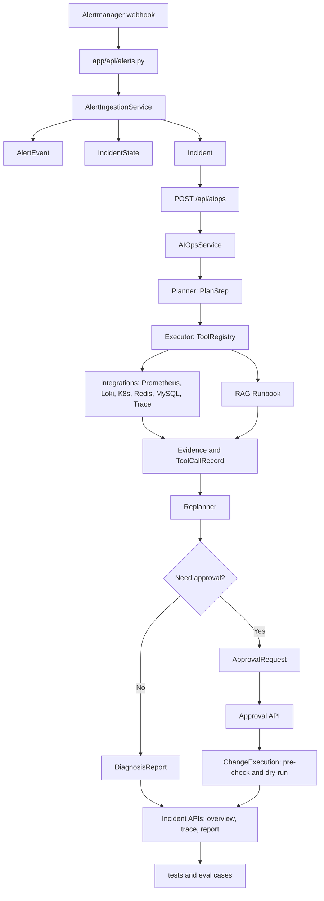

# AutoOnCall 校招面试总复盘：如何把复杂 AIOps 项目讲成自己的核心竞争力

AutoOnCall 是一个 Python 3.11 FastAPI 应用，项目定位是 RAG 问答和 AIOps 智能诊断平台。  
它不是只做普通聊天，而是把运维知识库、告警接入、Agent 诊断、工具取证、人工审批和安全变更串成一条闭环。  
当前代码入口在 `app/main.py`，主要路由分布在 `app/api/`，业务编排在 `app/services/`，AIOps Agent 在 `app/agent/aiops/`。  
项目用 Pydantic 模型固定业务语言，例如 `IncidentState`、`AlertEvent`、`PlanStep`、`Evidence`、`TraceEvent`、`DiagnosisReport`、`ApprovalRequest`、`ChangeExecution`。  
RAG 链路负责让回答有知识来源，AIOps 链路负责把故障诊断过程拆成计划、取证、再规划和报告。  
安全边界是这个项目的面试重点：Agent 可以自动做只读诊断，但中高风险动作必须进入审批和安全变更流程。  
这篇复盘面向两个月后参加校招、刚开始学习项目的同学，目标不是背完整代码，而是把项目讲成可信、可演示、可追问的工程经历。

## 1. 先建立面试表达地图

面试官通常不会一开始就让你逐行讲代码。他会先判断三件事：

1. 你是否真的理解项目解决的问题。
2. 你是否能把复杂系统拆成清晰链路。
3. 你是否知道边界、风险和不足，而不是只会夸大功能。

所以 AutoOnCall 最适合这样定位：

> 我做的是一个面向 OnCall 故障诊断的后端项目。它基于 FastAPI 提供 RAG 问答、Alertmanager 告警接入和 AIOps 诊断接口。核心链路是把告警标准化为 Incident，再通过 Plan-Execute-Replan Agent 调用指标、日志、Trace、K8s、Redis、MySQL、Runbook 等工具取证，最后沉淀 Evidence、Trace、DiagnosisReport。如果诊断过程中出现重启、回滚、配置修改等风险动作，系统不会让 Agent 直接执行，而是创建 `ApprovalRequest`，审批后进入 `ChangeExecution` 的 pre-check、dry-run、sandbox 或人工记录流程。

这段话里有四个关键词：

- 后端工程化：`app/main.py` 注册路由，`app/api/` 负责入口，`app/services/` 负责编排，`app/models/` 固定契约。
- RAG 可信问答：`RagAgentService`、`retrieve_structured_knowledge`、Milvus、本地 lexical index、citation、no-answer policy。
- AIOps Agent：`AIOpsService` 连接 LangGraph，节点是 `planner -> executor -> replanner`。
- 风险控制：`RiskController`、`ApprovalRequest`、`ChangePlan`、`ChangeExecution` 明确禁止自动生产写操作。

## 2. 30 秒项目介绍

AutoOnCall 是一个 Python 3.11 FastAPI 后端项目，面向 OnCall 故障诊断场景。它支持 RAG 知识库问答、Alertmanager 告警接入，以及基于 LangGraph 的 AIOps Agent 诊断。诊断链路会把告警转成 `Incident`，通过 `planner -> executor -> replanner` 生成计划、调用指标/日志/Trace/K8s/Redis/MySQL/Runbook 等工具收集证据，再沉淀 `Evidence`、`TraceEvent` 和 `DiagnosisReport`。我觉得这个项目最大的亮点不是只接了大模型，而是做了状态建模、工具契约、人工审批、安全变更和测试覆盖，能体现后端工程化和 Agent 安全边界意识。

适合在面试刚开始时使用，控制在 30 秒内，不要展开太多细节。

## 3. 2 分钟项目介绍

AutoOnCall 是一个面向运维故障诊断的 FastAPI 应用，当前版本定位是 AIOps Agent 原型。项目分成 API 层、模型层、服务层、Agent 层、工具和外部适配器层。API 层在 `app/api/`，包括 RAG 聊天、文件上传、AIOps 诊断、告警接入、审批、Incident 查询、健康检查和离线评测；模型层在 `app/models/`，用 Pydantic 定义 `Incident`、`AlertEvent`、`IncidentState`、`PlanStep`、`Evidence`、`TraceEvent`、`DiagnosisReport`、`ApprovalRequest`、`ChangePlan` 和 `ChangeExecution`；服务层在 `app/services/`，负责 RAG 检索、告警标准化、诊断状态持久化、报告生成、审批和安全变更。

核心链路有两条。第一条是 RAG：用户上传 Markdown 或文本后，`VectorIndexService` 做文档解析和分块，写入 Milvus，并维护本地 `LexicalIndexService`。查询时 `retrieve_structured_knowledge` 会做向量和词法混合检索、rerank、可信阈值判断；如果没有可信来源，`RagAgentService` 会拒答，而不是让模型自由编造，并在回答末尾补齐引用。

第二条是 AIOps：Alertmanager webhook 进入 `POST /api/alerts/alertmanager`，`AlertIngestionService` 标准化成 `AlertEvent`，按 fingerprint 去重并更新 `IncidentState`。诊断入口是 `POST /api/aiops`，`AIOpsService` 用 LangGraph 编排 `planner -> executor -> replanner`。Planner 生成结构化 `PlanStep`，Executor 通过 `ToolRegistry` 调用只读工具收集指标、日志、Trace、K8s、Redis、MySQL、消息队列、服务上下文、发布历史、历史工单和 Runbook，Replanner 根据证据决定继续补查、生成报告、请求审批或升级人工。

我会重点讲两个工程取舍。第一，诊断结果不是只返回一段文字，而是沉淀 `Evidence`、`ToolCallRecord`、`TraceEvent`、`DiagnosisReport` 和 `AIOpsSessionSnapshot`，方便审计和恢复。第二，系统明确把只读诊断和生产变更分开：`RiskController` 会识别重启、回滚、扩缩容、配置修改、SQL 写操作等风险动作，必要时创建 `ApprovalRequest`；审批后也不是直接执行生产动作，而是进入 `ChangeExecutionService` 的 pre-check、dry-run、sandbox 或 manual_record。

## 4. 5 分钟项目介绍

如果面试官让你完整介绍项目，可以按下面这版讲。核心是按业务链路展开，顺序是“请求入口 -> 数据模型 -> 服务层 -> 状态变化 -> 外部依赖 -> 返回/沉淀结果 -> 测试覆盖”。

AutoOnCall 是我准备校招时重点梳理的一个 AIOps 后端项目。它使用 Python 3.11 和 FastAPI，入口在 `app/main.py`，通过 `include_router` 挂载了 `chat`、`file`、`aiops`、`alerts`、`approvals`、`incidents`、`evaluations` 和 `health` 等路由，同时把 `static/` 作为前端工作台挂载出来。

第一条链路是知识库问答。文件入口是 `POST /api/upload` 和 `POST /api/index_directory`，代码在 `app/api/file.py`。上传时会做文件名规范化、扩展名校验、大小限制和临时文件替换，然后调用 `VectorIndexService` 建索引。检索入口是 `POST /api/chat` 和 `POST /api/chat_stream`，代码在 `app/api/chat.py`。`RagAgentService.query_with_retrieval` 先调用 `retrieve_structured_knowledge`，后者会走 Milvus 向量检索和本地 lexical index 混合检索，并用 `RAG_MAX_L2_DISTANCE`、`RAG_MIN_LEXICAL_TRUST_SCORE`、rerank 和 stale source 标记判断可信度。没有可信来源时返回 no-answer policy，有可信来源时由 grounded model 生成答案，并通过 `ensure_citation_block` 补齐 source_file 和 chunk_id。

第二条链路是告警接入。入口是 `POST /api/alerts/alertmanager`，代码在 `app/api/alerts.py`。`AlertIngestionService` 会从 Alertmanager payload 里提取 `alerts[]`，把 labels、annotations、status、startsAt、endsAt 等字段标准化为 `AlertEvent`。fingerprint 优先用 Alertmanager 自带值，如果没有就根据 `alertname + service + environment + namespace/pod/instance/job/severity/cluster` 等关键字段生成稳定 hash。然后它构造 `Incident`，并通过 `build_incident_state_from_alert` 更新 `IncidentState`。重复 firing 不会重复创建 Incident；resolved 会更新告警状态，但不会覆盖审批、变更等更深生命周期。

第三条链路是 AIOps 诊断。入口是 `POST /api/aiops`，支持 SSE 流式返回；也有 `GET /api/aiops/demo/incidents` 和 `POST /api/aiops/demo/incidents/{case_id}/run` 便于本地演示。`AIOpsService` 在初始化时构建 LangGraph 状态机，节点是 `planner`、`executor`、`replanner`。初始状态由 `create_initial_aiops_state` 创建，里面包含 `session_id`、`trace_id`、incident、plan、current_plan、gathered_evidence、risk_assessment、pending_approval 等字段。Planner 生成 `PlanStep`；Executor 通过 `ToolRegistry` 调用统一工具，每个工具返回 `ToolExecutionResult`；Replanner 判断证据是否足够、是否需要补查、是否需要审批、是否生成报告。

第四条链路是结果沉淀。诊断过程中会写入 `TraceEvent` 和 `ToolCallRecord`，工具结果会转为 `Evidence`，最终生成 `DiagnosisReport`。报告不只是一段 Markdown，还包含 root_cause、hypotheses、key_findings、confirmed_facts、inferred_conclusions、next_steps、risk_summary、change_plan、confidence、warnings 和 errors 等结构化字段。`AIOpsSessionSnapshot` 会保存每次运行的最新状态，服务重启或审批恢复时可以从 checkpoint、session snapshot 或 persisted report fallback 找回上下文。

第五条链路是审批和安全变更。风险判断在 `app/agent/aiops/risk_controller.py`，只读低风险工具可以自动执行，重启、回滚、扩缩容、配置修改等动作需要审批，`delete_pod`、`execute_sql`、`rm -rf`、`drop table` 等危险动作会被 forbidden。审批模型是 `ApprovalRequest`，API 在 `app/api/approvals.py`；审批通过后可以调用 `POST /api/incidents/{incident_id}/diagnosis/resume` 更新诊断闭环，也可以调用 `POST /api/incidents/{incident_id}/changes/{change_plan_id}/resume` 进入 `ChangeExecutionService`。安全变更支持 `dry_run_only`、`manual_record`、`sandbox`，并且通过 `approval_id + change_plan_id` 生成稳定 `change_execution_id`，避免重复创建执行记录。

第六条是测试和工程质量。仓库里有大量 pytest 测试，例如 `test_alert_ingestion_service.py`、`test_aiops_mainline_api.py`、`test_executor_evidence.py`、`test_replanner_decision.py`、`test_risk_controller.py`、`test_approval_service.py`、`test_change_execution_service.py`、`test_rag_retrieval_service.py`、`test_auth_rbac.py`、`test_health_api.py`、`test_frontend_playwright_smoke.py` 等。项目还配置了 Ruff、Black、isort、mypy，常用命令包括 `make test-quick`、`make lint`、`make type-check`、`make eval`、`make eval-rag`、`make eval-change`。

我会把这个项目总结成一句话：它不是单点的大模型 Demo，而是一个用后端工程方式组织 AIOps Agent 的项目，重点是结构化状态、可信证据、可审计 Trace、可恢复持久化、风险审批和质量保障。

## 5. 前 12 篇主题对应的面试知识地图

| 主题 | 面试中能回答的问题 | 重点代码 |
| --- | --- | --- |
| 01 项目总览与架构设计 | 项目解决什么问题，整体怎么分层 | `README.md`、`app/main.py`、`app/api/`、`app/services/` |
| 02 代码结构与工程分层 | FastAPI 项目如何组织复杂业务 | `app/api/`、`app/models/`、`app/services/`、`app/agent/aiops/` |
| 03 Alertmanager 告警接入 | webhook 如何变成 Incident，如何去重 | `app/api/alerts.py`、`app/services/alert_ingestion_service.py`、`app/models/alert.py` |
| 04 AIOps 诊断主链路 | `/api/aiops` 如何流式诊断和沉淀状态 | `app/api/aiops.py`、`app/services/aiops_service.py`、`app/models/aiops_session.py` |
| 05 Planner/Executor/Replanner | 为什么不是一次性大模型回答 | `app/agent/aiops/planner.py`、`executor.py`、`replanner.py`、`plan_fallback.py` |
| 06 Evidence/Trace/Report | 诊断过程如何可解释、可审计 | `app/models/evidence.py`、`app/models/trace.py`、`app/models/report.py` |
| 07 人工审批与安全变更 | 如何避免 Agent 直接执行危险操作 | `risk_controller.py`、`approval_service.py`、`change_execution_service.py` |
| 08 RAG 知识库与问答 | 如何避免 RAG 胡答，如何做引用 | `rag_agent_service.py`、`rag_retrieval_service.py`、`vector_index_service.py` |
| 09 外部适配器与工具层 | 如何统一 Prometheus、日志、K8s、Redis、MySQL 等 | `app/integrations/`、`app/tools/`、`ToolRegistry` |
| 10 API、RBAC、健康检查 | 权限如何控制，健康检查如何分层 | `app/core/auth.py`、`app/api/health.py` |
| 11 存储与状态模型 | 为什么状态不能只放内存 | `aiops_store.py`、`sqlite_store.py`、`mysql_store.py`、`read_models.py` |
| 12 测试体系与质量保障 | 如何验证复杂 Agent 链路 | `tests/`、`pyproject.toml`、`Makefile`、`eval/` |

## 6. 总体流程图



## 7. 核心亮点怎么讲

### 7.1 FastAPI 工程化

可说点：

- `app/main.py` 只做应用启动、CORS、中间件、路由注册和静态文件挂载，不把业务逻辑堆在入口。
- `app/api/` 负责请求参数、权限依赖、HTTP 状态码和响应格式。
- `app/services/` 负责编排，例如 `AIOpsService`、`AlertIngestionService`、`ApprovalService`、`ChangeExecutionService`、`RagAgentService`。
- `app/models/` 用 Pydantic 定义跨层契约，减少“字典到处传”的失控风险。
- `app/integrations/` 封装外部系统协议，`app/tools/` 封装 Agent 可调用工具。

推荐说法：

> 我理解它的分层不是为了目录好看，而是为了控制依赖方向。API 层不直接写诊断细节，服务层不直接暴露 HTTP，模型层固定跨层数据契约，工具和 adapter 隔离外部系统差异。这样后续新增一个外部数据源时，主要改 integrations 和 tools，而不是把 API 和 Agent 节点都改一遍。

### 7.2 RAG 不是普通问答，而是可信知识入口

可说点：

- 上传入口在 `app/api/file.py`，有扩展名、文件大小、文件名清洗和临时文件替换。
- 检索入口在 `app/services/rag_retrieval_service.py` 的 `retrieve_structured_knowledge`。
- 项目同时使用 Milvus 向量检索和 `LexicalIndexService` 词法索引。
- 检索结果经过 stale source、metadata filter、rerank、可信阈值和 no-answer policy。
- `RagAgentService.query_with_retrieval` 会在没有可信来源时拒答，有可信来源时补 citation。

推荐说法：

> 我不会把这个项目讲成“接了一个向量库”。我会强调它做了可信检索边界：向量召回只说明相似，不等于可信，所以代码里还有 lexical、rerank、阈值、stale 标记和 citation。没有可信来源时返回 no-answer，避免模型凭经验编造运维结论。

### 7.3 AIOps Agent 采用 Plan-Execute-Replan

可说点：

- `AIOpsService._build_graph` 用 LangGraph 构建状态机。
- 节点是 `planner`、`executor`、`replanner`。
- `PlanStep` 是机器可消费的诊断步骤，包含 `tool_name`、`purpose`、`input_args`、`expected_evidence`、`risk_level`、`status`。
- Executor 不自由发挥，而是通过 `ToolRegistry.arun` 调用注册工具。
- Replanner 根据 `gathered_evidence`、`risk_assessment`、`pending_approval`、`report` 决定下一步。

推荐说法：

> AIOps 场景不适合一次性让大模型给答案，因为故障诊断需要分步取证。Plan-Execute-Replan 的好处是先把假设拆成计划，再调用工具拿证据，最后根据证据更新结论。它更像一个可审计的诊断流程，而不是一次聊天补全。

### 7.4 外部适配器和工具层统一

可说点：

- `ToolContract` 描述工具名、输入输出 schema、risk_level、read_only、timeout、retry_policy、data_sources、degradation_strategy。
- 默认工具由 `create_default_tool_registry` 注册，包括 `QueryAlertsTool`、`QueryMetricsTool`、`QueryLogsTool`、`QueryTracesTool`、`QueryRedisStatusTool`、`QueryK8sStatusTool`、`QueryMySQLStatusTool`、`SearchRunbookTool` 等。
- 外部系统在 `app/integrations/`，例如 Prometheus、Loki、Kubernetes、Redis、MySQL、Alertmanager、Redpanda、CMDB、Ticketing。
- adapter 负责协议和输入安全，tool 负责 Agent 调用契约和结构化输出。

推荐说法：

> 我理解工具层的价值是把“Agent 能做什么”变成可审计契约。Planner 只能选择稳定工具名，Executor 只通过 registry 调用，工具返回统一结构。这样可以做风险判断、Trace 记录、失败降级和 UI 展示。

### 7.5 证据、Trace、报告三层沉淀

可说点：

- `Evidence` 关注诊断证据：来源、类型、立场、置信度、fact、inference、uncertainty。
- `ToolCallRecord` 关注工具调用：输入、输出、耗时、状态、错误、是否只读。
- `TraceEvent` 关注流程事件：节点、事件类型、输入摘要、输出摘要、错误和 metadata。
- `DiagnosisReport` 关注最终结论：summary、root_cause、hypotheses、key_findings、risk_summary、change_plan、confidence、markdown。

推荐说法：

> 我会强调这不是只返回一个最终答案。Evidence 用来说明结论依据，Trace 用来回放过程，Report 用来给用户和面试官看结果。三者分开后，后续要做审计、复盘、回放、报告下载或者 UI 展示都更清楚。

### 7.6 人工审批和安全变更

可说点：

- 风险判断在 `risk_controller.py`，根据 tool、risk_level、read_only、上下文和环境判断 allow、approval_required、forbidden。
- `ApprovalRequest` 保存审批 ID、incident、动作、风险级别、状态、change_plan、创建和决策信息。
- `ApprovalService.decide_request` 通过 `save_approval_decision_if_pending` 防止重复审批。
- `ChangeExecutionService.start_after_approval` 进入 pre-check、dry-run、manual_record 或 sandbox。
- `ChangePlan.notes` 明确说明 Agent 只生成变更计划草案，不自动执行生产动作。

推荐说法：

> 这个项目里我最想强调的是安全边界。Agent 可以收集证据和生成建议，但不能直接执行生产写操作。中高风险动作要审批，审批后也只是进入安全变更流程，先 pre-check 和 dry-run，生产动作默认还是人工记录。这比“让 Agent 自动修复故障”更符合工程现实。

### 7.7 测试体系

可说点：

- 模型测试：`test_aiops_models.py`、`test_change_execution_models.py`。
- API 测试：`test_aiops_mainline_api.py`、`test_alerts_api.py`、`test_auth_rbac.py`、`test_health_api.py`。
- Agent 测试：`test_executor_evidence.py`、`test_replanner_decision.py`、`test_risk_controller.py`。
- RAG 测试：`test_rag_retrieval_service.py`、`test_rag_agent_citations.py`、`test_file_api_boundaries.py`。
- 存储和恢复测试：`test_sqlite_aiops_recovery.py`、`test_aiops_session_snapshot_store.py`、`test_legacy_migration.py`。
- 安全变更测试：`test_approval_service.py`、`test_change_execution_service.py`、`test_change_execution_api.py`。

推荐说法：

> AIOps 项目最难测的不是某个函数，而是状态流转和异常边界。这个仓库的测试不是只测 happy path，还测重复告警、审批幂等、工具失败、RAG 无可信来源、RBAC scope、健康检查、SQLite 恢复和安全变更状态机。

## 8. 可以说“我做过/我理解”的工程改进点

这部分不要说成“我一个人完成了全部项目”。更稳妥的表达是：“我重点理解并能讲清楚这些工程改进点，如果让我负责，我会这样实现和验证。”

### 8.1 幂等

可以讲：

- 告警接入按 fingerprint 去重，重复 firing 不重复创建 Incident。
- `AlertIngestionItem` 返回 `created`、`deduplicated`、`previous_status`、`status_changed`、`reopened`。
- 审批决策只允许 pending 进入 approved/rejected，`ApprovalService.decide_request` 会拒绝重复决策。
- 安全变更用 `approval_id + change_plan_id` 生成稳定执行 ID，`create_change_execution_once` 防止重复创建。

推荐表达：

> 幂等的核心是同一外部事件重复到达时，系统状态不能错乱。告警靠 fingerprint，审批靠 pending 状态条件更新，安全变更靠稳定 execution ID 和已有记录复用。

### 8.2 权限

可以讲：

- `app/core/auth.py` 定义 `READ_SCOPE`、`DIAGNOSE_SCOPE`、`CHAT_WRITE_SCOPE`、`KNOWLEDGE_WRITE_SCOPE`、`APPROVE_SCOPE`、`CHANGE_SCOPE`、`EVAL_SCOPE`。
- `require_scope` 作为 FastAPI dependency 注入路由。
- `audit_actor` 在审批和变更中优先使用认证 principal，避免只信请求体里的操作者字段。

推荐表达：

> 这个项目的 RBAC 是轻量 token scope 模型，适合内网演示和项目原型。生产级还需要接入 SSO/OIDC，但目前已经把读、诊断、知识写入、审批、变更和评测区分开了。

### 8.3 健康检查

可以讲：

- `/health/live` 只检查进程是否响应。
- `/health/ready` 关注整体依赖，当前以 RAG/Milvus readiness 为主。
- `/health/ready/rag` 单独表示 RAG 能力。
- `/health/ready/aiops` 单独表示 AIOps 能力，并考虑外部系统和 mock fallback。

推荐表达：

> 我理解 readiness 不能简单等于所有能力都可用。RAG 不可用不一定代表 AIOps 完全不可演示，外部系统没配置也可能在本地 mock 模式下演示。因此健康检查要按能力分层。

### 8.4 输入边界

可以讲：

- 文件上传限制扩展名、文件大小，清洗文件名，并用临时文件替换。
- Alertmanager payload 会对敏感字段做脱敏、字段截断和 raw payload 精简。
- RAG metadata filter 有 key pattern 校验。
- Prometheus label、Kubernetes label、MySQL SQL、日志查询等在 adapter/tool 层做规范化和约束。

推荐表达：

> Agent 系统不能把外部输入直接交给模型或外部系统。这个项目的边界处理分散在上传、告警、检索和 adapter 层，目标是让不可信输入先结构化、校验、脱敏，再进入业务链路。

### 8.5 报告语义

可以讲：

- 报告不只包含 Markdown，还包含结构化字段。
- `EvidenceAnalysis` 和报告生成会处理证据不足、冲突、fallback、unknown source。
- mock 或 failed 来源不能和真实 Prometheus、Redis、MySQL 证据同等置信。

推荐表达：

> 报告语义的重点是“结论必须能回到证据”。如果证据不足，就应该在 uncertainties 和 warnings 里说明，而不是为了看起来完整强行给根因。

### 8.6 mock fallback

可以讲：

- README 明确说生产或严格验收应设置 `AIOPS_MOCK_FALLBACK_ENABLED=false`。
- mock/fallback 应显式体现在 data_source 或 metadata 中。
- 工具失败要结构化返回 failed，而不是让 Agent 误以为拿到了真实证据。

推荐表达：

> mock fallback 对本地演示很有价值，但不能污染生产诊断。我的理解是，fallback 可以存在，但必须显式标记来源，并且在报告置信度和结论里降权。

### 8.7 安全变更

可以讲：

- `RiskController` 把危险动作分为 allow、approval_required、forbidden。
- `ChangeExecutionService` 的 pre-check 校验审批绑定、计划状态、风险等级、过期窗口和回滚方案。
- dry-run 只校验，不执行生产写操作。
- `manual_record` 等待人工提交执行结果，`sandbox` 只用于本地或明确开启的沙箱路径。

推荐表达：

> 我不会说这个系统已经自动修复生产故障。更准确的说法是，它能生成可审计的变更计划和安全执行记录，把自动诊断和生产写操作隔离开。

## 9. 本地演示脚本

演示目标不是炫技，而是证明你能把链路跑通，并能解释每一步背后的状态。

### 9.1 基础启动

准备依赖：

```bash
pip install -e ".[dev]"
```

启动服务：

```bash
make dev
```

打开：

- 前端工作台：`http://localhost:9900`
- OpenAPI：`http://localhost:9900/docs`
- Liveness：`http://localhost:9900/health/live`
- Readiness：`http://localhost:9900/health/ready`

如果要演示 RAG：

```bash
make up
make dev
make upload
```

如果要演示完整 AIOps 沙箱：

```bash
make sandbox-up
powershell -ExecutionPolicy Bypass -File deploy\full-stack\seed-demo-data.ps1
make sandbox-demo
```

注意：沙箱是本地演示环境，不要把它说成真实生产接入。

### 9.2 演示 RAG 问答

演示顺序：

1. 说明文档来自 `aiops-docs/`，通过 `make upload` 调用 `/api/upload` 写入知识库。
2. 在前端或 `/api/chat` 提一个 Runbook 相关问题。
3. 展示回答中的 citations。
4. 故意问一个知识库没有依据的问题，说明 no-answer policy。

可以讲：

> 这里我想证明 RAG 不是无脑把检索结果塞给模型。代码里先做结构化检索，可信来源不足就拒答；可信来源足够才生成 grounded answer，并补齐 source_file 和 chunk_id。

### 9.3 演示告警接入

可以用 Alertmanager webhook：

```bash
curl -X POST "http://127.0.0.1:9900/api/alerts/alertmanager" \
  -H "Content-Type: application/json" \
  -d '{"receiver":"autooncall","status":"firing","alerts":[{"status":"firing","labels":{"alertname":"RedisMaxClientsHigh","service":"order-service","environment":"prod","severity":"critical"},"annotations":{"summary":"order-service Redis clients are near maxclients"},"startsAt":"2026-06-30T10:00:00Z","fingerprint":"sandbox-redis-maxclients"}]}'
```

然后查看：

```bash
curl http://127.0.0.1:9900/api/alerts
curl http://127.0.0.1:9900/api/incidents
```

可以讲：

> 这里重点看 fingerprint 去重和 `inc-alert-*` Incident 创建。重复发送同一个 fingerprint 不应该重复创建 Incident，resolved 也不应该覆盖审批或变更中的深层状态。

### 9.4 演示 AIOps 诊断

推荐使用现成 demo：

```bash
curl http://127.0.0.1:9900/api/aiops/demo/incidents/redis-maxclients
curl -N -X POST http://127.0.0.1:9900/api/aiops/demo/incidents/redis-maxclients/run \
  -H "Content-Type: application/json" \
  -d "{}"
```

讲解顺序：

1. `POST /api/aiops` 返回 SSE。
2. `plan` 事件说明 Planner 生成步骤。
3. `step_complete` 或工具相关事件说明 Executor 调用工具。
4. `report` 说明 Replanner/ReportGenerator 形成结构化报告。
5. `complete` 说明终态可能是 completed、waiting_approval、failed、approval_resumed 等。

可以讲：

> 我会边看 SSE 边解释状态变化，而不是只展示最后报告。因为这个项目的价值在于可追踪诊断过程。

### 9.5 演示报告和 Trace

诊断后查看：

```bash
curl http://127.0.0.1:9900/api/incidents/{incident_id}
curl http://127.0.0.1:9900/api/incidents/{incident_id}/trace
curl http://127.0.0.1:9900/api/incidents/{incident_id}/report
```

可以讲：

> Report 是给用户看的结构化结论，Trace 是给排查和审计看的过程记录，Evidence 是支撑结论的证据。它们不是重复数据，而是面向不同使用场景的沉淀。

### 9.6 演示审批和安全变更

如果诊断触发了待审批动作：

```bash
curl http://127.0.0.1:9900/api/approvals/pending
```

提交审批：

```bash
curl -X POST http://127.0.0.1:9900/api/incidents/{incident_id}/approval \
  -H "Content-Type: application/json" \
  -d '{"decision":"approve","reason":"同意按变更计划进入 dry-run"}'
```

恢复诊断闭环：

```bash
curl -N -X POST http://127.0.0.1:9900/api/incidents/{incident_id}/diagnosis/resume \
  -H "Content-Type: application/json" \
  -d '{"approval_id":"{approval_id}"}'
```

启动安全变更 dry-run：

```bash
curl -N -X POST http://127.0.0.1:9900/api/incidents/{incident_id}/changes/{change_plan_id}/resume \
  -H "Content-Type: application/json" \
  -d '{"approval_id":"{approval_id}","mode":"dry_run_only","operator":"interviewer-demo"}'
```

可以讲：

> 这一步重点不是证明系统真的改了生产，而是证明系统没有直接改生产。审批通过后仍然要 pre-check 和 dry-run，manual_record 也只是记录人工执行结果。

## 10. 8 周学习路线

### 第 1 周：项目地图和运行

学什么：

- 阅读 `README.md`、`app/main.py`、`app/api/`。
- 跑通 `make dev`，打开 `/docs` 和前端工作台。
- 理解 FastAPI router、dependency、response model。

做什么演示：

- 展示 `/health/live`、`/health/ready`、`/api/aiops/demo/incidents`。

准备话术：

- 30 秒项目介绍。
- “项目怎么分层”的回答。

### 第 2 周：RAG 链路

学什么：

- 阅读 `app/api/chat.py`、`app/api/file.py`、`rag_agent_service.py`、`rag_retrieval_service.py`、`vector_index_service.py`、`lexical_index_service.py`。
- 理解 Milvus、lexical index、metadata_filter、stale source、citation。

做什么演示：

- 上传文档，问一个有引用的问题，再问一个无可信来源的问题。

准备话术：

- “如何避免 RAG 胡答？”
- “为什么向量检索还要 lexical？”

### 第 3 周：告警接入和 Incident 生命周期

学什么：

- 阅读 `app/api/alerts.py`、`alert_ingestion_service.py`、`models/alert.py`、`models/incident_state.py`。
- 理解 fingerprint、deduplicated、reopened、resolved。

做什么演示：

- 发送 Alertmanager webhook，重复发送一次，再发送 resolved。

准备话术：

- “为什么 AlertEvent 和 IncidentState 要分开？”
- “resolved 为什么不一定覆盖更深状态？”

### 第 4 周：AIOps 主链路

学什么：

- 阅读 `app/api/aiops.py`、`aiops_service.py`、`models/aiops_session.py`。
- 理解 SSE、session_id、trace_id、snapshot、terminal status。

做什么演示：

- 运行 demo incident，观察 plan、step、report、complete 事件。

准备话术：

- 2 分钟项目介绍。
- “为什么要流式返回？”

### 第 5 周：Plan-Execute-Replan 和工具层

学什么：

- 阅读 `planner.py`、`executor.py`、`replanner.py`、`plan_fallback.py`、`tools/registry.py`、`tools/base.py`。
- 理解 `PlanStep`、`ToolContract`、`ToolExecutionResult`、fallback。

做什么演示：

- 展示 `/api/aiops/tools/contracts`。
- 解释一次工具调用如何变成 Evidence。

准备话术：

- “为什么不用一次大模型回答？”
- “如何避免 Agent 随便调用工具？”

### 第 6 周：证据、报告、审批和安全变更

学什么：

- 阅读 `models/evidence.py`、`models/trace.py`、`models/report.py`、`risk_controller.py`、`approval_service.py`、`change_execution_service.py`。
- 理解 evidence stance、confidence、approval_required、forbidden、pre-check、dry-run。

做什么演示：

- 展示 report、trace、pending approvals。
- 如果有 change_plan，演示 dry-run-only。

准备话术：

- “怎么避免 Agent 直接执行危险操作？”
- “审批通过后为什么还要安全变更流程？”

### 第 7 周：存储、RBAC、健康检查和测试

学什么：

- 阅读 `aiops_store.py`、`sqlite_store.py`、`mysql_store.py`、`read_models.py`、`core/auth.py`、`api/health.py`、`tests/`。
- 理解 SQLite/MySQL 抽象、读模型、scope、健康检查能力分层。

做什么演示：

- 展示 `/api/aiops/runs`、`/api/incidents`、`/health/ready/rag`、`/health/ready/aiops`。

准备话术：

- “为什么不能只放内存？”
- “RBAC 怎么设计？”
- “测试覆盖了哪些关键边界？”

### 第 8 周：综合面试冲刺

学什么：

- 把前 7 周串成 5 分钟项目介绍。
- 复盘 30 个高频追问和 10 个容易被问倒的问题。
- 准备简历 bullet 和项目不足。

做什么演示：

- 完整演示：RAG 问答 -> Alertmanager webhook -> demo diagnosis -> report/trace -> approval -> dry-run。

准备话术：

- 5 分钟完整介绍。
- “项目最大亮点是什么？”
- “如果继续优化，你会做什么？”

## 11. 简历 bullet 写法

偏后端工程：

- 参与设计并梳理 AutoOnCall AIOps 后端链路，基于 FastAPI、Pydantic 和分层 Service 架构实现 RAG 问答、Alertmanager 告警接入、Incident 生命周期、诊断运行历史、审批和变更读模型，覆盖 `/api/chat`、`/api/alerts/alertmanager`、`/api/aiops`、`/api/incidents` 等核心接口。

偏 AI Agent：

- 梳理基于 LangGraph 的 Plan-Execute-Replan 诊断流程，将故障诊断拆分为结构化 `PlanStep`、工具取证、证据分析和报告生成，通过 `ToolRegistry` 统一指标、日志、Trace、K8s、Redis、MySQL、Runbook 等工具调用，并沉淀 `Evidence`、`TraceEvent` 和 `DiagnosisReport`。

偏工程质量和安全：

- 完善 AIOps Agent 风险边界设计，基于 `RiskController` 区分只读诊断、需审批动作和禁止动作，引入 `ApprovalRequest`、`ChangePlan`、`ChangeExecution` 支持审批后 pre-check、dry-run、sandbox 和人工执行记录，并通过 pytest 覆盖告警去重、RAG 引用、审批幂等、RBAC、健康检查和安全变更状态流转。

如果担心“参与设计并梳理”不够具体，可以在真实负责范围明确后替换成“实现”“重构”“补充测试”“接入”等动词。不要把未亲自完成的内容写成独立负责。

## 12. 项目不足与后续优化

### 12.1 当前不足

- 项目是 AIOps Agent 原型，不应声称已经接入真实生产系统。
- 本地演示可能使用 mock/fallback，严格验收应设置 `AIOPS_MOCK_FALLBACK_ENABLED=false`。
- API token RBAC 适合内网演示，生产环境还需要 SSO/OIDC、网关鉴权、审计平台和密钥轮换。
- SQLite 适合单机演示，多副本部署需要 MySQL、迁移、备份和并发控制。
- RAG 的检索质量依赖文档质量、chunk 策略、embedding 模型和阈值，离线评测不能代表线上真实准确率。
- 安全变更链路目前强调 dry-run、sandbox 和人工记录，不自动执行真实生产写操作。
- 健康检查已经分层，但真实生产还需要更细的依赖超时、熔断、降级和告警。
- 前端工作台能演示链路，但还不是完整的企业级控制台。

### 12.2 后续优化方向

- 引入更正式的身份体系：SSO/OIDC、组织角色、审批人白名单、操作审计和权限回放。
- 加强 RAG 评测：构建更多 Runbook case，跟踪 citation 命中率、拒答准确率、召回质量和回答一致性。
- 做更完整的 Agent 观测：LLM token、工具耗时、失败原因、replan 次数、证据置信度变化。
- 优化状态持久化：MySQL 多实例部署、事务边界、归档策略、数据保留和迁移验证。
- 加强外部适配器：真实 Prometheus/Loki/Jaeger/K8s 权限模型、超时重试、限流和只读查询模板。
- 完善安全变更：接入真实变更平台，只生成计划和校验单，执行仍由平台和人工控制。
- 引入回放能力：根据 `AIOpsSessionSnapshot`、`TraceEvent` 和 `ToolCallRecord` 重放一次诊断过程。
- 改进报告质量：把证据冲突、证据不足、fallback only、unknown source 的表达做得更稳定。

推荐表达：

> 我不会把它夸成生产级自动修复系统。更准确地说，它是一个工程化程度比较高的 AIOps Agent 原型，已经把诊断、证据、审批和安全变更边界搭起来了。后续如果生产化，我会优先做真实身份体系、外部系统权限、持久化高可用、RAG 评测和变更平台集成。

## 13. 30 个高频面试追问与推荐回答

### 1. 这个项目和普通 RAG 聊天项目有什么区别？

推荐回答：普通 RAG 聊天主要解决“基于知识库回答问题”，而 AutoOnCall 把 RAG 放在 AIOps 链路里。RAG 既支持用户问答，也给 Planner 和 Runbook 查询提供上下文。项目还有 Alertmanager 告警接入、Plan-Execute-Replan 诊断、工具取证、Evidence/Trace/Report 沉淀、人工审批和安全变更，所以它更像一个故障诊断平台原型。

### 2. 你们项目怎么分层？

推荐回答：入口在 `app/main.py`；`app/api/` 放 HTTP 路由和权限依赖；`app/models/` 放 Pydantic 契约；`app/services/` 做业务编排和状态沉淀；`app/agent/aiops/` 做 Agent 状态机；`app/tools/` 是 Agent 工具契约；`app/integrations/` 是外部系统适配；`tests/` 做回归保护。典型调用方向是 API -> Service -> Agent/Store/Integration -> Model。

### 3. 为什么要用 FastAPI？

推荐回答：FastAPI 对异步接口、Pydantic 模型、依赖注入和 OpenAPI 支持比较好。这个项目有 SSE 流式诊断、上传、健康检查、权限依赖和较多结构化响应，FastAPI 能比较自然地组织这些能力。

### 4. Alertmanager webhook 进来后发生什么？

推荐回答：入口是 `POST /api/alerts/alertmanager`。`AlertIngestionService` 提取 `alerts[]`，合并 labels 和 annotations，标准化为 `AlertEvent`，根据 fingerprint 去重，构造 `Incident`，再更新 `IncidentState`。如果 `auto_diagnose=true` 且是新建或 reopened firing 告警，会后台触发 AIOps 诊断。

### 5. fingerprint 为空怎么办？

推荐回答：代码会优先使用 Alertmanager 自带 fingerprint；如果没有，就根据 `alertname`、`service`、`environment` 以及 namespace、pod、instance、job、severity、cluster 等关键 label 生成 sha256。这样重复 webhook 仍能稳定映射到同一个 Incident。

### 6. 为什么要区分 `AlertEvent` 和 `IncidentState`？

推荐回答：`AlertEvent` 是外部告警事件的标准化记录，重点是来源、fingerprint、labels、annotations 和 firing/resolved。`IncidentState` 是系统内部最新生命周期，可能处于 diagnosing、waiting_approval、change_running、completed 等状态。resolved 告警不能简单覆盖内部深层状态，所以两者要分开。

### 7. 为什么用 Plan-Execute-Replan，而不是一次大模型调用？

推荐回答：故障诊断需要逐步取证。一次性回答容易把假设当结论。Plan-Execute-Replan 先生成计划，再调用工具收集证据，最后根据证据继续补查或生成报告。这样可以记录每一步工具调用、证据来源和风险判断，更适合 AIOps。

### 8. Planner 输出如何保证 Executor 能消费？

推荐回答：Planner 输出结构化 `PlanStep`，包含 `tool_name`、`purpose`、`input_args`、`expected_evidence`、`risk_level`、`status` 等字段。Executor 会通过 `parse_plan_step` 和 `ToolRegistry` 找到对应工具，找不到或失败时返回结构化失败结果，而不是让流程无声失败。

### 9. 工具调用为什么要经过 `ToolRegistry`？

推荐回答：`ToolRegistry` 提供稳定工具名和统一调用入口。每个工具都有 `ToolContract`，声明输入输出、风险等级、是否只读、超时、重试和数据源。这样 Executor 不需要知道每个外部系统细节，也便于风险控制、审计和 UI 展示。

### 10. 外部 adapter 和 tool 有什么区别？

推荐回答：adapter 负责外部系统协议，比如 Prometheus HTTP API、Loki LogQL、Redis RESP、MySQL 只读查询、Kubernetes API。tool 负责给 Agent 暴露稳定能力，比如 `query_metrics`、`query_logs`、`query_redis_status`。adapter 更靠近外部系统，tool 更靠近 Agent 契约。

### 11. 如何避免 Agent 执行危险操作？

推荐回答：首先，默认工具主要是只读诊断。其次，`RiskController` 会根据工具名、动作文本、risk_level、read_only 和 incident environment 判断策略。只读低风险 allow，中高风险或非只读动作 approval_required，硬危险动作 forbidden。审批后也不会直接执行生产写操作，而是进入安全变更流程。

### 12. 哪些动作会被禁止？

推荐回答：代码里有硬禁止工具和模式，例如 `delete_pod`、`execute_sql`、`run_shell`、`kill_process`、`shutdown_host`，以及 `rm -rf`、`kubectl delete`、`drop table`、`delete from`、`update`、`insert`、`alter table` 等危险模式。命中后策略是 forbidden。

### 13. 审批请求里保存什么？

推荐回答：`ApprovalRequest` 保存 `approval_id`、`incident_id`、动作、风险级别、原因、状态、step_id、tool_name、change_plan、requested_by、decided_by、decision_reason 和 metadata。它不是简单一个布尔值，而是可审计的人工决策记录。

### 14. 审批通过后系统会自动改生产吗？

推荐回答：不会。审批通过后，`resume_after_approval` 只是记录人工决策并更新诊断报告。真正的变更要走 `ChangeExecutionService`，先 pre-check 和 dry-run，`manual_record` 等待人工提交执行结果，`sandbox` 也只用于本地或明确开启的沙箱路径。

### 15. 安全变更如何保证幂等？

推荐回答：安全变更用 `approval_id + change_plan_id` 生成稳定 `change_execution_id`，并通过 store 的 `create_change_execution_once` 创建。如果同一个审批和变更计划重复 resume，会返回已有执行记录或从已有 dry-run 状态继续，而不是重复创建。

### 16. `Evidence` 和 `TraceEvent` 有什么区别？

推荐回答：`Evidence` 是诊断证据，回答“这个结论有什么依据”；`TraceEvent` 是流程事件，回答“系统执行了哪些节点和工具”。一个工具调用可能既产生 Trace，也被转成 Evidence。Trace 适合审计和回放，Evidence 适合报告和根因分析。

### 17. 报告置信度是大模型给的吗？

推荐回答：不能简单说是大模型给的。报告置信度应该来自证据质量、来源、数量、冲突情况、fallback 情况等综合判断。代码里有 Evidence、EvidenceAnalysis、confidence_reason、warnings 和 uncertainties，目的就是避免把模型语言流畅度误当成诊断可信度。

### 18. 如果证据冲突怎么办？

推荐回答：稳妥做法不是强行给唯一根因，而是在报告里列出 confirmed_facts、inferred_conclusions 和 uncertainties。冲突证据会降低置信度，并提示下一步补查方向。面试中可以说当前实现已经有证据立场和报告不确定性字段，后续还可以加强冲突解释。

### 19. 如果外部系统没配置怎么办？

推荐回答：adapter 或 tool 应返回结构化的 not_configured 或 failed，而不是伪装成功。README 也强调生产或严格验收应设置 `AIOPS_MOCK_FALLBACK_ENABLED=false`。本地 demo 可以启用 mock fallback，但报告中必须显式标记来源。

### 20. RAG 如何避免胡答？

推荐回答：`retrieve_structured_knowledge` 会先做可信检索，结合向量距离、lexical 分数、metadata filter、stale source、rerank 等判断。如果没有可信来源，`RagAgentService` 返回 no-answer，而不是让模型凭空回答。有可信来源时，grounded prompt 要求只基于片段回答，并补 citation。

### 21. 为什么有了向量检索还要 lexical index？

推荐回答：向量检索适合语义相似，但对服务名、错误码、配置项、命令、指标名这类精确词可能不稳定。lexical index 可以补精确匹配能力。混合检索再 rerank，可以兼顾语义召回和关键词召回。

### 22. metadata_filter 有什么风险？

推荐回答：如果直接拼查询表达式，可能造成过滤条件异常或注入。代码里对 metadata filter key 有 pattern 校验，并有 normalize 逻辑。面试里可以说这是输入边界的一部分，生产还可以进一步做白名单字段和类型校验。

### 23. 为什么要有 `AIOpsSessionSnapshot`？

推荐回答：LangGraph checkpoint 偏运行时，服务重启后可能丢失。`AIOpsSessionSnapshot` 是持久化的运行快照，记录 session、incident、trace、状态、节点和报告等信息，便于 `/api/aiops/runs` 查询和审批恢复。

### 24. 为什么不能只把状态放内存？

推荐回答：诊断、审批和变更可能跨请求、跨时间发生。只放内存会导致服务重启后丢失审批上下文、Trace、报告和运行历史。项目通过 SQLite/MySQL store 保存 AlertEvent、IncidentState、Approval、Trace、Report、SessionSnapshot、ChangeExecution。

### 25. SQLite 和 MySQL 怎么选？

推荐回答：SQLite 适合本地演示、单机开发和校招项目展示，部署简单。多副本或生产化场景需要 MySQL，并配合迁移、备份、事务和连接池。项目抽象了 `AIOpsStateStore`，使两种后端可以共享业务层。

### 26. RBAC 怎么实现？

推荐回答：`app/core/auth.py` 定义 scope 和 role，`require_scope` 作为 FastAPI dependency 接入路由。token 可以通过 Authorization Bearer 或 `X-AutoOnCall-Token` 提供。鉴权关闭适合本地 demo，开启后如果没配置 token 会返回 503，避免误以为系统已受保护。

### 27. 健康检查为什么分 live 和 ready？

推荐回答：liveness 只说明进程还活着，不应该检查外部依赖，否则可能导致错误重启。readiness 表示能不能接流量，需要检查依赖。项目还拆了 `/health/ready/rag` 和 `/health/ready/aiops`，因为不同能力依赖不同。

### 28. SSE 有什么作用？

推荐回答：AIOps 诊断可能耗时较长，而且中间过程对用户有价值。SSE 可以流式返回 plan、step、report、complete、error 等事件，让前端实时展示诊断过程，也避免一个 HTTP 请求长时间无反馈。

### 29. 测试最重要覆盖什么？

推荐回答：我认为最重要的是状态流转和异常边界。比如重复告警不重复建 Incident，resolved 不覆盖深层状态，工具失败能结构化返回，RAG 无可信来源会拒答，审批不能重复决策，安全变更不能重复执行，RBAC scope 生效，健康检查语义正确。

### 30. 这个项目最大亮点是什么？

推荐回答：最大亮点是把大模型能力放进可控的后端工程链路里。不是只让模型生成答案，而是有结构化计划、工具契约、证据沉淀、Trace 审计、报告模型、审批和安全变更边界，以及测试保护。它能体现我对 AI Agent 工程化和生产风险的理解。

## 14. 10 个容易被问倒的问题与稳妥回答方式

### 1. 这个系统线上准确率是多少？

稳妥回答：目前不能声称有线上准确率，因为项目定位是 AIOps Agent 原型和本地/沙箱演示。仓库里有 `eval/cases.yaml`、`eval/rag_cases.yaml`、`eval/change_cases.yaml` 做离线评测，但离线 case 不等于真实生产准确率。生产化需要接入真实故障样本、人工标注、长期回归和线上反馈闭环。

### 2. 你们真的接入了生产 Prometheus、K8s、Redis、MySQL 吗？

稳妥回答：不能夸大。项目有对应 adapter 和 full-stack sandbox，可以接真实协议或本地 mock 服务。README 明确说这是原型，不应声称已经接入真实生产系统。面试中我会说它具备适配层设计和本地验证能力，生产接入还需要权限、网络、安全审计和变更流程。

### 3. 如果大模型生成错误计划怎么办？

稳妥回答：第一，计划是结构化 `PlanStep`，Executor 会按 tool registry 执行，不是任意执行文本。第二，有 `plan_fallback`，LLM 失败时可以生成规则兜底计划。第三，风险动作会被 `RiskController` 拦截。第四，报告会基于实际证据，不应该把计划本身当结论。后续还可以加入计划校验器和人工确认。

### 4. 如果工具返回假数据怎么办？

稳妥回答：工具层只能保证结构化和来源标记，不能完全保证外部系统数据真实。项目通过 `data_source`、Trace、Evidence confidence、mock/fallback 标记来降低误判。生产化还需要外部系统权限、数据新鲜度、采集链路监控和多源交叉验证。

### 5. 你们的安全变更是不是只是模拟？

稳妥回答：是的，当前实现重点是安全边界和流程建模，不是自动执行真实生产变更。`dry_run_only` 只校验计划，`manual_record` 记录人工执行结果，`sandbox` 用于本地沙箱。这个限制是有意设计的，因为校招项目里更应该体现风险意识，而不是声称 Agent 能自动改生产。

### 6. RAG 文档过期怎么办？

稳妥回答：代码里有 stale source 标记，上传覆盖失败时可以避免继续使用旧知识误答。但这只是基础能力。后续还需要文档版本、更新时间、负责人、过期策略、定期重建索引和基于线上反馈的知识库治理。

### 7. 多个诊断并发会不会状态混乱？

稳妥回答：系统用 `session_id` 区分诊断运行，用 `incident_id` 区分故障对象，用 `trace_id` 串联过程。持久化 store 负责保存 snapshot、trace、report 等。当前本地原型能支撑演示和测试，生产高并发还要加强数据库事务、锁、队列、幂等键和分布式部署验证。

### 8. 为什么不用 Celery 或消息队列做诊断任务？

稳妥回答：当前 API 用 SSE 直接流式返回，适合本地演示和交互式诊断。生产化时可以把诊断提交和执行解耦，用任务队列或工作流引擎执行，再通过 run status、WebSocket/SSE 或轮询展示状态。这个项目已经有 session snapshot 和 run history，为异步化留下了基础。

### 9. 你具体贡献了什么？

稳妥回答：不要虚构。可以按真实情况说：“我重点梳理和掌握了项目的 AIOps 主链路、RAG 边界、审批和安全变更设计，并能基于代码解释每个模块。如果让我负责落地，我会从某个具体点切入，例如补充测试、完善报告语义、增强 adapter 边界或优化演示脚本。”如果你确实改过代码，再具体说文件和 PR。

### 10. 如果让你重构，你最先改哪里？

稳妥回答：我会优先做三件事。第一，补齐生产身份和审计体系，把 token RBAC 升级到 SSO/OIDC。第二，增强 Agent 评测和回放，确保每次模型或 prompt 变更都有回归结果。第三，把外部 adapter 的超时、重试、限流、只读查询模板和错误分类做得更统一。这样优先解决生产化风险，而不是盲目加功能。
