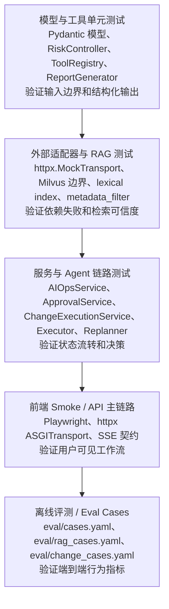

# AutoOnCall 的测试体系与工程化质量保障：如何让复杂 AIOps 链路可验证

AutoOnCall 是一个 Python 3.11 FastAPI 应用，用于 RAG 问答和 AIOps 智能诊断。
它不是单纯的聊天 demo，而是把 Alertmanager 告警接入、RAG Runbook、Plan-Execute-Replan Agent、工具取证、人工审批、安全变更、Trace 和报告沉淀串成一条可解释链路。
这类系统最容易出问题的地方不是“某个函数能不能跑”，而是状态是否会被误改、风险动作是否会被误放行、外部系统不可用时是否能结构化降级。
因此，当前仓库把 pytest 单元测试、API 链路测试、Agent 决策测试、外部适配器测试、前端 smoke 和离线 eval case 组合成一套质量保障体系。
本篇只讲测试和工程化质量保障，不重复展开 RAG、审批、存储或适配器的业务细节。
读完本文后，你应该能在面试里讲清楚：AutoOnCall 为什么要测状态流转和异常边界，如何用 mock transport、tmp_path、monkeypatch、pytest-asyncio 稳定复杂链路，以及 ruff、black、mypy、make 命令在工程门禁中各自负责什么。

## 1. 先看测试体系的整体地图

当前仓库的测试集中在 `tests/` 目录，pytest 配置写在 `pyproject.toml` 的 `[tool.pytest.ini_options]` 中：

- 测试目录：`testpaths = ["tests"]`。
- 文件命名：`test_*.py` 或 `*_test.py`。
- 测试函数：`test_*`。
- 异步模式：`asyncio_mode = "auto"`，配合 `pytest-asyncio`。
- 默认参数：`-ra`、`-q`、`--strict-markers`、`--cov=app`、`--cov-report=term-missing`。
- 集成测试标记：`integration` 用于需要 Docker 或真实外部系统的测试。

按当前检出内容统计，`tests/` 顶层有 57 个 `test_*.py` 文件，约 357 个测试函数。这个数量不是为了“堆覆盖率”，而是因为项目同时有 API、Agent、RAG、状态持久化、外部适配器和前端工作台，每一层都有不同的失败模式。



这张金字塔反映了一个核心取舍：底层测试要快、细、确定；越往上越接近真实业务链路，但也越贵、越容易受环境影响。所以 AutoOnCall 没有把所有验证都压到一个“启动全栈跑一遍”的脚本里，而是把风险拆开：模型约束在模型层测，状态机在服务层测，HTTP 契约在 API 层测，外部系统用 `MockTransport` 测协议和降级，完整行为用 eval case 测指标。

## 2. 为什么 AIOps 项目必须测试状态流转和异常边界

普通 CRUD 项目常见测试重点是“输入一条数据，返回一条数据”。AIOps 项目更复杂，因为一次诊断会经历多次状态变化：

1. 告警进入系统后，`AlertEvent` 要标准化，并通过 fingerprint 去重。
2. `IncidentState` 要记录故障生命周期，但不能被外部 resolved 告警误覆盖更深的内部状态。
3. `AIOpsService` 要流式执行 planner、executor、replanner，并沉淀 Trace、Evidence、Report。
4. 风险动作要进入 `ApprovalRequest`，审批通过后才能进入 `ChangeExecution`。
5. 安全变更还要经过 pre-check、dry-run、sandbox 或 manual_record。
6. 外部系统可能未配置、超时、权限不足、返回空结果或字段变化。
7. RAG 可能无可信来源，此时应拒答，而不是让模型自由发挥。

这就是为什么测试不能只断言“HTTP 200”。比如 `tests/test_alert_ingestion_service.py` 中的 `test_resolved_alert_does_not_override_deeper_incident_lifecycle()` 会先创建 firing 告警，再手动把 IncidentState 置为 `waiting_approval`，最后发送 resolved webhook，断言内部状态仍保持 `waiting_approval`，只在 metadata 中记录 `alert_status=resolved`。这个测试保护的是生产平台里很关键的边界：监控恢复不等于变更审批流程可以被外部告警直接抹掉。

再比如 `tests/test_aiops_mainline_api.py` 的 `test_incident_approval_rejects_cross_incident_approval_id_without_mutation()`，它验证审批 ID 不能跨 incident 使用。这个用例看起来很小，但它防的是安全事故：用户不能拿 A 事件的 approval_id 去批准 B 事件的生产动作。

## 3. 覆盖矩阵：每类测试守住什么

| 测试类型 | 代表文件 | 主要覆盖对象 | 重点断言 |
| --- | --- | --- | --- |
| 模型测试 | `tests/test_aiops_models.py`、`tests/test_change_execution_models.py` | `AIOpsRequest`、`Incident`、`PlanStep`、`Evidence`、`TraceEvent`、`DiagnosisReport`、`ChangeExecution` | Pydantic 边界、JSON 可序列化、向后兼容、读模型字段 |
| 服务测试 | `tests/test_alert_ingestion_service.py`、`tests/test_change_execution_service.py`、`tests/test_report_generator.py` | 告警接入、审批、安全变更、报告生成 | 状态流转、幂等、脱敏、过期计划、报告状态同步 |
| API 测试 | `tests/test_aiops_mainline_api.py`、`tests/test_chat_rag_api.py`、`tests/test_auth_rbac.py`、`tests/test_change_execution_api.py`、`tests/test_health_api.py` | FastAPI 路由、SSE、RBAC、健康检查 | HTTP 状态码、响应模型、SSE 事件、审计 actor、能力级 readiness |
| Agent 测试 | `tests/test_executor_evidence.py`、`tests/test_replanner_decision.py`、`tests/test_risk_controller.py`、`tests/test_evidence_analyzer.py` | Executor、Replanner、RiskController、EvidenceAnalyzer | 工具失败不打断流程、风险动作审批、禁止动作拦截、证据充分性 |
| 外部适配器测试 | `tests/test_external_adapters.py`、`tests/test_tool_registry.py` | Prometheus、Loki、Jaeger/Tempo、K8s、Redis、MySQL、Redpanda、Ticketing、ToolRegistry | `MockTransport` 协议、输入转义、错误分类、未配置降级、工具契约 |
| RAG 测试 | `tests/test_rag_retrieval_service.py`、`tests/test_chat_rag_api.py`、`tests/test_rag_agent_citations.py`、`tests/test_file_api_boundaries.py` | 检索、引用、上传索引、metadata filter | L2 阈值、lexical 兜底、stale source、拒答策略、引用字段 |
| 审批变更测试 | `tests/test_approval_service.py`、`tests/test_change_execution_service.py`、`tests/test_change_execution_api.py` | `ApprovalService`、`ChangeExecutionService`、safe-change API | pending/approved/rejected、dry-run、manual_record、sandbox、幂等 |
| 前端 smoke | `tests/test_static_aiops_demo.py`、`tests/test_frontend_playwright_smoke.py` | `static/` 工作台、FastAPI 静态资源、浏览器基础交互 | 页面渲染、tab 切换、表单预设、console error |
| 离线评测 | `tests/test_eval_cases.py`、`tests/test_rag_eval_cases.py`、`scripts/eval/eval_cases.py`、`scripts/eval/eval_rag_cases.py`、`scripts/eval/eval_change_cases.py` | AIOps、RAG、安全变更 eval case | 工具命中、根因命中、风险策略、拒答率、变更安全指标 |

这张矩阵适合面试时直接讲：我不是只写了几个单测，而是按复杂系统的风险面分层测试。

## 4. 模型测试：先把输入边界收紧

模型层主要位于 `app/models/`。它负责把 HTTP 请求、Agent 状态、证据、审批、变更和报告变成可验证的结构。对应测试集中在 `tests/test_aiops_models.py` 和 `tests/test_change_execution_models.py`。

典型例子有三类。

第一类是请求边界。`test_aiops_request_rejects_invalid_session_id_boundaries()` 验证空 `session_id` 和超过 128 个字符的 `session_id` 会触发 Pydantic `ValidationError`；`test_aiops_resume_request_rejects_invalid_ids()` 验证恢复诊断的 ID 也不能为空或过长。这样可以避免 API 层收到无界字符串后进入存储层或日志层。

第二类是兼容性。`test_aiops_request_keeps_legacy_session_only_payload()` 和 `test_initial_aiops_state_is_backward_compatible()` 说明项目保留了早期只传 `session_id` 的调用方式，同时新的结构化 incident 字段也能进入 `create_initial_aiops_state()`。这种测试对校招项目很加分，因为它体现了“版本演进不是改完就算”，还要守旧客户端的兼容。

第三类是领域对象可沉淀。`test_aiops_domain_models_are_json_dumpable()` 会构造 `Incident`、`PlanStep`、`Evidence`、`RiskAssessment`、`ApprovalRequest`、`ToolCallRecord`、`TraceEvent`、`DiagnosisReport`，逐个调用 `model_dump(mode="json")`。这不是形式主义，因为这些对象后续要写入 SQLite/MySQL、返回 API、渲染报告。如果模型不能稳定转 JSON，整个 AIOps 闭环都会断。

`tests/test_change_execution_models.py` 则保护安全变更模型。比如 `test_change_plan_builder_creates_structured_redis_plan()` 断言 `build_change_plan()` 会生成 Redis 配置变更步骤、回滚方案、观察指标、blast radius 和 `manual_execution_required=True`。`test_change_execution_models_round_trip_json_payload()` 验证 `ChangeExecution`、`PreCheckResult`、`DryRunResult` 可以 JSON 往返。这里测的是安全变更记录能不能被可靠存储和读回。

## 5. 服务测试：把业务状态机测透

服务层位于 `app/services/`，是状态变化最密集的地方。AutoOnCall 的服务测试有一个共同特点：大量使用 `tmp_path` 创建临时 SQLite 数据库，避免污染开发环境，也让每个测试都是独立的。

### 5.1 告警接入服务

`tests/test_alert_ingestion_service.py` 覆盖 `app/services/alert_ingestion_service.py`。

测试链路可以概括为：

```text
Alertmanager payload
  -> AlertIngestionService.ingest_alertmanager_webhook()
  -> AlertEvent 标准化
  -> fingerprint 去重
  -> IncidentState 创建或更新
  -> SQLite 临时库读回断言
```

关键测试包括：

- `test_alertmanager_webhook_creates_and_deduplicates_incident()`：同一个 fingerprint 的 firing 告警重复发送时，第一次 `created=1`，第二次 `deduplicated=1`。
- `test_alertmanager_resolved_updates_alert_only_lifecycle()`：resolved webhook 会把 alert 和 alert-only incident 更新为 resolved。
- `test_alertmanager_reopened_firing_alert_is_marked_for_diagnosis()`：resolved 后再次 firing 会被标记为 reopened。
- `test_alert_ingestion_compacts_raw_payload_by_default()`：默认不保存完整外部 payload，并截断过长 URL。
- `test_alert_ingestion_redacts_sensitive_labels_and_annotations()`：labels、annotations、raw_payload 中的 token、password、Authorization、dsn 等敏感信息会被脱敏。
- `test_long_alertmanager_fingerprint_is_hashed_for_storage()` 和 `test_blank_alertmanager_fingerprint_falls_back_to_stable_hash()`：长 fingerprint 和空 fingerprint 都有稳定处理。

这些测试的价值是把告警入口的边界写成可回归用例。以后有人改 Alertmanager 解析逻辑，只要误删脱敏、误改去重或误覆盖 IncidentState，就会被测试挡住。

### 5.2 报告生成服务

`tests/test_report_generator.py` 覆盖 `app/services/report_generator.py`。

它不只测试“生成 Markdown”，还测试报告语义：

- `test_report_generator_builds_persists_and_reloads_report()` 验证报告能保存并重新加载。
- `test_report_generator_records_report_generated_trace()` 验证生成报告时写入 Trace。
- `test_report_generator_marks_pending_approval_as_manual_action()` 验证待审批报告会标记 `manual_action_required`。
- `test_report_generator_marks_approval_decision_on_latest_report()` 验证审批结果会同步到最新报告和 markdown。
- `test_report_generator_renders_conflicts_and_confidence_reasons()` 验证证据冲突和置信度原因会进入报告。
- `test_report_generator_caps_mock_only_analysis_confidence()`、`test_report_generator_caps_unknown_successful_evidence_confidence()` 验证 mock-only 或 unknown evidence 不会给出过高置信度。

这说明项目把报告当成“可审计结果”，不是简单拼字符串。

### 5.3 安全变更服务

`tests/test_change_execution_service.py` 是服务层状态机测试的典型代表。它通过 `_build_runtime(tmp_path)` 把 `TraceService`、`ReportGenerator`、`ApprovalService` 和 `ChangeExecutionService` 指向同一个临时数据库，再用 `_approved_request()` 构造已批准的变更计划。

重点边界包括：

- `test_safe_change_requires_approved_request()`：pending approval 不能启动安全变更。
- `test_safe_change_dry_run_only_validates_without_resolving_incident()`：dry-run 通过只代表 `change_validated`，不能直接把生产 incident 标记为 resolved。
- `test_dry_run_can_resume_into_manual_record_waiting_state()`：dry-run 后可进入等待人工执行。
- `test_dry_run_can_resume_into_sandbox_validation()`：staging 环境可进入 sandbox validation。
- `test_prod_sandbox_without_local_sandbox_escalates_with_clear_message()`：prod、production、prd、线上、生产这些环境不能假装 sandbox 执行成功，而是升级人工接管。
- `test_high_risk_plan_without_rollback_stops_at_precheck()`：高风险计划缺少 rollback plan 会停在 pre-check。
- `test_dry_run_failure_never_enters_manual_execution()`：dry-run 失败不能进入人工执行阶段。
- `test_same_approval_and_plan_resume_is_idempotent()`：同一个 `approval_id + change_plan_id` 重复 resume 只保留一个执行记录。

这组测试非常适合面试讲“风险控制”：Agent 即使提出了修复建议，系统也不会绕过审批、dry-run、回滚和人工确认。

## 6. API 测试：验证 HTTP、SSE、RBAC 和读模型契约

API 层位于 `app/api/`。当前项目主要用 `httpx.AsyncClient` 加 `httpx.ASGITransport(app=...)` 做 FastAPI 测试。这样不需要真正绑定端口，测试速度快，也不受本机端口占用影响。

### 6.1 AIOps 主链路与 SSE

`tests/test_aiops_mainline_api.py` 构造一个只注册 `aiops`、`approvals`、`incidents` 路由的测试 app，并用 `monkeypatch` 替换 LLM、MCP client、TraceService、ReportGenerator、ApprovalService。它没有绕过真实 graph 节点，而是让 planner/executor/replanner 在可控 fallback 下跑完。

`test_aiops_api_runs_real_graph_nodes_with_fallbacks()` 的断言很完整：

- `POST /api/aiops` 返回 200。
- SSE 事件里包含 `plan`、`step_complete`、`report`，最后是 `complete`。
- terminal event 的 `status`、`diagnosis.status` 和 `structured_report.status` 一致。
- 返回的 `incident_id`、`trace_id` 和结构化报告一致。
- 再调用 `/api/incidents/{incident_id}/trace`、`/report`、`/incident`、`/approval` 都能读到一致结果。

`test_aiops_sse_contract_exposes_structured_terminal_status()` 则专门守 SSE 契约：每个非 error 事件要有 `trace_id`，complete 事件要有 `incident_id`、`trace_id`、`structured_report`。这类测试能防止前端或外部调用方依赖的字段被无意删掉。

### 6.2 RAG API

`tests/test_chat_rag_api.py` 覆盖 `app/api/chat.py`。

- `test_chat_request_models_reject_unbounded_session_and_question_inputs()` 验证 `ChatRequest`、`ClearRequest` 的输入边界。
- `test_chat_returns_citations_and_retrieval_metadata()` 用 `monkeypatch` 替换 `rag_agent_service.query_with_retrieval()`，断言 `/api/chat` 返回 citations、retrieval、noAnswer 和 answerPolicy。
- `test_chat_returns_http_500_when_rag_service_fails()` 验证 RAG 服务异常会被包装成明确错误。
- `test_chat_stream_emits_search_results_before_done()` 验证 `/api/chat_stream` 会先发 `search_results`，再发内容和 done，并保留拒答策略。

这里测的是 RAG API 的契约，而不是重新测向量检索算法。检索算法由 `tests/test_rag_retrieval_service.py` 单独覆盖。

### 6.3 RBAC 和审计 actor

`tests/test_auth_rbac.py` 覆盖 `app/core/auth.py` 与相关 API 的权限边界。

核心用例包括：

- `test_auth_disabled_keeps_local_demo_routes_open()`：默认本地 demo 模式下接口可访问。
- `test_auth_enabled_without_tokens_fails_closed()`：启用鉴权但没有配置 token 时返回 503，属于 fail closed。
- `test_read_token_can_read_but_cannot_approve_or_diagnose()`：read token 能读工具契约，但不能诊断、审批或读取 eval。
- `test_approver_token_is_used_as_approval_audit_actor()`：即使请求体里传 `decided_by="spoofed-user"`，真正写入的审批人仍是认证主体 `approver_token`。
- `test_json_token_registry_expands_roles()`：JSON token registry 中的 operator 角色能展开为相应 scope。

这组测试说明权限不是页面层面的装饰，而是 API 层的硬边界。

### 6.4 API contract 和健康检查

`tests/test_api_contracts.py` 通过 `app.openapi()` 验证告警、审批、Incident 相关接口暴露了明确的 response model，例如 `AlertIngestionResult`、`ApprovalDecisionResponse`、`IncidentOverviewResponse`。这能防止接口从结构化响应退化成随意 dict。

`tests/test_health_api.py` 验证 `/health/live` 不检查 Milvus，`/health/ready` 会报告依赖失败，`/health/ready/rag` 和 `/health/ready/aiops` 是能力级 readiness。这对部署很重要：进程活着、RAG 可用、AIOps 可用，不是同一个概念。

## 7. Agent 测试：让 Planner/Executor/Replanner 可验证

Agent 最难测，因为它容易被误解为“LLM 输出不可预测”。AutoOnCall 的做法是把不可控部分隔离，把可控决策写成结构化函数和状态更新。

### 7.1 Executor：工具结果必须变成证据和审计记录

`tests/test_executor_evidence.py` 覆盖 `app/agent/aiops/executor.py`。

`test_executor_registry_step_creates_evidence_and_tool_call_record()` 构造 `PlanStep(tool_name="query_redis_status")`，打开 mock fallback，并禁用真实 Redis 配置。执行 executor 后断言：

- 当前计划被消费，步骤进入 `past_steps`。
- `gathered_evidence` 中有 `source_tool=query_redis_status`、`evidence_type=redis`、`data_source=mock`、`stance=supporting`。
- evidence 包含 fact、inference、uncertainty、next_step。
- `tool_call_records` 中记录 trace_id、incident_id、step_id、tool_name、input_summary、output_summary、risk_level、read_only、latency_ms。

`test_executor_failed_tool_creates_error_evidence_without_breaking_flow()` 和 `test_executor_treats_structured_failure_payload_as_failed_evidence()` 验证工具抛异常或返回 `status=failed` 时，系统会生成低置信度 unknown evidence 和 failed tool record，而不是直接让整个 Agent 崩掉。

`test_executor_persistence_redacts_sensitive_tool_input_args()` 则验证持久化工具输入输出时会脱敏 token、password、Authorization、cookie。这跟告警脱敏一样，是面向生产审计的安全测试。

### 7.2 Replanner：补证、重试、报告和审批

`tests/test_replanner_decision.py` 覆盖 `app/agent/aiops/replanner.py`。

它验证了几个典型决策：

- 证据不足时，`test_replanner_adds_missing_evidence_steps_when_plan_is_empty()` 会补 `query_metrics`、`query_redis_status`。
- 工具失败时，`test_replanner_retries_failed_tool_without_calling_llm()` 会生成 `s3-retry`，且不依赖 LLM。
- 证据充分时，`test_replanner_generates_report_when_evidence_is_sufficient()` 会生成报告。
- 证据充分但剩余计划里有生产风险动作时，`test_replanner_checks_remaining_risk_before_generating_report()` 会先进入 `approval_required`，而不是直接报告完成。
- 达到最大步骤时，`test_replanner_max_steps_forces_response()` 会强制输出响应，避免无限循环。
- 高风险 manual remediation 时，`test_replanner_request_approval_writes_structured_state()` 会写入 `risk_assessment` 和 `pending_approval`，响应中明确“Agent 不会自动执行生产变更”。

这些测试把 Agent 变成了可验证的状态机，而不是不可解释的黑盒。

### 7.3 风险控制和证据分析

`tests/test_risk_controller.py` 覆盖 `app/agent/aiops/risk_controller.py`：

- 只读查询自动允许。
- 中高风险 remediation suggestion 仍是只读建议，不直接创建审批。
- 生产重启服务需要审批。
- `delete_pod` 默认 forbidden。
- 危险 shell 命令和未审计写 SQL forbidden。

`tests/test_evidence_analyzer.py` 则覆盖证据语义：Redis maxclients 证据能标记 report ready，unknown source 会降低置信度，Redpanda lag、MySQL slow query、Redis 日志与状态冲突、失败工具重试等都被单独测试。

这两组测试是 AIOps 项目的亮点：它们不测“模型会不会说得像”，而是测“系统会不会做出安全、可解释、可复盘的决策”。

## 8. 外部适配器测试：用 MockTransport 稳定模拟真实系统

外部系统位于 `app/integrations/` 和 `app/tools/`，包括 Alertmanager、Prometheus、日志网关、Loki、Jaeger/Tempo、Kubernetes、Redis、MySQL、Redpanda、CMDB、DeployHistory、Ticketing。

`tests/test_external_adapters.py` 的核心技术是 `httpx.MockTransport`。它让测试不用启动真实 Prometheus 或 Loki，也能验证请求路径、参数、响应归一化和错误分类。

典型用例：

- `test_prometheus_adapter_marks_empty_query_results()`：Prometheus 返回空 result 时，signals 中的 p95、error_rate、qps 等为 0，并记录 `empty_queries`。
- `test_prometheus_adapter_escapes_service_label_value_before_querying()`：服务名中的引号、反斜杠、换行会被 PromQL label 安全转义。
- `test_log_gateway_adapter_sends_window_filters_and_bounded_limit()`：日志网关请求会包含时间窗口、关键词过滤，并把 limit 限制到 1000。
- `test_loki_adapter_queries_range_and_normalizes_streams()`：Loki 查询使用 `/loki/api/v1/query_range`，并把 stream values 归一化为日志列表。
- `test_kubernetes_adapter_rejects_invalid_service_label_before_query()`：非法 service label 在发出请求前就被拒绝。
- `test_mysql_adapter_blocks_non_readonly_sql_and_redacts_processlist()`：只允许只读 SQL，并脱敏 processlist 中的手机号等信息。
- `test_structured_adapter_failure_marks_tool_result_failed()`：适配器异常会变成结构化 failed payload，而不是默默降级成 mock。
- `test_tools_return_not_configured_when_mock_fallback_is_disabled()`：当 mock fallback 关闭且外部系统未配置时，工具统一返回 `error_type=not_configured`。

这组测试体现了适配器层的设计边界：adapter 负责外部协议，tool 负责 Agent 可调用契约，返回必须包含 status、source、signals、raw、summary、error_type、retryable 等结构化字段。

`tests/test_tool_registry.py` 进一步验证 `create_default_tool_registry()` 注册了标准 AIOps 工具，并暴露 read_only、risk_level、data_sources、degradation_strategy、retry_policy 等可审计契约。工具输入还会被限制，例如超长 `time_range`、`limit` 会被 clamp 到安全范围。

## 9. RAG 测试：防止无来源胡答

RAG 相关测试主要覆盖 `app/services/rag_retrieval_service.py`、`app/services/lexical_index_service.py`、`app/api/chat.py` 和文件上传索引。

`tests/test_rag_retrieval_service.py` 是核心：

- `test_structured_retrieval_returns_sources_scores_and_rejections()`：可信文档进入 `retrieval_results`，高距离噪声进入 `rejected_results`，返回内容包含 `source_file`、`chunk_id` 和引用要求。
- `test_structured_retrieval_rejects_when_all_scores_exceed_threshold()`：所有 L2 距离超过阈值时返回 `status=no_answer` 和 `answer_policy=refuse_without_trusted_source`。
- `test_structured_retrieval_excludes_stale_vector_source()`：上传失败或标记 stale 的来源不会继续作为可信知识。
- `test_metadata_filter_rejects_unsafe_keys()`：metadata filter 只保留安全 key，并构造 Milvus expr。
- `test_hybrid_rerank_can_promote_lexically_strong_candidate()`：词法强相关候选可以被 rerank 提升。
- `test_hybrid_search_can_recall_lexical_only_candidate()`：向量结果为空时，lexical index 仍能召回 Runbook。
- `test_lexical_only_candidate_must_pass_lexical_trust_threshold()`：lexical-only 候选也必须过可信阈值。
- `test_unscored_vector_results_are_not_trusted_by_default()`：没有距离分数的向量结果默认不可信。

`tests/test_file_api_boundaries.py` 则覆盖上传和索引边界：索引失败时上传可以 207 partial_success，空文件返回 empty indexing，超大文件不能覆盖已有文件，目录索引只能在 `INDEX_ALLOWED_ROOTS` 范围内执行。

`tests/test_milvus_client_boundaries.py` 验证向量维度不匹配时默认不自动删除 collection，只有显式开启 `milvus_recreate_on_dimension_mismatch` 才会重建。这是存储安全测试，避免本地或生产数据被误删。

## 10. 审批变更测试：防止 Agent 直接执行生产风险动作

审批和安全变更是 AutoOnCall 的风险控制核心，对应文件包括：

- `app/services/approval_service.py`
- `app/services/approval_workflow.py`
- `app/services/change_execution_service.py`
- `app/services/change_plan_builder.py`
- `app/api/approvals.py`
- `app/api/aiops.py`
- `app/models/approval.py`
- `app/models/change_plan.py`
- `app/models/change_execution.py`

测试覆盖集中在 `tests/test_approval_service.py`、`tests/test_change_execution_service.py`、`tests/test_change_execution_api.py`。

`tests/test_approval_service.py` 验证：

- 审批请求可以创建、列表查询并持久化。
- 最新 pending request 可以被批准。
- 相同 idempotency key 会复用 pending request。
- 已 reject 的请求不能再次 decision。
- 审批结果会同步报告生命周期。
- 不带 approval_id 恢复审批时，如果存在更新的 pending request，会阻断旧请求。

`tests/test_change_execution_api.py` 则把服务能力放到 API 层：

- `test_safe_change_resume_api_streams_precheck_dry_run_and_complete()` 调用 `/api/incidents/{incident_id}/changes/{change_plan_id}/resume`，断言 SSE 中有 `change_precheck`、`change_dry_run` 和 `complete`，再通过 list/detail API 验证 stages。
- `test_manual_change_result_api_records_observation()` 先进入 `manual_record` 等待态，再调用 `/api/changes/{execution_id}/manual-result`，断言最终 `status=closed`、observation passed、manual_result_required false。

这部分测试可以总结成一句面试话术：系统不是“审批通过就执行”，而是“审批通过后进入安全变更状态机，pre-check、dry-run、执行记录、观察和回滚建议都要被测试保护”。

## 11. 前端 smoke：保证静态工作台基本可用

前端位于 `static/`，FastAPI 在 `app/main.py` 中挂载静态页面。

当前有两类前端测试。

第一类是静态代码级 smoke：`tests/test_static_aiops_demo.py` 会检查前端能消费结构化报告和 incident 链接、上传失败时能提示 indexing failure、demo incident curl 使用统一 API base URL、状态目录暴露后端 lifecycle metadata，以及静态资源能被 FastAPI 提供。

第二类是真浏览器 smoke：`tests/test_frontend_playwright_smoke.py` 使用 `pytest.importorskip("playwright.sync_api")`，动态找一个本地空闲端口，启动 `uvicorn app.main:app`，再用 Chromium 打开页面。它会：

- 填写并保存 API token。
- 切换 AIOps 预设，例如 `redis_maxclients`。
- 切换 chat、incidents、response、system 等工作台视图。
- 等待关键 DOM 元素可见。
- 截图到 `tmp_path / "autooncall-workbench.png"`。
- 收集 console error，并忽略 favicon 或资源加载类噪声。

代码当前实现：这个 smoke 测试需要本地能启动 uvicorn、能绑定 `127.0.0.1` 的临时端口，并且安装了 Playwright browser。如果浏览器未安装会 skip。

已知限制：在受限沙箱或 CI 环境中，本地端口绑定、子进程启动或浏览器沙箱可能不可用，因此这类 Playwright smoke 可能失败或被跳过。它适合作为本地交付前检查或 CI 中的可选 job，而不是替代服务层和 API 层测试。

## 12. 离线评测：把“项目效果”变成可回归指标

AutoOnCall 还有 `eval/` 和 `scripts/eval_*.py`，它们不是传统单元测试，而是离线回归评测。

### 12.1 AIOps eval

`eval/cases.yaml` 当前包含 16 个 AIOps case，例如：

- `redis_maxclients_timeout`
- `mysql_slow_query_latency`
- `pod_crashloop`
- `service_5xx_unavailable`
- `slow_response_dependency_timeout`
- `cpu_high_usage_spike`
- `memory_oom_pressure`
- `disk_no_space_write_failure`
- `restart_service_requires_approval`
- `forbidden_delete_pod`
- `forbidden_unaudited_sql`
- `logs_timeout_graceful_degradation`
- `metrics_timeout_redis_degradation`
- `k8s_permission_denied_incomplete_report`
- `redis_log_status_conflict`
- `runbook_no_answer_rejection`

`scripts/eval/eval_cases.py` 会读取这些 case，使用 fallback plan、工具 fixture、EvidenceAnalyzer、RiskController 和 ReportGenerator 生成确定性结果，并统计工具命中、工具顺序、禁止工具规避、根因命中、风险策略、审批召回、报告状态、证据数量、置信度、降级成功率、Trace 完整度等指标。

`tests/test_eval_cases.py` 验证当前 16 个 AIOps case 全部通过，并且与 RAG eval 合并后总计 38 个 case 全部通过。它还验证 summary markdown 中包含“简历可摘取指标”，这很适合校招项目展示。

### 12.2 RAG eval

`eval/rag_cases.yaml` 当前包含 22 个 RAG case，覆盖 CPU、内存、磁盘、服务不可用、慢响应等 Runbook，也包含简历包装、报销流程、前端样式、投资建议、行政流程这类 should_reject 问题。

`scripts/eval/eval_rag_cases.py` 不依赖 Milvus 和 Embedding，而是读取 `aiops-docs/*.md`，通过 `document_splitter_service` 构建本地 lexical index，计算 recall@1、recall@k、strict recall、MRR、keyword hit、citation_coverage_rate、confusion_case_pass_rate、no_answer_rejection_rate。

`tests/test_rag_eval_cases.py` 验证：

- 核心 Runbook 类型和拒答 case 都存在。
- 22 个 case 全部通过。
- `recall_at_k=1.0`、`citation_coverage_rate=1.0`、`confusion_case_pass_rate=1.0`、`no_answer_rejection_rate=1.0`、`mrr >= 0.9`。
- 如果期望来源错误，会明确指出失败指标和实际检索来源。

### 12.3 安全变更 eval

`eval/change_cases.yaml` 当前包含 9 个安全变更 case，覆盖审批后安全变更、sandbox 和 forbidden policy，例如：

- 已审批 Redis maxclients dry-run 成功。
- 过期证据阻断 pre-check。
- dry-run 失败阻断执行。
- 人工执行观察失败后建议回滚。
- forbidden SQL 不进入变更执行。
- pending approval 不能启动 safe change。
- rejected approval 不能启动 safe change。
- staging sandbox 可以完成沙箱验证。
- prod sandbox 未显式开启时转人工接管。

`scripts/eval/eval_change_cases.py` 使用临时 SQLite 数据库，构造 `ApprovalService`、`ChangeExecutionService`、`TraceService`、`ReportGenerator`，统计 change_plan_completeness、precheck_recall、dry_run_before_execute_rate、approval_before_execute_rate、rollback_recommendation_rate、forbidden_change_block_rate。

`tests/test_change_eval_cases.py` 验证 9 个 case 全部通过，并且安全变更 eval 覆盖审批拒绝、dry-run 保护、rollback 建议、sandbox 边界和 forbidden 动作拦截。

这类 eval case 的价值是把“我做了 AIOps 项目”变成“我能用指标证明 Agent 工具选择、风险策略、RAG 拒答和安全变更行为可回归”。

## 13. pytest 技术手段：如何让复杂链路稳定

当前仓库里反复出现几种 pytest 技术，它们共同解决“复杂系统不好测”的问题。

### 13.1 `tmp_path`：隔离数据库和截图产物

大量服务测试使用 `tmp_path / "xxx.db"` 初始化 `AIOpsSQLiteStore`、`TraceService`、`ReportGenerator`、`ApprovalService`。好处是每个测试有独立数据库，不依赖执行顺序，也不会污染真实 `logs/` 或 `data/`。

前端 Playwright smoke 也把截图写到 `tmp_path`，避免生成物进入仓库。

### 13.2 `monkeypatch`：替换配置、服务和不可控依赖

`monkeypatch` 用于三类场景：

- 替换配置：例如设置 `config.aiops_mock_fallback_enabled=True`、清空 Redis/MySQL/Prometheus URL、开启或关闭 raw payload。
- 替换外部依赖：例如把 planner 的 `ChatQwen` 替换成失败 LLM，把 MCP client 替换成空 client。
- 替换服务仓库：例如让 API 层的 `get_approval_service()` 返回临时数据库中的服务实例。

这让测试既能覆盖真实代码路径，又不会真的调用 LLM、MCP、Milvus 或生产外部系统。

### 13.3 `pytest-asyncio`：测试 async API、工具和服务

项目里 FastAPI、AIOpsService、工具调用、适配器请求大量是 async。`pyproject.toml` 设置 `asyncio_mode = "auto"`，测试中用 `@pytest.mark.asyncio` 标记异步测试，例如：

- `tests/test_aiops_mainline_api.py`
- `tests/test_change_execution_service.py`
- `tests/test_external_adapters.py`
- `tests/test_replanner_decision.py`
- `tests/test_executor_evidence.py`

这种写法能直接 `await` 服务方法或异步 HTTP client，不需要手动管理 event loop。

### 13.4 `httpx.ASGITransport`：不占端口测 FastAPI

API 测试通常用：

```python
async with httpx.AsyncClient(
    transport=httpx.ASGITransport(app=app),
    base_url="http://test",
) as client:
    ...
```

这样请求直接进入 ASGI 应用，不需要启动 uvicorn，也不会出现端口冲突。它适合绝大多数 API 契约测试。只有 `tests/test_frontend_playwright_smoke.py` 这类真浏览器测试才需要临时端口。

### 13.5 `httpx.MockTransport`：不启动真实外部系统

外部适配器测试用 `httpx.MockTransport(handler)` 模拟 Prometheus、Loki、Jaeger、Tempo、Redpanda、Ticketing 等 HTTP 后端。测试可以精确断言 request path、query params、body，也可以返回 403、404、空结果或异常，验证 `adapter_failure()` 的分类结果。

这比简单 monkeypatch adapter 方法更贴近真实协议，但仍然稳定、快速、可离线运行。

## 14. 工程化质量门禁：ruff、black、mypy、make

工程质量不只靠 pytest。当前仓库在 `pyproject.toml` 和 `Makefile` 中配置了格式化、lint、类型检查和评测命令。

### 14.1 ruff、black、isort

`pyproject.toml` 中：

- `[tool.black]` 设置 `line-length = 100`、`target-version = ['py311']`。
- `[tool.ruff]` 设置 `line-length = 100`、`target-version = "py311"`，排除 `.git`、`__pycache__`、`venv`、`logs`、`*.pyc`、`*.egg-info`。
- `[tool.ruff.lint]` 选择 `E`、`W`、`F`、`I`、`C`、`B`、`UP`，忽略 `E501`、`B008`、`C901`、`W191`。
- `[tool.ruff.lint.isort]` 和 `[tool.isort]` 都把 `app` 作为 first-party。

对应 Makefile：

- `make format`：先运行 `ruff check --select I --fix app/` 整理 import，再 `ruff format app/`，失败时 fallback 到 `black app/`。
- `make lint`：运行 `ruff check app/`。
- `make fix`：运行 `ruff check --fix app/` 和格式化。

代码当前实现：格式化范围主要是 `app/`，不是全仓库。这符合当前 Python 应用主代码优先的策略。

可改进方向：如果后续希望更严格，可以把 `tests/`、`scripts/` 也纳入 ruff/format 门禁，尤其是 eval 脚本和测试工具函数。

### 14.2 mypy 和 pyright

`pyproject.toml` 的 `[tool.mypy]` 设置 Python 3.11，开启 `warn_return_any`、`warn_unused_configs`、`no_implicit_optional`、`warn_redundant_casts`、`warn_unused_ignores`、`warn_no_return`、`strict_equality`，同时对 `langchain.*`、`pymilvus.*` 忽略缺失类型。

`make type-check` 会运行：

```bash
python -m mypy app/ --ignore-missing-imports --python-version $(MYPY_PYTHON_VERSION)
```

仓库还有 `pyrightconfig.json`，对 `app/` 做 basic 级别类型检查配置。

代码当前实现：`make check-all` 当前包含 format、lint、test、eval、eval-rag、eval-change，但没有直接调用 `make type-check`。

可改进方向：CI 或正式交付前可以把 `make type-check` 加进 `check-all` 或单独作为 required job。这样类型回归和行为回归都能被门禁保护。

### 14.3 test、eval 和本地验证命令

Makefile 中常用质量命令包括：

- `make test`：运行 `pytest tests/ -v --cov=app --cov-report=term-missing --cov-report=html`，生成 HTML 覆盖率。
- `make test-quick`：运行 `pytest tests/ -v`，用于快速验证。由于 pytest addopts 中已有 coverage 配置，它仍会遵守仓库级测试发现和覆盖率设置。
- `make eval`：运行 `scripts/eval/eval_cases.py --cases eval/cases.yaml`，输出 `logs/eval_summary.json` 和 `logs/eval_summary.md`。
- `make eval-rag`：运行 `scripts/eval/eval_rag_cases.py --cases eval/rag_cases.yaml --docs-dir aiops-docs`。
- `make eval-change`：运行 `scripts/eval/eval_change_cases.py --cases eval/change_cases.yaml`。
- `make verify-local`：顺序执行 `test-quick`、`eval`、`eval-rag`、`eval-change`。
- `make hygiene-check`：运行 `scripts/maintenance/hygiene_check.py`，检查本地生成产物。
- `make check-all`：执行 format、lint、test 和三类 eval。

这些命令对应不同场景：开发中跑 `make test-quick`，面试演示或提交前跑 `make verify-local`，正式质量门禁跑 `make check-all`，需要类型约束时补 `make type-check`。

## 15. 代码当前实现与可改进方向

代码当前实现：

- pytest 覆盖面比较完整，已经包括模型、服务、API、Agent、适配器、RAG、审批变更、前端 smoke 和 eval case。
- 复杂服务测试普遍使用 `tmp_path` 隔离 SQLite 状态。
- API 测试主要使用 `httpx.ASGITransport`，避免端口占用。
- 外部适配器测试使用 `httpx.MockTransport`，不依赖真实 Prometheus、Loki、K8s 等环境。
- eval case 是确定性的，不依赖 live LLM 或生产系统，适合做回归指标。
- Playwright smoke 通过 `pytest.importorskip` 处理未安装浏览器的情况。

已知限制：

- Playwright smoke 在受限沙箱中可能无法绑定本地端口、启动 uvicorn 子进程或启动 Chromium，所以可能失败或跳过。
- `make check-all` 当前不包含 `make type-check`，类型检查需要单独执行。
- eval case 使用 fixture/mock/offline 方式验证行为指标，不能替代真实生产流量压测或 live adapter 集成验收。
- 多数质量命令聚焦 `app/`，对 `scripts/`、`tests/` 的格式化门禁还可以更严格。

可改进方向：

- 在 CI 中拆分 job：unit/API、adapter contract、frontend smoke、eval、type-check，减少单个 job 过长。
- 给 Playwright smoke 增加环境变量开关，例如只在具备浏览器和端口权限的 job 中运行。
- 为 `tests/test_external_adapters.py` 中部分 live-like adapter 增加 `integration` 变体，连接 `deploy/compose/full-stack-compose.yml` 的真实沙箱。
- 把 `make type-check` 和 `make hygiene-check` 纳入交付前门禁，避免类型回归和本地产物误提交。
- 为 eval summary 增加趋势对比，记录每次 pass_rate、latency、失败指标变化，形成更完整的质量看板。

## 16. 校招面试怎么讲测试体系

可以这样概括：

> AutoOnCall 的测试不是只测函数返回值，而是围绕 AIOps 复杂链路的风险点设计的。模型测试保证请求和状态对象可序列化、边界清晰；服务测试保证告警、审批、变更这些状态机不会乱跳；API 测试保证 HTTP、SSE、RBAC 和 response model 契约稳定；Agent 测试把 Executor、Replanner、RiskController 的关键决策结构化验证；外部适配器用 httpx.MockTransport 测协议和降级；RAG 测试保证没有可信来源时拒答；最后用 eval/cases.yaml、rag_cases.yaml、change_cases.yaml 把工具命中、根因命中、风险策略、拒答率和安全变更指标做成离线回归。

这段话的重点是“按风险分层测试”，不是背文件名。

## 17. 面试官可能追问与推荐回答

### 追问 1：为什么 AIOps 项目比普通后端更需要测试状态流转？

推荐回答：

因为 AIOps 诊断不是一次请求一次返回，它会经历告警接入、IncidentState 更新、Agent 多轮取证、审批暂停、安全变更、报告沉淀等状态。如果状态流转错了，可能出现 resolved 告警覆盖 waiting_approval、审批 ID 跨 incident 生效、dry-run 失败后仍进入执行等风险。当前项目用 `tests/test_alert_ingestion_service.py`、`tests/test_aiops_mainline_api.py`、`tests/test_change_execution_service.py` 专门测这些状态边界。

### 追问 2：你们怎么测试外部系统适配器？会不会依赖真实 Prometheus 或 K8s？

推荐回答：

普通契约测试不依赖真实外部系统，而是用 `httpx.MockTransport` 模拟 HTTP 响应。比如 Prometheus 空结果、Loki stream、Jaeger/Tempo trace、K8s pods/events、Ticketing 409 duplicate 都可以稳定构造。这样能测请求路径、参数、输入转义、响应归一化和错误分类。真实 full-stack adapter 验收可以放到单独 integration job 或 sandbox 验证里。

### 追问 3：LLM 输出不稳定，Agent 怎么测？

推荐回答：

项目没有直接断言 LLM 文本，而是把 Agent 拆成结构化状态更新。Executor 测工具调用如何转成 Evidence 和 ToolCallRecord；Replanner 测证据不足时补步骤、工具失败时重试、风险动作进入审批、最大步数强制报告；RiskController 测生产写操作、危险 shell、未审计 SQL 是否 forbidden。LLM 可以被 monkeypatch 掉，保留可验证的状态机。

### 追问 4：RAG 怎么避免胡答？

推荐回答：

RAG 测试重点是可信来源，而不是回答文案。`retrieve_structured_knowledge()` 会保留 retrieval_results、rejected_results、score、source_file、chunk_id；所有候选超过 L2 阈值或 lexical trust 阈值不足时返回 `no_answer`，answer_policy 是 `refuse_without_trusted_source`。`tests/test_rag_retrieval_service.py` 和 `eval/rag_cases.yaml` 都覆盖了拒答场景。

### 追问 5：审批通过后为什么还要测安全变更？

推荐回答：

审批通过只代表“人允许进入变更流程”，不代表系统可以直接执行生产动作。项目中的 `ChangeExecutionService` 还要做 pre-check、dry-run、sandbox 或 manual_record，并且 dry-run 通过也只标记 `change_validated`，不能直接 resolved。相关测试覆盖 pending approval 阻断、缺少 rollback plan 阻断、dry-run 失败阻断、manual result 后才 closed、重复 resume 幂等。

### 追问 6：`tmp_path` 和 `monkeypatch` 在项目里解决了什么问题？

推荐回答：

`tmp_path` 用来给每个测试创建隔离 SQLite 数据库或截图目录，保证测试互不污染。`monkeypatch` 用来替换配置、LLM、MCP client、RAG 服务、API 依赖注入和外部 adapter，让测试能覆盖真实业务代码路径，但不访问真实生产依赖。这两个工具让复杂链路测试稳定、快速、可重复。

### 追问 7：`make test`、`make test-quick`、`make eval` 有什么区别？

推荐回答：

`make test` 跑 pytest 并生成 terminal 和 HTML 覆盖率，适合完整测试；`make test-quick` 跑 pytest，适合开发中快速验证；`make eval` 跑 AIOps 离线评测，检查工具命中、风险策略、根因命中、报告等指标；`make eval-rag` 检查 Runbook 检索和拒答；`make eval-change` 检查安全变更。`make verify-local` 会组合快速测试和三类 eval。

### 追问 8：当前测试体系有什么不足？

推荐回答：

当前主要不足有三个。第一，Playwright smoke 依赖端口和浏览器，在受限沙箱可能失败或 skip。第二，eval case 是 deterministic/offline，不等同于真实 LLM 和真实生产 adapter 的压测。第三，`make check-all` 当前没有包含 `make type-check`，类型检查需要单独跑。后续可以把 type-check、hygiene-check、live sandbox integration 和趋势化 eval summary 加到 CI 质量门禁中。

### 追问 9：这个测试体系为什么适合作为校招亮点？

推荐回答：

因为它展示的不只是会写 pytest，而是能围绕复杂业务风险设计测试。AutoOnCall 的测试覆盖输入模型、状态机、API 契约、SSE、RBAC、Agent 决策、外部依赖失败、RAG 拒答、安全变更和前端 smoke，还把效果指标沉淀成 eval case。面试时可以把它讲成“我理解工程质量如何支撑 AI Agent 产品化”，这比只说“我写了单元测试”更有辨识度。
